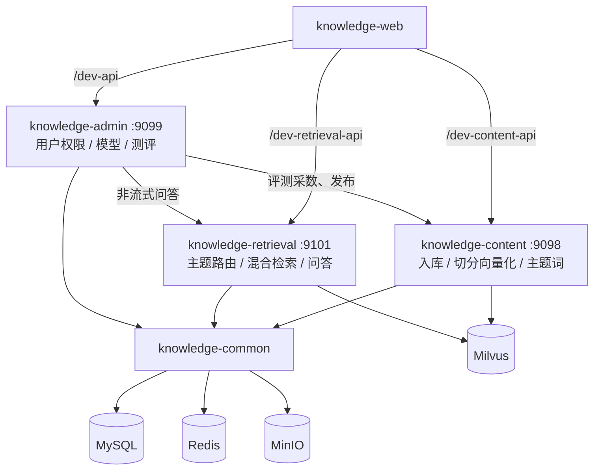
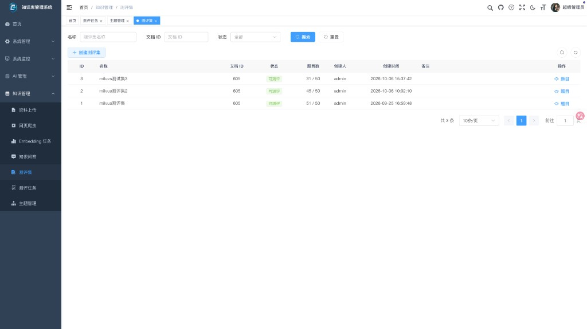
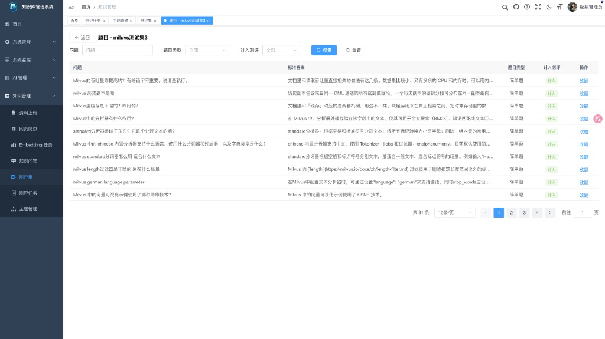
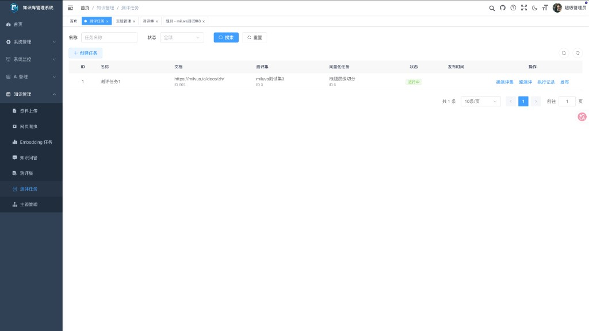
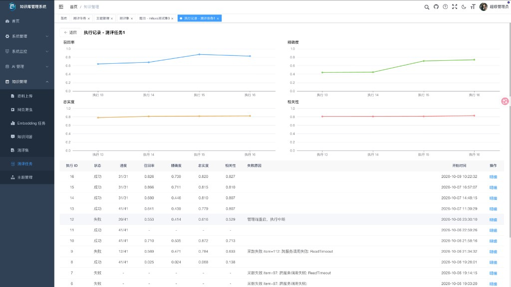
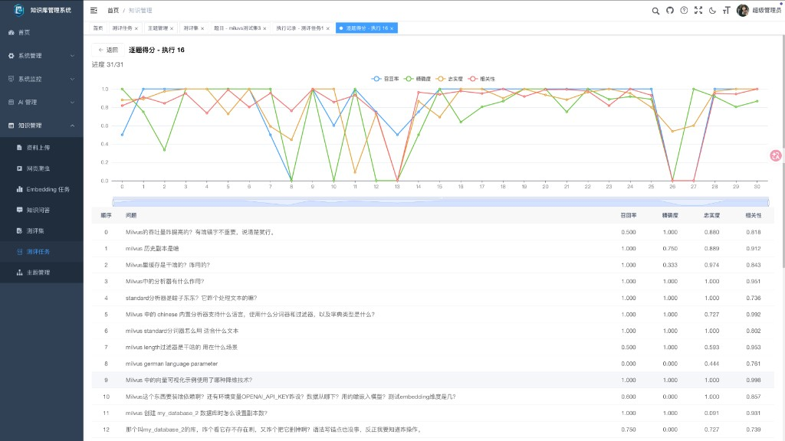
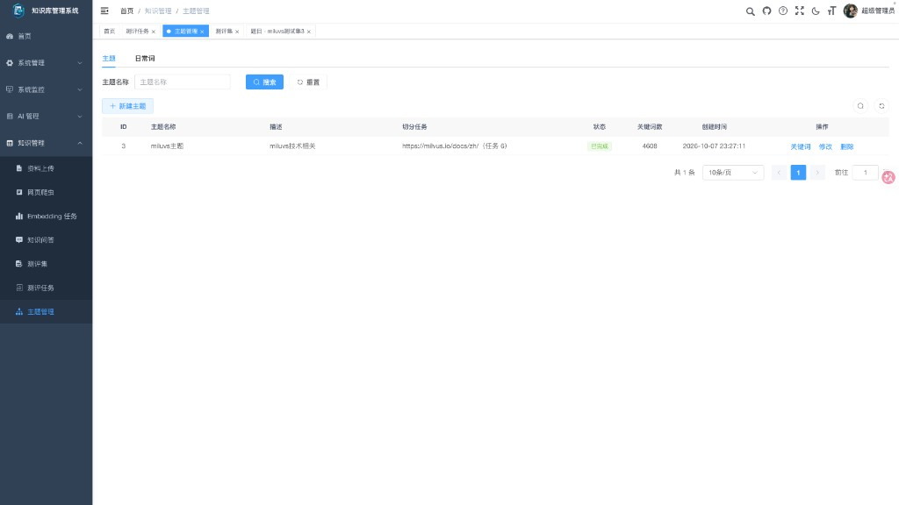
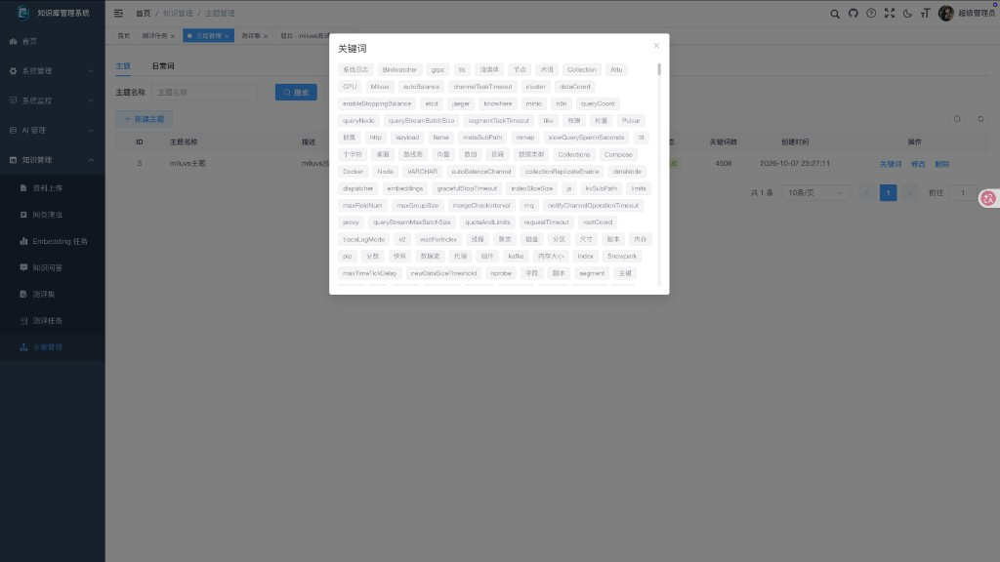
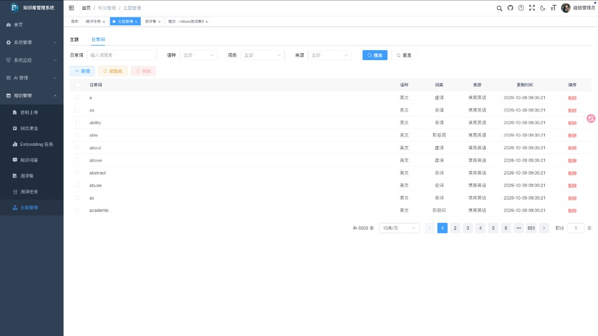

<h1 align="center">
    
</h1>
<h1 align="center" style="margin: 30px 0 30px; font-weight: bold;">knowledge</h1>
<h4 align="center">企业知识库 RAG 系统 · 基于 RuoYi-Vue3-FastAPI 二次开发</h4>
<p align="center">
    <a href="https://github.com/jiangwch03/knowledge">
        
    </a>
    <a href="https://github.com/jiangwch03/knowledge">
        
    </a>
    <a href="./LICENSE">
        
    </a>
    
    
    
    
    
    
    
    
    
    <a href="https://github.com/jhao104/proxy_pool">
        
    </a>
</p>

## 平台简介

knowledge 是一套企业知识库 RAG 系统，基于 [RuoYi-Vue3-FastAPI](https://github.com/insistence/RuoYi-Vue3-FastAPI) 二次开发，面向个人及企业开源使用。

* 前端采用 Vue3、Element Plus，基于若依前端改造，提供后台管理与知识业务界面。
* 后端采用 FastAPI、SQLAlchemy，按职责拆分为 `knowledge-admin`（后台管理）、`knowledge-content`（文档入库）、`knowledge-retrieval`（检索问答）三个服务，公共能力下沉至 `knowledge-common`。
* 数据层使用 MySQL、Redis、MinIO、Milvus；权限认证沿用 OAuth2 & Jwt，支持动态权限菜单与数据范围控制。
* 文档入库支持上传解析（MinerU）、切分向量化、网页爬取（Crawl4AI）；检索问答基于 LangChain / LangGraph / DeepAgents，支持主题关键词路由、混合检索、精排与流式对话。
* 发布前用测评集和 RAGAS 对 canary 向量打分（召回率、精确率、忠实度、相关性），确认后再发布到正式库。
* Python 包由 uv workspace 统一管理（`requires-python >= 3.13`）；不提供若依 uni-app 移动端。
* 特别鸣谢：[RuoYi-Vue3-FastAPI](https://github.com/insistence/RuoYi-Vue3-FastAPI)、[RuoYi-Vue3](https://github.com/yangzongzhuan/RuoYi-Vue3)

## 功能点对照（相对若依）

### 若依原有功能点

以下仍按原样保留：

1. 用户管理：用户是系统操作者，该功能主要完成系统用户配置。
2. 角色管理：角色菜单权限分配、设置角色按机构进行数据范围权限划分。
3. 菜单管理：配置系统菜单，操作权限，按钮权限标识等。
4. 部门管理：配置系统组织机构（公司、部门、小组）。
5. 岗位管理：配置系统用户所属担任职务。
6. 字典管理：对系统中经常使用的一些较为固定的数据进行维护。
7. 参数管理：对系统动态配置常用参数。
8. 通知公告：系统通知公告信息发布维护。
9. 操作日志：系统正常操作日志记录和查询；系统异常信息日志记录和查询。
10. 登录日志：系统登录日志记录查询包含登录异常。
11. 在线用户：当前系统中活跃用户状态监控。
12. 缓存监控：对系统的缓存信息查询，命令统计等。
13. 传输加密：支持前后端请求加密、响应解密、公钥轮换、运行策略下发与监控统计。

### 弃用若依功能点

1. 服务监控：已移除服务监控、数据监控相关菜单与页面。
2. 在线构建器：已移除表单拖拽构建器页面。
3. 代码生成：已移除代码生成菜单与一键生成下载能力。
4. AI对话：已移除管理端内置 AI 对话页（问答改由「知识问答」承接）。
5. 移动端：不提供若依 uni-app 移动端。

### 改造功能点

1. AI管理：保留「模型管理」；去掉原「AI对话」；新增「模型适配」，为业务功能点（如文档向量化、网页爬取、知识问答、测评打分）绑定所用模型。
2. 系统接口：仍可查看接口文档；随后台拆分为多个服务，文档入口按服务分别提供。
3. 定时任务：界面增删改查与调度日志保留；任务按所属应用区分（管理后台 / 知识内容等）。

### 新增功能点

1. 资料上传：上传知识文档，查看解析状态，支持预览、下载与删除。
2. 网页爬虫：通过对话配置网页爬取，管理爬取会话、任务与入库文档；高强度反爬时可使用系统代理池（由外部代理池定时同步至字典 `crawl_proxy_pool`）。  
   > **说明**：当前实现距离「理想的动态适配爬取参数」还有一定距离，后续迭代优化。
3. Embedding 任务：对已入库文档发起切分与向量化，支持向量先写入 canary、任务查询、创建、重试与删除。正式发布不在本页，改由测评任务执行。
4. 知识问答：基于知识库进行会话式问答（含会话管理与流式回答）。问句先按主题关键词决定是否检索，再做混合检索与精排。
5. 测评集：针对一篇文档生成题目，可查看标准答案、题目类型，改题，并选择是否计入测评。
6. 测评任务：绑定一篇文档、一份测评集和一次 canary 向量化任务。可多次跑测评，查看历次召回率、精确率、忠实度、相关性，以及逐题得分。历史上有成功记录后可发布，把该次向量从 canary 切到正式库。
7. 主题管理：从一个已完成的切分任务抽取关键词，供问答路由使用。页内「日常词」用来滤掉 data、user 这类普通词，可按语种、词类、来源查看，也可新增、剔除和重新初始化。

## 系统架构

三个业务服务加一个公共库。前端按路径把请求分到对应服务。测评由管理端编排：向内容服务要文档和向量任务，向检索服务要回答和上下文，再用 RAGAS 打分。



入库到发布的顺序：

```text
资料上传 / 网页爬虫
  → 切分并写入 canary 向量
  → 生成测评集
  → 测评任务跑 RAGAS
  → 发布，canary 切到正式库
```

问答时：问句用 jieba 切开，命中已完成主题的关键词就走知识检索；没命中再问主题模型。检索是稠密向量加 BM25，合并后再精排，留下的片段回填父段后交给模型。

分层、启动和中间件见 [系统架构总览](./docs/系统架构/系统架构总览.md)。

## 演示图

完整演示图见 [演示图](./docs/演示图/演示图.md)。

- **若依原有模块**：外联上游截图（见 [README-RuoYi.md · 演示图](./README-RuoYi.md#演示图)），仅收录本项目仍使用的界面。
- **本项目新增 / 改造模块**：模型管理、模型适配、资料上传、网页爬虫、Embedding 任务、知识问答、测评集、测评任务、主题管理、日常词。

<table>
    <tr>
        <td></td>
        <td></td>
    </tr>
    <tr>
        <td></td>
        <td></td>
    </tr>
    <tr>
        <td></td>
        <td></td>
    </tr>
    <tr>
        <td></td>
        <td></td>
    </tr>
</table>

## 仓库结构

| 包 / 目录 | 职责 | 默认端口 |
|-----------|------|----------|
| `knowledge-common` | 公共基础设施（事务、消息流、广播、中间件、DAO 等） | — |
| `knowledge-admin` | 后台管理（用户 / 角色 / 菜单 / 字典 / 定时任务 / AI 模型 / 测评编排） | `9099` |
| `knowledge-content` | 知识内容（文档上传、MinerU 解析、切分向量化、网页爬取、主题与日常词） | `9098` |
| `knowledge-retrieval` | 知识检索与问答（主题路由、混合检索、精排、QA Agent） | `9101` |
| `knowledge-web` | Vue3 + Element Plus 前端 | Vite `:80` |
| `sql/` | MySQL 初始化与升级脚本；`milvus/` 为向量库脚本 | — |
| `docs/` | 架构与业务设计文档 | — |

Python 包由根目录 [uv workspace](./pyproject.toml) 管理（`requires-python >= 3.13`）。前端通过 `/dev-api`、`/dev-content-api`、`/dev-retrieval-api` 分别代理到上述三个后端。

## 快速开始

启动前请自行安装并启动以下外部依赖（本仓库不附带一键编排）：

| 依赖 | 用途 | 说明 |
|------|------|------|
| MySQL | 业务库 | ≥ 5.7；初始化脚本见 `sql/README.md` |
| Redis Stack | 缓存 / 会话 / 消息流等 | ≥ 6.2；需 Redis Stack（含 RedisJSON 等模块） |
| MinIO | 对象存储 | 文档与解析产物等 |
| Milvus | 向量库 | ≥ 2.6；集合脚本见 `sql/milvus/` |
| 代理池（可选） | 爬虫代理 IP | 本地需单独 Docker 部署；见下方「爬虫代理池」 |

连接地址与账号请按各服务 `configs/.env.*` 自行配置。

文档解析与知识问答还需自行配置：**MinerU Token**（`knowledge-content` 的 `.env`）、以及 **LLM / Embedding 模型 API**（后台「AI 管理 / 模型适配」）。Crawl4AI 默认 `sdk` 进程内调用，无需单独起服务；消息流默认 Redis Stream，无需 Kafka。

### 爬虫代理池（本地 Docker）

网页爬取在高强度反爬场景会查询字典 `crawl_proxy_pool`。本仓库**不内置**代理采集服务，需本地另行部署 [jhao104/proxy_pool](https://github.com/jhao104/proxy_pool)，由 `knowledge-content` 定时任务同步进字典：

| 项目 | 说明 |
|------|------|
| 源码 | [https://github.com/jhao104/proxy_pool](https://github.com/jhao104/proxy_pool) |
| 默认 API | `http://127.0.0.1:5010`（拉取 `/all/`，清理可选回调 `/delete/`） |
| 同步节奏 | 拉取每 30 秒（只增）；清理每 1 分钟（只删不通节点） |
| 配置 | `knowledge-content` 的 `.env`：`proxy_pool_*`（见 `.env.dev`） |
| 定时任务种子 | `sql/04_upgrade_proxy_pool_sync.sql` |

本地推荐用官方镜像（需自备 Redis，并把 `DB_CONN` 指到可连通地址）：

```bash
docker pull jhao104/proxy_pool

# 将 redis://:password@host:port/0 换成你的 Redis 连接串
docker run -d --name proxy_pool \
  --env DB_CONN=redis://:password@host:port/0 \
  -p 5010:5010 \
  jhao104/proxy_pool:latest
```

也可用源码目录下的 `docker-compose up -d`。启动后确认 `http://127.0.0.1:5010/count/` 有返回，再启动 `knowledge-content`；不需要代理时可在 `.env` 将 `proxy_pool_sync_enabled = false`。

```bash
# 依赖（本地无 Nexus 时改用 PyPI）
uv sync --default-index pypi

# 数据库：按 sql/README.md 顺序执行 01 → 02 → 03 → 04

# 后端
uv run --package knowledge-admin python -m knowledge_admin.main
uv run --package knowledge-content python -m knowledge_content.main
uv run --package knowledge-retrieval python -m knowledge_retrieval.main

# 前端
cd knowledge-web && npm install && npm run dev
```

常用测试：`make help` / `make test-common` / `make test-all`。

## 文档

### 架构

| 主题 | 文档 |
|------|------|
| 系统架构总览 | [系统架构](./docs/系统架构/系统架构总览.md) |
| 应用启动与生命周期 | [启动流程](./docs/系统架构/启动流程与生命周期.md) |
| 中间件链与注解切面 | [中间件链](./docs/系统架构/中间件链与注解切面.md) |

### 基础设施

| 主题 | 文档 |
|------|------|
| 注解式事务管理 | [事务管理](./docs/基础设施/注解式事务管理.md) |
| 消息流服务（Kafka 风格） | [消息流](./docs/基础设施/消息流服务.md) |
| 广播服务（Redis Pub/Sub） | [广播服务](./docs/基础设施/广播服务.md) |
| Redis 与数据库 | [Redis 与数据库](./docs/基础设施/Redis与数据库基础设施.md) |
| 定时任务调度与同步 | [定时任务](./docs/基础设施/定时任务调度.md) |
| 日志聚合与操作日志落库 | [日志聚合](./docs/基础设施/日志聚合.md) |
| 分布式信号量 | [分布式信号量](./docs/基础设施/分布式信号量.md) |
| MinIO 下载流程 | [MinIO](./docs/基础设施/MinIO下载流程.md) |

### 业务（RAG）

主流程时序与状态流转（对齐当前代码）：

| 主题 | 文档 |
|------|------|
| 资料上传 | [资料上传流程](./docs/rag功能流程说明/资料上传流程.md) |
| 网页爬虫 | [网页爬虫流程](./docs/rag功能流程说明/网页爬虫流程.md) |
| 切分与向量化 | [切分与向量化流程](./docs/rag功能流程说明/切分与向量化流程.md) |
| 知识问答 | [知识问答流程](./docs/rag功能流程说明/知识问答流程.md) |
| 知识库发布评测 | [发布评测方案](./docs/rag/03-知识库发布评测方案.md) |
| 测评集出题 | [出题架构](./docs/rag/07-测试集出题架构方案.md) |
| 主题关键词 | [过滤方案](./docs/rag/16-主题关键词过滤方案.md) |
| 召回与精确率优化 | [优化记录](./docs/rag/15-召回率精确率指标优化提升记录.md) |
| SQL 脚本说明 | [sql/README.md](./sql/README.md) |
| 检索服务说明 | [knowledge-retrieval/README.md](./knowledge-retrieval/README.md) |

公共库能力说明见 [knowledge-common/README.md](./knowledge-common/README.md)。

## 版本记录

### 1.1.0

相对 1.0.0。向量先停在 canary，测评通过后再发布；问答按主题关键词决定是否检索。

- 测评集：按一篇文档出题，可改题，并选择是否计入测评。
- 测评任务：绑定这次 canary 向量，用 RAGAS 打召回率、精确率、忠实度、相关性。可多次执行，看历次曲线和逐题得分。历史上有成功记录后发布到正式库。
- 主题管理：从已完成的切分任务抽取关键词。日常词用来滤掉普通词，可按语种、词类、来源查看，也可新增、剔除和重新初始化。问句先按关键词命中，未命中再问主题模型。
- 管理端通过 Nacos 调用内容服务和检索服务。检索提供评测用的非流式问答，采数按登录用户加载。
- 网页爬取可从外部代理池定时同步代理。

### 1.0.0

首次发布。包含资料上传、网页爬虫、切分向量化、知识问答，以及若依后台的用户、权限和模型管理。

## 许可证

本项目基于 [RuoYi-Vue3-FastAPI](https://github.com/insistence/RuoYi-Vue3-FastAPI) 开发，遵循 MIT License。详见 [LICENSE](./LICENSE)。
