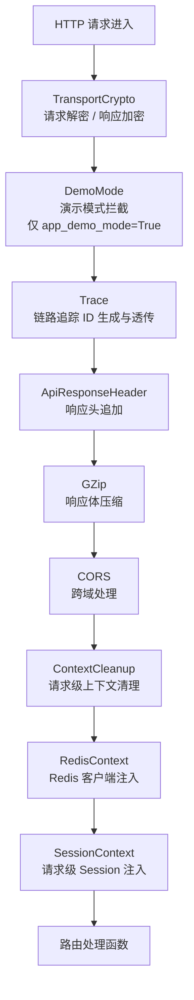
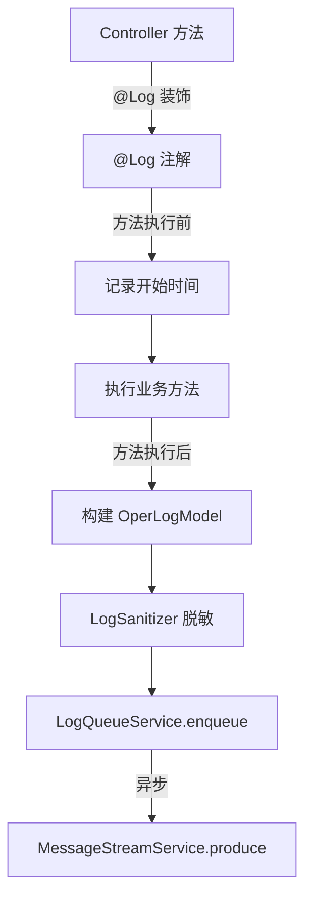
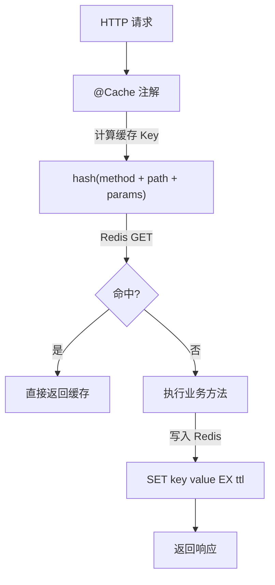
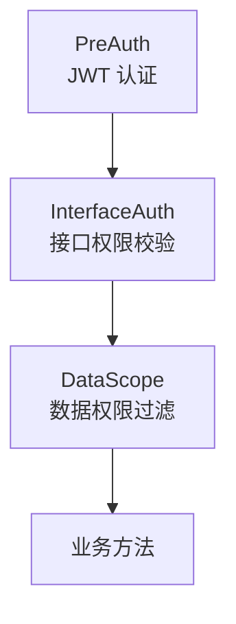
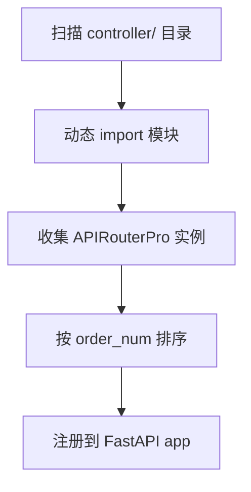

# 中间件链与注解切面

## 1. 中间件注册顺序

`handle_middleware(app)` 按以下顺序注册中间件（后注册的先执行，ASGI 洋葱模型）：



**实际注册顺序**（`middlewares/handle.py`）：

| 序号 | 注册顺序 | 中间件 | 文件 | 职责 |
|------|---------|--------|------|------|
| 1 | 最先注册 | `SessionContextMiddleware` | `common/transactional.py` | 为 `get_current_session()` 注入请求级 Session |
| 2 | | Redis 上下文注入 | `middlewares/redis_context_middleware.py` | 为 HTTP 路径注入 `RedisContext.get_redis()` |
| 3 | | ContextCleanup | `middlewares/context_middleware.py` | 请求结束清理 `RequestContext` 变量 |
| 4 | | CORS | `middlewares/cors_middleware.py` | 跨域资源共享 |
| 5 | | GZip | `middlewares/gzip_middleware.py` | 响应体 GZip 压缩 |
| 6 | | ApiResponseHeader | `middlewares/api_response_header_middleware.py` | 追加响应头（如请求ID） |
| 7 | | Trace | `middlewares/trace_middleware.py` | 生成 trace_id / span_id，注入 `TraceCtx` |
| 8 | | DemoMode | `middlewares/demo_mode_middleware.py` | 演示模式拦截写操作（条件启用） |
| 9 | 最后注册 | TransportCrypto | `middlewares/transport_crypto_middleware.py` | 请求体解密 / 响应体加密（Pure ASGI） |

> ASGI 洋葱模型：最后注册的中间件最外层，请求先经过 TransportCrypto，最后经过 SessionContext。

---

## 2. 各中间件详解

### 2.1 SessionContextMiddleware

**位置**：`knowledge_common/common/transactional.py`

为每个 HTTP 请求创建 `AsyncSession`，存入 `ContextVar`，使 `get_current_session()` 在非 `@transactional` 方法中也能获取当前请求的 session。


### 2.2 RedisContext 注入中间件

**位置**：`middlewares/redis_context_middleware.py`

为 HTTP 请求路径注入 Redis 客户端到 `RedisContext`（ContextVar），使 `RedisConnection.get_redis()` 在请求处理中可用。

### 2.3 Trace 中间件

**位置**：`middlewares/trace_middleware.py`

- 生成 `trace_id`（请求唯一标识）和 `span_id`
- 存入 `TraceCtx`（基于 `ContextVar`）
- 日志自动携带 trace_id，实现链路追踪

### 2.4 TransportCrypto 中间件

**位置**：`middlewares/transport_crypto_middleware.py`

- Pure ASGI 接口实现（非 BaseHTTPMiddleware），解决 ContextVar 传递问题
- 请求体 AES 解密 → 路由处理 → 响应体 AES 加密
- 通过 `.env` 配置密钥，支持条件启用

### 2.5 DemoMode 中间件

**位置**：`middlewares/demo_mode_middleware.py`

- 仅当 `app_demo_mode=True` 时启用
- 拦截 POST/PUT/DELETE 等写操作，返回提示信息

---

## 3. 声明式注解切面

### 3.1 注解总览

| 注解 | 位置 | 用途 |
|------|------|------|
| `@Log` | `common/annotation/log_annotation.py` | 操作日志记录（异步推送 MessageStream） |
| `@Cache` | `common/annotation/cache_annotation.py` | 接口响应缓存（Redis） |
| `@RateLimit` | `common/annotation/rate_limit_annotation.py` | 接口限流（固定/滑动窗口） |
| `@PydanticValidate` | `common/annotation/pydantic_annotation.py` | Pydantic 模型参数校验 |

### 3.2 @Log 操作日志



**使用示例**：
```python
@router.post('/user')
@Log(title='用户管理', business_type=BusinessType.INSERT)
async def add_user(request: Request, user: UserModel):
    ...
```

**参数说明**：
- `title`：模块标题
- `business_type`：业务类型（INSERT/UPDATE/DELETE/EXPORT 等）
- `is_save_request_data`：是否保存请求参数（默认 True）
- `is_save_response_data`：是否保存响应数据（默认 True）

### 3.3 @Cache 接口缓存



**使用示例**：
```python
@router.get('/config/{config_key}')
@Cache(key='sys_config', ttl=3600)
async def get_config(config_key: str):
    ...
```

**缓存清理**：
```python
await ApiCacheManager.clear_namespace(redis, 'sys_config')
await ApiCacheManager.clear_all(redis)
```

### 3.4 @RateLimit 接口限流

**使用示例**：
```python
@router.post('/login')
@RateLimit(limit=5, window_seconds=60, scope='ip')
async def login(request: Request):
    ...
```

**参数说明**：
- `limit`：窗口内最大请求数
- `window_seconds`：时间窗口（秒）
- `scope`：限流维度（`ip` / `user` / `user_or_ip`）
- `algorithm`：算法（`fixed_window` / `sliding_window`）
- `fail_strategy`：Redis 故障策略（`open` 放行 / `closed` 拒绝 / `local_fallback` 本地降级）

---

## 4. 依赖注入切面

### 4.1 认证鉴权链路



### 4.2 PreAuth（预认证）

**位置**：`common/aspect/pre_auth.py`

- 解析 `Authorization` 头中的 JWT Token
- 从 Redis 获取用户信息（`LoginService.get_current_user`）
- 支持 `exclude_routes` 排除白名单路由
- 注入 `CurrentUserModel` 到 `RequestContext`

**使用方式**：
```python
@router.get('/user/list')
async def list_users(
    _current_user: CurrentUserModel = PreAuthDependency()
):
    ...
```

### 4.3 InterfaceAuth（接口权限）

**位置**：`common/aspect/interface_auth.py`

- **权限标识校验**：`CheckUserInterfaceAuth` — 校验 `permissions` 列表
- **角色标识校验**：`CheckRoleInterfaceAuth` — 校验 `role_key` 列表
- 支持严格模式（`is_strict=True`，所有权限都需匹配）
- 超级管理员（`*:*:*`）自动通过

**使用方式**：
```python
@router.delete('/user/{user_id}')
async def delete_user(
    _check: bool = UserInterfaceAuthDependency('system:user:delete')
):
    ...
```

### 4.4 DataScope（数据权限）

**位置**：`common/aspect/data_scope.py`

返回 SQLAlchemy `ColumnElement`，直接嵌入查询条件：

| data_scope | 值 | 含义 |
|------------|---|------|
| 全部数据权限 | `1` | 不限条件（admin 或全权限角色） |
| 自定义数据权限 | `2` | 按 `sys_role_dept` 关联表过滤 |
| 本部门数据权限 | `3` | `dept_id = 当前用户部门` |
| 本部门及以下 | `4` | `FIND_IN_SET` 匹配子部门 |
| 仅本人数据权限 | `5` | `user_id = 当前用户ID` |

**使用方式**：
```python
@router.get('/user/list')
async def list_users(
    data_scope: ColumnElement = DataScopeDependency(query_alias=SysUser)
):
    query = select(SysUser).where(data_scope)
    ...
```

---

## 5. 路由自动注册

**位置**：`common/router.py`



- `APIRouterPro`：扩展 `APIRouter`，支持 `order_num`（注册顺序）和 `auto_register`（是否自动注册）
- `auto_register_routers(app, code_root)`：一键扫描并注册所有路由
- 扫描范围：`controller/` 目录下所有 `.py` 文件

---

## 6. 相关文档

- [启动流程](./启动流程与生命周期.md)
- [事务管理](../infrastructure/注解式事务管理.md)
- [日志聚合](../infrastructure/日志聚合.md)
- [Redis 与数据库](../infrastructure/Redis与数据库基础设施.md)
