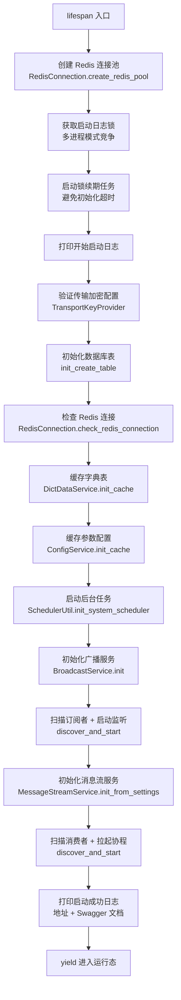
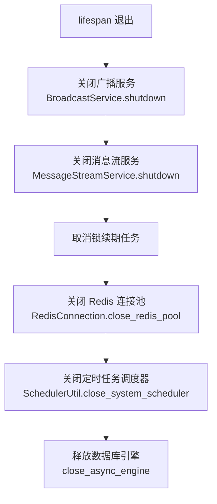
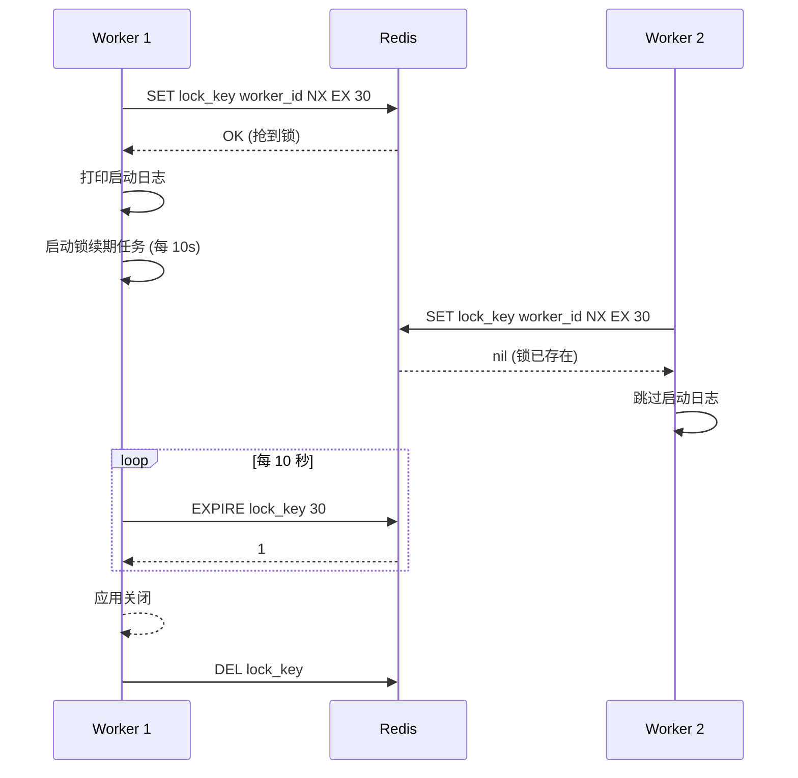

# 应用启动与生命周期

## 1. 入口与工厂函数

```mermaid
graph LR
    Main["main.py"] -->|"uvicorn.run"| Factory["create_app"]
    Factory -->|"APIDocsUtil.setup"| FastAPI["FastAPI 实例"]
    FastAPI -->|"handle_sub_applications"| SubApps["子应用挂载"]
    SubApps -->|"handle_middleware"| MW["中间件链"]
    MW -->|"handle_exception"| Exception["全局异常处理"]
    Exception -->|"auto_register_routers"| Routes["路由自动注册"]
```



**关键代码位置**：
- `knowledge-admin/src/knowledge_admin/main.py`
- `knowledge-rag/src/knowledge_rag/main.py`
- `knowledge-*/src/knowledge_*/server/server.py`

**启动命令**：
```bash
# admin
cd knowledge-admin && uv run python -m knowledge_admin.main

# rag
cd knowledge-rag && uv run python -m knowledge_rag.main
```

---

## 2. 启动流程（lifespan）



**启动顺序说明**：

1. **Redis 连接池**：单例模式，首次调用创建并缓存，后续直接返回
2. **日志锁竞争**：多进程模式下只有抢到锁的进程打印启动日志，避免重复输出
3. **锁续期任务**：获取锁后立即启动后台续期，防止初始化时间过长导致锁过期
4. **传输加密校验**：验证请求解密/响应加密的密钥配置
5. **数据库建表**：`Base.metadata.create_all`，有表跳过，无表创建
6. **Redis 检查**：ping 测试连接可用性
7. **字典/配置缓存**：启动时预热系统字典和参数配置到 Redis
8. **定时任务调度器**：Leader 选举 → 加载任务 → 启动 APScheduler
9. **广播服务**：`@subscriber` 装饰器注册 → 扫描路径 → 启动 Pub/Sub 监听
10. **消息流服务**：`@consumer` 装饰器注册 → 扫描路径 → 拉起消费协程
11. **启动自检**：发送测试消息验证链路通畅（失败仅打日志，不阻塞启动）

---

## 3. 关闭流程



**关闭顺序原则**：

- **先关闭消息服务**：BroadcastService 和 MessageStreamService 依赖 Redis，必须在连接池关闭前停止
- **再关闭后台任务**：取消锁续期、调度器等长运行协程
- **最后释放资源**：Redis 连接池、数据库引擎

---

## 4. 多进程日志锁机制



**设计要点**：

- **锁过期时间**：30 秒（`LockConstant.LOCK_EXPIRE_SECONDS`）
- **续期间隔**：10 秒（`LockConstant.LOCK_RENEWAL_INTERVAL`）
- **锁丢失处理**：续期任务检测到锁丢失后，触发 `SchedulerUtil.on_lock_lost()`，释放调度器资源
- **重竞选机制**：锁丢失后启动 `_reacquire_task`，定期尝试重新获取锁

---

## 5. 关键源码片段

### 5.1 lifespan 入口

```python
# knowledge-admin/src/knowledge_admin/server/server.py
@asynccontextmanager
async def lifespan(app: FastAPI) -> AsyncGenerator[None, None]:
    # 创建 Redis 连接池
    app.state.redis = await RedisConnection.create_redis_pool(log_enabled=False)

    # 获取启动日志锁
    startup_log_enabled = await StartupUtil.acquire_startup_log_gate(
        redis=app.state.redis,
        lock_key=LockConstant.APP_STARTUP_LOCK_KEY,
        worker_id=SchedulerUtil._worker_id,
        lock_expire_seconds=LockConstant.LOCK_EXPIRE_SECONDS,
    )
    app.state.startup_log_enabled = startup_log_enabled

    # 启动锁续期任务
    if startup_log_enabled:
        app.state.lock_renewal_task = StartupUtil.start_lock_renewal(...)

    # ... 启动流程 ...

    yield

    # ... 关闭流程 ...
```

### 5.2 广播服务初始化

```python
async def _init_broadcast(app: FastAPI) -> None:
    BroadcastService.init(redis=app.state.redis)
    BroadcastService.register_subscriber_paths([
        'knowledge_admin.message.subscriber',
    ])
    await BroadcastService.discover_and_start()
    # 启动自检
    await AdminBroadcastTestPublisher.send_demo()
```

### 5.3 消息流服务初始化

```python
async def _init_message_stream(app: FastAPI) -> None:
    MessageStreamService.init_from_settings(
        MessageStreamConfig, redis=app.state.redis
    )
    MessageStreamService.register_consumer_paths([
        'knowledge_admin.message.consumer'
    ])
    await MessageStreamService.discover_and_start()
    # 启动自检
    await AdminMessageTestPublisher.send_demo()
```

---

## 6. 配置说明

### 6.1 应用配置（AppSettings）

| 字段 | 默认值 | 说明 |
|------|--------|------|
| `app_name` | `knowledge` | 应用名称（admin/rag 各自覆盖） |
| `app_host` | `0.0.0.0` | 监听地址 |
| `app_port` | `9099` | 监听端口 |
| `app_workers` | `1` | 工作进程数（多进程启用日志锁） |
| `app_reload` | `True` | 热重载（开发环境） |

### 6.2 日志锁配置（LockConstant）

| 常量 | 值 | 说明 |
|------|-----|------|
| `APP_STARTUP_LOCK_KEY` | `app:startup:lock` | 启动日志锁 Key |
| `LOCK_EXPIRE_SECONDS` | `30` | 锁过期时间（秒） |
| `LOCK_RENEWAL_INTERVAL` | `10` | 续期间隔（秒） |

---

## 7. 相关文档

- [中间件链](./中间件链与注解切面.md)
- [Redis 与数据库](../infrastructure/Redis与数据库基础设施.md)
- [定时任务调度](../infrastructure/定时任务调度.md)
- [消息流服务](../infrastructure/消息流服务.md)
- [广播服务](../infrastructure/广播服务.md)
