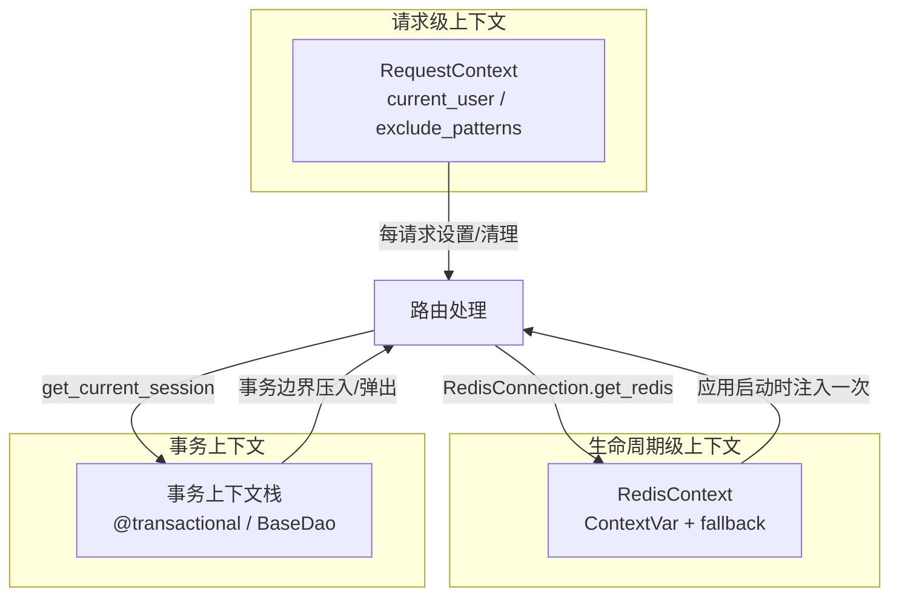
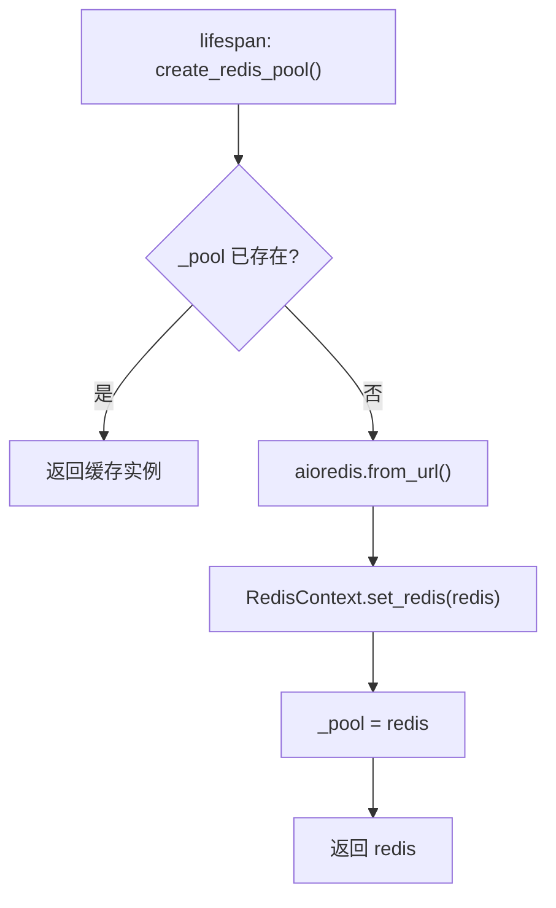
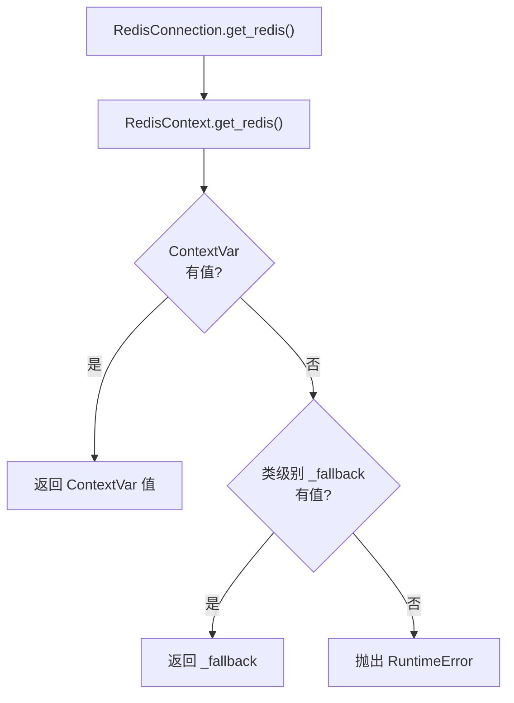
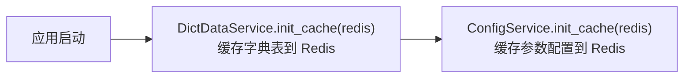
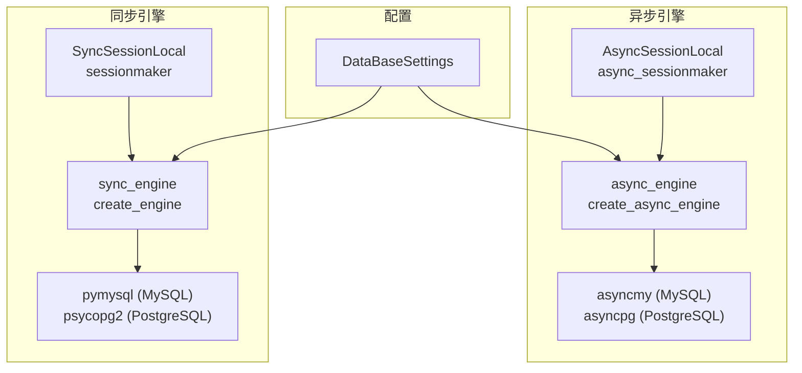
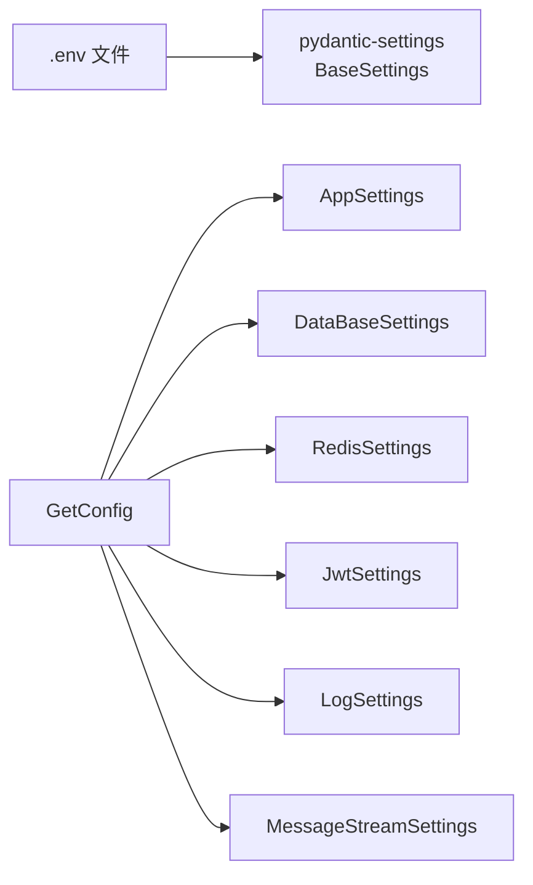

# Redis 与数据库基础设施

> 模块位置：`knowledge-common/src/knowledge_common/redis/`

## 1. 上下文体系总览



---

## 2. Redis 基础设施

### 2.1 RedisConnection 单例连接池



**关键配置**（`RedisSettings`）：

| 字段 | 默认值 | 说明 |
|------|--------|------|
| `redis_host` | `127.0.0.1` | Redis 主机 |
| `redis_port` | `6379` | Redis 端口 |
| `redis_database` | `0` | 数据库编号 |
| `redis_password` | `''` | 密码 |

**连接参数**：
- `decode_responses=True`：自动解码
- `socket_timeout=None`：禁用超时（避免 Pub/Sub 空闲断连）
- `health_check_interval=30`：健康检查间隔

### 2.2 RedisContext 双路径注入



**两条注入路径**：

| 路径 | 注入方式 | 适用场景 |
|------|---------|---------|
| ContextVar | `redis_context_middleware` 中间件 | HTTP 请求处理 |
| _fallback | `RedisContext.set_redis()` 启动时 | 定时任务、RPC、后台协程 |

### 2.3 启动预热



- 字典表：`DictDataService.init_cache()` 将系统字典数据预热到 Redis，避免每次查询数据库
- 参数配置：`ConfigService.init_cache()` 将系统参数配置预热，支持运行时动态修改

### 2.4 RedisClient CRUD 封装

**位置**：`knowledge_common/redis/client.py`

对 aioredis 原生 API 的二次封装，核心特性：

- **透明序列化**：存入时自动将 Pydantic Model / dict / list 序列化为 JSON 字符串；取出时自动反序列化，支持通过 `model` 参数直接映射为 Pydantic 实例
- **自动获取客户端**：所有方法均为 `@classmethod`，Redis 客户端自动从 `RedisContext` 获取，无需手动传入
- **五大数据类型全覆盖**：String / Hash / List / Set / ZSet + 通用操作

| 数据类型 | 代表方法 | 说明 |
|---------|---------|------|
| **String（透明序列化）** | `set(key, value)` / `get(key, model=...)` / `get_many(keys)` / `set_many(mapping)` | 自动 JSON 序列化/反序列化 |
| **String（原生）** | `set_str(key, value)` / `get_str(key)` / `incr(key, amount)` | 不经过序列化，直接存取字符串 |
| **Hash** | `hset(name, mapping=...)` / `hget(name, key)` / `hgetall(name)` / `hdel(name, *keys)` | value 自动 JSON 序列化 |
| **List** | `lpush(name, *values)` / `rpush(name, *values)` / `lpop(name)` / `rpop(name)` / `lrange(name, start, end)` | value 自动 JSON 序列化 |
| **Set** | `sadd(name, *values)` / `srem(name, *values)` / `smembers(name)` / `sismember(name, value)` | value 自动 JSON 序列化 |
| **ZSet** | `zadd(name, mapping)` / `zrem(name, *members)` / `zrange(name, start, end)` / `zrangebyscore(name, min, max)` | member 自动 JSON 序列化 |
| **通用操作** | `delete(*keys)` / `exists(*keys)` / `expire(key, seconds)` / `ttl(key)` / `keys(pattern)` / `scan_iter(match)` / `type(key)` | — |

**典型用法**：

```python
from knowledge_common.redis import RedisClient

# String（透明序列化）
await RedisClient.set('user:1', {'name': '张三', 'age': 25})
data: dict = await RedisClient.get('user:1')

# String（原生，不序列化）
await RedisClient.set_str('token:abc', 'some_token_value', ex=3600)
token: str = await RedisClient.get_str('token:abc')

# Hash
await RedisClient.hset('user:1:profile', mapping={'name': '张三', 'age': '25'})
profile: dict = await RedisClient.hgetall('user:1:profile')

# 通用操作
await RedisClient.delete('user:1')
await RedisClient.expire('user:1', 3600)
```

### 2.5 RedisPubSub 工具类

**位置**：`knowledge_common/redis/pubsub.py`

| 方法 | 用途 |
|------|------|
| `publish(redis, channel, payload)` | 发布消息（dict 自动 JSON 序列化） |
| `subscribe(redis, channel, handler)` | 订阅频道，启动后台监听 Task |
| `unsubscribe(task)` | 取消订阅 |
| `shutdown()` | 关闭所有订阅任务 |

**特性**：自动 JSON 序列化/反序列化、双层循环异常自愈（永久存活）、支持同步/异步 handler。

---

## 3. 数据库基础设施

### 3.1 双引擎架构



**配置参数**（`DataBaseSettings`）：

| 字段 | 默认值 | 说明 |
|------|--------|------|
| `db_type` | `mysql` | 数据库类型（mysql / postgresql） |
| `db_host` | `127.0.0.1` | 主机 |
| `db_port` | `3306` | 端口 |
| `db_pool_size` | `50` | 连接池大小 |
| `db_max_overflow` | `10` | 最大溢出连接 |
| `db_pool_recycle` | `3600` | 连接回收时间（秒） |
| `db_pool_timeout` | `30` | 获取连接超时（秒） |

### 3.2 Session 获取方式

| 场景 | 异步 | 同步 |
|------|------|------|
| Service 显式事务 | `@transactional` → `get_current_session()` | `@transactional_sync` → `get_current_session_sync()` |
| DAO 隐式短事务 | `BaseDao` 公开方法自动 `@transactional` | `BaseDao` 公开方法自动 `@transactional_sync` |
| 分页工具 | `PageUtil.paginate` 隐式短事务 | - |
| FastAPI 依赖注入 | `get_db()` 生成器（遗留，新代码优先走事务边界） | - |

### 3.3 get_db() 依赖注入

```python
# 每个请求创建独立 session，请求结束自动关闭
async def get_db() -> AsyncGenerator[AsyncSession, None]:
    async with AsyncSessionLocal() as current_db:
        yield current_db
```

### 3.4 自动建表

```python
# lifespan 启动时
async def init_create_table() -> None:
    async with async_engine.begin() as conn:
        await conn.run_sync(Base.metadata.create_all)
```

- 无表则创建，有表则跳过
- 表结构变更不自动处理（需手动迁移）

---

## 4. 配置加载机制



**环境文件位置**：

| 项目 | 路径 |
|------|------|
| admin | `knowledge-admin/src/configs/.env.{app_env}` |
| rag | `knowledge-content/src/configs/.env.{app_env}` |

**配置模型访问**：通过 `AppConfig`、`DataBaseConfig`、`RedisConfig` 等单例对象直接访问属性。

---

## 5. 相关文档

- [事务管理](./注解式事务管理.md)
- [启动流程](../architecture/启动流程与生命周期.md)
- [系统架构总览](../architecture/系统架构总览.md)
