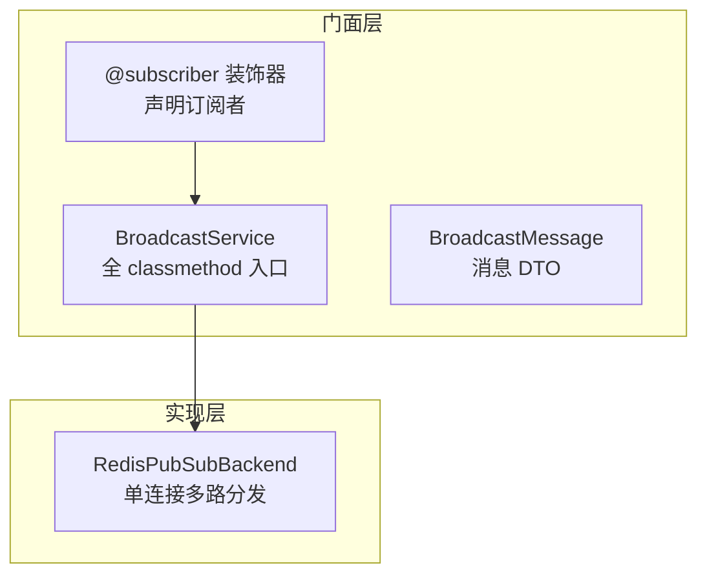
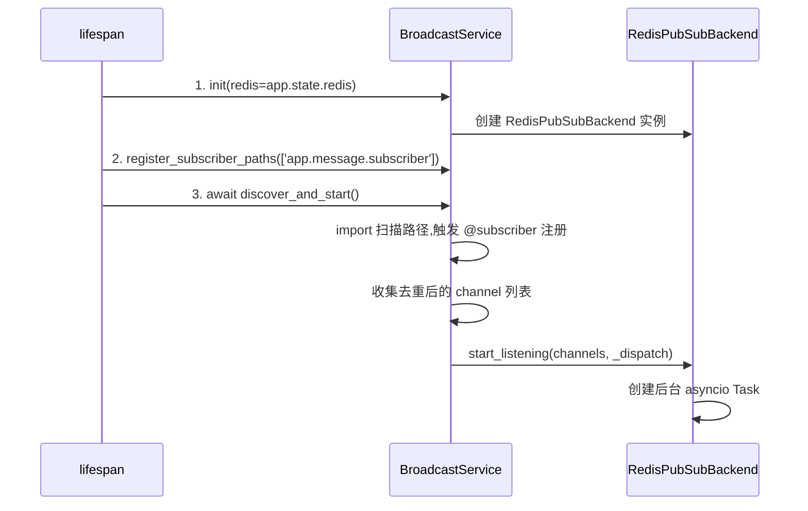
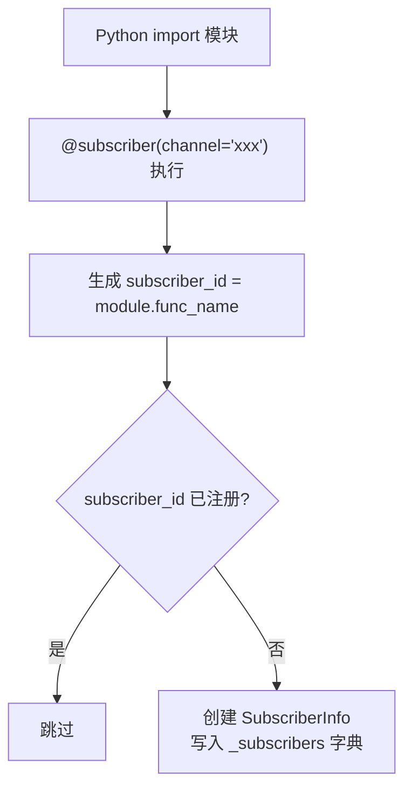
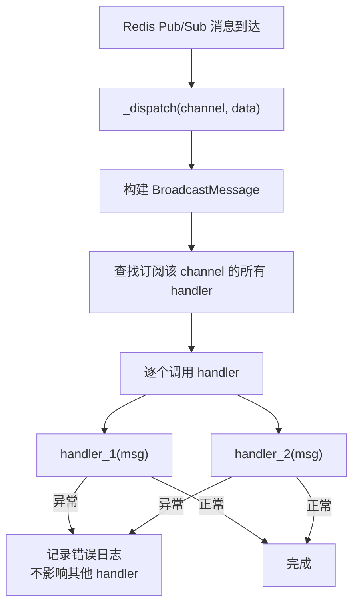
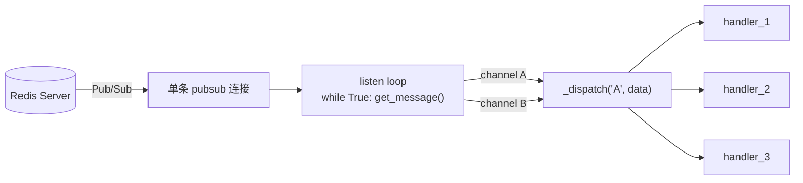
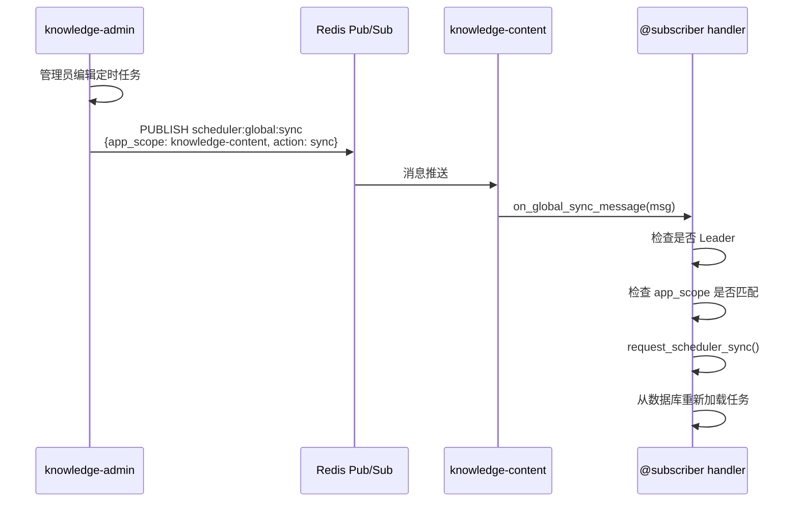

# 广播服务（BroadcastService）

> 模块位置：`knowledge-common/src/knowledge_common/broadcast/`

## 1. 概述

与 `MessageStreamService` 对等的广播抽象层。基于 Redis Pub/Sub 实现 fire-and-forget 广播通道，用于定时任务同步等全局通知场景。

**核心特性**：
- 单 pubsub 连接多路分发（所有 channel 共享一条连接）
- `@subscriber` 装饰器声明式注册
- handler 异常隔离（单个 handler 失败不影响其他）
- 自动重连

---

## 2. 架构分层



| 文件 | 职责 |
|------|------|
| `service.py` | 门面：init / discover_and_start / publish / shutdown |
| `subscriber.py` | `@subscriber` 装饰器 + `SubscriberInfo` 注册 |
| `message.py` | `BroadcastMessage` 数据类 |
| `backends/redis_pubsub.py` | Redis Pub/Sub 实现（单连接 + dispatch table） |

---

## 3. 三步接入范式



**接入代码**：

```python
# server.py lifespan 中
BroadcastService.init(redis=app.state.redis)
BroadcastService.register_subscriber_paths(['knowledge_admin.message.subscriber'])
await BroadcastService.discover_and_start()
# 启动自检
await AdminBroadcastTestPublisher.send_demo()
```

---

## 4. @subscriber 注册机制



**SubscriberInfo 字段**：

| 字段 | 类型 | 说明 |
|------|------|------|
| `subscriber_id` | `str` | 全局唯一标识 |
| `channel` | `str` | 订阅的 channel |
| `handler` | `async def(msg: BroadcastMessage)` | 业务处理函数 |

---

## 5. 消息分发与异常隔离



**异常隔离**：每个 handler 独立 try/except，单个失败不影响同 channel 的其他 handler。

---

## 6. 发布消息

```python
# 发布广播
await BroadcastService.publish(
    'scheduler:global:sync',
    {'app_scope': 'knowledge-content', 'action': 'sync'}
)
```

- `payload` 为 `dict` 时自动 JSON 序列化
- `payload` 为 `str` 时原样发送
- 返回值为接收者数量（Redis PUBLISH 返回值）

---

## 7. 单连接多路分发



所有 channel 共享一条 pubsub 连接，避免多连接资源浪费。

---

## 8. 业务场景：定时任务全局同步



**订阅者位置**：`knowledge_common/message/subscriber/scheduler_subscriber.py`（common 集中维护，admin/rag 自动复用）

---

## 9. BroadcastMessage 结构

| 字段 | 类型 | 说明 |
|------|------|------|
| `channel` | `str` | 消息来源 channel |
| `payload` | `dict \| str` | 自动 JSON 反序列化后的载荷 |
| `timestamp` | `float` | 消息接收时间戳 |

---

## 10. 默认扫描路径

`BroadcastService._scan_paths` 默认包含 `knowledge_common.message.subscriber`，确保 common 中集中维护的订阅者（如 `scheduler_subscriber.py`）在所有项目中自动注册。

---

## 11. 相关文档

- [消息流服务](./消息流服务.md)
- [定时任务调度](./定时任务调度.md)
- [启动流程](../architecture/启动流程与生命周期.md)
