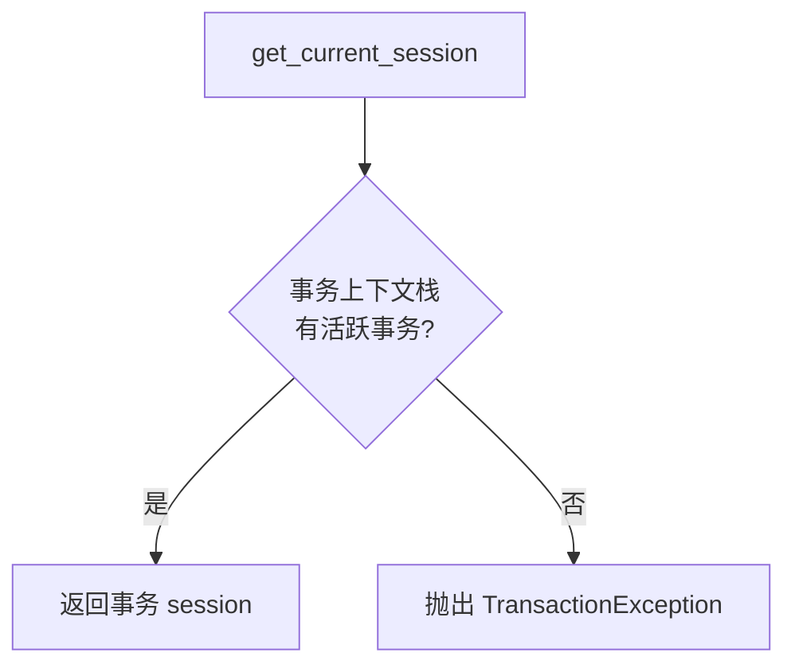

# 注解式事务管理

> 模块位置：`knowledge-common/src/knowledge_common/common/transactional.py`  
> DAO 基类：`knowledge-common/src/knowledge_common/mapper/dao/base_dao.py`

## 1. 概述

类 Spring `@Transactional` 的注解式事务装饰器，基于 FastAPI + SQLAlchemy 2.0，支持**异步**（AsyncSession）和**同步**（Session）双模式。

**核心约定**：Session **仅**由事务边界提供。无非事务 Session 注入（已移除 Middleware / `@with_session` / `*_session_scope`）。

| 模式 | API | 用途 |
|------|-----|------|
| 异步 | `@transactional()` | Service 显式事务边界 |
| 异步 | `get_current_session()` | 获取当前异步事务 Session |
| 同步 | `@transactional_sync()` | 同步事务装饰器 |
| 同步 | `get_current_session_sync()` | 获取当前同步事务 Session |
| 通用 | `BaseDao` | DAO 公开方法自动挂载 REQUIRED 短事务 |
| 通用 | `PageUtil.paginate` | 分页查询隐式短事务 |
| 通用 | `PropagationBehavior` | 7 种传播行为枚举 |

---

## 2. Session 获取



提供 Session 的入口：

1. Service 显式 `@transactional` / `@transactional_sync`
2. `BaseDao` 子类公开方法的隐式短事务
3. `PageUtil.paginate` 的隐式短事务

---

## 3. BaseDao 隐式短事务

所有持久化 DAO 继承 `BaseDao`。类定义时通过 `__init_subclass__` 为公开方法自动挂载 `@transactional()` / `@transactional_sync()`（`REQUIRED`）。

```
无 Service @transactional                有 Service @transactional
─────────────────────────────            ─────────────────────────────
Dao.m1() → short TX1 commit              Service.write() begin
Dao.m2() → short TX2 commit                Dao.m1 / m2 join
PageUtil.paginate() → short TX           commit once
```

- 业务方法体仍使用 `get_current_session()`，无需改动。
- 多步写的原子性仍靠 Service 显式 `@transactional`。
- 私有方法（`_` 前缀）不自动挂载。

---

## 4. 事务传播行为

7 种传播行为，对齐 Spring `@Transactional` 语义：

| 传播行为 | 有事务时 | 无事务时 |
|---------|---------|---------|
| `REQUIRED`（默认） | 加入当前事务 | 新建事务 |
| `REQUIRES_NEW` | 挂起当前事务，新建独立事务 | 新建事务 |
| `SUPPORTS` | 加入当前事务 | 无事务运行 |
| `NOT_SUPPORTED` | 挂起当前事务，无事务运行 | 无事务运行 |
| `NEVER` | 抛出 `TransactionException` | 无事务运行 |
| `MANDATORY` | 加入当前事务 | 抛出 `TransactionException` |
| `NESTED` | 创建 savepoint 嵌套事务 | 新建事务（同 REQUIRED） |

---

## 5. 典型使用示例

### Service 层事务

```python
from knowledge_common.common import transactional, get_current_session

class UserService:
    @transactional()
    async def create_user(self, user: UserModel) -> CrudResponseModel:
        session = get_current_session()
        session.add(user)
        return CrudResponseModel(is_success=True, message='创建成功')
```

### DAO 层（继承 BaseDao，无需手写事务装饰器）

```python
from knowledge_common.mapper.dao.base_dao import BaseDao
from knowledge_common.common.transactional import get_current_session

class UserDao(BaseDao):
    @classmethod
    async def get_user_by_id(cls, user_id: int) -> UserModel | None:
        session = get_current_session()
        result = await session.execute(select(SysUser).where(SysUser.user_id == user_id))
        return result.scalar_one_or_none()
```

### 后台任务 / 定时任务

直接调用 DAO 或带 `@transactional` 的 Service，无需外层 Session 注入。

---

## 6. 相关文档

- [系统架构总览](../architecture/系统架构总览.md)
- [中间件链](../architecture/中间件链与注解切面.md)
- [Redis 与数据库](./Redis与数据库基础设施.md)
