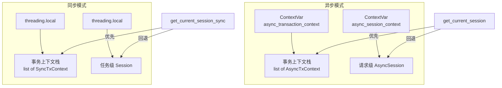
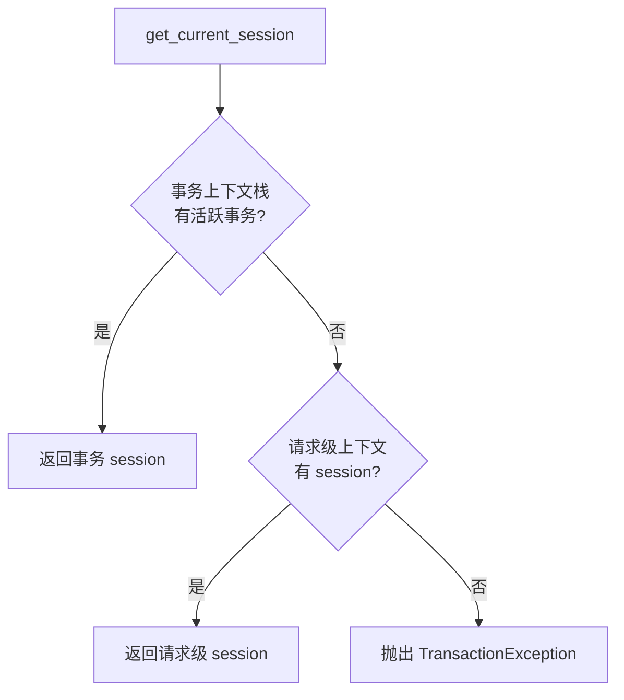
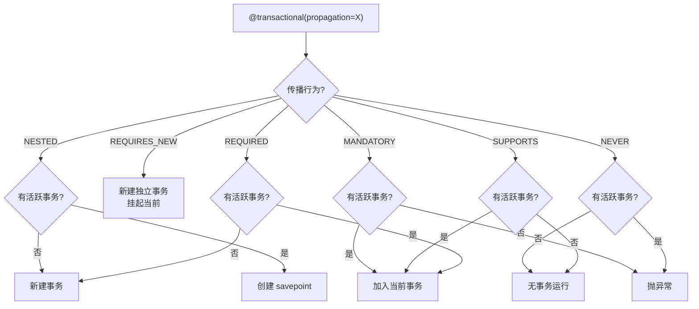
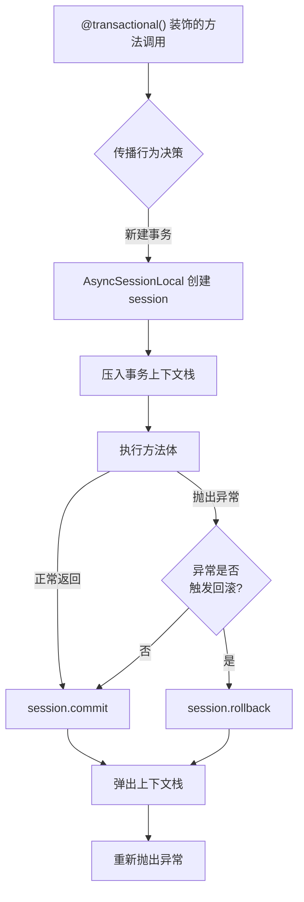
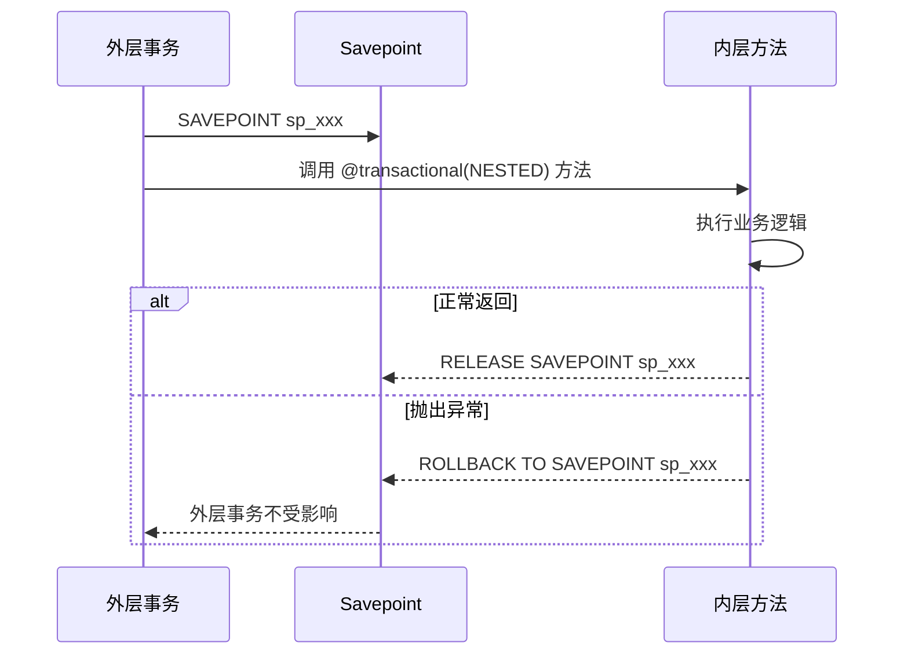
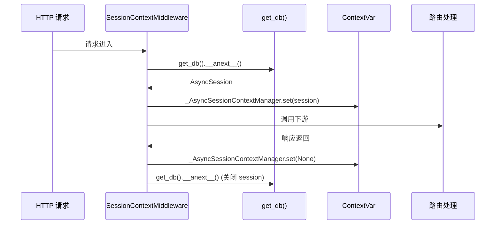

# 注解式事务管理

> 模块位置：`knowledge-common/src/knowledge_common/common/transactional.py`

## 1. 概述

类 Spring `@Transactional` 的注解式事务装饰器，基于 FastAPI + SQLAlchemy 2.0，支持**异步**（AsyncSession）和**同步**（Session）双模式。核心目标：业务代码零侵入，消除手动 `commit/rollback` 模板代码。

### 公开 API 一览

| 模式 | API | 用途 |
|------|-----|------|
| 异步 | `@transactional()` | 异步事务装饰器 |
| 异步 | `get_current_session()` | 获取当前异步 session |
| 异步 | `@with_session` | 非 Web 异步场景 session 注入 |
| 异步 | `async_session_scope()` | 异步 session 上下文管理器 |
| 同步 | `@transactional_sync()` | 同步事务装饰器 |
| 同步 | `get_current_session_sync()` | 获取当前同步 session |
| 同步 | `@with_session_sync` | 同步场景 session 注入 |
| 同步 | `session_scope()` | 同步 session 上下文管理器 |
| 通用 | `SessionContextMiddleware` | FastAPI 请求级 session 中间件 |
| 通用 | `PropagationBehavior` | 7 种传播行为枚举 |

---

## 2. 双模式上下文隔离



**隔离机制**：

| 场景 | 异步实现 | 同步实现 |
|------|---------|---------|
| 事务上下文 | `ContextVar`（协程安全） | `threading.local`（线程安全） |
| 非事务 session | `ContextVar`（请求级） | `threading.local`（任务级） |
| 数据结构 | 栈（支持嵌套事务） | 栈（支持嵌套事务） |

---

## 3. Session 获取优先级



**三层来源**：

1. **事务上下文**（`@transactional` 装饰的方法内）：自动 commit/rollback
2. **请求级上下文**（`SessionContextMiddleware` 注入）：不自动 commit，由框架管理生命周期
3. **手动创建**（`async_session_scope()` / `@with_session`）：适用于后台任务、定时任务

---

## 4. 事务传播行为

7 种传播行为，对齐 Spring `@Transactional` 语义：

| 传播行为 | 有事务时 | 无事务时 |
|---------|---------|---------|
| `REQUIRED`（默认） | 加入当前事务 | 新建事务 |
| `REQUIRES_NEW` | 挂起当前事务，新建独立事务 | 新建事务 |
| `SUPPORTS` | 加入当前事务 | 无事务运行 |
| `NOT_SUPPORTED` | 挂起当前事务，无事务运行 | 无事务运行 |
| `NEVER` | 抛出 `TransactionException` | 无事务运行 |
| `MANDATORY` | 加入当前事务 | 抛出 `TransactionException` |
| `NESTED` | 创建 savepoint 嵌套事务 | 新建事务（同 REQUIRED） |

### 传播决策流程



---

## 5. 事务执行流程



**回滚规则**：
- 默认：所有 `Exception` 都触发回滚
- `rollback_for=(SpecificException,)`：仅指定异常触发回滚
- `no_rollback_for=(IgnoredException,)`：指定异常不回滚

---

## 6. 嵌套事务（NESTED）



- savepoint 名称格式：`sp_{uuid4_hex[:16]}`
- 内层回滚不影响外层，外层最终 commit 时只包含未回滚的操作

---

## 7. SessionContextMiddleware

**注册位置**：`middlewares/handle.py` 中最先注册



**作用**：使 `get_current_session()` 在非 `@transactional` 方法中也能返回当前请求的 session（不自动 commit，请求结束后 session 关闭）。

---

## 8. 非事务场景 Session 方案

| 场景 | 方案 | 说明 |
|------|------|------|
| 后台异步任务 | `@with_session` | 装饰器，自动创建/清理 session |
| 异步代码块 | `async with async_session_scope()` | 上下文管理器 |
| 同步定时任务 | `@with_session_sync` | 同步装饰器 |
| 同步代码块 | `with session_scope()` | 同步上下文管理器 |

### 使用示例

```python
# 后台异步任务
@with_session
async def background_task():
    session = get_current_session()
    result = await session.execute(select(User))
    # session 在函数返回后自动关闭

# 异步代码块
async with async_session_scope() as session:
    result = await session.execute(select(User))

# 同步定时任务
@with_session_sync
def scheduled_task():
    session = get_current_session_sync()
    result = session.execute(select(User))
```

---

## 9. 典型使用示例

### 9.1 Service 层事务

```python
from knowledge_common.common import transactional, get_current_session

class UserService:
    @transactional()
    async def create_user(self, user: UserModel) -> CrudResponseModel:
        session = get_current_session()
        session.add(user)
        return CrudResponseModel(is_success=True, message='创建成功')
```

### 9.2 Service 层嵌套事务

```python
class OrderService:
    @transactional()
    async def create_order(self, order: OrderModel) -> None:
        session = get_current_session()
        session.add(order)
        # 扣减库存，失败只回滚 savepoint，不影响订单
        await self._deduct_stock(order)

    @transactional(propagation=PropagationBehavior.NESTED)
    async def _deduct_stock(self, order: OrderModel) -> None:
        session = get_current_session()
        # 库存不足抛异常，回滚到 savepoint
        ...
```

### 9.3 DAO 层获取 session

```python
class UserDao:
    @classmethod
    async def get_user_by_id(cls, user_id: int) -> UserModel | None:
        session = get_current_session()
        result = await session.execute(select(SysUser).where(SysUser.user_id == user_id))
        return result.scalar_one_or_none()
```

---

## 10. 相关文档

- [系统架构总览](../architecture/系统架构总览.md)
- [中间件链](../architecture/中间件链与注解切面.md)
- [Redis 与数据库](./Redis与数据库基础设施.md)
