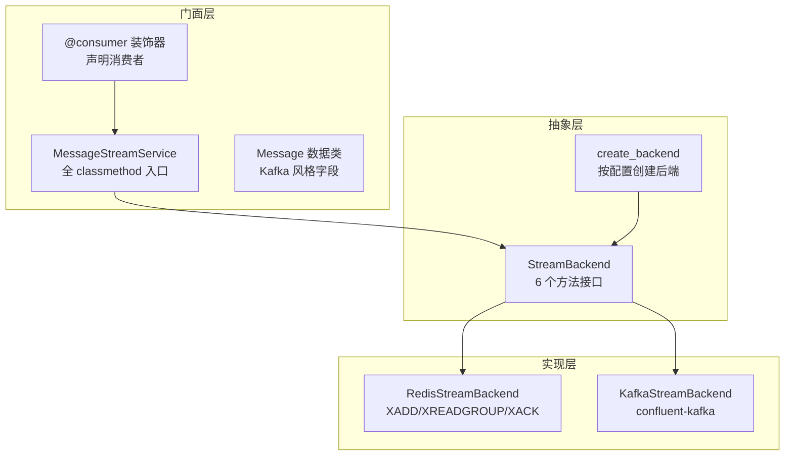
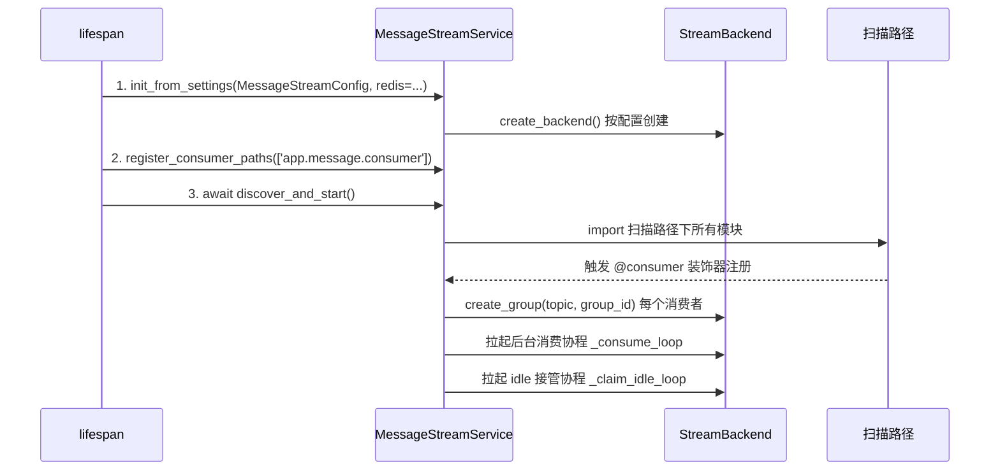
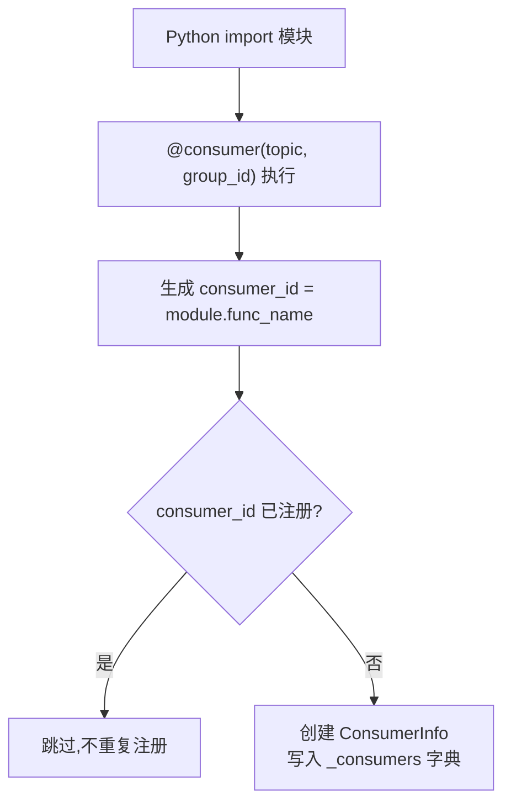
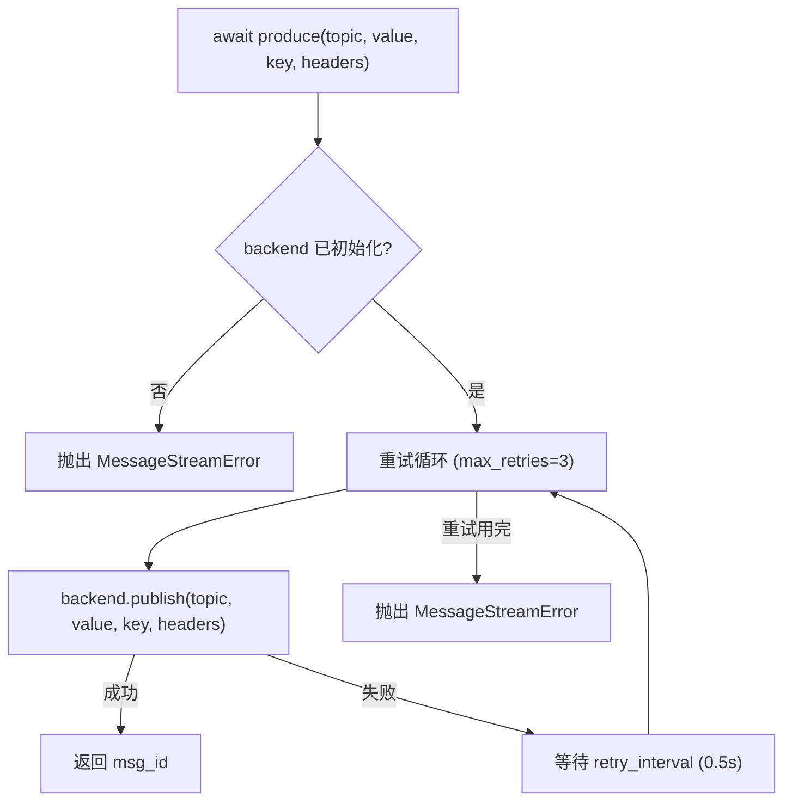
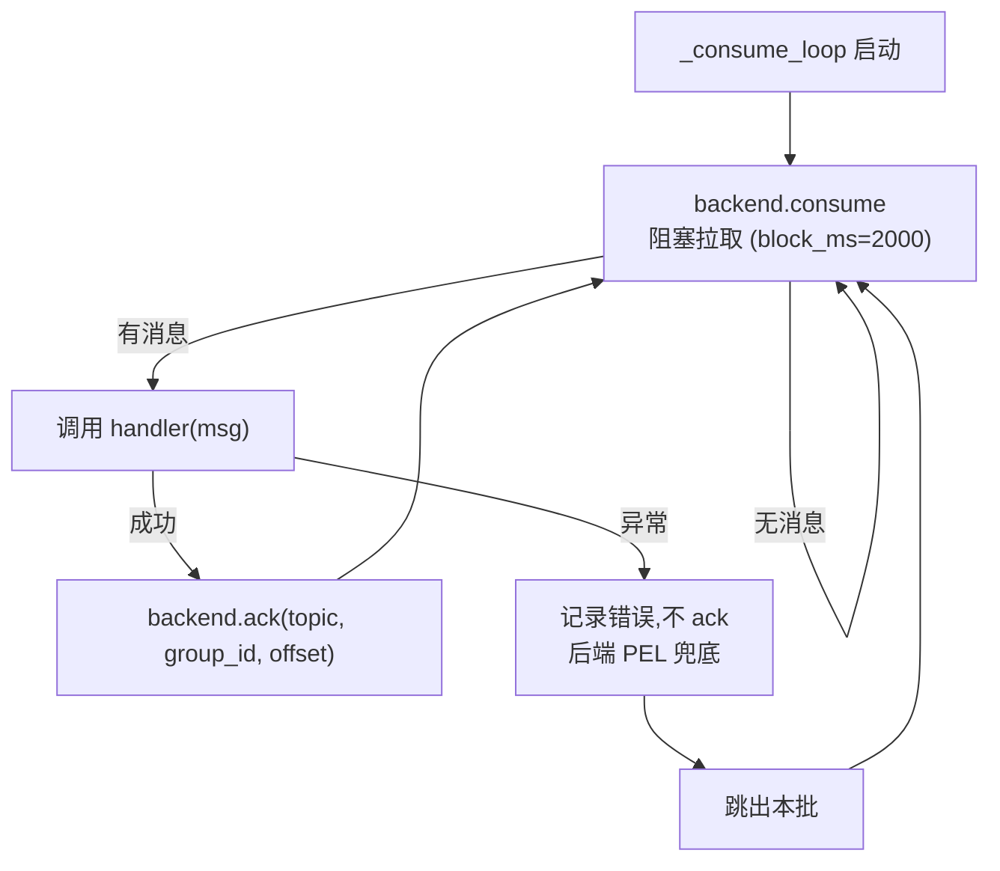
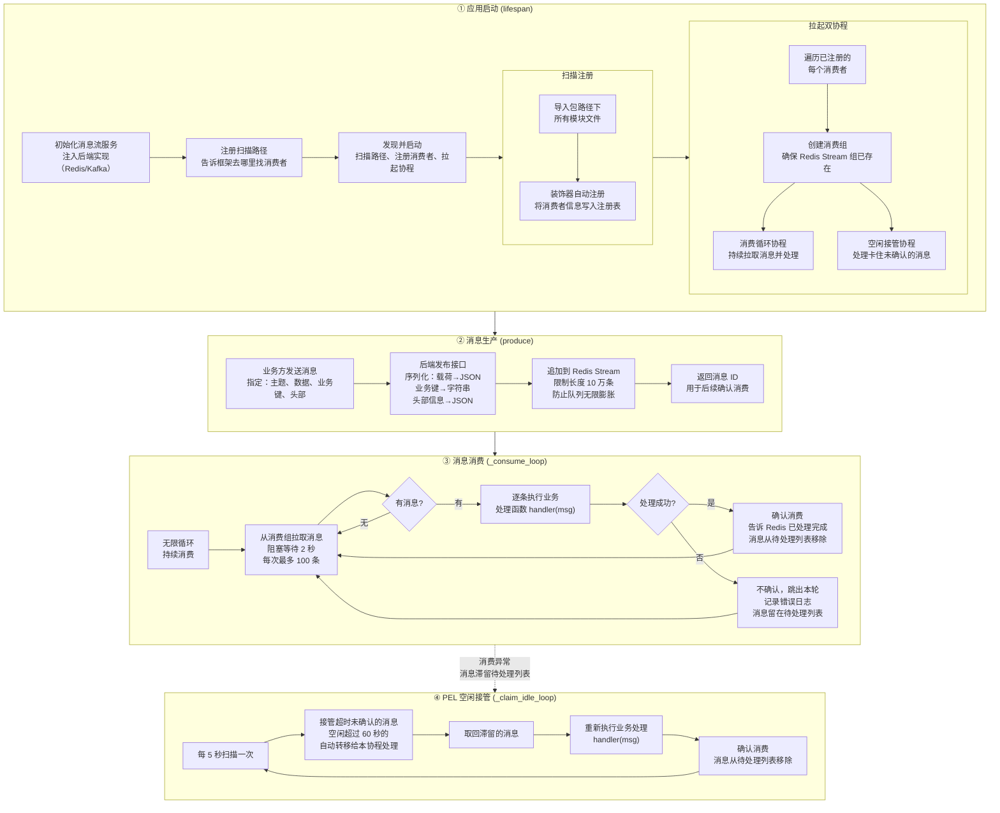

# 消息流服务（MessageStreamService）

> 模块位置：`knowledge-common/src/knowledge_common/message_stream/`

## 1. 设计理念

Kafka 风格的 Python 消息流门面。把"协议层 XADD/XREADGROUP/XACK"的裸操作，变成"业务层 `@consumer` 声明 + `produce` 推送"的门面抽象。

**核心承诺**：`.env` 改 `MESSAGE_STREAM_BACKEND=redis|kafka` 即可切换后端，业务代码零行修改。

---

## 2. 分层架构



| 层级 | 文件 | 职责 |
|------|------|------|
| 门面层 | `service.py` | 生命周期管理 + `produce` 推送 |
| 门面层 | `consumer.py` | `@consumer` 装饰器 + `ConsumerInfo` 注册 |
| 门面层 | `message.py` | `Message` 数据类（Kafka 字段对齐） |
| 抽象层 | `backends/base.py` | `StreamBackend` 接口定义 |
| 抽象层 | `backends/factory.py` | 按 `.env` 配置动态创建后端 |
| 实现层 | `backends/redis_stream.py` | Redis Stream 实现 |
| 实现层 | `backends/kafka_stream.py` | Kafka 实现 |

---

## 3. 三步接入范式



**接入代码**（以 admin 为例）：

```python
# server.py lifespan 中
MessageStreamService.init_from_settings(MessageStreamConfig, redis=app.state.redis)
MessageStreamService.register_consumer_paths(['knowledge_admin.message.consumer'])
await MessageStreamService.discover_and_start()
# 启动自检
await AdminMessageTestPublisher.send_demo()
```

---

## 4. @consumer 注册机制



**ConsumerInfo 字段**：

| 字段 | 说明 |
|------|------|
| `consumer_id` | 全局唯一标识（`{module}.{func_name}`） |
| `topic` | 订阅主题（Kafka 风格） |
| `group_id` | 消费组 |
| `handler` | 业务处理函数 `async def(msg: Message) -> None` |
| `max_retries` | 消费侧最大重试次数（默认 3） |

---

## 5. produce 推送流程



---

## 6. 消费协程循环



**双协程设计**：

| 协程 | 职责 | 命名 |
|------|------|------|
| `_consume_loop` | 主消费循环，阻塞拉取 + 处理 + ack | `msg-stream:consume:{id}` |
| `_claim_idle_loop` | PEL 兜底，接管空闲超时（60s）的卡住消息 | `msg-stream:claim:{id}` |

---

## 7. Message 数据结构

字段命名对齐 Kafka，保证切 Kafka 时业务代码零修改：

| 字段 | 类型 | 说明 |
|------|------|------|
| `topic` | `str` | 主题 |
| `key` | `str \| None` | 业务键（partition key / 过滤键） |
| `value` | `Any` | 载荷 |
| `headers` | `dict` | 头部元数据 |
| `timestamp` | `int` | 毫秒时间戳 |
| `offset` | `str` | 消息位置（Stream "1234-0" / Kafka offset） |
| `partition` | `int \| None` | 分区号（Stream 无分区，值为 None） |

**兼容别名**：`msg.stream` ≡ `msg.topic`，`msg.payload` ≡ `msg.value`

---

## 8. 后端切换

`.env` 配置：

```bash
# Redis Stream 后端（默认）
MESSAGE_STREAM_BACKEND=redis
MESSAGE_STREAM_REDIS_MAXLEN=100000

# Kafka 后端
MESSAGE_STREAM_BACKEND=kafka
KAFKA_BOOTSTRAP_SERVERS=localhost:9092
```

**切换影响**：

| 层面 | 是否修改 |
|------|---------|
| `@consumer` 装饰器 | 不修改 |
| `MessageStreamService.produce` | 不修改 |
| `Message` 数据结构 | 不修改 |
| `backends/factory.py` | 自动选择 |

---

## 9. 默认扫描路径

`MessageStreamService._scan_paths` 默认包含 `knowledge_common.message.consumer`，确保 common 中集中维护的消费者（如日志聚合 `log_consumer.py`）在所有项目中自动注册。

业务项目通过 `register_consumer_paths` 追加各自专属路径（如 `knowledge_admin.message.consumer`）。
---

## 10. Redis Stream 生产-消费全流程



### Redis Stream 协议映射

| 抽象方法 | Redis 命令 | 关键参数 / 说明 |
|---|---|---|
| `publish` | `XADD topic MAXLEN ~ 100000 __value __key __headers` | 近似裁剪，防止 Stream 无限膨胀 |
| `consume` | `XREADGROUP GROUP group consumer BLOCK 2000 COUNT 100 >` | `>` 仅消费未投递消息 |
| `ack` | `XACK topic group offset` | 批量确认，`*msg_offsets` 变参 |
| `create_group` | `XGROUP CREATE topic $ MKSTREAM` | `$` 从最新起，`MKSTREAM` 自动创建 |
| `claim_idle` | `XAUTOCLAIM topic group consumer 60000 0-0` | 接管空闲 >60s 未 ACK 的消息 |

---

## 11. 相关文档

- [广播服务](./广播服务.md)
- [日志聚合](./日志聚合.md)
- [启动流程](../architecture/启动流程与生命周期.md)
