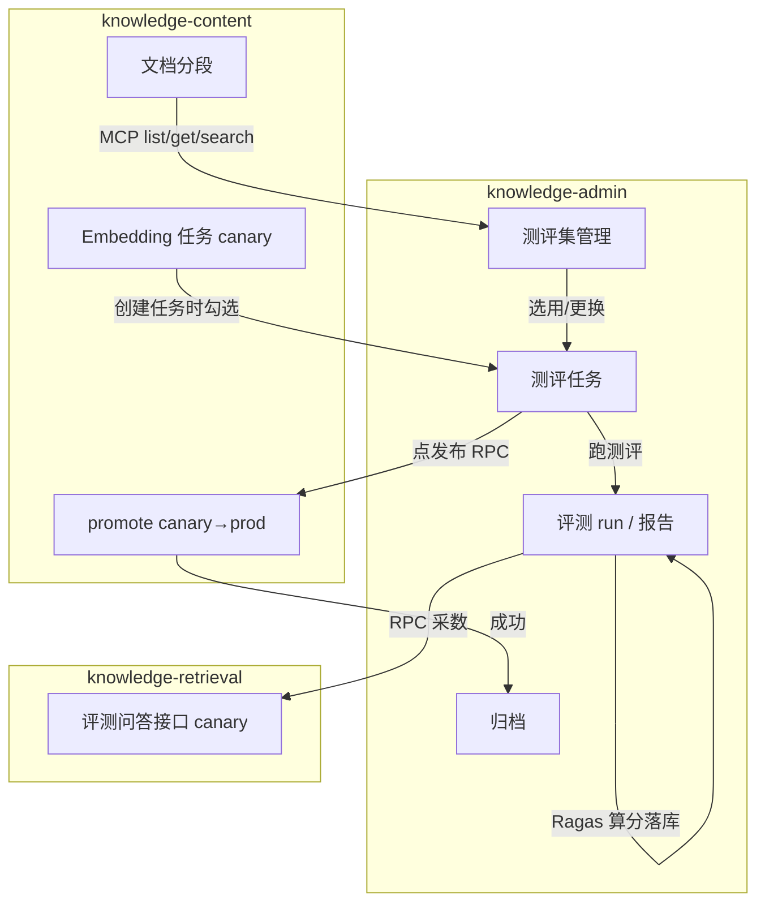

# Ragas 集成方案：知识库发布评测

> 目标：在现有流程上引入 **Ragas** 离线评测；不写代码，先给出可落地的实现思路与架构设计。
>
> **范围说明**：本期只做离线/人工触发评测与人工发布决策；**不做** A/B、**不做** Langfuse（提示词管理 / 线上监控）、**不做**评测结果自动门控发布。后续线上监控可继续挂在 admin 演进。

---

## 0. 已拍板决策（摘要）

| 项 | 决策 |
|----|------|
| 功能落点 | **`knowledge-admin` 主责**（测评集/任务/run/报告/编排发布）；通过 **RPC/内部接口** 调 `knowledge-content`、`knowledge-retrieval`；不新开服务 |
| 评测表存储 | 与现有 `knowledge_*` **同库**；表仍由 admin 服务读写维护 |
| 发布入口 | **有且仅有** admin 测评任务上点「发布」；**删除** embedding `auto-promote` 整条路径（调度/自动触发代码）；**不做** content 侧独立手动 promote；**不做**无测评直接上 prod |
| 发布门槛 | 任务 `OPEN` 且该任务历史上存在 **≥1 次** `run.status=SUCCESS` 才可发布；换测评集**不使**旧 SUCCESS 失效（不要求当前测集再跑） |
| 评测采数 | **改造问答 Agent**：支持 `releaseTag`（默认 prod），评测时打 canary；提供非流式出口返回 `{answer, contexts}` |
| 测评集 | **独立功能**，不挂切分/向量化流程；与评测任务解耦，可复用 |
| 测评集范围 | 一份测评集只对应一个 `doc_id`；生成时只勾选一个文档；同一文档可有多套测评集，用**名称**区分 |
| 出题方式 | 本期做 **生成 Agent + 分段 MCP**；题目**仅**来自一次自动生成；人工**只改**已有题（问/答/依据、enabled），**不**手写录入、**不**做增量补题 |
| 出题配额 | 提示词**写死**：总量 **20～40**；简单 : 中等 : 高难 = **1 : 2 : 1**；预算不够可少题，仍尽量保比例 |
| 测评任务 | 创建时勾选「测评集 + 向量化任务」；可多次跑、可更换测评集；满足发布门槛后点「发布」→ promote；成功后任务**归档**（不可再操作，报告只读可看） |
| 评测 run | 每次跑测评全量落库；run 本身天生只读（历史快照），与是否归档无关 |

---

## 1. 背景与目标

### 1.1 现状

- 知识内容进入 `knowledge-content` 后，经 Embedding 任务切分、向量化，写入 **Milvus canary**，再通过 `EmbeddingPublishService` 切换为 **prod**。
- 当前存在定时 **auto-promote**。本期要求**删除**自动触发发布代码，改为仅测评任务人工发布（见 §0）。
- 知识问答在 `knowledge-retrieval` 由 LangGraph Agent 完成。单独检索接口已支持 `releaseTag` / `taskId`（默认 prod）；**问答 Agent 尚未透传**，实际一直打 prod。
- 发布依据目前是「任务状态 + 向量写入成功」，缺少检索/生成质量的量化评估。
- 各服务已有 `facade` 目录约定对外/RPC VO，但跨服务调用契约尚未铺开；本期评测作为首批 admin → content / retrieval 的内部调用落地。

### 1.2 本次目标

| 目标 | 说明 |
|------|------|
| **独立测评集** | 按文档维护可复用题库；**生成 Agent + 分段 MCP** 一次出题 + 人工改题（无手写录入、无补题） |
| **测评任务** | 绑定测评集与某次向量化（canary）任务；人工多次跑 Ragas、看报告，再人工决定是否发布 |
| **人工发布** | 唯一入口：测评任务点发布（须历史上 ≥1 次 SUCCESS run）→ 调 content promote → 成功后归档 |

---

## 2. 功能落点与职责拆分

评测横切 content（文档/向量/发布）与 retrieval（问答），且属**测试/运营阶段**能力，后续还要跟线上监控一起放后台 —— **主责放 `knowledge-admin`，不新开服务。**

```text
┌──────────────────────────────────────────────────────────────┐
│                     knowledge-admin                           │
│  测评集 · 生成 Agent · 测评任务 · run/报告 · Ragas · 点发布    │
│  表：knowledge_eval_*                                         │
└───────┬──────────────────────────────┬───────────────────────┘
        │ 生成：MCP 拉分段              │ 评测/发布：RPC
        ▼                              ▼
┌───────────────────────┐    ┌────────────────┬─────────────────┐
│  分段 MCP（挂 content）│    │ knowledge-     │ knowledge-      │
│  list / get / search  │    │ content        │ retrieval       │
│  背后读 segment       │    │ promote 等     │ 评测问答接口    │
└───────────────────────┘    └────────────────┴─────────────────┘
```

| 服务 | 职责 |
|------|------|
| **admin** | 测评集 CRUD；**生成 Agent**（自主选段出题）；测评任务生命周期；跑测评（后台 + Ragas）；报告；点发布后归档；`knowledge_eval_*` 同库 |
| **content** | 文档/分段/向量化任务查询；**分段 MCP 数据源**；执行 `promote`；去掉 auto-promote |
| **retrieval** | Agent 支持 `releaseTag`/`taskId`（默认 prod）；评测非流式 `{answer, contexts}` |

约定：

- **publish 只在 content 执行**；admin 只编排「调 promote → 成功则归档」。
- **Ragas 长任务在 admin 后台跑**，不堵在 retrieval 请求里。
- **测评集生成**走 admin 内 Agent + 分段 MCP；任务查询/promote/评测采数仍走 RPC facade。
- 跨服务契约放各服务 `facade`；MCP 工具可与同一套分段查询共用实现。

---

## 3. 整体流程图

### 3.1 总览



### 3.2 测评集生成（Agent + MCP）

```text
【admin】选一个 doc + 填名称 → 启动生成 Agent
        │
        ▼ Agent 调 MCP list_segments（只要目录/预览，不拉全文）
        │
        ▼ Agent 自主决定：get 哪些段 / 是否 search 补洞
        │
        ▼ 对已取正文：抽要点 → 多要点合成复杂题（带 used_chunk_ids + 依据摘录）
        │     （不够则再 get/search，受预算约束）
        │
        ▼ save_dataset_items → knowledge_eval_dataset / item
        │
        ▼ 人工编辑题目
```

### 3.3 测评任务与发布

```text
向量化任务 COMPLETED（canary 就绪）
        │
        ▼ 【admin】创建测评任务：勾选 测评集 + embedding_task_id
        │
        ├─► 可更换测评集（旧 SUCCESS run 仍算发布门槛）
        │
        ▼ 【admin】跑测评（可多次）
        │     1. 快照当前测集题目 → run
        │     2. 逐题 RPC retrieval（canary + taskId）→ answer/contexts
        │     3. Ragas 打分 → 写 run / run_item
        │     4. 出报告（只读）
        │
        ▼ 【admin】人看报告 → 点「发布」
        │     前置：该任务历史上 ≥1 次 run=SUCCESS
        │
        ▼ RPC content.promote(embedding_task_id)
        │
        ▼ 成功 → 测评任务 status=ARCHIVED（禁止换集/再跑/再发；报告仍可看）
```

### 3.4 测评任务状态

```text
OPEN ──跑测评/换集──► OPEN ──（历史上≥1次 SUCCESS）发布成功──► ARCHIVED
         │
         └─ 失败的 run 不影响任务仍为 OPEN；可再跑
```

| 状态 | 可换集 | 可跑测评 | 可发布 | 可看报告 |
|------|--------|----------|--------|----------|
| OPEN | ✓ | ✓ | ✓（须历史上 ≥1 次 SUCCESS） | ✓ |
| ARCHIVED | ✗ | ✗ | ✗ | ✓（只读） |

> run 无「可改」状态：一旦写入即历史快照，只能新增下一次 run。  
> 换集不使旧 SUCCESS 失效；无 SUCCESS 时禁止发布。

---

## 4. 测评集（独立功能）

### 4.1 模型约定

```text
一份测评集
├─ 名称（业务自填，用于区分）
├─ doc_id（有且仅有一个）
├─ 描述（可选）
├─ 状态
└─ 题目列表
```

- 生成时**只能勾选一个文档**；同一 `doc_id` 允许多套，靠名称区分。
- **新建测评集** = 选 doc + 名称 → **启动生成 Agent 跑一轮**（无空白题库入口）。
- 人工仅可对已有题目做修改：问题、标准答案、参考依据、`enabled` 启停；**不**手写新增题目，**不**做增量补题 / 再跑生成追加。题不够可另建一套测集（同 doc、不同名称）。

### 4.2 生成形态：分段 MCP + 生成 Agent

目标：由 LLM **自主决策「有哪些段、拉哪些段」**，再做要点合成出题；禁止默认整篇/全量正文塞进上下文。**本期必做**生成 Agent（非后续项）。

#### 4.2.1 分段 MCP（建议挂 content，工具可被 admin Agent 调用）

| 工具 | 作用 | 返回要点 |
|------|------|----------|
| `list_document_segments` | 摸目录 | `chunk_id`、`chunk_order`、标题或前 N 字预览、长度；**不含全文** |
| `get_document_segments` | 按需取正文 | 指定 `chunk_ids[]`；单次最多 K 条 |
| `search_document_segments` | 补洞（可选） | 按 query 在该 doc 内语义/关键词检索相关段预览或正文 |

MCP 背后复用 content 分段查询（可带 `release_tag` / `task_id` 指定素材版本）。另需写库工具（可在 admin 侧非 MCP）：`save_dataset_items`。

#### 4.2.2 生成 Agent 循环（admin）

```text
list → 看目录 → 决定拉哪些
  → get（± search）→ 读正文 → 抽要点
  → 若覆盖不足 / 要复杂题再拉关联段
  → 2～3 条要点合成一题（问 + 标准答案 + 依据摘录 + used_chunk_ids）
  → save → 人改
```

出题策略仍是 **要点 → 再合成**（高难题须综合 ≥2 处信息）；差异在于「读哪些段」由 Agent 选，不是写死全量流水线。

#### 4.2.3 出题配额（提示词写死，不做配置项）

| 项 | 约定 |
|----|------|
| 总量 | **20～40** 题（Agent 在预算内自选，目标落在此区间） |
| 难度比例 | 简单 : 中等 : 高难 = **1 : 2 : 1**（例：24 → 6/12/6；40 → 10/20/10） |
| 简单 | 单段 / 单要点可答 |
| 中等 | 同主题少量综合 |
| 高难 | ≥2 处信息（多跳 / 对比 / 因果等） |

#### 4.2.4 保证自主决策有效的约束

| 手段 | 说明 |
|------|------|
| 系统提示 | 先 list；禁止未 list 就盲拉全文；高难题须多段依据；写入配额与 1:2:1 |
| 预算 | get 总段数 ≤ N；单次 get ≤ K；总 token / 总步数上限 |
| 覆盖 | 提示按 order 区间抽样；可多轮补未覆盖段 |
| 产出结构 | 每题强制 `used_chunk_ids` + 依据摘录，便于抽检；建议带难度档标记 |
| 降级 | 超预算或空结果 → 均匀抽样后仍按要点合成；可少于 20，仍尽量保 1:2:1 |

参考依据以**原文摘录**入库（可附 `used_chunk_ids` 作生成期溯源）；跨发版复用不以活 `chunk_id` 为唯一依赖。

---

## 5. 问答链路改造（retrieval）

| 能力 | 现状 | 本期改造 |
|------|------|----------|
| `/retrieval/search` | 已支持 `releaseTag`/`taskId`，默认 prod | Agent 内部可复用 |
| 问答 Agent | 未透传 releaseTag；仅 SSE | 透传 `releaseTag`（默认 **prod**）+ `taskId`；评测传 **canary** |
| 评测出口 | 无 | facade 非流式接口：`{answer, contexts}` |

线上对话默认 prod；仅 admin 评测跑批走 canary。

---

## 6. 测评任务与 run

### 6.1 能力

| 能力 | 说明 |
|------|------|
| 创建 | 绑定测评集 + 向量化任务 |
| 换集 | 归档前可换；旧 SUCCESS run 仍计发布门槛 |
| 多跑 | 每次独立 run |
| 发布 | 唯一入口：admin 调 content promote；须该任务历史上 ≥1 次 SUCCESS |
| 归档 | 发布成功后锁定操作 |

**删除** embedding `auto-promote`（含调度与自动触发代码）；**不做** content 侧独立手动 promote；无测评任务则无法上 prod。

### 6.2 run 落库内容（全量）

| 类别 | 内容 |
|------|------|
| 绑定 | 测评任务、测评集、embedding_task_id、releaseTag |
| 题目快照 | 问、标准答案、参考依据等 |
| 推理 | 每题 contexts、answer |
| 指标 | 逐题分 + 汇总 |
| 版本 | 起止时间、embedding_model、llm_version、裁判模型等 |

### 6.3 指标与参考线（仅供人看，不自动门控）

检索：`context_recall` / `context_precision` / `context_relevancy`  
生成：`faithfulness` / `answer_relevancy` / `answer_correctness`

```text
context_recall      ≥ 0.75
context_precision  ≥ 0.70
faithfulness       ≥ 0.75
answer_relevancy   ≥ 0.70
answer_correctness ≥ 0.70
```

---

## 7. 数据库设计

评测表由 **admin** 维护，与现有 `knowledge_*` **同库**（不单独拆库）。命名：`knowledge_eval_*`。

### 7.1 ER 关系

```text
knowledge_eval_dataset 1──* knowledge_eval_dataset_item
         │
         │ 选用（可换）
         ▼
knowledge_eval_task 1──* knowledge_eval_run 1──* knowledge_eval_run_item
         │
         └── embedding_task_id（逻辑关联 content 侧任务，无 DB 外键强绑）
         └── doc_id（冗余，便于列表筛选；与测评集 doc_id 一致校验）
```

### 7.2 `knowledge_eval_dataset`（测评集）

| 字段 | 类型 | 说明 |
|------|------|------|
| `dataset_id` | bigint PK AI | 主键 |
| `name` | varchar(128) | 名称（业务区分） |
| `doc_id` | bigint | 有且仅一个文档 |
| `description` | varchar(500) | 可选描述 |
| `status` | varchar(32) | 如 DRAFT / READY |
| `item_count` | int | 题目数冗余 |
| `user_id` / `dept_id` | bigint | 归属 |
| `create_by` / `create_time` / `update_by` / `update_time` | | 审计 |
| `del_flag` | char(1) | 0/2 |
| `remark` | varchar(500) | 备注 |

索引：`idx_doc_id`、`idx_status`、`idx_create_time`。

### 7.3 `knowledge_eval_dataset_item`（题目）

| 字段 | 类型 | 说明 |
|------|------|------|
| `item_id` | bigint PK AI | 主键 |
| `dataset_id` | bigint | 所属测评集 |
| `question` | text | 问题 |
| `ground_truth` | text | 标准答案 |
| `reference_excerpts` | mediumtext | 参考原文摘录 JSON 数组（出题依据） |
| `used_chunk_ids` | text | 可选，生成期选用的 chunk_id 列表（溯源；不唯依赖） |
| `keypoints` | text | 可选，合成所用要点 JSON |
| `sort_order` | int | 排序 |
| `enabled` | tinyint | 1=参与评测 / 0=剔除 |
| 审计字段 | | 同规范 |

索引：`idx_dataset_id`。

### 7.4 `knowledge_eval_task`（测评任务）

| 字段 | 类型 | 说明 |
|------|------|------|
| `eval_task_id` | bigint PK AI | 主键 |
| `name` | varchar(128) | 任务名称（可选） |
| `embedding_task_id` | bigint | 绑定的向量化任务 |
| `doc_id` | bigint | 冗余，与 embedding/dataset 对齐校验 |
| `dataset_id` | bigint | **当前**选用的测评集（可更换） |
| `status` | varchar(32) | `OPEN` / `ARCHIVED` |
| `publish_time` | datetime | 发布成功时间；未发布空 |
| `user_id` / `dept_id` | bigint | 归属 |
| 审计 + `del_flag` / `remark` | | |

索引：`idx_embedding_task_id`、`idx_dataset_id`、`idx_status`、`idx_doc_id`。

约束（应用层）：`ARCHIVED` 后拒绝换集/跑测/再发布。

### 7.5 `knowledge_eval_run`（一次跑测评）

| 字段 | 类型 | 说明 |
|------|------|------|
| `run_id` | bigint PK AI | 主键 |
| `eval_task_id` | bigint | 所属测评任务 |
| `dataset_id` | bigint | 该次跑选用的测评集 |
| `embedding_task_id` | bigint | 快照绑定 |
| `release_tag` | varchar(32) | 一般为 canary |
| `status` | varchar(32) | PENDING / RUNNING / SUCCESS / FAILED |
| `dataset_snapshot` | mediumtext | 题目快照 JSON（防改集漂移；也可只靠 run_item 冗余） |
| `summary_metrics` | text | 汇总指标 JSON |
| `report_text` | mediumtext | 可选，报告正文/渲染缓存 |
| `embedding_model_code` | varchar(128) | 版本信息 |
| `llm_version` | varchar(128) | 生成/问答模型 |
| `judge_model_code` | varchar(128) | Ragas 裁判模型 |
| `error_message` | varchar(2000) | 失败原因 |
| `started_at` / `finished_at` | datetime | |
| 审计字段 | | |

索引：`idx_eval_task_id`、`idx_status`、`idx_create_time`。

### 7.6 `knowledge_eval_run_item`（逐题结果）

| 字段 | 类型 | 说明 |
|------|------|------|
| `run_item_id` | bigint PK AI | 主键 |
| `run_id` | bigint | 所属 run |
| `dataset_item_id` | bigint | 原题 id（可空，以快照为准） |
| `question` | text | 快照 |
| `ground_truth` | text | 快照 |
| `reference_excerpts` | mediumtext | 快照 |
| `contexts` | mediumtext | 检索上下文 JSON |
| `answer` | mediumtext | 模型回答 |
| `metrics` | text | 各 Ragas 指标 JSON |
| `sort_order` | int | |
| 审计字段 | | |

索引：`idx_run_id`。

> run / run_item **只插入不更新业务字段**（status 从 PENDING→终态除外）；无编辑接口。

---

## 8. 跨服务接口（RPC / facade / MCP 草案）

### 8.1 分段 MCP（生成测评集用）

| 工具 | 说明 |
|------|------|
| `list_document_segments` | `doc_id` + 可选 `release_tag`/`task_id` → 段目录与预览 |
| `get_document_segments` | `doc_id` + `chunk_ids[]`（上限 K）→ 正文 |
| `search_document_segments` | `doc_id` + `query` → 相关段（可选） |

实现挂 content（或 content 数据 + MCP 适配层）；admin 生成 Agent 只通过工具访问分段，不默认全量加载。

### 8.2 admin → content（RPC）

| 能力 | 说明 |
|------|------|
| 查询 embedding 任务 | 列表/详情，供创建测评任务勾选（COMPLETED + canary） |
| `promote(embedding_task_id)` | 测评任务点发布时调用 |
| （可选）分段查询 HTTP | 与 MCP 共用实现，供非 Agent 场景 |

### 8.3 admin → retrieval（RPC）

| 能力 | 说明 |
|------|------|
| 评测问答 | 入参：`question`、`release_tag=canary`、`task_id`、权限上下文；出参：`answer`、`contexts` |

### 8.4 content 侧变更

- **删除** embedding `auto-promote` 整条路径（调度任务 / 自动触发代码）；不保留 content 侧独立手动发布入口。
- 暴露分段 list/get/search（供 MCP）与任务查询、promote 内部接口（promote 仅供 admin 测评任务编排调用）。

---

## 9. 实施阶段（阶段 1）

1. content：**删除** auto-promote；分段 list/get/search + 任务查询 + promote facade；分段能力挂 MCP。
2. retrieval：Agent 透传 releaseTag/taskId；评测非流式 facade。
3. admin：五张 `knowledge_eval_*` 表；**生成 Agent**（调 MCP + 配额 20～40 / 1:2:1 + 要点合成 + save）+ 测集**改题**（无录入、无补题）。
4. admin：测评任务（创建/换集/多跑/报告/发布门槛校验/归档）+ Ragas 后台跑批。
5. 联调：Agent 出题 → 人改 → canary 采数 → SUCCESS 报告 → promote → 归档。

---

## 10. 风险与注意事项

| 风险 | 说明 | 应对 |
|------|------|------|
| 评测/出题成本 | Agent 多步工具调用 + Ragas 均调 LLM | 段数/步数/token 预算；异步跑批 |
| Agent 漏段或乱拉 | 自主决策不等于全覆盖 | list 先行、区间覆盖提示、超预算降级抽样 |
| LLM 裁判偏差 | 指标受裁判模型影响 | 固定裁判版本；人工抽检 |
| 跨服务调用 | facade / MCP 需新建 | 契约先定；MCP 与 RPC 共用分段实现 |
| 权限透传 | retrieval / 分段受 data_scope | 透传操作者或服务账号策略 |
| 测集复用 vs 切分变化 | chunk_id 会变 | 依据存原文摘录；chunk_id 仅溯源 |
| Python 兼容 | 3.13 vs Ragas | POC 独立环境验证 |
| 数据隐私 | 测集/run 含原文 | admin 权限与审计 |

---

## 11. 后续迭代建议

1. 固定测评集做回归对比。
2. 多裁判模型交叉验证。
3. 线上监控 / Trace（可继续挂 admin，或再引入 Langfuse）。
4. 用户点踩回流测评集。
5. 增量补题 / 再跑生成追加；题型策略可插拔（对比/因果/多跳模板）。
6. （若运营需要）无测评旁路发布——**与本期「唯一入口」哲学冲突，默认不引入**。

---

## 12. 文档索引

| 主题 | 参考 |
|------|------|
| 切分与向量化流程 | [切分与向量化流程](../rag功能流程说明/切分与向量化流程.md) |
| 知识问答流程 | [知识问答流程](../rag功能流程说明/知识问答流程.md) |
| 系统架构总览 | [系统架构总览](../系统架构/系统架构总览.md) |
| Ragas 官方文档 | https://docs.ragas.io |
