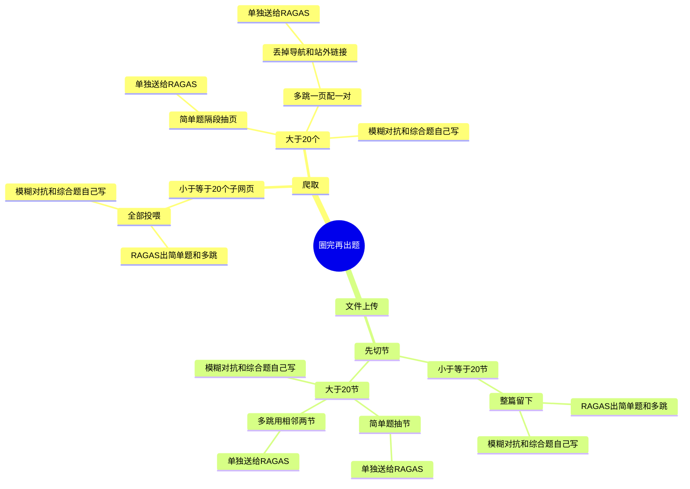

# 测试集出题架构方案

> 出题要同时盖住四类题、速度和 token。四类题是为了把 RAG 测全，不是照着某个出题库的合成器来分的。送进去的就是业务文档，问法跟着原文走。

---

## 核心矛盾

自动出题要同时做到下面三件。单独做容易，放在一起就会互相顶住。

### 1. 题型要齐

自动出的题要覆盖下面四类，用来把 RAG 测全：基础检索、跨段归纳、幻觉和拒答、长文总结。不能只有「从一段里抄一个事实」。

**简单事实查询。** 考察基础的检索和提取能力。答案在一段原文里就能找到。

**多跳推理问题。** 答案需要跨越多个文档片段，综合归纳才能得出。例如：对比 A 产品和 B 产品在保修政策上的区别。

**模糊或对抗性提问。** 用户提问表述不清，或者故意问一些文档里没有的内容。测试 RAG 系统是否会产生幻觉（胡编乱造），或者能否优雅地回答「我不知道」。

**长文本 / 综合类问题。** 需要系统对大段上下文进行深度总结和提炼。

简单事实查询看一段就能写。多跳要先知道哪几段合在一起才答得全。长文本要把一大段上下文送给模型。模糊和对抗性题还要故意离开原文，或把问法写糊。

### 2. 出题要快

测评集绑定的是一整篇文档，页数可以到几百。出题若先把每一页抽标题、写摘要、抽实体，再给切出来的每一块做筛选和主题，模型调用会跟着页数和块数涨。几十道题本身只要几分钟，时间几乎全耗在出题前的预处理上。人等不了几个小时才看到题。

### 3. 原材料总量要卡住，省 token

送进模型的原文必须有上限。全库送进去，token 和调用次数都按文档总量算，不按题数算。题只有几十道，读过的原文却是整库。

---

## 这几件事怎么顶在一起

- 多跳和长文本都要多段原文。给每一页做实体、摘要、主题，材料关系是有了，速度和 token 都保不住。
- 只均匀抽几页、每页直接出题，速度快、token 少，简单事实查询够用，多跳和长文本不稳。
- 模糊和对抗性题不能从原文里摘事实来写，还要构造「文档里没有」或「问法不清」的题，取材方式和另外三类不一样。
- 自己再做一套「全库抽实体、写摘要、找相似」来换速度，调用次数并不会少，只是把同一套预处理换了个地方。

后面的方案要回答的就是：四类题都留着，多跳和长文本的材料从哪来，读进模型的原文怎么封顶。

---

## 工具对比

RAGAS、DeepEval、LlamaIndex 都是把文档交进去再出题。交多少处理多少，没有「先按页面链接把页圈小」这一步。`testset_size` 只限制出多少题，不限制读多少页。

| | RAGAS | DeepEval | LlamaIndex |
|---|---|---|---|
| 简单事实查询 | 能出。单段具体题就是这类 | 能出。改写前的基础题就是这类 | 能出。一块原文一道题，三个里最快 |
| 多跳推理 | 能出。按实体重叠、主题相近把几段配上，题要几段合在一起才能答 | 不稳。把向量相近的块拼在一起，题经常一段就能答 | 不出。没有跨段关系 |
| 模糊或对抗 | 不出。题都设计成原文里能答，没有「文档里没有、应回答我不知道」 | 会写出原文答不了的题，但是改写跑偏，没有标准答案「我不知道」，也没有故意写糊的问法 | 不出。题都贴着给出的块 |
| 长文本 / 综合 | 只沾边。跨段概括不是「对一大段上下文做总结」 | 不做 | 不做。块是短的 |
| 速度 | 最慢。每篇都抽实体、写摘要、建关系 | 比 RAGAS 快，少了全库实体抽取；交进去的文档仍会先全部切块、做向量 | 最快。没有出题前的图谱 |
| 总量 | 不管。给多少篇处理多少篇 | 不管。抽样发生在全库切块和向量之后，前面的 token 省不掉 | 不管。给多少块处理多少块 |

<mark>简单题和多跳用 RAGAS。模糊、对抗和综合题自己写。出题只用圈好的那一批。</mark>

---

## 使用方案

<mark>圈资料自己做。</mark>用站内页面引用把页圈小，只走一步，页数封顶。再把这一小批送去出题。

<mark>简单题、多跳用 RAGAS。</mark>只喂圈好的页。

<mark>模糊、对抗、综合题自己写。</mark>模糊题把问法写不清；对抗题问文档里没有的内容，标准答案是「不知道」；综合题按多跳圈出来的那批内容出。小于等于 20 页时没有两批，用全部投喂的那一批。

LlamaIndex、DeepEval 不用来出题。

<mark>打分仍用 RAGAS。</mark>出题归出题，圈资料归圈资料。

圈资料怎么选，见下一节。选完怎么出题，放在圈资料后面。

---

## 圈资料

选页在本地完成，不调用模型。预算按题数定，不按文档有多少页定。爬取的子网页小于等于 20 个时，下面三种都不用，全部投喂。

### 系统里实际有两种材料

上传不只有 PDF。PDF、Word、Excel、Markdown 解析完，都是一篇文档里的一个 Markdown。源文件上限 100MB。MinerU 按最多 300 页一批解析，解析完再合成这一个文件，知识库里不按页拆开。库里现有 7 篇上传文档，每篇都是 1 个文件。有页数记录的 PDF 是 20 页和 61 页。已经切过分段的两篇，正文大约 1.6 万字。

网页爬取是一页一个 Markdown，默认不把多页合并成一个文件。Milvus 中文文档（`https://milvus.io/docs/zh/`）是 388 个文件，合计 4.9MB。单页中位数约 11KB，九成在 22KB 以内，最大一页约 59KB。正文合计约 383 万字，最短的一页也有约 1500 字。慢是因为页数多，不是因为单页像一本书。

爬取按子网页个数划线，不看每页实际大小。小于等于 20 个就全部投喂。同站首页那篇只有 2 页，走这条。388 页的中文文档走后面的抽样。

### 三种选法

#### 1. 系统抽样

按顺序隔一段取一页，取满就停。

Milvus 中文文档有 388 页，已经大于 20 页，才用这一招。简单题要 5 页，就用 388 除以 5，大约每隔 78 页取一页。第 1 页和最后一页一定要。不看这一页有多少字。

上传的《CPU内存排查》只有 1 个文件、大约 1.6 万字，用不着抽，整篇直接用。61 页的 PDF 要先按标题切成节，再按这个间隔抽节。

#### 2. 链接一对、只走一步

用页面里的链接，把两页配成一对。配好就停，不继续往下点。

还是 Milvus 这 388 页。抽看了 12 页，每页有十到几十条站内链接。首页和文档目录几乎每页都有，先丢掉。留下的链接必须指向这 388 页里面的某一页。

「创建外部集合」这一页有 56 条站内链接。丢掉首页和目录之后，只留 1 条指向这 388 页里的另一页。两页算一对。多跳要 10 道题，就留 10 对。不另量那一页有多大。

上传的 PDF 里几乎没有这种页与页的链接。多跳改用同一章下面挨着的两节。

#### 3. MMR

先放进一页。下一页要是和已经放进去的页用词差不多，就先不放，换一页差别更大的。放满就停。像不像只看用词或链接，不把全文送给大模型。

Milvus 里能看到「用 OpenAI 做向量」「用 Voyage 做排序」这种主题接近的页。这种选法会少留重复主题，再去拿讲检索、讲索引的页。文档站的页本身已经比较散，均匀抽通常就够了。手册要的是连续的一章，用不上这一步。

### 对着两种材料

| | 1. 系统抽样 | 2. 链接一对、只走一步 | 3. MMR |
|---|---|---|---|
| 爬取，很多小页（Milvus） | 合适。简单题用这个。388 页全喂，正文大约是抽中那几页的二十倍 | 合适，先洗链接。抽看了 12 页，每页有十到几十条站内链接；真正每页都出现的只有首页和文档目录。正文链接是跟着这一页走的。只保留指向这 388 页之内的链接，目录、首页、版本切换丢掉，再每个起点只留 1 条 | 收益不大。这些页主题本来就散，均匀抽已经能岔开。先算相似度再挑，多一步 |
| 上传，一个长文件 | 文件只有 1 个，按文件抽没有对象。先按标题在本地切成节，再对节做均匀抽 | 站内链接基本没有。多跳用同一上级标题下的相邻小节 | 也要先切节。它挑的是彼此不像的节，用来避开重复。模糊、对抗、综合题不走这一步 |

模糊题、对抗题、综合题不加页，用多跳圈出来的那一批自己写，不用简单题那几页。模糊题把问法写糊；对抗题问文档里没有的事，标准答案是「不知道」；综合题按这批内容出。小于等于 20 页时没有两批，用全部投喂的那一批。

### 怎么组合

<mark>先看是爬取还是上传。每一边再看大不大。</mark>

1. 爬取：子网页小于等于 20 个，全部投喂。大于 20 个，简单题隔段抽 5 页；多跳隔段取 10 个起点，每个起点只配一对，去重后不超过 20 页。不量每页多大。
2. 上传：先在本地按标题切节，没有标题就大约每 8000 字切一节，不调用模型。小于等于 20 节，整篇送去出题。大于 20 节，简单题隔段抽节；多跳用同一上级标题下的相邻节。

模糊题、对抗题、综合题都挂在同一支，不再另挑。小于等于 20 页，用全部投喂的那一批。大于 20 页，用多跳圈出来的页，不用简单题隔段抽出的那几页。多跳那批是成对的页，综合题才有内容可综合。

MMR 不进主路径。文档站用均匀抽已经够散；手册要的是连续的一章。

---

## 整体流程

圈资料在本地做完，不调用模型。出完写入测评集。打分仍用 RAGAS。MMR 不走这里。从中心往外看，一条分支走到底。

模糊题、对抗题、综合题不再另圈。小于等于 20 页（或 20 节）时，用全部投喂的那一批。大于 20 时，用多跳圈出来的页或节，不用简单题隔段抽出的那几页。

**RAGAS 出题。** 调用 `generate_with_langchain_docs` 时传入 `query_distribution`。不传的话，简单题和两种多跳会平分题数，混在一次里出。现在的代码还没传这个参数。

`query_distribution` 是合成器加权重，没有「简单题 / 多跳」这种开关。它只管最后写什么题，不管前面的抽标题、摘要、实体。交进去的页仍然全部做预处理，所以大于 20 时简单题和多跳必须分成两次调用，各带各的页。

1. 简单题那一次：只放 `SingleHopSpecificQuerySynthesizer`，权重为 1。
2. 多跳那一次：只放 `MultiHopSpecificQuerySynthesizer` 和 `MultiHopAbstractQuerySynthesizer`。这批页里建不出关系时，多跳会被跳过，这批就是 0 道，不要再把简单题合成器加回去出。
3. 小于等于 20、材料是同一批时，可以一次调用，上面三个合成器都放，能用的平分题数。综合题仍不走 RAGAS。

**题数和比例。** 没有线上提问记录，不按 RAGAS 平分。题数至少 50，少了某一类的分数站不住。20 页、20 节是圈资料的线，不是题数。一页可以出多道题。

按 4:2:2:1:1 分。50 道时是：

| 题型 | 道数 |
|---|---|
| 简单题 | 20 |
| 多跳 | 10 |
| 综合 | 10 |
| 模糊 | 5 |
| 对抗 | 5 |

简单题略多，因为它是主路径。再多，总分就会变成「只会从一页里抄一句」。多跳一道一对，50 道时正好 10 对。综合和多跳同一档，才看得出归纳行不行。模糊、对抗比真实流量多留一点，因为问错或胡编的代价高。这三类仍用多跳圈出来的那批材料，题分开数。

题数大于 50 时按同一比例取整，加起来要等于总题数，余数补给简单题。多跳对数等于多跳题数。

**切节。** 只用于上传。爬取已经是一页一个 Markdown，不用再切。判断长不长之前必须先切，否则没有节数。不看源文件那 100MB。

按 Markdown 标题切。代码块里的 `#` 不当标题。没有标题，大约每 8000 字切一节，这一档和 Milvus 单页正文的中位数同一量级。切完小于等于 20 节，整篇留下。大于 20 节，简单题按节隔段抽，多跳用同一上级标题下相邻的两节。库里《CPU内存排查》大约 1.6 万字，远不到 20 节，整篇直接用。

### 切节接口

content 现有的 `/internal/segments` 不改，也不把那里的分段交给 admin。那套切分是给向量用的：标题切开之后还要按块大小再切小，写进 embedding 的分段表。那些是向量块，不是这里的节。出题也不依赖文档已经做过 embedding。

上传另开一个对内接口。content 自己读这一份原文，按上面的规则切成节，把切好的节返回给 admin。不落分段表，不再切小。admin 不再自己切。

`GET /internal/documents/{docId}/sections`

只给上传的那一份 Markdown 用。爬取仍走现有的 `/internal/documents/{docId}/source-files`，admin 自己下载各页原文。

返回每一节：

1. 顺序，从 0 起。
2. 标题。按字数切开的节，标题为空。
3. 上级标题。多跳用来找同一章里相邻的两节。没有上级则为空。
4. 这一节的正文。

admin 拿到列表后：

1. 节数小于等于 20，这些节全部送去出题。
2. 节数大于 20，简单题按顺序隔段抽节，多跳用同一上级标题下相邻的两节。模糊题、对抗题、综合题用多跳圈出来的节，不再另切。

**简单题隔段抽页。** 页按爬下来的顺序排好，每隔固定几页取一页，不是按文章段落抽。Milvus 中文文档有 388 页，简单题要 5 页，就用 388 除以 5，大约每隔 78 页取一页。第 1 页和最后一页一定取。取满就停。这 5 页单独送给 RAGAS。上传的长文件先切成节，再按同样的间隔抽节。

**多跳一页配一对。** 用页面里的链接把两页配成一对，配好就停，不继续往下点。留下的链接必须指向这 388 页里面的某一页。这几对单独送给 RAGAS。上传的 PDF 里几乎没有这种链接，多跳改用同一章下面挨着的两节。

1. 首页和目录不能靠爬取入口来认。入口只在整站爬取时才是目录，只爬一节或几页时，入口就是普通的一页，按入口删会删错。改成看链接出现得密不密：上面隔段取出的 10 个起点里，超过一半都指向同一个地址，这个地址当成导航丢掉。只看这 10 页上的链接，不读正文，也不把剩下的页再扫一遍。Milvus 上按这个标准会丢掉的，就是首页和文档目录。
2. 配对要散在 388 页上，不从第一页顺着链接往下爬。页按爬下来的顺序排好，和简单题同一个顺序。10 对就用 388 除以 10，大约每隔 39 页取一个起点。每个起点只留 1 条合格链接，配成一对就停。这一页没有合格链接，就顺延到下一页，下一对起点仍按原来的间隔跳，避免对挤在一起。
3. 配 10 对。一道多跳题用一对。10 对去重后不超过 20 页，和「小于等于 20 页就全部投喂」同一条线。再多，多跳这一批的预处理时间就会往上走。

20 不是系统限制，是按等待时间倒推的。Milvus 中文文档 388 页全喂，估的是 5 到 9 个小时。时间几乎都在出题前的预处理，跟着页数涨。摊下来大约一页 1 分钟。小于等于 20 页全部投喂，大约二十分钟左右：按 5 小时摊大约 15 分钟，按 9 小时摊大约半小时。大于 20 页才圈，不然全喂就会从等一会儿变成等一小时。要是十分钟就该停，线在 10 页附近；半小时到四十分钟也能等，线可以放到 30 页。
