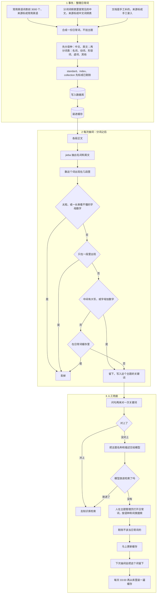

# 主题关键词过滤方案

主题 3 从正文里抽出了 14375 个词。其中大量是 `user`、`data`、`common` 这种日常用词，还有看不出意思的字母数字串。这份文档说明：这些词要滤掉，工业界常用的三种滤法在咱们这批词上分别会怎样，以及哪一种合适。

2026-10-08 已经按第一种办法删过一轮，词表现在是 13760 条。下面的段数是在正文里数的，不随词表删减变化。

## 这些词是干什么的

切分时用 jieba 从正文抽词，存进主题。用户提问时，问句再切一次。只要有一个词和主题里的词对上，就不再问模型，直接去知识库里搜。一个都对不上，才把主题名称和描述交给模型。

所以词表里该留的，是「问句里一出现，就说明这人在问咱们这批文档」的词。`Milvus`、`etcd`、`分析器` 是。`user`、`data`、`common`、`数据` 不是，随便一句问话都可能带上，结果被直接送去检索。

抽词没有个数上限。jieba 给每个词一个分数，分数高只表示它在那一段里比较显眼，不表示它是术语。`数据` 的分数是 4.781，`向量` 是 4.628，`数据` 更高。按分数从低往高砍，会留下 `数据`，砍掉一些真正的术语。

词来自任务 6 的正文，用来抽词的片段共 **3309** 段。在正文里搜索下面这些字符串，能搜到的段数是：

| 词 | 有这个词的段数 | 该留还是该丢 |
|---|---:|---|
| Milvus | 2522 | 留 |
| 数据 | 1749 | 丢 |
| data | 1331 | 丢 |
| 向量 | 1044 | 留 |
| user | 209 | 丢 |
| common | 146 | 丢 |
| etcd | 121 | 留 |
| standard | 89 | 留。上一道口语题靠它才进了检索 |
| 分析器 | 82 | 留 |

`user`、`data` 是按字符串搜的，`username` 这类也算进去了，只看量级。

## 方案一：先写一份「不要的词」

抽词之前准备一份名单，抽到名单里的词就丢掉。`user`、`users`、`data`、`common`，以及同样意思的中文 `数据`、`文档`、`内容`、`信息`，都写在上面。像 `b640d0a1a8a3` 这种纯字母数字、看不出词义的串，用一条规则丢掉，不必逐个去写。

这是搜索引擎里最常见的第一层。日常用词不参与检索，免得每篇文档都因为「的」「是」「data」被命中。

用在咱们身上：14375 条删掉 615 条，还剩 13760 条。你点名的那几个已经不在库里。没写进名单的还在，比如 `enable`、`down`，以及只在某一页出现过一次的配置名。

名单写得越长，漏网的越少，但文档里的普通词写不完。每发现一个，就补一次。

## 方案二：看这个词在咱们文档里出现了多少段

出现的段数特别多，当成谁都会用的词，丢掉。只在一段里出现过，当成某一页的代号或碎片，也丢掉。居中的留下。

搜索引擎建索引时会这样做：太常见的词不索引，只出现一次的词也可以不索引。

用咱们这张表对一下，两头都对不齐。

出现很多段的那一头：`Milvus` 有 2522 段，`数据` 有 1749 段，`向量` 有 1044 段。`Milvus` 比 `数据` 还常见。把「出现太多」定在能丢掉 `数据` 的位置，`Milvus` 和 `向量` 会一起被丢掉。这批文档整库都在讲 Milvus，真正的主题词本来就会反复出现。

出现很少段的那一头：`user` 有 209 段，`etcd` 有 121 段，`分析器` 只有 82 段。`user` 和 `分析器` 离得近。把线画在能丢掉 `user` 的位置，`分析器` 先没了。

只出现一次的乱码，这条规则能丢掉。它解决不了 `user` 和 `数据`。

## 方案三：拿日常用语来比

另外准备两份「平时谁都认识的词」，一份常用英语，一份常用汉语。抽出来的词如果在这两份里面，就丢掉，不管它在咱们文档里出现了多少段。不在里面，就留下。

再加一条：3309 段里只出现过一次的，丢掉。用户提问时几乎不会正好打出某一页里的代号。问得出来的术语，文档里通常会写很多遍。

写成 `queryNode`、`BM25` 这种带大写的，日常词典里没有，按写法直接留。

这是术语表的常用做法。判断一个词算不算术语，不看它在这本书里出现了几次，看它换一本书还常不常见。`data` 换到哪本技术书都有。`etcd` 只有在讲这套系统时才有。

对着咱们的词：

- `user`、`data`、`common`、`数据`、`文档`：日常就常用，丢掉。
- `Milvus`、`etcd`、`分析器`、`向量`：日常很少这么用，留下。
- 只写过一次的乱码、只出现一次的配置名：丢掉。
- `queryNode`、`BM25`：写法本身就是专名，留下。

有一小部分词两边都沾：`standard`、`index`、`collection`、`cluster`。日常英语里有这些词，咱们文档里它们又是专名。只靠日常词表，它们会被丢掉。

## 误伤怎么防

误伤指的是：这个词被当成日常词丢掉了，用户问的那句话里又没有别的词能对上主题，于是没进检索。

先看上次那道口语题。问句切开是 `standard`、`分析器`、`文本`。`standard` 在日常英语里。`分析器` 不在日常词表里，会留下。问句里还有 `分析器`，照样对得上。上次三个词都不在词表里，模型又没认出来，才没进检索。

真正会伤到的，是问句里只剩一个日常词能当线索。比如只说 `collection`。

曾经想过看这个词左右是不是老跟着同一个专名。对着这 3309 段数过：`collection` 旁边没有固定的词，挨得最多的那个只占 6%。`standard` 旁边最多的是 tokenizer，只占 21%。`data` 反而有 48% 挨着 crawler，因为有一批句子在重复同一句话。按「有固定搭档就留」会留下 `data`，丢掉 `collection`。这条不用。

改成三步：

- 在日常词表里的，默认丢掉。`user`、`data`、`common`、`数据`、`文档` 走这里。
- 已经知道会误伤的四个不参与过滤：`standard`、`index`、`collection`、`cluster`。日常词放在库里，页面上可以继续剔除。剔除后的词下次抽词会留下来。
- `queryNode` 这种中间还有大写的，以及 `BM25` 这种字母加数字的，直接留。只是首字母大写的 `Search`、`Error`，按小写去对日常词表，该丢还是丢。全大写的 `DROP`、`ID` 同样按小写处理。

只在一段正文里出现过的，不管是不是专名，都丢掉。

对不上关键词时，还会把主题名称和描述交给模型。模型也没认出来，再把那个词补进上面的短名单。

## 选方案三

方案一删完还剩一万三千多。`user`、`data` 能删掉，是因为有人把它们写进了名单，名单外面的普通词还在。

方案二只看咱们自己的 3309 段。这批文档讲的就是 Milvus，所以 `Milvus` 比 `数据` 更常见，`user` 和 `分析器` 的段数又挨在一起。同一条线划下去，该留的和该丢的分不开。

方案三看的是换到别的书里还常不常见。`user` 和 `数据` 在别的书里也常见，`etcd` 和 `分析器` 不会。这条线跟上面那张表是对齐的。只出现一次的碎片，用「至少出现两段」去掉，不靠人逐个辨认。

日常词默认丢掉。`standard`、`index`、`collection`、`cluster` 在短保留名单里。只出现一次的丢掉。改用这套规则时要重新抽一遍词，现有词表没记下每个词出现了几段。

## 实施过程

选定方案三之后，按下面三截落地。日常词先整理进库。每次抽词，分词之后按这个顺序过滤。伤到专名时，人在页面上把那个词从日常词里剔除。

### 日常词从哪来

中文用的是分词工具 jieba 自带的一张表，里面大约 27 万个词，每个词有一个常见程度分数，分数越低越常见。例如「的」是 0.88，「数据」是 4.78，「名字」是 6.18，「向量」是 9.26，「分析器」是 11.6。分数低于 7 的收进来，一共 3511 个。这条线刚好把「名字」「是」「和」划进来，把「向量」「分析器」留在外面。来源标成中文词频表。

「文档」的分数是 9.99，本来过不了这条线。它和「数据」一样，随便一句问话都可能带上，所以单独加了这一个。来源标成手工录入。后来在页面上新增的词，也标成手工录入。

英文用的是一张按网页出现次数排好的常用英语表，名字是 google-10000-english，取了去掉脏话的那一版里最靠前的 3000 个。the、user、data、common 都在里面。来源标成常用英语。

两份合在一起 6512 条。`standard`、`index`、`collection` 在常用英语里，入库时标成已剔除，不参与过滤。`cluster` 排在 3000 名之外，表里没有它，抽词时本来就会留下。

### 词怎么进的库

这 6512 个词没有写成 INSERT。`sql/07_upgrade_topic_everyday_word.sql` 只建空表 `knowledge_everyday_word`，加上菜单和每天 03:00 刷新缓存的任务。后面的 `sql/08` 到 `sql/11` 是改表名、加语种、加新增按钮、加来源，仍然不插入词。

中文那 27 万条在 jieba 安装目录里，英文 3000 个在程序里的词表文件。表是空的时，程序读这两份，分批写进库，并标上语种、词类、来源。主题管理页里的「初始化」会先清空这张表，再按同样的程序重新入库，并刷新缓存。页面上新增、剔除过的词会回到这份初始词表。日常词不单独占菜单。

