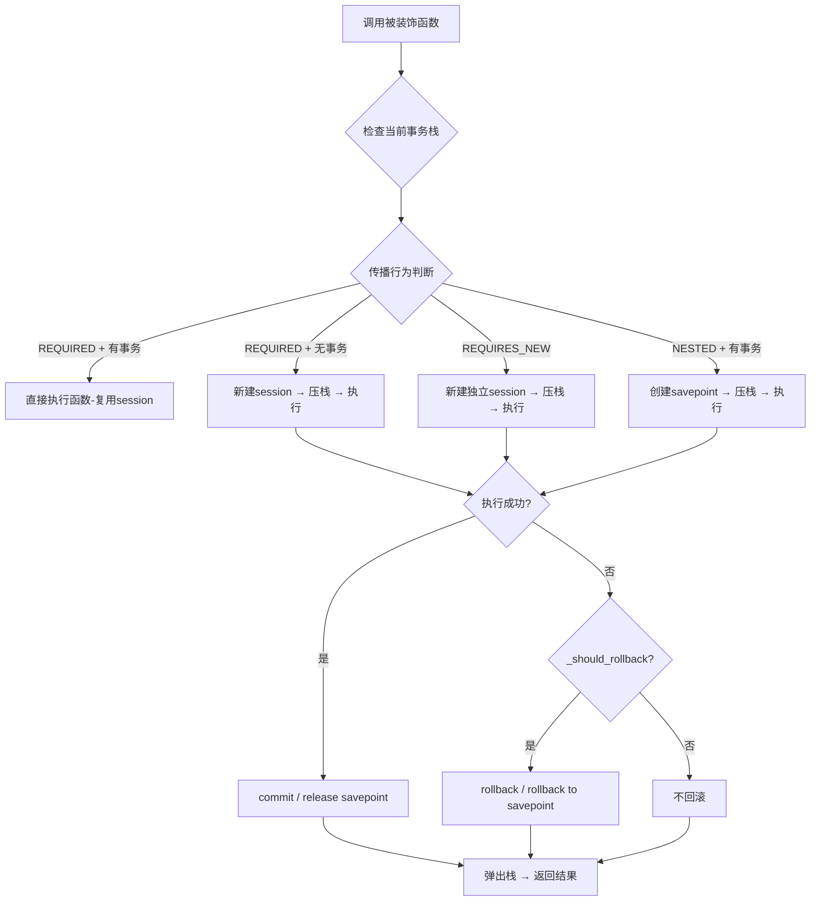
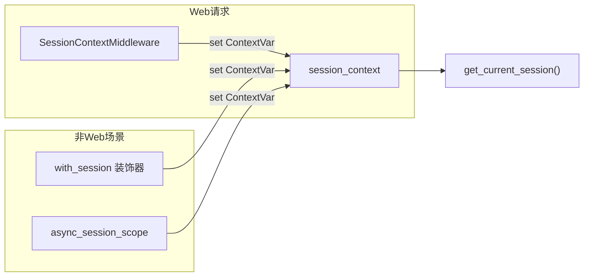

# 注解式事务管理机制

## 1. 概述

本项目实现了类 Spring `@Transactional` 的注解式事务管理，基于 FastAPI + SQLAlchemy 2.0 构建，同时支持**异步**（AsyncSession）和**同步**（Session）双模式。核心目标是对业务代码零侵入，消除手动 `commit/rollback` 的重复模板代码。

**模块位置**: `knowledge-common/src/knowledge_common/common/transactional.py`

### 公开 API 一览

| 模式 | API | 用途 |
|------|-----|------|
| 异步 | `@transactional()` | 异步事务装饰器 |
| 异步 | `get_current_session()` | 获取当前异步 session |
| 异步 | `@with_session` | 非 Web 异步场景 session 注入 |
| 异步 | `async_session_scope()` | 异步 session 上下文管理器 |
| 异步 | `SessionContextMiddleware` | FastAPI 请求级 session 中间件 |
| 同步 | `@transactional_sync()` | 同步事务装饰器 |
| 同步 | `get_current_session_sync()` | 获取当前同步 session |
| 同步 | `@with_session_sync` | 同步场景 session 注入 |
| 同步 | `session_scope()` | 同步 session 上下文管理器 |

---

## 2. 核心架构

### 2.1 双模式上下文隔离

```
┌────────────────────────────────┐  ┌────────────────────────────────┐
│        异步模式                  │  │        同步模式                  │
│  contextvars.ContextVar        │  │  threading.local()             │
│  (协程级隔离)                    │  │  (线程级隔离)                    │
│                                │  │                                │
│  _AsyncTransactionContextManager│  │  _SyncTransactionContextManager │
│  _AsyncSessionContextManager   │  │  _SyncSessionContextManager    │
└────────────────────────────────┘  └────────────────────────────────┘
```

- **异步场景**: 使用 `ContextVar` 维护事务上下文栈，天然支持 asyncio 并发隔离
- **同步场景**: 使用 `threading.local()` 维护事务上下文栈，线程级隔离

### 2.2 事务上下文栈

每次进入事务时，将 `TxContext`（包含 session、is_active、is_root 等信息）压入栈；退出时弹出。栈结构使嵌套事务层级清晰可追踪。

```python
@dataclass
class _AsyncTxContext:
    session: AsyncSession
    is_active: bool = True
    is_read_only: bool = False
    is_root: bool = False           # 最外层事务标记
    savepoint_name: str | None = None  # NESTED 模式
```

### 2.3 Session 获取优先级

`get_current_session()` 采用三层查找机制：

```
事务上下文（@transactional 内）
      ↓ 未命中
请求/任务级上下文（中间件 / @with_session 内）
      ↓ 未命中
抛出 TransactionException
```

---

## 3. 事务传播行为

支持 7 种传播行为，与 Spring 语义一致：

| 传播行为 | 行为描述 |
|----------|---------|
| `REQUIRED`（默认） | 有活跃事务则加入，无则新建 |
| `REQUIRES_NEW` | 始终新建独立事务，挂起当前事务 |
| `SUPPORTS` | 有事务则加入，无则无事务运行 |
| `NOT_SUPPORTED` | 挂起当前事务，无事务运行 |
| `NEVER` | 无事务运行，若存在事务则抛出异常 |
| `MANDATORY` | 必须有事务，否则抛出异常 |
| `NESTED` | 在当前事务中创建 savepoint，回滚仅到 savepoint |

---

## 4. 核心流程

### 4.1 事务装饰器执行流程



### 4.2 Session 注入双通道



### 4.3 嵌套事务统一提交

```
outer_func (@transactional REQUIRED) ─── 新建 session, is_root=True
  │
  ├── inner_func (@transactional REQUIRED) ─── 检测到活跃事务 → 直接执行（不新建session）
  │
  └── 全部成功 → 由 outer_func 统一 commit
       任何异常 → 由 outer_func 统一 rollback
```

---

## 5. 装饰器参数

```python
@transactional(
    propagation=PropagationBehavior.REQUIRED,  # 传播行为
    isolation=None,                             # 隔离级别（预留）
    read_only=False,                            # 只读事务
    timeout=None,                               # 超时（秒），异步用 asyncio.wait_for
    rollback_for=None,                          # 指定触发回滚的异常类型
    no_rollback_for=None,                       # 指定不触发回滚的异常类型
)
```

**回滚判断逻辑**:
1. 异常在 `no_rollback_for` 中 → 不回滚
2. 指定了 `rollback_for` → 仅匹配的异常回滚
3. 两者都未指定 → 所有 `Exception` 均回滚（默认策略）

---

## 6. 使用示例

### 6.1 异步事务 — 基础用法

```python
from knowledge_common.common import transactional, get_current_session

class ConfigService:
    @classmethod
    @transactional()
    async def add_config_services(cls, request, page_object):
        """新增参数配置 —— 事务自动管理，无需手动 commit/rollback"""
        if not await cls.check_config_key_unique_services(None, page_object):
            raise ServiceException(message='参数键名已存在')
        # DAO 内部通过 get_current_session() 获取 session
        await ConfigDao.add_config_dao(None, page_object)
        await request.app.state.redis.set(...)
        return CrudResponseModel(is_success=True, message='新增成功')
```

### 6.2 DAO 层从上下文获取 session

```python
from knowledge_common.common.transactional import get_current_session

class ConfigDao:
    @classmethod
    async def add_config_dao(cls, db: AsyncSession | None = None, config=None):
        """db 参数为 None 时自动从事务上下文获取"""
        if db is None:
            db = get_current_session()
        db_config = SysConfig(**config.model_dump())
        db.add(db_config)
        await db.flush()
        return db_config
```

### 6.3 同步事务 — 定时任务日志

```python
from knowledge_common.common.transactional import transactional_sync

class JobLogService:
    @classmethod
    @transactional_sync()
    def add_job_log_services(cls, query_db=None, page_object=None):
        """同步写入日志 —— 事务由装饰器管理"""
        JobLogDao.add_job_log_dao(query_db, page_object)
        return CrudResponseModel(is_success=True, message='新增成功')
```

### 6.4 嵌套事务 — REQUIRED 传播

```python
@transactional()
async def create_order(order_data):
    """外层事务：创建订单"""
    session = get_current_session()
    session.add(Order(**order_data))
    await create_order_items(order_data['items'])  # 内层复用同一事务

@transactional()
async def create_order_items(items):
    """内层事务：REQUIRED 传播，加入外层事务"""
    session = get_current_session()
    for item in items:
        session.add(OrderItem(**item))
    # 不会单独 commit，由外层统一提交
```

### 6.5 独立事务 — REQUIRES_NEW

```python
@transactional()
async def process_payment(order_id):
    """主事务"""
    await update_order_status(order_id, 'processing')
    await log_payment_attempt(order_id)  # 独立事务，即使主事务回滚也会保留日志

@transactional(propagation=PropagationBehavior.REQUIRES_NEW)
async def log_payment_attempt(order_id):
    """独立事务：即使外层回滚，日志也会被持久化"""
    session = get_current_session()
    session.add(PaymentLog(order_id=order_id))
```

### 6.6 NESTED — 部分回滚

```python
@transactional()
async def batch_import(records):
    """外层事务"""
    session = get_current_session()
    for record in records:
        try:
            await import_single(record)
        except ValueError:
            pass  # 单条失败不影响整体

@transactional(propagation=PropagationBehavior.NESTED)
async def import_single(record):
    """NESTED: 创建 savepoint，失败仅回滚到 savepoint"""
    session = get_current_session()
    session.add(Record(**record))
```

### 6.7 非 Web 场景 — @with_session

```python
from knowledge_common.common import with_session, get_current_session

@with_session
async def scheduled_cleanup_task():
    """定时任务：自动创建 session 并注入上下文"""
    session = get_current_session()
    expired = await session.execute(select(Token).where(Token.expires_at < now()))
    for token in expired.scalars():
        await session.delete(token)
    await session.commit()
```

### 6.8 非 Web 场景 — async_session_scope

```python
from knowledge_common.common import async_session_scope

async def one_off_migration():
    """一次性脚本：使用上下文管理器"""
    async with async_session_scope() as session:
        result = await session.execute(select(User).where(User.status == 'pending'))
        # ... 处理逻辑
```

### 6.9 同步场景 — session_scope

```python
from knowledge_common.common import session_scope

def sync_report_generation():
    """同步脚本：使用同步上下文管理器"""
    with session_scope() as session:
        result = session.execute(select(Report).where(Report.date == today))
        # ... 处理逻辑
```

### 6.10 回滚异常配置

```python
@transactional(rollback_for=(ValueError, ServiceException))
async def strict_validation(data):
    """仅 ValueError 和 ServiceException 触发回滚"""
    ...

@transactional(no_rollback_for=(BusinessWarning,))
async def tolerant_process(data):
    """BusinessWarning 不触发回滚，其他异常照常回滚"""
    ...
```

---

## 7. FastAPI 中间件集成

`SessionContextMiddleware` 在 `handle_middleware()` 中注册为第一个中间件：

```python
# knowledge-common/src/knowledge_common/middlewares/handle.py
def handle_middleware(app: FastAPI) -> None:
    app.add_middleware(SessionContextMiddleware)  # 第一个加载
    ...
```

**工作机制**：
1. 请求到达 → 中间件调用 `get_db()` 创建 AsyncSession
2. 将 session 存入 `_AsyncSessionContextManager`（ContextVar）
3. 请求处理期间，`get_current_session()` 可在任何层级（Controller/Service/DAO）获取此 session
4. 请求结束 → 清理 ContextVar，关闭 session

---

## 8. 迁移指南

### 迁移前（手动事务）

```python
class SomeService:
    @classmethod
    async def create_item(cls, query_db: AsyncSession, item_data):
        try:
            db_item = Item(**item_data)
            query_db.add(db_item)
            await query_db.commit()
            return CrudResponseModel(is_success=True, message='成功')
        except Exception as e:
            await query_db.rollback()
            raise e
```

### 迁移后（注解式事务）

```python
class SomeService:
    @classmethod
    @transactional()
    async def create_item(cls, item_data):
        session = get_current_session()
        db_item = Item(**item_data)
        session.add(db_item)
        return CrudResponseModel(is_success=True, message='成功')
        # 无需 try-except，无需 commit/rollback
```

**关键变化**:
- 移除 `query_db: AsyncSession` 参数传递（或设为可选）
- 移除 `try-except + commit/rollback` 模板代码
- DAO 层支持 `db=None` 时自动从上下文获取 session
- 新旧模式可共存，支持逐步迁移
