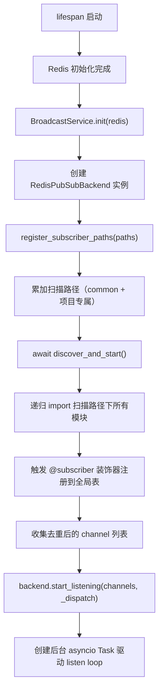
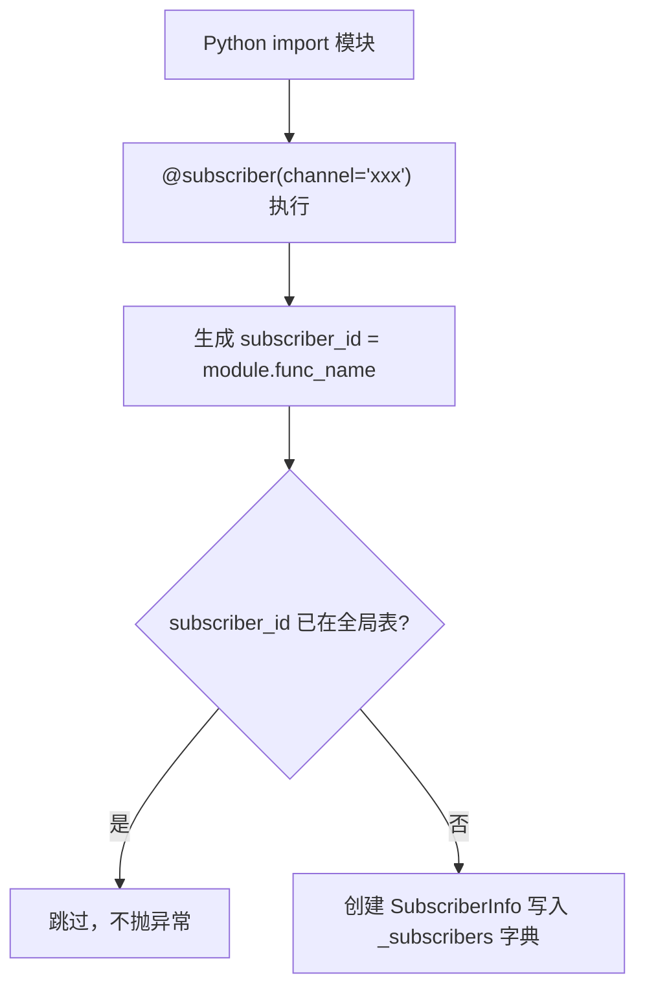
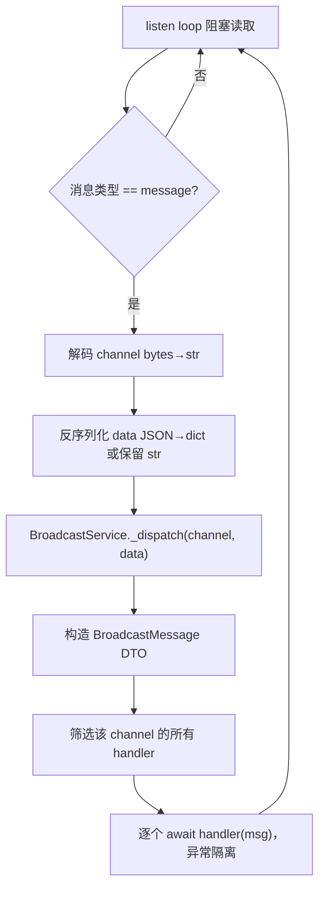
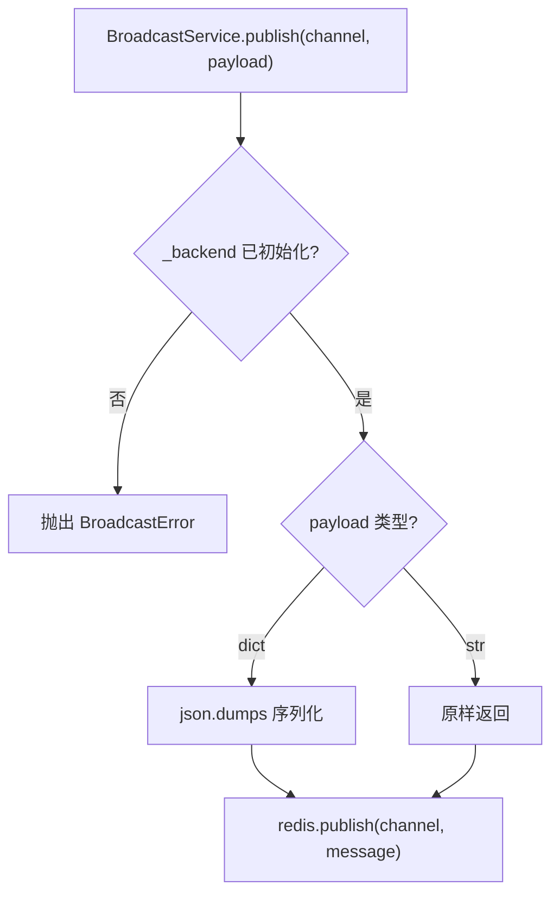
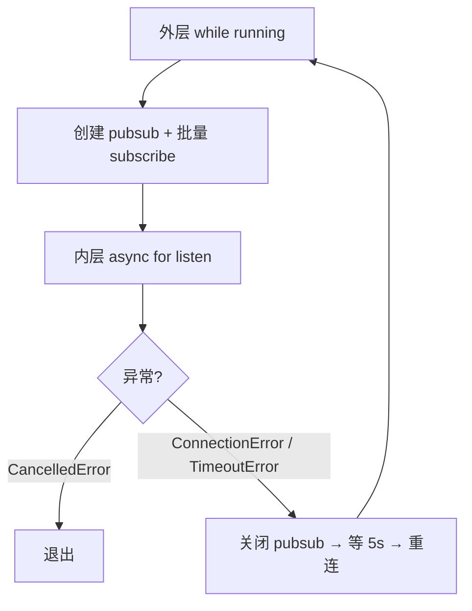
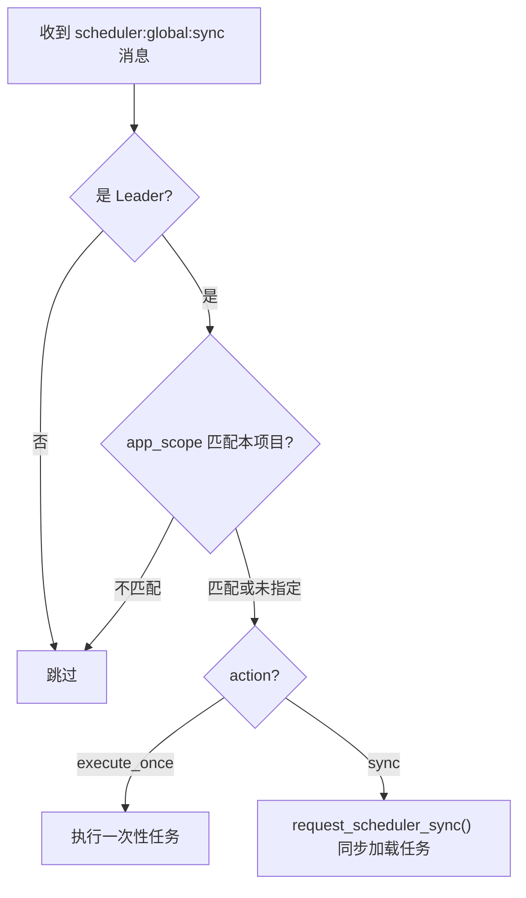
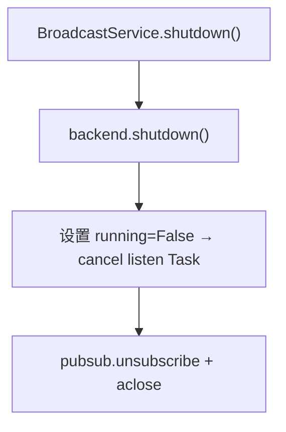

# BroadcastService 广播服务流程

## 启动流程

```mermaid
flowchart TD
    A["lifespan 启动"] --> B["Redis 初始化完成"]
    B --> C["BroadcastService.init(redis)"]
    C --> D["创建 RedisPubSubBackend 实例"]
    D --> E["register_subscriber_paths(paths)"]
    E --> F["累加扫描路径（common + 项目专属）"]
    F --> G["await discover_and_start()"]
    G --> H["递归 import 扫描路径下所有模块"]
    H --> I["触发 @subscriber 装饰器注册到全局表"]
    I --> J["收集去重后的 channel 列表"]
    J --> K["backend.start_listening(channels, _dispatch)"]
    K --> L["创建后台 asyncio Task 驱动 listen loop"]
```

## 订阅注册流程

```mermaid
flowchart TD
    A["Python import 模块"] --> B["@subscriber(channel='xxx') 执行"]
    B --> C["生成 subscriber_id = module.func_name"]
    C --> D{"subscriber_id 已在全局表?"}
    D -- 是 --> E["跳过，不抛异常"]
    D -- 否 --> F["创建 SubscriberInfo 写入 _subscribers 字典"]
```

## 消息接收与分发流程

```mermaid
flowchart TD
    A["listen loop 阻塞读取"] --> B{"消息类型 == message?"}
    B -- 否 --> A
    B -- 是 --> C["解码 channel bytes→str"]
    C --> D["反序列化 data JSON→dict 或保留 str"]
    D --> E["BroadcastService._dispatch(channel, data)"]
    E --> F["构造 BroadcastMessage DTO"]
    F --> G["筛选该 channel 的所有 handler"]
    G --> H["逐个 await handler(msg)，异常隔离"]
    H --> A
```

## 消息发布流程

```mermaid
flowchart TD
    A["BroadcastService.publish(channel, payload)"] --> B{"_backend 已初始化?"}
    B -- 否 --> C["抛出 BroadcastError"]
    B -- 是 --> D{"payload 类型?"}
    D -- dict --> E["json.dumps 序列化"]
    D -- str --> F["原样返回"]
    E --> G["redis.publish(channel, message)"]
    F --> G
```

## 自动重连机制

```mermaid
flowchart TD
    A["外层 while running"] --> B["创建 pubsub + 批量 subscribe"]
    B --> C["内层 async for listen"]
    C --> D{"异常?"}
    D -- "CancelledError" --> E["退出"]
    D -- "ConnectionError / TimeoutError" --> F["关闭 pubsub → 等 5s → 重连"]
    F --> A
```

## 定时任务广播消费流程

```mermaid
flowchart TD
    A["收到 scheduler:global:sync 消息"] --> B{"是 Leader?"}
    B -- 否 --> C["跳过"]
    B -- 是 --> D{"app_scope 匹配本项目?"}
    D -- 不匹配 --> C
    D -- 匹配或未指定 --> E{"action?"}
    E -- "execute_once" --> F["执行一次性任务"]
    E -- "sync" --> G["request_scheduler_sync() 同步加载任务"]
```

## 关闭流程

```mermaid
flowchart TD
    A["BroadcastService.shutdown()"] --> B["backend.shutdown()"]
    B --> C["设置 running=False → cancel listen Task"]
    C --> D["pubsub.unsubscribe + aclose"]
```
