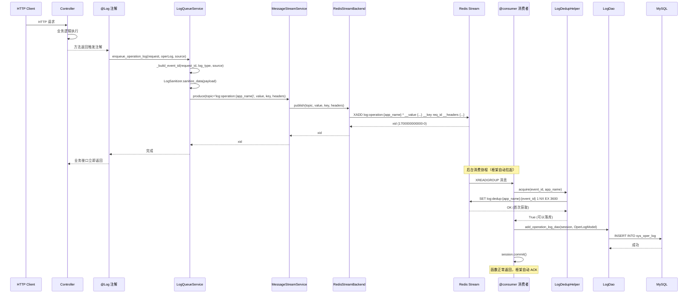

# 基于 MessageStreamService 的日志聚合流程

> 一句话：日志聚合通过 `MessageStreamService` 框架实现，推送侧用 `produce`，消费侧用 `@consumer` 装饰器，按 `app_name` 隔离，业务级去重由 `LogDedupHelper` 保证。

---

## 一、架构概述

日志聚合作为 `message-stream-service` 的标准业务方，完全遵循 Kafka 风格 API：

```
HTTP 请求 → @Log 注解 → LogQueueService.enqueue → MessageStreamService.produce
                                                              ↓
                                            RedisStreamBackend.publish (XADD)
                                                              ↓
                                            @consumer 装饰器 → 消费者函数
                                                              ↓
                                            LogDedupHelper.acquire (SET NX EX)
                                                              ↓
                                            DAO 落库 → 框架自动 ACK
```

**核心组件**：
- **LogQueueService**：推送门面，负责构建 payload、headers，调用 `MessageStreamService.produce`
- **@consumer 装饰器**：声明消费者，框架自动拉起后台消费协程
- **LogDedupHelper**：业务级去重，基于 Redis SET NX EX，异常时自动释放
- **MessageStreamService**：框架门面，统一管理生产/消费/ack/claim_idle

---

## 二、时序图



---

## 三、按 app_name 隔离的命名约定

### Topic 命名
- 操作日志：`log:operation:{app_name}`
- 登录日志：`log:login:{app_name}`

示例：
- admin 端：`log:operation:knowledge-admin`、`log:login:knowledge-admin`
- rag 端：`log:operation:knowledge-rag`、`log:login:knowledge-rag`

### Group ID 命名
- `log_writer:{app_name}`

示例：
- admin 端：`log_writer:knowledge-admin`
- rag 端：`log_writer:knowledge-rag`

### 隔离保证
- admin 进程只消费 `log:*:knowledge-admin` 系列 topic
- rag 进程只消费 `log:*:knowledge-rag` 系列 topic
- 跨 app 不串扰，日志条目不会出现在另一端的数据库表里

---

## 四、业务级去重机制

### LogDedupHelper 设计

```python
async with LogDedupHelper.acquire(event_id, app_name) as ok:
    if not ok:
        return  # 已被其他消费者落库或 event_id 为空
    async with AsyncSessionLocal() as session:
        await SomeLogDao.add_xxx_dao(session, ...)
        await session.commit()
```

**语义**：
- `__aenter__`：调 `redis.set(key, '1', nx=True, ex=3600)`，返回是否首次获取
- `__aexit__`：
  - 正常完成 → 保留 TTL 内的去重窗口（避免短期重复落库）
  - 业务抛异常 → 主动 `delete` dedup key，允许后端协议下一轮重试时再次获取

**event_id 计算**：
```python
base = f'{request_id}:{log_type}:{source}'
event_id = hashlib.md5(base.encode('utf-8')).hexdigest()
```

---

## 五、消费者代码示例

消费者文件位于 `knowledge_common/message/consumer/log_consumer.py`，由 common 集中维护：

```python
from knowledge_common.message_stream import Message, consumer
from knowledge_common.service.log_service import LogDedupHelper
from knowledge_common.config.database import AsyncSessionLocal
from knowledge_common.dao.log_dao import OperationLogDao
from knowledge_common.entity.vo.log_vo import OperLogModel

@consumer(topic='log:operation:knowledge-admin', group_id='log_writer:knowledge-admin')
async def handle_admin_operation_log(msg: Message) -> None:
    """
    admin 端操作日志消费者
    
    从 message_stream 取消息 → 业务级去重 → 落库 → 框架自动 ack
    """
    event_id = msg.headers.get('event_id')
    app_name = msg.headers.get('app_name', 'knowledge-admin')
    async with LogDedupHelper.acquire(event_id, app_name) as ok:
        if not ok:
            return
        async with AsyncSessionLocal() as session:
            operation_log = OperLogModel(**msg.value)
            await OperationLogDao.add_operation_log_dao(session, operation_log)
            await session.commit()
```

**关键点**：
- 消费者函数签名：`async def handle(msg: Message) -> None`
- 异常语义：函数抛异常 → 框架不 ack → 后端协议兜底（claim_idle 接管）
- 事务管理：每条消息独立 session，独立 commit

---

## 六、切 Kafka 时的契约保证

当日志聚合完全接入 `MessageStreamService` 后，切换后端只需修改 `.env`：

```bash
# .env
MESSAGE_STREAM_BACKEND = 'redis'  # 改为 'kafka' 即可切换
```

**业务侧零修改**：
- `@consumer` 装饰器保持不变
- `MessageStreamService.produce` 调用保持不变
- `LogDedupHelper` 保持不变
- `LoginLogDao` / `OperationLogDao` 保持不变

**只有框架层切换**：
- `RedisStreamBackend` ↔ `KafkaStreamBackend`
- 由 `backends/factory.py` 根据配置自动选择

---

## 七、配置说明

### LogConfig（业务级配置）

| 字段 | 默认值 | 说明 |
|------|--------|------|
| `log_stream_dedup_ttl` | 3600 | 去重 Key 过期时间（秒） |
| `log_stream_dedup_prefix` | `log:dedup` | 去重 Key 前缀 |

### MessageStreamSettings（框架级配置）

| 字段 | 默认值 | 说明 |
|------|--------|------|
| `message_stream_backend` | `redis` | 后端选择：redis / kafka |
| `message_stream_consume_block_ms` | 2000 | 阻塞读取等待时间（毫秒） |
| `message_stream_consume_batch_size` | 100 | 每次读取的最大消息数量 |
| `message_stream_claim_idle_ms` | 60000 | Pending 回收最小空闲时间（毫秒） |
| `message_stream_claim_interval_ms` | 5000 | Pending 回收检查间隔（毫秒） |
| `message_stream_redis_maxlen` | 100000 | Redis Stream 近似裁剪上限 |

---

## 八、监控与调试

### 查看消费组状态
```bash
# 查看 admin 端操作日志消费组
redis-cli XINFO CONSUMERS log:operation:knowledge-admin log_writer:knowledge-admin

# 查看 PEL（Pending Entries List）
redis-cli XPENDING log:operation:knowledge-admin log_writer:knowledge-admin
```

### 查看去重锁
```bash
# 查看 admin 端去重 key
redis-cli KEYS "log:dedup:knowledge-admin:*"
```

### 手动触发重试
```bash
# 认领空闲超过 60 秒的消息
redis-cli XAUTOCLAIM log:operation:knowledge-admin log_writer:knowledge-admin consumer-name 60000 0-0
```

---

## 九、故障排查

### 消息堆积
- 检查消费者协程是否正常运行
- 检查数据库连接是否正常
- 查看 PEL 长度：`XPENDING log:operation:{app_name} log_writer:{app_name}`

### 重复落库
- 检查 dedup key TTL 是否过短
- 检查 event_id 计算逻辑是否一致

### 跨 app 串扰
- 检查 topic 命名是否正确：`log:{event_type}:{app_name}`
- 检查 group_id 命名是否正确：`log_writer:{app_name}`
- 检查消费者装饰器 topic 参数是否匹配

---

## 十、相关文件

- **推送侧**：`knowledge_common/service/log_service.py`（LogQueueService）
- **消费者**：`knowledge_common/message/consumer/log_consumer.py`
- **去重 Helper**：`knowledge_common/service/log_service.py`（LogDedupHelper）
- **配置**：`knowledge_common/config/env.py`（LogConfig、MessageStreamSettings）
- **测试**：`knowledge-common/tests/test_log_aggregation_via_message_stream.py`
