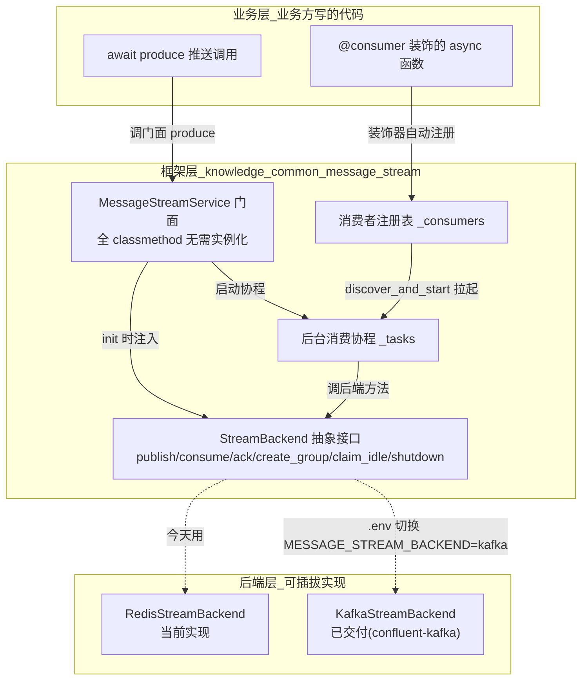
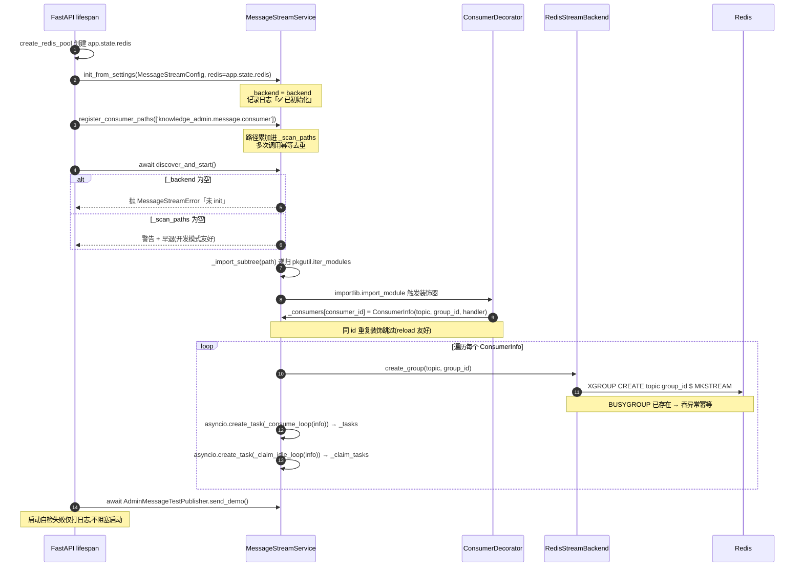
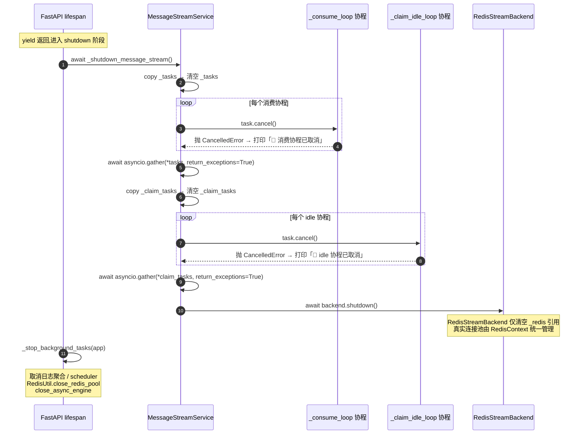
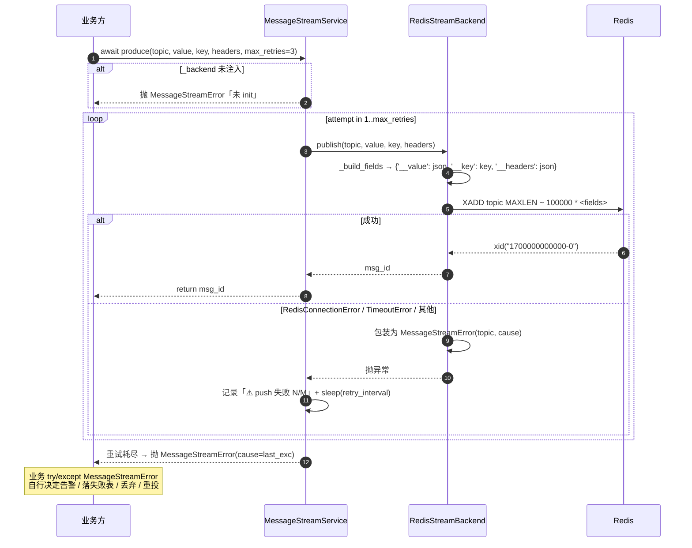
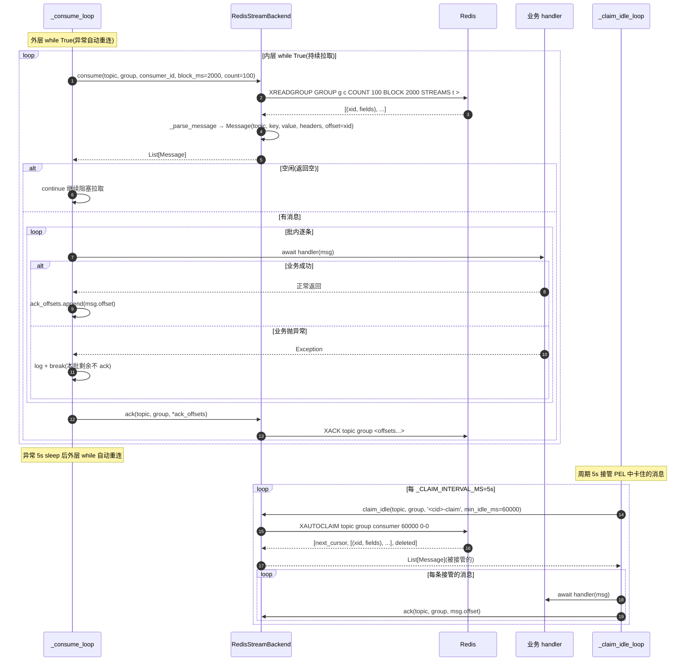

# 消息流服务设计 业务化总结

> 一句话:把"协议层 XADD/XREADGROUP/XACK"的裸操作,变成"业务层 `@consumer` 声明 + `produce` 推送"的 Kafka 风格门面。**.env 改 `MESSAGE_STREAM_BACKEND=redis|kafka` 即可切换后端,业务代码零行修改**。

---

## 一、为什么要做"消息流服务"

### 1.1 现状的痛

当前 Redis Stream 的协议操作(`XADD` / `XREADGROUP` / `XACK` / `XAUTOCLAIM`)与日志业务**深度耦合**在 `knowledge-common/src/knowledge_common/service/log_service.py` 一个文件里:

```text
[业务代码] → 裸调 XADD / XREADGROUP → [Redis Stream]
                ↑
              协议直接暴露
              想换 Kafka 就要改业务
```

**问题点**:
- 协议层与业务层无边界,业务代码直接调 `xadd` / `xreadgroup`
- 唯一消费者是日志聚合,即将新增 RAG 端"文档解析 + 拆分"长流程(分钟级、5 步骤、强可观测性)
- 这套裸调用既无法复用、也无法演进,更扛不住未来切 Kafka

### 1.2 业务诉求

| 诉求 | 业务表达 |
|---|---|
| 业务方"声明式"接入 | 写一个 `@consumer` 装饰的 async 函数就完事,不用关心 ack / 拉取 / 重连 |
| 推送方法统一 | 一个 `await produce(topic, value)` 调用就完事,失败自动重试 |
| .env 一行切后端 | 在 .env 中把 `MESSAGE_STREAM_BACKEND` 改为 `kafka` 即可,**业务代码、装饰器、消息字段、异常类型零行修改**(后端选择由 `init_from_settings` 工厂 + ``MessageStreamConfig`` 读取 .env 驱动) |
| 异常语义统一 | `try/except MessageStreamError` 一次性兜底,不用分别处理 Redis / Kafka 的协议异常 |
| 多业务可复用 | 日志聚合、文档解析、长流程任务……都用同一套门面 |

---

## 二、它做了什么:核心承诺

### 2.1 一图看清架构分层



### 2.2 三个核心承诺

| 承诺 | 实现机制 |
|---|---|
| **业务零感知协议** | 业务函数只接收 `Message` 对象,不调 `xadd` / `xack` / `subscribe` 等协议方法 |
| **切 Kafka 零修改** | 门面命名中性 / 装饰器参数对齐 Kafka / 消息字段对齐 Kafka / 异常统一 / 后端选择由 ``MessageStreamConfig.message_stream_backend`` + `create_backend` 工厂驱动 |
| **lifespan 单点接入** | 三行 `init` + `register_consumer_paths` + `discover_and_start`,与 `auto_register_routers` 风格一致 |

---

## 三、业务方用起来什么样

### 3.1 接入三步走(对齐真实代码)

> 真实接入位置参见 [knowledge-admin/.../server.py](file:///Users/jsir/programfiles/qoder/knowledge/knowledge-admin/src/knowledge_admin/server/server.py) 与 [knowledge-rag/.../server.py](file:///Users/jsir/programfiles/qoder/knowledge/knowledge-rag/src/knowledge_rag/server/server.py),消费者放在子项目的 `message/consumer/` 包下,被框架按声明路径全扫描注册。

```python
# === Step 1:在「业务消费者包」下新建消费者文件 ===
# 文件:knowledge_admin/message/consumer/test_consumer.py
from knowledge_common.message_stream import Message, consumer
from knowledge_common.utils.log_util import logger

@consumer(topic='test:admin:demo', group_id='admin_test_demo')
async def handle_admin_test_demo(msg: Message) -> None:
    # 业务正常返回 → 框架自动 ack
    # 业务抛异常    → 框架不 ack,后端协议兜底
    logger.info(f'收到: topic={msg.topic} key={msg.key} value={msg.value}')

# === Step 2:lifespan 启动阶段「独立函数」三行接入 + 自检 ===
# 文件:knowledge_admin/server/server.py
from knowledge_common.config.env import MessageStreamConfig
from knowledge_common.message_stream import MessageStreamService
from knowledge_admin.message.test_publisher import AdminMessageTestPublisher

async def _init_message_stream(app):
    # ① 注入后端实现(.env 改 MESSAGE_STREAM_BACKEND 即可切换 redis / kafka)
    MessageStreamService.init_from_settings(MessageStreamConfig, redis=app.state.redis)
    # ② 声明消费者扫描路径(可多次累加,同进程 admin + rag 也支持)
    MessageStreamService.register_consumer_paths(['knowledge_admin.message.consumer'])
    # ③ 扫描 + 拉起后台消费 / idle 接管协程
    await MessageStreamService.discover_and_start()
    # ④ 启动自检:发一条 demo 验证生产-消费链路(失败仅打日志,不阻塞启动)
    await AdminMessageTestPublisher.send_demo()

# === Step 3:lifespan 关闭阶段一行收尾(必须在 Redis 连接池关闭之前) ===
async def _shutdown_message_stream():
    await MessageStreamService.shutdown()
```

> 设计要点:消息流是「基础设施注册」而非「后台任务」,所以与 `_start_background_tasks`(scheduler / 日志聚合)拆成独立函数,职责清晰、关闭顺序可控。

### 3.2 推送消息

```python
from knowledge_common.message_stream import MessageStreamService, MessageStreamError

try:
    msg_id = await MessageStreamService.produce(
        topic='log:op',
        value={'op': 'login', 'user_id': 1},
        key='user_1',              # 业务键(顺序保证 / partition 路由用)
        headers={'trace_id': 'x'},
        max_retries=3,             # 默认 3 次重试
        retry_interval=0.5,        # 重试间隔(秒)
    )
except MessageStreamError as e:
    # 业务方自行决定:告警 / 落失败表 / 丢弃 / 重投
    logger.error(f'push 失败,业务自处理: {e}')
```

### 3.3 业务方"绝不该写"的代码

| ❌ 反模式 | ✅ 正确姿势 |
|---|---|
| `await redis.xadd(...)` | `await MessageStreamService.produce(...)` |
| `await redis.xreadgroup(...)` | `@consumer` 装饰一个 async 函数 |
| `await redis.xack(...)` | 业务函数正常返回,框架自动 ack |
| `try: ... except redis.ConnectionError` | `try: ... except MessageStreamError` |
| 用 Stream 的 xid(`"1700-0"`)做幂等键 | 用业务 ID(`doc_id` / `user_id`)做幂等键 |

---

## 四、运行时流程全景(按代码逻辑)

本章把门面的 4 条主路径——**启动注册 / 关闭 / 发送 / 消费**——按真实代码逐步还原,方便排查问题时"代码-文档双向对照"。

关键源码索引:
- 门面: [MessageStreamService](file:///Users/jsir/programfiles/qoder/knowledge/knowledge-common/src/knowledge_common/message_stream/service.py)
- 装饰器: [consumer](file:///Users/jsir/programfiles/qoder/knowledge/knowledge-common/src/knowledge_common/message_stream/consumer.py)
- 后端实现: [RedisStreamBackend](file:///Users/jsir/programfiles/qoder/knowledge/knowledge-common/src/knowledge_common/message_stream/backends/redis_stream.py)
- 抽象接口: [StreamBackend](file:///Users/jsir/programfiles/qoder/knowledge/knowledge-common/src/knowledge_common/message_stream/backends/base.py)
- 接入示例: [knowledge-admin server.py](file:///Users/jsir/programfiles/qoder/knowledge/knowledge-admin/src/knowledge_admin/server/server.py)

### 4.1 启动注册流程(lifespan 启动阶段)

**核心顺序**:Redis 连接池 → 后台任务(scheduler / 日志聚合) → **消息流基础设施注册** → 启动自检。



**关键代码骨架**:

```python
# knowledge-common/.../message_stream/service.py:discover_and_start
if cls._backend is None:
    raise MessageStreamError('MessageStreamService 未 init')
if not cls._scan_paths:
    logger.warning('⚠️ 未注册任何扫描路径'); return       # 早退保护

for path in list(cls._scan_paths):
    cls._import_subtree(path)                            # 触发 @consumer 注册

for consumer_id, info in list(cls._consumers.items()):
    await cls._backend.create_group(info.topic, info.group_id)   # 幂等
    cls._tasks[consumer_id]       = asyncio.create_task(cls._consume_loop(info))
    cls._claim_tasks[consumer_id] = asyncio.create_task(cls._claim_idle_loop(info))
```

**接入侧顺序约束**:
1. `_init_message_stream` 必须在 `app.state.redis` 创建之后调用(后端依赖该客户端)
2. `register_consumer_paths` 必须在 `discover_and_start` 之前(否则没有扫描入口)
3. 启动自检 `send_demo` 必须在 `discover_and_start` 之后(否则消费组未建,消息会堆积)

---

### 4.2 关闭流程(lifespan 退出阶段)

**核心顺序**:**先关消息流**(依赖 Redis)→ 再关后台任务 → 最后关 Redis 池 / DB 引擎。顺序反了会出现"协程 cancel 时 Redis 已断"的二次异常。



**关键代码骨架**:

```python
# knowledge-common/.../message_stream/service.py:shutdown
consume_tasks = list(cls._tasks.values()); cls._tasks.clear()
for t in consume_tasks:
    if not t.done(): t.cancel()
if consume_tasks:
    await asyncio.gather(*consume_tasks, return_exceptions=True)

# claim 协程同样处理...

if cls._backend is not None:
    try: await cls._backend.shutdown()
    except Exception as e: logger.warning(f'⚠️ backend.shutdown 异常(忽略): {e}')
```

**为什么先收 cancel 再 gather**:统一向所有协程发取消信号,再一次性等待全部退出,避免串行 `await` 时"前一个还在退,后一个还在跑"的窗口。

---

### 4.3 发送消息流程(produce → backend.publish)

**核心承诺**:业务一次 `await produce(...)` 调用,框架自动重试 3 次,失败统一抛 `MessageStreamError`,业务 `try/except` 一次性兜底。



**关键代码骨架**:

```python
# knowledge-common/.../message_stream/service.py:produce
for attempt in range(1, max_retries + 1):
    try:
        return await cls._backend.publish(topic, value, key, headers)
    except MessageStreamError as e:
        last_exc = e
        if attempt < max_retries:
            await asyncio.sleep(retry_interval)
raise MessageStreamError(f'push 失败,已重试 {max_retries} 次', topic=topic, cause=last_exc)
```

**异常分层处理**(`RedisStreamBackend.publish`):
- `RedisConnectionError` / `RedisTimeoutError` → 包装 `MessageStreamError(cause=...)`,门面层会重试
- 任何其他 `Exception` → 同样包装为 `MessageStreamError`,门面层兜底重试
- **业务层 100% 只需 `except MessageStreamError`,不接触 redis-py 任何异常**

---

### 4.4 消费消息流程(每个 ConsumerInfo 一对协程)

**核心结构**:`discover_and_start` 为每个 `@consumer` 拉起 **两个并行协程**——`_consume_loop`(主消费)+ `_claim_idle_loop`(PEL 兜底)。



**两个协程的职责划分**:

| 协程 | 职责 | 拉取方式 | 消息来源 | ack 时机 |
|---|---|---|---|---|
| `_consume_loop` | 主消费 | 阻塞 2s,批量 100 条 | `XREADGROUP ... >`(只拉未派发过的) | 本批全部 handler 返回成功后批量 ack |
| `_claim_idle_loop` | PEL 兜底 | 每 5s 一轮 | `XAUTOCLAIM`(接管 60s 未 ack 的) | 每条 handler 返回成功后立即 ack |

**关键代码骨架**:

```python
# knowledge-common/.../message_stream/service.py:_consume_loop
while True:                                  # 外层:异常重连
    try:
        while True:                          # 内层:持续拉取
            messages = await backend.consume(
                topic, group_id, consumer_id, block_ms=2000, count=100,
            )
            if not messages: continue        # 空闲继续阻塞
            ack_offsets = []
            for msg in messages:
                try:
                    await info.handler(msg)  # 业务 handler
                    ack_offsets.append(msg.offset)
                except Exception:
                    logger.error(...)        # 业务异常不 ack
                    break                    # 本批剩余也走兜底(PEL)
            if ack_offsets:
                await backend.ack(topic, group_id, *ack_offsets)
    except asyncio.CancelledError: raise     # shutdown 退出
    except Exception:
        await asyncio.sleep(5.0)             # 5s 后外层重连
```

**ack 语义三档**:

| 场景 | 是否 ack | 后续何去何从 |
|---|---|---|
| 业务正常返回 | ✅ 是 | 消息从 PEL 移除,不会重发 |
| 业务抛异常 | ❌ 否 | 留在 PEL,60s 后被 `_claim_idle_loop` 接管重试 |
| `backend.ack` 失败 | 不可控 | 下轮 `XREADGROUP` 不重读,但 60s 后 idle 协程会接管 |

**业务言下之意**:业务只需「返回 = 成功」「抛异常 = 请重试」,不需要了解 PEL / XAUTOCLAIM / offset 等协议细节。切 Kafka 后,`_claim_idle_loop` 退化为"按未 commit 区间 seek 重读",业务依然零修改。

---

## 五、切 Kafka 零返工的 4 个埋点(执行清单)

这一节是**切 Kafka 时的执行清单**,本 change 在第一版实现时就已贯彻全部 4 条,所以切换时**业务侧零行修改**(后端切换只改 .env 中的 `MESSAGE_STREAM_BACKEND` 即可)。

### 埋点 1:业务 ID 自管,不依赖消息 ID

**为什么**:Stream 的 xid 是 `"1700000000000-0"` 格式,Kafka 的 offset 是单调递增整数。两者格式不一样,业务方如果用消息 ID 做幂等键,切换就要重写。

**做法**:业务方用 `business_id_fn` 装饰器参数 / 或用 `msg.key` 声明业务幂等键。

```python
# ✅ 切 Kafka 时这段代码零修改
@consumer(
    topic='doc:parse',
    group_id='rag_parser',
    business_id_fn=lambda msg: msg.value['doc_id'],   # 业务 ID 自管
)
async def parse_doc(msg: Message) -> None:
    doc_id = msg.value['doc_id']
    if already_parsed(doc_id):       # 用业务 ID 查幂等表
        return
    do_parse(doc_id)
```

### 埋点 2:幂等键由业务声明,不靠协议层

**为什么**:Stream 没有 partition 概念(全局有序),Kafka 用 partition key 路由(同 key 进同 partition,保证顺序)。业务如果想"同一文档的所有消息进同一个 worker",**只能靠业务声明的 key**。

**做法**:`produce(..., key='doc_123')` 声明业务键,后端各自实现:
- Stream 后端:把 key 塞进消息 payload,业务侧消费时按 key 自行过滤
- Kafka 后端:把 key 作为 partition key,broker 自动按 hash 路由

```python
# ✅ 业务声明 key,切 Kafka 时这段不用改
await MessageStreamService.produce(
    topic='doc:parse',
    value={'doc_id': 'doc_123', 'step': 'extract'},
    key='doc_123',   # 同一 doc_id 的消息必走同一 worker(切 Kafka 后由 partition 保证)
)
```

### 埋点 3:顺序保证通过 key 参数声明

**为什么**:Stream 全局有序(单分区天然有序),Kafka 多 partition 只在同 partition 内有序。业务想要"同一文档串行处理",必须**显式声明 key**。

**做法**:跟埋点 2 同一个 `key` 参数搞定,但语义不同:
- **埋点 2** 是"声明幂等键给业务用"
- **埋点 3** 是"声明路由键给后端用"
- **同一个 key 参数** 同时承担两个职责,所以业务方一次声明、双重保护

### 埋点 4:异常语义统一,业务抛 = 失败 = 框架不 ack

**为什么**:Stream 是 PEL 接管(空闲超时 `XAUTOCLAIM` 其他 worker 接手),Kafka 是 offset 重平衡(没 commit 的下次重读)。两者机制不同,但**业务侧的语义必须统一**。

**做法**:框架强制"业务抛异常 → 不 ack → 后端协议兜底"的语义,业务侧只管 try/except 业务逻辑,**不用关心是 PEL 还是重平衡**。

```python
# ✅ 业务异常处理代码切 Kafka 时零修改
@consumer(topic='doc:parse', group_id='rag_parser')
async def parse_doc(msg: Message) -> None:
    try:
        do_parse(msg.value)
    except BusinessRetryableError:
        raise            # 框架不 ack,后端协议接管(Stream PEL / Kafka 重平衡)
    except BusinessFatalError:
        save_to_dead_letter(msg)   # 业务自己落死信
        # 不 raise,框架认为成功,ack 消息(不让它无限循环)
```

---

## 六、业务状态由业务自己管(不要塞进消息层)

| ❌ 反模式 | ✅ 正确姿势 |
|---|---|
| 把任务进度塞进 Stream 消息 fields 里 | 业务在关系库建 `rag.task` 表维护任务状态 |
| 用消息 ID 作为业务状态主键 | 用业务 ID(`doc_id`)作主键 |
| 靠"重放消息"恢复业务状态 | 靠"查业务状态表"恢复 |

**为什么**:
- 消息层(Stream / Kafka)是**临时缓冲区**,有 TTL / maxlen / 重平衡,不适合长期持有业务状态
- 业务状态(任务进度、文档解析状态)由**关系库**承载,跟消息中间件解耦
- 切 Kafka 时业务状态表**零修改**,只是触发器(消息)换了协议

---

## 七、与 `RedisPubSubUtil` 的对仗

项目里已有 `utils/redis_pubsub_util.py` 作为 Pub/Sub 广播工具,本次新增的 `MessageStreamService` 是**职责互补**而非替代:

| 维度 | `RedisPubSubUtil` | `MessageStreamService` |
|---|---|---|
| 物理位置 | `utils/`(无状态工具) | `service/message_stream/`(有生命周期 + 注册机制) |
| 命名 | `RedisPubSubUtil`(中间件名打头) | `MessageStreamService`(中间件无关) |
| 中间件 | Redis Pub/Sub | Redis Stream / Kafka 双后端 |
| 消息可靠性 | 离线订阅者收不到(可丢) | 消费组 + ack / PEL(不丢) |
| 业务接入 | 命令式 `subscribe(channel, callback)` | 声明式 `@consumer(topic, group_id)` 装饰器 |
| 启动机制 | 业务方手动调 `subscribe` | 框架 `discover_and_start` 全路径扫描 |
| 切 Kafka | 不支持(Pub/Sub 无对应) | **零修改**(契约对齐 Kafka) |
| 典型场景 | 调度器 sync 广播、实时通知 | 日志聚合、文档解析、长流程任务 |
| 业务方负担 | 自己写 while True 循环 / 自己处理重连 | 框架兜底,业务只写业务函数 |

**选型口诀**:
> 「**丢了也没事的实时广播 → Pub/Sub**」
> 「**不能丢的可靠队列 / 长流程任务 → MessageStreamService**」

---

## 八、为什么不抽 Saga / Outbox / 幂等装饰器

这是一个**主动设计的边界**,不是疏漏。

| 框架不做的事 | 谁来做 |
|---|---|
| Saga 事务编排 | 业务编排层(业务方自己写 step 函数) |
| Outbox 模式 | 业务方关系库 + 定时扫描发布 |
| 通用幂等装饰器 | 业务方根据自己的业务键自己实现 |
| 业务消息轨迹 | 业务方按需写入业务追踪表 |

**原因**:
- 这些是**业务编排层**的职责,放进框架会让框架变得"啥都管,啥都管不好"
- 业务的幂等键 / 状态机 / 轨迹都跟具体业务强相关,框架无法给出"一刀切"的方案
- 本服务定位:**协议层抽象 + 注册 + 推送 + 兜底**,做好"消息正确进出"这一件事

---

## 九、关键决策回顾

| 决策 | 内容 | 原因 |
|---|---|---|
| 门面命名 | `MessageStreamService` | 中间件无关,切 Kafka 命名不变 |
| 位置 | `message_stream/` 子包 | 有生命周期和注册机制,不属于 utils,也不混业务 service |
| 方法名 | `produce` | 对齐 confluent-kafka 原生命名 |
| 装饰器参数 | `topic` + `group_id` | 对齐 Kafka 客户端原生参数 |
| 装饰器文件 | 独立 `consumer.py` | 与门面分开,职责清晰 |
| Message 字段 | `topic` / `key` / `value` / `headers` / `timestamp` / `offset` / `partition` | 对齐 Kafka;留 `stream` / `payload` 别名兼容老代码 |
| 业务路径注册 | `register_consumer_paths(paths)` | 对齐 `auto_register_routers` 范式 |
| ack 透明化 | 业务正常返回自动 ack,业务抛异常不 ack | 业务零感知协议,后端协议兜底 |
| 重试策略 | 默认 3 次,失败抛 `MessageStreamError` | 业务方 try/except 一次性处理 |
| 抽象接口 | 6 个方法:`publish` / `consume` / `ack` / `create_group` / `claim_idle` / `shutdown` | 覆盖 Redis Stream 与 Kafka 的最小公共集 |
| Kafka 客户端选型 | **confluent-kafka 2.14+**(`confluent_kafka.aio.AIOProducer` / `AIOConsumer`,librdkafka 同步 API + 内部 ThreadPoolExecutor 包装) | librdkafka 工业级稳定 + 官方 Confluent 维护 + AsyncIO 支持(2.5+ aio 模块稳定) |
| 后端工厂 | `create_backend(settings, redis)` 按 `message_stream_backend` 选 Redis/Kafka 实现 | 业务方在 lifespan 一行调用,屏蔽实例化差异 |
| 入口 API | `MessageStreamService.init_from_settings(settings, redis=)` | 代理 `init + create_backend`,`init(backend)` 仍保留用于单元测试注入 |
| 实现 4 个埋点 | 业务 ID 自管 / 幂等键业务声明 / 顺序用 key / 异常语义统一 | 切 Kafka 时业务零修改的硬性约束 |
| 消费拉取参数 | `block_ms=2000` / `batch_size=100` | 平衡 idle 唤醒频率与吞吐 |
| idle 接管参数 | `claim_idle_ms=60_000` / `claim_interval_ms=5_000` | 消费者 60s 内未 ack 即由 idle 协程 5s 周期接管 |
| 推送默认 maxlen | `100_000`(approximate) | Stream 近似裁剪防无限增长,Kafka 用 retention 取代 |
| 消费循环兜底 | 异常 5s sleep 后外层重连 | Redis 闪断 / 协议错误自愈,业务无感 |

---

## 十、一句话总结

> 这一版消息流服务,把"业务调协议"的耦合,变成"业务声明 + 框架兜底"的解耦。
> .env 改 `MESSAGE_STREAM_BACKEND` 一行即可在 Redis Stream 与 Kafka 间切换,**业务代码零行修改**。
> **业务只关心业务,协议交给框架,后端选择交给 .env**。
