# Redis Pub/Sub 广播机制 通用知识总结

> 本文档整合 Redis Pub/Sub 的核心原理、性能本质、消息生命周期、适用边界与选型决策，作为通用知识参考。

## 一、核心模型与原理

### 1.1 三大角色与消息流转

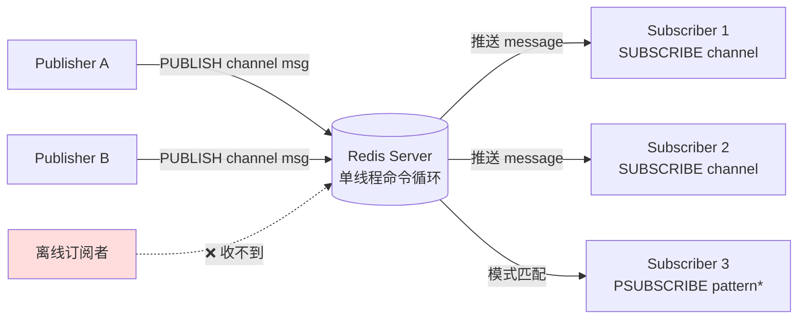

| 角色 | 命令 | 作用 |
|------|------|------|
| **频道（Channel）** | 字符串标识，如 `news.tech` | 消息的逻辑路由地址 |
| **发布者** | `PUBLISH channel payload` | 向频道发送消息 |
| **订阅者** | `SUBSCRIBE channel` | 精确订阅单个频道 |
| **模式订阅者** | `PSUBSCRIBE pattern*` | 模糊匹配多个频道 |

### 1.2 消息投递时序

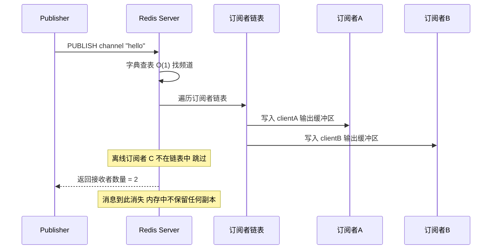

### 1.3 网络协议格式

订阅者收到的是三元素数组：

```bash
["message", channel, payload]   # 普通消息
["pmessage", pattern, channel, payload]  # 模式匹配消息
["subscribe", channel, 1]  # 订阅成功确认
```

## 二、单线程模型：性能与广播的根基

### 2.1 Redis "单线程"的精准含义

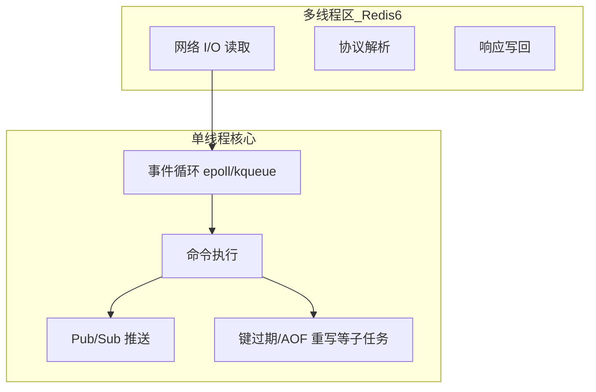

| 模块 | 是否多线程 | 说明 |
|------|----------|------|
| 网络 I/O 收发包 | ✅ 多线程（Redis 6.0+） | 解决高并发下网络读写瓶颈 |
| **命令执行** | ❌ **单线程** | 所有命令串行执行 |
| **Pub/Sub 消息推送** | ❌ **单线程** | 遍历订阅者链表逐个 send |
| 后台持久化/异步删除 | ✅ 子进程/后台线程 | 不阻塞主线程 |

> 💡 Redis = "**I/O 多线程 + 命令执行单线程**" 的混合模型。

### 2.2 单线程对 Pub/Sub 的三大好处

```python
# Redis 内部 publish.c 核心逻辑（伪代码）
def publishCommand(channel, message):
    subscribers = channel_dict[channel]   # O(1) 查表
    for client in subscribers:            # 单线程遍历，全程无锁
        sendReply(client, [...])
    return len(subscribers)
```

| 好处 | 体现 |
|------|------|
| 🔒 **零锁开销** | 不用考虑订阅者链表被并发修改，遍历时结构稳定 |
| 🎯 **原子快照** | 一次 publish 推给 N 个订阅者，**全部送达或全部不送达**，无"半广播" |
| 📦 **批量聚合** | 多个 publish 命令串行执行，每个 publish 内部推送原子 |

### 2.3 性能"四板斧"

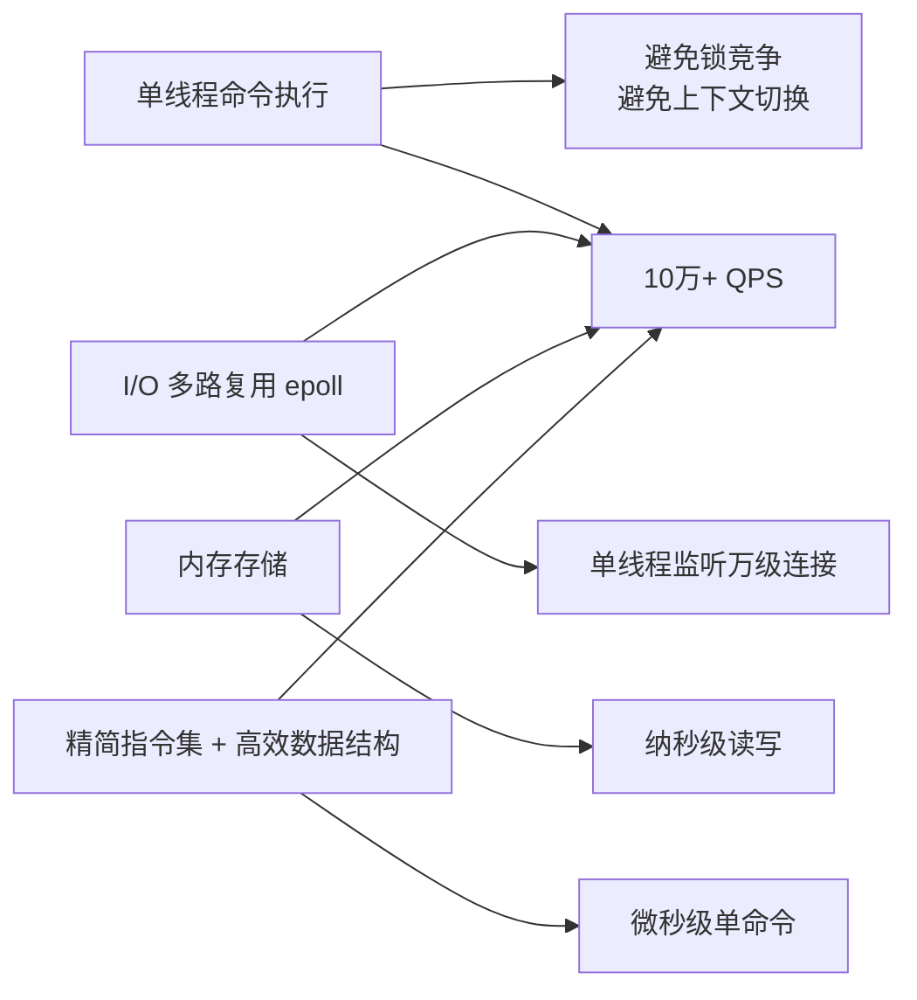

| 因素 | 收益 |
|------|------|
| **内存存储** | 读写纳秒级，比磁盘快 5 个数量级 |
| **epoll/kqueue 多路复用** | 单线程监听万级连接 |
| **高效数据结构** | `dict`(哈希表) / `skiplist`(跳表) / `quicklist` 等专为 CPU 缓存优化 |
| **单线程串行** | 无锁无切换，微秒级命令执行 |

## 三、消息生命周期：核心纠偏

### 3.1 关键认知：消息从未被"存储"

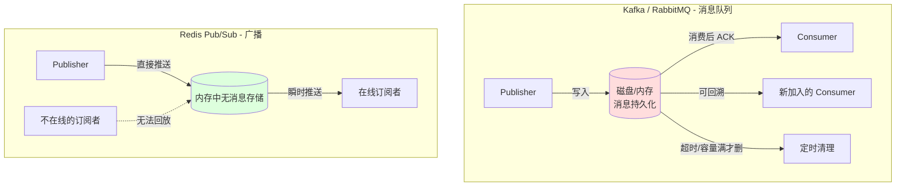

> 🎯 **关键区别**：Kafka 是 "消息先存，消费者慢慢取"；Redis Pub/Sub 是 "消息不存，订阅者必须当时在场"。

**消息的"一生"**：到达 Redis → 写入订阅者 socket 缓冲区 → 客户端读取 → 使命结束。**没有磁盘、没有 DB、没有队列、没有超时清除**。

### 3.2 Redis 真正维护的三个数据结构

| 内部数据结构 | 存储内容 | 清理时机 |
|------------|---------|---------|
| `pubsub_channels`（字典） | `{频道名 → 客户端链表}` | 频道最后一个订阅者退订时，删除该条目 |
| `pubsub_patterns`（链表） | `{pattern → 客户端}` 模式订阅 | 客户端断连时清理所有模式订阅 |
| `client->pubsub_channels`（链表） | 该客户端订阅了哪些频道 | 客户端断连时整个链表释放 |

### 3.3 清理触发点（连接级，不是消息级）

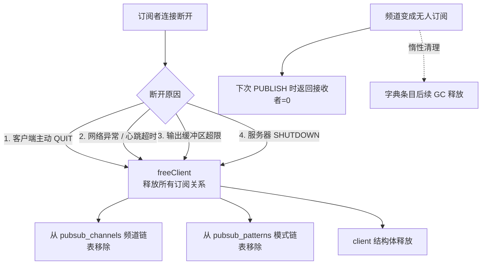

### 3.4 "超时"在 Pub/Sub 里的真实含义

| 超时配置 | 默认值 | 作用对象 |
|---------|--------|---------|
| `timeout` | 0（不超时） | 客户端空闲 N 秒后断开（连接级） |
| `tcp-keepalive` | 300 秒 | TCP 层心跳检测（连接级） |
| `client-output-buffer-limit pubsub` | 32MB / 8MB / 60s | **订阅者慢消费的硬限**（连接级） |

> ⚠️ 以上全部是"连接级"超时，**与"消息超时"完全无关**。

### 3.5 慢订阅者的"熔断"机制

```python
# Redis 内部逻辑（简化）
def checkClientOutputBuffer(client):
    if client.type == CLIENT_TYPE_PUBSUB:
        used = client.obuf_mem_used
        limit = 32 * 1024 * 1024  # 32MB
        if used > limit:
            freeClient(client)  # 强制断开
            # 后果：该订阅者从所有频道移除
            #       后续 PUBLISH 再也推不到它
```

> 这是为什么 **Pub/Sub 订阅者处理消息必须极快** —— 慢了就直接被踢掉。

### 3.6 Redis 主动踢出订阅者的 7 种场景

上面提到「慢了就直接被踢」，但实际生产中 Redis 主动踢出订阅者还有多种场景。系统性梳理如下：

#### 3.6.1 七大踢出场景全景

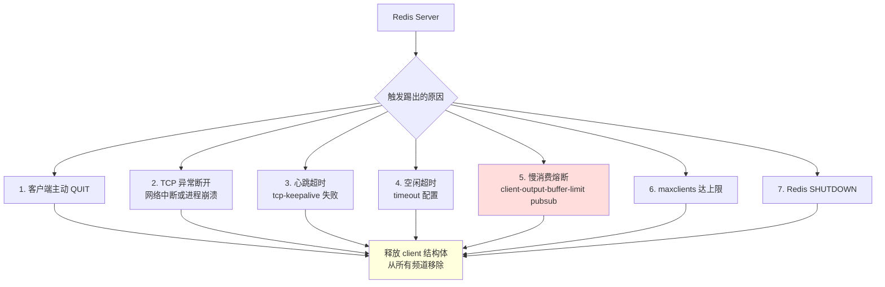

| # | 触发条件 | 触发方 | 默认配置 | 常见场景 |
|---|---------|-------|---------|---------|
| 1 | 客户端 `QUIT` 命令 | 客户端主动 | — | 优雅退出 |
| 2 | TCP 连接异常断开 | 客户端/网络 | — | 网络故障、进程崩溃 |
| 3 | `tcp-keepalive` 失败 | TCP 层 | 300 秒 | 心跳超时 |
| 4 | `timeout` 空闲超时 | Redis Server | 0（不超时） | 配置启用时 |
| 5 | **慢消费熔断** ⚠️ | Redis Server | 32MB / 8MB / 60s | **最容易被忽视** |
| 6 | `maxclients` 达上限 | Redis Server | 10000 | 容量不足 |
| 7 | Redis `SHUTDOWN` | 运维操作 | — | 停机时 |

#### 3.6.2 慢消费熔断机制详解

```python
# Redis 内部 checkClientOutputBuffer 逻辑（伪代码）
def checkClientOutputBuffer(client):
    if client.type == CLIENT_TYPE_PUBSUB:
        hard_limit = 32 * 1024 * 1024        # 硬限制 32MB
        soft_limit = 8 * 1024 * 1024         # 软限制 8MB
        soft_seconds = 60                     # 持续 60 秒

        # 硬限：超过立即踢
        if client.obuf_mem_used > hard_limit:
            freeClient(client)

        # 软限：持续超限才踢（避免频抖）
        elif client.obuf_mem_used > soft_limit:
            if 持续超过软限制(soft_seconds):
                freeClient(client)
```

`client-output-buffer-limit pubsub` 默认配置三元素说明：

| 参数 | 默认值 | 含义 |
|------|--------|------|
| **硬限制** | 32 MB | 缓冲区超过即踢 |
| **软限制** | 8 MB | 持续 60 秒超限才踢 |
| **时间窗口** | 60 秒 | 软限的持续时间 |

#### 3.6.3 踩坑信号与排查方法

| 信号 | 检查方式 |
|------|---------|
| **Redis 日志** | `Client id=N closed by Redis: output buffer limit exceeded` |
| **客户端日志** | `Connection closed by server` / `Broken pipe` |
| **业务表现** | 任务变更偶发「不生效」，10 秒后轮询兜底恢复 |
| **INFO clients** | `client_recent_max_output_buffer` 接近 32MB 阈值 |
| **CLIENT LIST** | `omem=<bytes>` 字段看各客户端缓冲区占用 |

> 🎯 **一句话总结**：Redis 会因为**连接级问题**（网络、心跳、缓冲区超限）主动踢出订阅者，**不会因为 Pub/Sub 业务问题**（消息丢失、订阅者忙）踢出。生产中应重点关注「慢消费熔断」这个隐性陷阱，并在客户端实现 **自动重连 + 业务幂等** 双重保障。

## 四、关键特性与局限对比

| 特性 | 状态 | 说明 |
|------|------|------|
| ✅ **实时性** | 强 | 毫秒级延迟，发布即推送 |
| ✅ **解耦** | 强 | 发布订阅双方无需知道对方存在 |
| ✅ **跨进程/跨服务** | 强 | 任何能连 Redis 的进程都可参与 |
| ✅ **一对多广播** | 强 | 一条消息可被 N 个订阅者同时消费 |
| ⚠️ **无持久化** | 弱 | 消息不落盘，订阅者离线即丢失 |
| ⚠️ **无 ACK** | 弱 | 不保证消息一定送达，不保证处理成功 |
| ⚠️ **无回溯** | 弱 | 新订阅者只能收到订阅后的新消息 |
| ⚠️ **无消费者组** | 弱 | 不支持 Kafka 那种分区消费 |
| ⚠️ **慢订阅者熔断** | 风险 | 处理慢会被踢，连接断开后消息全丢 |

## 五、选型决策

### 5.1 适用 vs 不适用

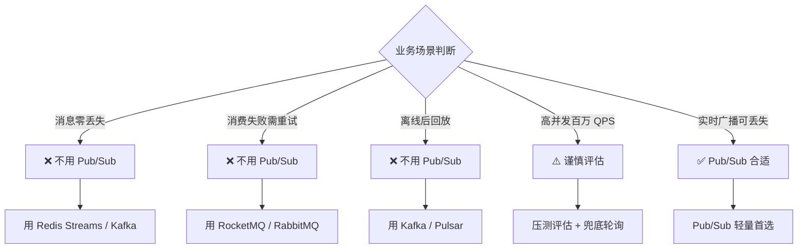

### 5.2 四大消息中间件横向对比

| 维度 | Redis Pub/Sub | Redis Streams | Kafka | RocketMQ |
|------|--------------|---------------|-------|----------|
| **消息持久化** | ❌ 无 | ✅ 持久化 | ✅ 磁盘 | ✅ 磁盘 |
| **消费 ACK** | ❌ 无 | ✅ PEL 回执 | ✅ offset 提交 | ✅ offset 提交 |
| **重复消费** | ❌ 不支持 | ✅ 消费者组 | ✅ 消费者组 | ✅ 消费者组 |
| **离线回放** | ❌ 不支持 | ✅ XPENDING/XREAD | ✅ 从 offset 重放 | ✅ 从 offset 重放 |
| **吞吐量** | 10万+/秒 | 10万+/秒 | **百万+/秒** | 10万+/秒 |
| **运维复杂度** | ⭐ 极简 | ⭐ 极简 | ⭐⭐⭐ 高 | ⭐⭐⭐ 高 |
| **消息顺序** | ❌ 不保证 | ✅ 单 stream 内 | ✅ 分区内 | ✅ 队列内 |
| **延迟** | **微秒级** | 毫秒级 | 毫秒级 | 毫秒级 |
| **适用规模** | 小型、广播 | 中小型、可靠队列 | 大数据、流计算 | 金融、电商 |

### 5.3 选型决策树

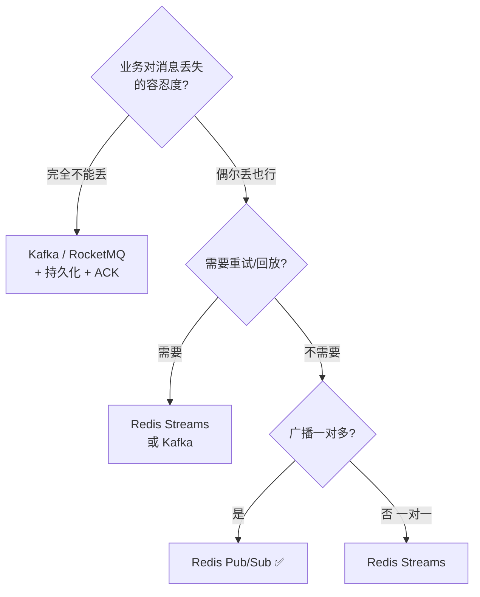

### 5.4 典型场景对照

| 业务场景 | 推荐方案 | 原因 |
|---------|---------|------|
| 任务调度变更广播 | ✅ **Pub/Sub** | 实时性优先 + 兜底轮询 |
| 订单支付结果通知 | ❌ → Kafka/RocketMQ | 零丢失 + 重复消费 + 顺序保证 |
| 用户注册送积分 | ❌ → Redis Streams | 失败可重试 + 消费幂等 |
| 直播间弹幕推送 | ✅ **Pub/Sub** | 可丢失、追求低延迟、用户在线才需要 |
| 缓存失效广播 | ✅ **Pub/Sub** | 失效可重算，无需持久化 |
| 分布式日志收集 | ❌ → Kafka | 大流量 + 可回溯分析 |
| 秒杀库存扣减 | ❌ → RocketMQ | 强一致 + 削峰填谷 |
| 监控告警通知 | ⚠️ 看场景 | 简单通知 Pub/Sub，关键告警走 MQ |

## 六、Redis Streams：Pub/Sub 的"完整版"

Pub/Sub 的"兄弟"——**Redis Streams**，补齐了消息持久化和消费组的短板：

```bash
# 1. 生产消息（带持久化）
XADD my_stream * event order_paid user_id=1001

# 2. 消费者组消费（支持 ACK）
XREADGROUP GROUP group1 consumer1 COUNT 10 STREAMS my_stream >

# 3. 处理失败的消息重新投递
XPENDING my_stream group1     # 查看 PEL
XCLAIM my_stream group1 consumer2 0 <id>  # 转移给别的消费者
```

| 特性 | Pub/Sub | Streams |
|------|---------|---------|
| 持久化 | ❌ | ✅（默认保留所有消息，可 MAXLEN 限制） |
| ACK | ❌ | ✅（ack 后的消息才从 PEL 移除） |
| 消费者组 | ❌ | ✅（天然支持） |
| 历史回放 | ❌ | ✅（指定 ID 读起点） |
| 阻塞读 | 始终阻塞 | ✅ `BLOCK 5000` 阻塞等待 |

> 💡 简单记忆：**Streams = Pub/Sub + 持久化 + 消费者组 + ACK**。

## 七、工程实践：用 Pub/Sub 时的分层防御

虽然 Pub/Sub 会丢消息，但通过**分层防御**可让"丢消息"变得可接受：

### 7.1 分层防御原理示意

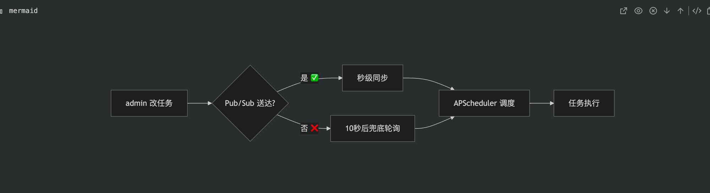

> 图示说明：业务方发起变更后，Pub/Sub 广播是"首选快路径"（秒级生效），定时轮询是"兑底慢路径"（最多 10 秒恢复）。两路最终都汇入下游消费者，保证最终一致性。

### 7.2 典型分层模式（按"丢消息容忍度"分档）

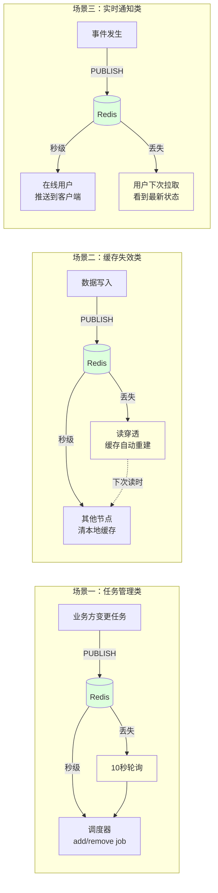

| 防御层 | 机制 | 作用 |
|--------|------|------|
| **第一层（实时）** | Pub/Sub | 90% 情况秒级生效 |
| **第二层（兜底）** | 定时轮询 DB / 读穿透 / 客户端重连 | 广播丢失时最迟 N 秒恢复 |
| **第三层（自愈）** | 消费者幂等 + 配置比对 | 重复同步无副作用 |

**典型兜底参数**：

| 业务容忍度 | 兜底间隔 |
|-----------|---------|
| 高敏感（资金） | 1-2 秒 |
| 中等（任务管理） | 5-10 秒 |
| 低敏感（统计） | 30-60 秒 |

### 7.3 Python 快速集成示例

下面提供最精简的核心代码，覆盖**同步/异步 × 发布/订阅**四种组合。

#### 7.3.1 同步发布者

```python
import redis

r = redis.Redis(host='localhost', port=6379, db=0)

# 发布一条消息，返回接收者数量
n = r.publish('my_channel', '{"event": "user_signup", "user_id": 1001}')
print(f"消息已发送给 {n} 个订阅者")
```

#### 7.3.2 同步订阅者（带自动重连）

```python
import redis
import json
import time

r = redis.Redis(host='localhost', port=6379, db=0)
pubsub = r.pubsub()

while True:
    try:
        pubsub.subscribe('my_channel')
        for message in pubsub.listen():
            if message['type'] != 'message':
                continue
            data = json.loads(message['data'])
            print(f"收到: {data}")
    except redis.ConnectionError as e:
        print(f"连接断开: {e}，5 秒后重连")
        time.sleep(5)
    finally:
        try:
            pubsub.close()
        except Exception:
            pass
```

#### 7.3.3 异步发布者

```python
import asyncio
from redis import asyncio as aioredis

async def publish():
    r = aioredis.Redis(host='localhost', port=6379, db=0)
    n = await r.publish('my_channel', '{"event": "order_paid", "order_id": 2001}')
    print(f"消息已发送给 {n} 个订阅者")
    await r.aclose()

asyncio.run(publish())
```

#### 7.3.4 异步订阅者（带自动重连）⭐推荐

```python
import asyncio
import json
from redis import asyncio as aioredis
from redis.exceptions import ConnectionError as RedisConnectionError

async def listen():
    r = aioredis.Redis(host='localhost', port=6379, db=0)
    while True:
        pubsub = r.pubsub()
        try:
            await pubsub.subscribe('my_channel')
            async for message in pubsub.listen():
                if message['type'] != 'message':
                    continue
                data = json.loads(message['data'])
                print(f"收到: {data}")
        except RedisConnectionError as e:
            print(f"连接异常: {e}，5 秒后重连")
            await asyncio.sleep(5)
        except Exception as e:
            print(f"订阅异常: {e}，5 秒后重连")
            await asyncio.sleep(5)
        finally:
            try:
                await pubsub.close()
            except Exception:
                pass

asyncio.run(listen())
```

#### 7.3.5 模式订阅（一个订阅者收多个频道）

```python
# 同步
pubsub = r.pubsub()
pubsub.psubscribe('news.*')   # 匹配 news.tech、news.sport 等
# 异步
await pubsub.psubscribe('news.*')

# 收到的是 pmessage 类型
# message['type'] == 'pmessage'
# message['pattern'] == 'news.*'
# message['channel'] == 'news.tech'
# message['data'] == '...'
```

#### 7.3.6 生产环境三大纪律

| 纪律 | 说明 |
|------|------|
| 🛡️ **自动重连** | 订阅者必须包在 `while True` 循环中，遇异常 sleep 重连 |
| ⚡ **处理极简** | 消息回调里只做轻量派发，重活异步执行避免缓冲区堆积 |
| 🔁 **业务幂等** | 重连或重发可能导致重复消费，业务侧必须幂等处理 |

## 八、一句话总结

> **Pub/Sub = "可丢弃的实时广播"**
> **Streams = "可靠队列"**
> **Kafka = "重型流水线"**
>
> 选型的本质不是"哪个最强"，而是"**哪个最匹配业务对消息可靠性的要求 + 运维成本预算**"。
>
> 对于"实时性优先 + 丢了我也不怕"的场景，**Pub/Sub + 兜底轮询** 是最优雅、最轻量的工程实践。
