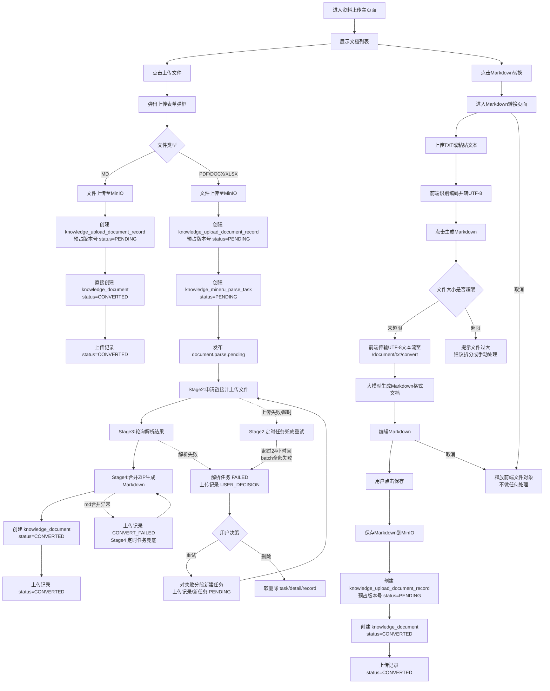
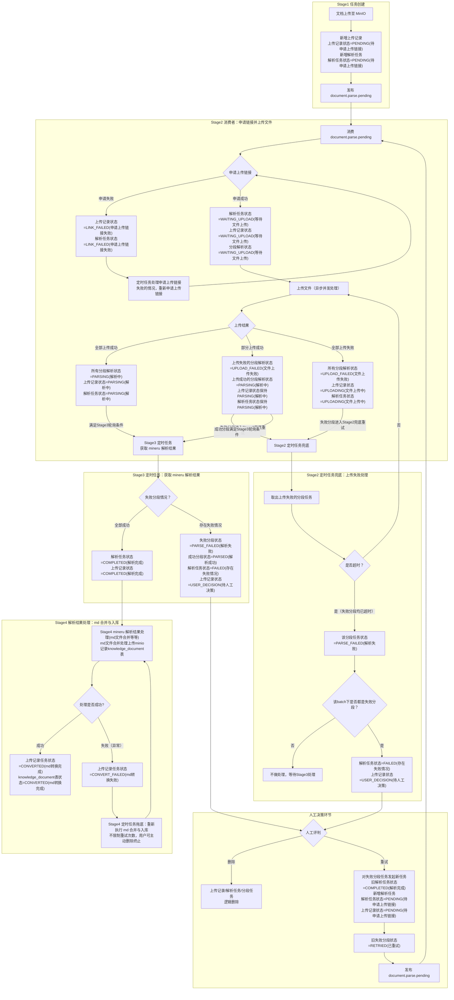
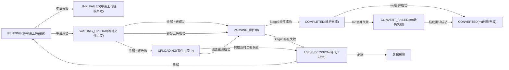
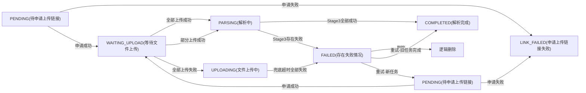
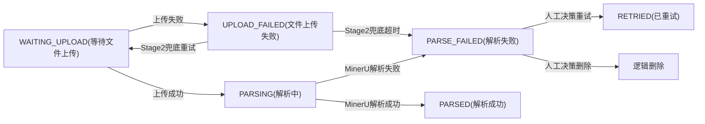
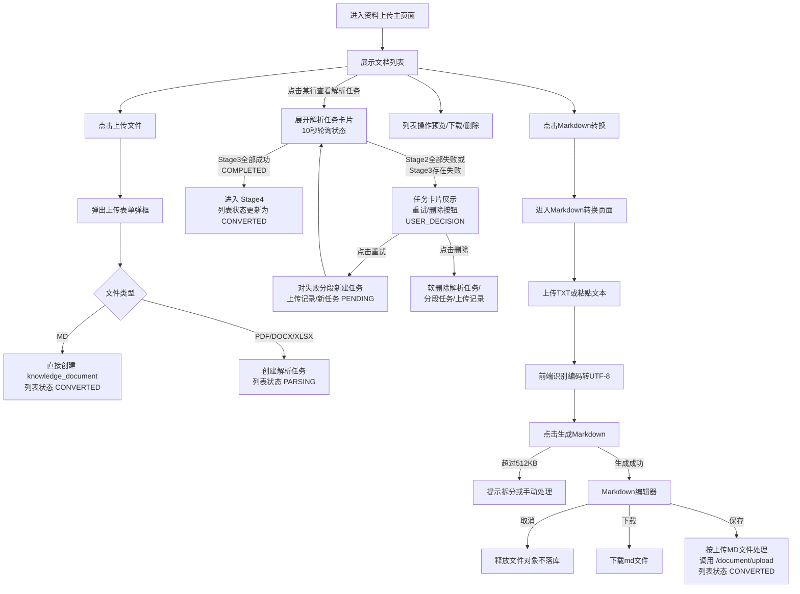
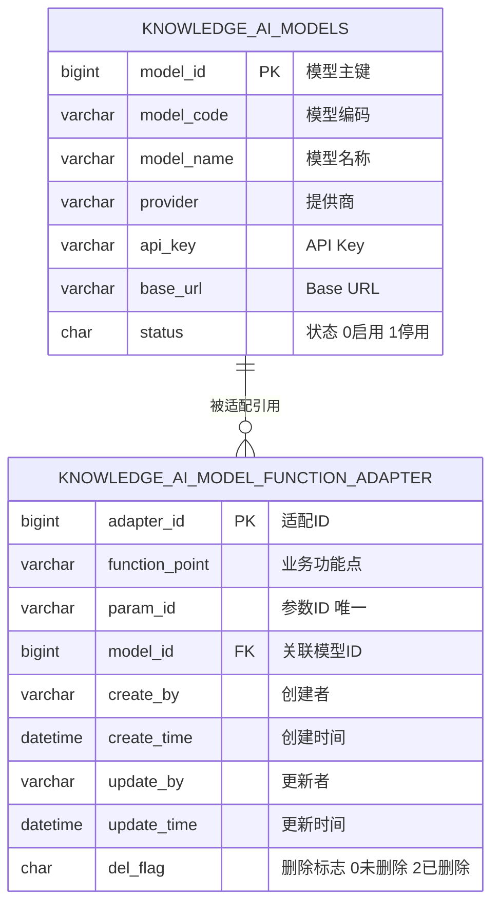

# 文档上传需求设计

## 一、需求背景与目标

### 1.1 背景

随着 RAG（检索增强生成）知识库建设的深入，系统需要持续补充高质量的 Markdown 格式数据源。当前知识库数据主要依赖人工整理，来源单一、入库效率低，难以满足对 PDF、DOCX、TXT、MD 等常见业务文档的快速归集需求。

为提升文档入库效率，需要建设一套资料上传解析通道：支持用户上传 PDF/DOCX/XLSX/MD 等常用文件，以及通过 Markdown 转换页面将 TXT 转换为 Markdown 后按 MD 文件落库；PDF/DOCX 经 MinerU 解析生成 Markdown，MD 直接入库，统一纳入 `knowledge_document` 文档主表管理，并支持版本控制、解析状态感知、失败重试与用户决策。

### 1.2 目标

- 前端新增「知识管理 → 资料上传」独立页面，支持文件上传、参数配置、解析状态查看、文档管理与版本提示。
- 后端在 `knowledge-content` 中实现：
  - PDF/DOCX 等文档上传 + MinerU 解析生成 Markdown；
  - TXT 文件生成 Markdown 格式文档并支持在线编辑后入库；
  - Markdown 文件直接入库；
  - 解析失败后的重试机制与用户决策机制。
- `knowledge-common` 提供共享基础设施，`knowledge-admin` 负责 merio_language 等字典数据初始化。
- 本次范围不涉及 embedding 与文档分块的具体实现，但表结构需预留扩展字段。

### 1.3 范围边界

| 范围 | 说明 |
|------|------|
| 包含 | 资料上传页面、文件上传、MinerU 解析、TXT 生成 Markdown 格式文档、文档版本管理、解析状态感知、失败重试与用户决策 |
| 不包含 | embedding 计算、文档分块、向量库写入、检索排序逻辑 |
| 依赖 | `knowledge-common` 的共享 DO/DAO/VO/消息流基础设施、MinIO 存储 |

---

## 二、总体流程

### 2.1 流程全景



### 2.2 模块职责

| 模块 | 职责 |
|------|------|
| `knowledge-web` | 新增「知识管理 → 资料上传」独立页面；通过代理访问 `knowledge-content` 接口 |
| `knowledge-content` | 文件上传、MinerU 解析调度、TXT 转 Markdown 兜底转换、文档落库、版本管理 |
| `knowledge-admin` | 负责 `merio_language` 等字典数据初始化与维护 |
| `knowledge-common` | 兼容层：共享基础设施、消息流、MinIO/Redis 通用能力 |

### 2.3 数据流转总览

| 核心表 | 作用 |
|--------|------|
| `knowledge_upload_document_record` | 记录上传基础信息、文件元数据、解析状态 |
| `knowledge_mineru_parse_task` | 记录 MinerU 解析任务参数、整体状态、错误信息 |
| `knowledge_mineru_parse_detail_task` | 记录 MinerU 解析批次/分段明细，支持按 `sequence_number` 重试 |
| `knowledge_document` | 解析/转换成功后生成的文档主表记录 |

---

## 三、状态机与数据库标记

### 3.1 上传记录状态 `knowledge_upload_document_record.status`

> 上传记录与解析任务共用同一主状态枚举。上传记录的终态为 `USER_DECISION（待人工决策）`，不会直接使用 `FAILED`；`FAILED` 仅作为解析任务的终态。

| 状态值 | 含义 | 触发场景 |
|--------|------|----------|
| `PENDING` | 待申请上传链接 | 初始状态；MinerU 解析任务刚创建；用户决策重试后新任务 |
| `LINK_FAILED` | 申请上传链接失败 | 向 MinerU 申请上传链接失败，进入 Stage2 定时任务兜底重试 |
| `WAITING_UPLOAD` | 等待文件上传 | MinerU 上传链接申请成功，等待上传分段文件 |
| `UPLOADING` | 文件上传中 | 所有分段上传均失败，正在 Stage2 定时任务兜底重试 |
| `PARSING` | 解析中 | 所有分段文件上传成功，正在轮询 MinerU 解析结果 |
| `COMPLETED` | 解析完成 | Stage3 所有分段均解析成功，等待 Stage4 md 合并与入库 |
| `USER_DECISION` | 待人工决策 | Stage2 全部上传超时失败或 Stage3 存在失败情况，等待用户选择重试或删除 |
| `CONVERTED` | md 转换完成 | Stage4 md 合并与入库成功 |
| `CONVERT_FAILED` | md 转换失败 | Stage4 md 合并与入库异常，进入 Stage4 定时任务兜底重试 |

### 3.2 解析任务状态 `knowledge_mineru_parse_task.status`

> 与上传记录共用同一主状态枚举。解析任务的终态为 `FAILED（存在失败情况）`，不会直接使用 `USER_DECISION`；`USER_DECISION` 仅作为上传记录的终态。

| 状态值 | 含义 | 触发场景 |
|--------|------|----------|
| `PENDING` | 待申请上传链接 | 刚创建任务；用户决策重试后新建任务 |
| `LINK_FAILED` | 申请上传链接失败 | 向 MinerU 申请上传链接失败，进入 Stage2 定时任务兜底重试 |
| `WAITING_UPLOAD` | 等待文件上传 | MinerU 上传链接申请成功，等待上传分段文件 |
| `UPLOADING` | 文件上传中 | 所有分段上传均失败，正在 Stage2 定时任务兜底重试 |
| `PARSING` | 解析中 | 所有分段文件上传成功，正在轮询 MinerU 解析结果 |
| `COMPLETED` | 解析完成 | Stage3 所有分段均解析成功；旧任务在用户决策重试后被标记为 COMPLETED |
| `FAILED` | 存在失败情况 | Stage2 全部上传超时失败或 Stage3 存在失败情况，需人工介入 |

### 3.3 解析分段状态 `knowledge_mineru_parse_detail_task.state`

| 状态值 | 含义 |
|--------|------|
| `WAITING_UPLOAD` | 等待文件上传 |
| `UPLOAD_FAILED` | 文件上传失败 |
| `PARSING` | 该分段已上传，MinerU 正在解析 |
| `PARSED` | MinerU 返回该分段解析成功 |
| `PARSE_FAILED` | MinerU 解析失败或上传超时失败 |
| `RETRIED` | 人工决策重试后，旧失败分段被标记为已重试 |

> 说明：`PARSING` 是 `pending` / `running` 的统一表达。若 MinerU 解析速度很快，Stage3 第一次轮询时可能直接从 `PARSING` 跳变到 `PARSED`。

### 3.4 文档状态 `knowledge_document.status`

| 状态值 | 含义 |
|--------|------|
| `CONVERTED` | 已生成 Markdown 格式文档 |
| `CHUNKED` | 已完成文档分块 |
| `VECTOR_STORED` | 已写入向量库 |

> 说明：`knowledge_document` 用于后续文档分块与向量存储，写入时即为 `CONVERTED`，随后按分块、向量化流程推进至 `CHUNKED`、`VECTOR_STORED`。

### 3.5 版本管理标记

- `knowledge_document` 以 `(doc_title, doc_version)` 联合唯一；`doc_title` 本身不唯一，同一标题可存在多版本，删除记录通过 `del_flag` 标记，不影响后续同名同版本重建。
- 版本号在创建 `knowledge_upload_document_record` 时预占：上传时查询该标题当前最大版本号，整数递增生成新版本号（如 `1.0` → `2.0`）后写入 `knowledge_upload_document_record.doc_version`，并更新该标题其他未删除上传记录的 `is_latest='0'`。
- 解析/转换完成后创建 `knowledge_document` 时，沿用 `knowledge_upload_document_record.doc_version`，保持两表版本号一致。
- `knowledge_upload_document_record.is_latest` 表示上传记录维度最新版（资料上传页面列表使用）；`knowledge_document.is_latest` 表示已落库文档维度最新版（RAG 检索使用）。由于新版本可能比旧版本解析得更快，两张表的 `is_latest` 可能存在短暂不一致。
- 同一标题下，每张表各自仅允许一条 `is_latest='1'` 的未删除记录。
- 默认文档列表（RAG 检索范围）只展示 `knowledge_document` 中 `is_latest='1'` 的记录。

### 3.6 整体状态流转图



#### 状态职责说明

##### 人工决策「重试」路径

存在失败情况时，**解析任务状态统一为 `FAILED`**，**上传记录状态统一为 `USER_DECISION`**，进入人工决策环节选择重试或删除。

`FAILED` 状态可能来自：
- Stage2 全部上传超时失败；
- Stage3 存在失败情况（部分失败或全部失败）。

在人工决策环节选择「重试」后：

- **旧解析任务**：状态标记为 `COMPLETED(解析完成)`，表示其负责的部分已完结，失败分段转交给新任务处理。
- **旧失败分段**：状态由 `PARSE_FAILED` 改为 `RETRIED(已重试)`，不再参与当前 batch 的终态判断，视为已完结。
- **新任务**：对失败分段发起新的解析任务，状态为 `PENDING(待申请上传链接)`，与初始任务一致，并重新发布 `document.parse.pending`。
- **上传记录状态**：改为 `PENDING(待申请上传链接)`，与解析任务状态保持一致；重试本质上是重新申请链接并上传，统一用 `PENDING` 更清晰。

##### 人工决策「删除」路径

选择「删除」后：

- **上传记录**：逻辑删除。
- **解析任务**：逻辑删除。
- **分段任务**：逻辑删除。
- **后续处理**：不再进入 md 合并入库流程。


##### Stage2 定时任务兜底机制

Stage2 消费者上传失败后，由 **Stage2 定时任务兜底** 处理：

- **职责**：扫描并处理上传失败的分段，重新尝试上传。
- **重试机制**：对上传失败的分段重新执行上传文件节点。
- **超时处理**：超过 24 小时仍未上传成功的分段，状态标记为 `PARSE_FAILED`。
- **终态收敛**：当该 batch 下所有分段都已超时失败（无剩余非失败分段）时，解析任务状态收敛为 `FAILED`，上传记录状态收敛为 `USER_DECISION`，进入人工决策环节。

##### Stage3 定时任务触发条件

Stage3 定时任务独立扫描数据库，轮询 MinerU 批量解析结果，触发条件为：

- **batch 中至少有一个分段上传成功**（部分成功场景或全部成功场景）；
- 上传失败的分段由 Stage2 定时任务兜底重试，不阻塞 Stage3 对成功分段的轮询；
- Stage3 根据 batch 中失败/成功分段的状态，统一判断进入「解析完成」或「待人工决策」；存在失败情况时解析任务状态为 `FAILED`。

> 注意：MinerU 上传链接自申请起 24 小时内有效；系统按 `knowledge_mineru_parse_task.create_time` + 23 小时 50 分钟设置 `upload_expire_at`，超过该时间未上传成功的分段不再继续上传。

##### Stage4 定时任务拖底机制：md 合并与入库

- **Stage4** md 合并与入库过程若出现异常，上传记录任务状态标记为 `CONVERT_FAILED`。
- 由 **Stage4 定时任务拖底** 重新执行 md 合并与入库。
- 拖底任务**不限制重试次数**，持续尝试直至成功。
- 用户可通过前端的**删除按钮**主动终止该文件的解析流程。

#### 三类状态独立转换图

##### 上传记录状态



##### 解析任务状态



##### 分段任务状态



---

## 四、前端页面与功能点

### 4.1 菜单结构

```
知识管理
├── 网页爬虫
├── 资料上传
└── embedding（占位）
```

### 4.2 资料上传主页面

页面整体为**文档列表 + 顶部操作区**布局。

#### 4.2.1 顶部操作区

- **上传文件按钮**：点击弹出上传表单弹框，支持 PDF/DOCX/XLSX/MD 上传。
- **Markdown 转换按钮**：跳转至 Markdown 文档转换页面，支持上传 TXT 文件或粘贴纯文本生成 Markdown；编辑器内可直接保存（按上传 MD 文件处理）或下载 MD 文件。

#### 4.2.2 文档列表

列表展示当前用户已上传/生成的文档，按 `update_time` 倒序排列，默认仅展示每个标题的最新上传版本（`knowledge_upload_document_record.is_latest='1'`）。

展示字段：

| 字段 | 说明 |
|------|------|
| 文档标题 | `doc_title`，点击可预览 |
| 文档格式 | `doc_type`：PDF/DOCX/XLSX/MD（TXT 由前端转换为 MD 后按 MD 落库） |
| 文档描述 | `doc_desc` |
| 版本 | `knowledge_upload_document_record.doc_version` |
| 状态 | 对应 `knowledge_upload_document_record.status`：PENDING/LINK_FAILED/WAITING_UPLOAD/UPLOADING/PARSING/COMPLETED/USER_DECISION/CONVERTED/CONVERT_FAILED |
| 操作 | 预览、下载、删除 |

列表行内操作（根据状态动态展示）：

- **预览**：`status='CONVERTED'` 时可用，调用 `GET /api/rag/document/{doc_id}/preview`。
- **下载**：`status='CONVERTED'` 时可用，调用 `GET /api/rag/document/{doc_id}/download`。
- **删除**：仅 `status` 不为 `CONVERTED` 且尚未生成 `knowledge_document` 的记录可删除，调用 `DELETE /api/rag/document/{record_id}` 软删除。
- **查看解析任务**：只要存在关联的 `knowledge_mineru_parse_task`，即可展开任务卡片查看解析状态。

#### 4.2.3 筛选与分页

- **文档格式筛选**：PDF / DOCX / XLSX / MD。
- **文档标题搜索**：按 `doc_title` 模糊查询。
- **文档描述搜索**：按 `doc_desc` 模糊查询。
- **状态筛选**：PENDING / LINK_FAILED / WAITING_UPLOAD / UPLOADING / PARSING / COMPLETED / USER_DECISION / CONVERTED / CONVERT_FAILED。
- **分页**：`page_num`、`page_size`。

> 说明：列表接口为 `GET /api/rag/document/list`。

### 4.3 上传弹框/表单

点击主页面「上传文件」按钮后弹出表单弹框。

#### 4.3.1 表单字段

- **文件选择**：文件拖拽上传与文件选择上传。
- **文件类型校验**：PDF/DOCX/XLSX/MD（TXT 在 Markdown 转换页面处理，转换为 MD 后按 MD 落库）。
- **文件大小限制提示**：如最大 100MB（不超过 MinerU 官方 200MB 限制）。
- **文档标题**：下拉选择已有标题或手动输入。
- **文档描述**：可选。
- **版本说明**：`version_remark`，可选。
- **解析参数配置**（PDF/DOCX 等显示，MD 隐藏）：
  - 解析模式 `parse_mode`：`html` / `document`
  - 公式识别 `enable_formula`：默认 `True`
  - 表格识别 `enable_table`：默认 `True`
  - 文档语言 `language`：字典 `merio_language`，默认 `ch`
  - OCR `is_ocr`：默认 `False`
- **同名文档版本提示**：检测到同名文档时提示下一版本号（如「将创建版本 2.0」），版本号按整数递增（`1.0` → `2.0` → `3.0`）。
- **上传按钮及表单校验**。

#### 4.3.2 上传中

- 文件保存至 MinIO 后，后端对 `doc_title` 维度加锁并预占版本号：
  - 查询该标题当前最大版本号，递增生成新版本号（如 `1.0` → `2.0`）；
  - 创建 `knowledge_upload_document_record`，写入 `doc_version`/`is_latest='1'`/`version_remark`；
  - 将该标题其他未删除上传记录的 `is_latest` 更新为 `'0'`。
- **MD 文件**：直接创建 `knowledge_document`，`doc_version` 沿用日志表预占版本，`is_latest` 按当前已落库最大版本号动态判断，上传记录状态为 `CONVERTED`。
- **PDF/DOCX 等**：创建 `knowledge_mineru_parse_task` 并发布 `document.parse.pending`，上传记录状态为 `PARSING`；`knowledge_document` 在 Stage4 完成后创建，版本号沿用日志表预占值。
- 上传失败提示及重新上传入口。

### 4.4 Markdown 文档转换页面

点击主页面「Markdown 转换」按钮后进入独立页面，用于 TXT 生成 Markdown 并保存/下载。

#### 4.4.1 页面入口与输入方式

- **上传 TXT 文件**：前端识别文件原始编码并转换为 UTF-8，默认展示原始 TXT 内容。
- **纯文本编辑**：提供大文本框，用户可直接粘贴文本内容。
- **返回按钮**：返回资料上传主页面。

#### 4.4.2 生成 Markdown

- 提供「生成 Markdown 格式文档」按钮。
- 调用后端接口 `POST /api/rag/document/txt/convert` 将纯文本转换为 Markdown。
- 若内容超过大小限制（512KB），后端返回错误，前端提示用户拆分或手动处理。
- 生成后用户在编辑器内修改 Markdown。

#### 4.4.3 编辑、下载与保存

- 编辑器内支持 Markdown 内容修改。
- 用户可随时取消/关闭，前端释放文件对象，不做任何落库处理。
- **下载**：将当前 Markdown 内容打包为 `.md` 文件供用户下载。
- **直接保存**：按上传 MD 文件处理，前端将 Markdown 内容作为文件调用 `POST /api/rag/document/upload` 落库；后端不感知原始 TXT 格式，落库后 `doc_type='MD'`。

### 4.5 解析任务详情与用户决策

PDF/DOCX 等文件上传后，列表对应行展示解析任务卡片，可展开查看详情。

#### 4.5.1 解析任务卡片

- 实时轮询解析状态（建议 10 秒一次，调用 `GET /api/rag/document/parse-task/{parse_task_id}`）。
- MinerU 解析状态展示：`PENDING` / `LINK_FAILED` / `WAITING_UPLOAD` / `UPLOADING` / `PARSING` / `COMPLETED` / `FAILED`。
- 解析失败原因展示 `error_message`。

#### 4.5.2 分段解析明细

- 调用 `GET /api/rag/document/parse-task/{parse_task_id}/details`。
- 展示 `sequence_number`、`state`、`page_ranges`。
- 失败分段高亮提示。
- 上传链接过期自动重试展示。

#### 4.5.3 用户决策

Stage2 全部上传超时失败或 Stage3 存在失败情况时进入 `USER_DECISION`，解析任务卡片中展示「重试」和「删除」按钮：

- **删除文档**：软删除 `knowledge_mineru_parse_task`、关联的 `knowledge_mineru_parse_detail_task` 以及 `knowledge_upload_document_record`。
- **重试**：对失败分段发起新的解析任务，旧解析任务状态标记为 `COMPLETED`，旧失败分段状态标记为 `RETRIED`，上传记录状态回退为 `PENDING`，并重新发布 `document.parse.pending`。

### 4.6 页面流转逻辑



关键流转说明：

1. 用户进入「资料上传」主页面，默认展示文档列表（含上传中、解析中、已完成、失败等状态）。
2. 点击「上传文件」弹框，选择 PDF/DOCX/XLSX/MD，填写表单后上传；上传成功后列表自动刷新。
3. 点击「Markdown 转换」跳转独立页面，支持上传 TXT 或粘贴纯文本；生成并编辑 Markdown 后可下载 `.md` 文件，或直接保存（按上传 MD 文件处理），返回主页面列表。
4. PDF/DOCX/XLSX 上传后进入解析流程，列表状态为 `PARSING`，行内展示「查看解析任务」入口。
5. 用户点击「查看解析任务」展开任务卡片，10 秒轮询解析状态；解析完成进入 Stage4 md 合并与入库，最终列表状态更新为 `CONVERTED`。
6. Stage2 全部上传失败或 Stage3 存在失败情况时，任务卡片状态为 `USER_DECISION`，卡片内展示「重试」和「删除」按钮：
   - **重试**：对失败分段发起新解析任务，卡片继续轮询状态。
   - **删除**：软删除记录后返回文档列表。

---

## 五、后端接口

接口统一前缀：`/api/rag`

### 5.1 文件上传

- **接口**：`POST /api/rag/document/upload`
- **Content-Type**：`multipart/form-data`
- **核心参数**：
  - `file`：文件（MD/PDF/DOCX/XLSX；TXT 需由前端转换为 MD 后再调用本接口）
  - `doc_title`：文档标题
  - `doc_desc`：文档描述（可选）
  - `parse_mode`：解析模式，`html` / `document`
  - `enable_formula`：公式识别，`'0'` / `'1'`
  - `enable_table`：表格识别，`'0'` / `'1'`
  - `language`：文档语言，如 `ch`
  - `is_ocr`：OCR，`'0'` / `'1'`
  - `version_remark`：版本说明（可选）
- **执行流程**：
  1. 校验文件类型与大小（本接口仅接受 MD/PDF/DOCX/XLSX）。
  2. 生成文件名并上传至 MinIO，获取 `original_doc_url`。
  3. 对 PDF/DOCX 等解析文件解析总页数 `total_pages`，MD 文件为 `0`。
  4. 插入 `knowledge_upload_document_record`：
     - `doc_title` / `doc_desc` / `doc_name` / `doc_type` = 入参/文件信息
     - `original_doc_url` = MinIO URL
     - `total_pages` = 总页数
     - `parse_required` = 是否需要 MinerU 解析（MD 为 `'0'`，PDF/DOCX 等为 `'1'`）
     - `status` = `'PENDING'`
     - `user_id` / `dept_id` = 当前用户/部门
     - `create_by` / `create_time` / `update_by` / `update_time` 自动填充
     - `del_flag` = `'0'`
  5. **MD 文件**：
     - 直接创建 `knowledge_document`：
       - `record_id` = 上传记录 ID
       - `source_type` = `'0'`
       - `doc_url` = `original_doc_url`
       - `status` = `'CONVERTED'`
       - `is_latest` = `'1'`
       - 同标题旧版本 `is_latest='0'`
     - 更新 `knowledge_upload_document_record.status='CONVERTED'`。
  6. **PDF/DOCX 等**：
     - 更新 `knowledge_upload_document_record.status='PARSING'`。
     - 创建 `knowledge_mineru_parse_task`：
       - `record_id` = 上传记录 ID
       - `parse_mode` / `enable_formula` / `enable_table` / `language` / `is_ocr` = 入参
       - `status` = `'PENDING'`
       - `user_id` / `dept_id` = 当前用户/部门
       - `del_flag` = `'0'`
     - 发布消息流 `document.parse.pending`，payload 包含 `parse_task_id`。
  7. 返回 `AjaxResult.success({record_id, parse_task_id?})`。

### 5.2 TXT 生成 Markdown 格式文档

- **接口**：`POST /api/rag/document/txt/convert`
- **Content-Type**：`application/json`
- **说明**：前端将 UTF-8 文本内容传入，后端通过**模型功能适配配置**（参数 ID 为 `txt_to_markdown`）读取实际调用的大模型，将纯文本格式化和结构化为 Markdown；若内容超过大小限制，直接拒绝或返回提示。
- **核心参数**：
  - `content`：TXT 文本内容（UTF-8 字符串，前端完成编码转换后传入）
  - `doc_title`：文档标题（用于前端预览，可选）
- **执行流程**：
  1. 校验 `content` 长度，折算大小超过 **512KB** 直接返回错误，避免大模型 Token 浪费和处理效果下降。
  2. 按 **UTF-8** 解析文本内容。
  3. 通过模型功能适配配置的参数 ID `txt_to_markdown` 读取对应的大模型配置。
  4. 调用该大模型，提示词要求：
     - 将纯文本生成为结构清晰的 Markdown 格式文档；
     - 识别标题、列表、代码块、表格等结构；
     - 不增删原文核心语义；
     - 保留原文段落和层级关系。
  5. 返回生成后的 Markdown 内容给前端，或返回大模型调用失败错误。
  6. 本接口**不入库、不生成 record_id**；转换结果由前端决定下载为 `.md` 文件，或按上传 MD 文件调用 `/document/upload` 落库。

### 5.3 查询解析任务

- **接口**：`GET /api/rag/document/parse-task/{parse_task_id}`
- **执行流程**：
  1. 查询 `knowledge_mineru_parse_task`：
     - `status`、`error_code`、`error_message`
  2. 返回任务快照。

### 5.4 查询解析分段明细

- **接口**：`GET /api/rag/document/parse-task/{parse_task_id}/details`
- **核心参数**：
  - `page_num`：页码
  - `page_size`：每页条数
- **执行流程**：
  1. 按 `parse_task_id` 与 `del_flag='0'` 查询 `knowledge_mineru_parse_detail_task`。
  2. 按 `sequence_number` 升序分页返回。

### 5.5 用户决策（重试/删除）

- **接口**：`POST /api/rag/document/parse-task/{parse_task_id}/decision`
- **核心参数**：
  - `decision`：`retry` 或 `delete`
- **执行流程**：
  - **`retry` 重试**：
    1. 校验 `knowledge_mineru_parse_task.status='FAILED'` 且关联 `knowledge_upload_document_record.status='USER_DECISION'`。
    2. 将旧解析任务状态更新为 `COMPLETED(解析完成)`，表示其负责的部分已完结。
    3. 将旧失败分段（`state='PARSE_FAILED'`）状态更新为 `RETRIED(已重试)`，不再参与当前 batch 的终态判断。
    4. 对失败分段发起新的解析任务：
       - 创建新的 `knowledge_mineru_parse_task`，`status='PENDING'`；
       - 创建新的 `knowledge_mineru_parse_detail_task`，`parse_task_id` = 新任务 ID，沿用原失败分段的 `sequence_number` / `page_ranges`，`state='WAITING_UPLOAD'`；
       - 新任务关联同一 `knowledge_upload_document_record`。
    5. 更新 `knowledge_upload_document_record.status='PENDING(待申请上传链接)'`。
    6. 发布 `document.parse.pending`，payload 包含新 `parse_task_id`。
  - **`delete` 删除文档**：
    1. 校验 `knowledge_mineru_parse_task.status='FAILED'` 且关联 `knowledge_upload_document_record.status='USER_DECISION'`。
    2. 若已生成 `knowledge_document`（关联 `record_id` 存在有效的 `knowledge_document`），返回错误，本期禁止删除。
    3. 软删除 `knowledge_mineru_parse_task`：`del_flag='2'`。
    4. 软删除关联的 `knowledge_mineru_parse_detail_task`：`del_flag='2'`。
    5. 软删除关联的 `knowledge_upload_document_record`：`del_flag='2'`。

### 5.6 文档上传记录列表

- **接口**：`GET /api/rag/document/list`
- **说明**：资料上传主页面列表，以 `knowledge_upload_document_record` 为主表，版本字段（`doc_version`/`is_latest`/`version_remark`）直接取自该表；左关联 `knowledge_document` 与 `knowledge_mineru_parse_task` 仅用于补充最终文档状态、下载地址、解析任务 ID 和错误信息，覆盖上传中、解析中、已完成、失败等全生命周期状态。
- **核心参数**：
  - `page_num`：页码
  - `page_size`：每页条数
  - `doc_title`：文档标题模糊搜索（可选）
  - `doc_desc`：文档描述模糊搜索（可选）
  - `doc_type`：文档格式，PDF/DOCX/XLSX/MD（可选）
  - `status`：上传记录状态，PENDING/LINK_FAILED/WAITING_UPLOAD/UPLOADING/PARSING/COMPLETED/USER_DECISION/CONVERTED/CONVERT_FAILED（可选）

- **执行流程**：
  1. 按 `del_flag='0'` 查询 `knowledge_upload_document_record`。
  2. 若 `doc_title` 非空，按标题模糊查询。
  3. 若 `doc_desc` 非空，按描述模糊查询。
  4. 若 `doc_type` 非空，按文档格式过滤。
  5. 若 `status` 非空，按上传记录状态过滤。
  6. 左关联 `knowledge_document`（获取 `doc_id`、`doc_url` 等）与 `knowledge_mineru_parse_task`（获取 `parse_task_id`、`error_message` 等）；解析中/失败状态可能尚未生成 `knowledge_document`，关联字段可为空。
  7. 按 `knowledge_upload_document_record.update_time` 倒序分页返回。

### 5.7 文档预览

- **接口**：`GET /api/rag/document/{doc_id}/preview`
- **执行流程**：
  1. 查询 `knowledge_document.doc_url`。
  2. 从 MinIO 读取 Markdown 内容。
  3. 返回文本内容。

### 5.8 文档下载

- **接口**：`GET /api/rag/document/{doc_id}/download`
- **执行流程**：
  1. 查询 `knowledge_document.doc_url`。
  2. 从 MinIO 下载最终 Markdown 文件并以 `application/octet-stream` 返回。

### 5.9 删除文档

- **接口**：`DELETE /api/rag/document/{record_id}`
- **说明**：仅允许删除尚未生成 `knowledge_document` 的上传记录。已生成 `knowledge_document` 的文档可能已进入分块/向量化下游流程，本期禁止删除；如需移除展示，可通过版本覆盖或后续扩展「下线/归档」功能实现。
- **执行流程**：
  1. 校验文档归属当前用户或数据权限。
  2. 查询 `knowledge_document`：
     - 若不存在（即 `status` 不为 `CONVERTED`），允许删除。
     - 若存在，返回错误，本期禁止删除。
  3. 软删除关联的（所有）`knowledge_mineru_parse_task`：`del_flag='2'`。
  4. 软删除关联的 `knowledge_mineru_parse_detail_task`：`del_flag='2'`。
  5. 软删除关联的 `knowledge_upload_document_record`：`del_flag='2'`。
  6. 更新 `update_by` / `update_time`。

---

## 六、消费者与定时任务

### 6.1 Stage1 任务创建

Stage1 并非独立消费者，而是由 `POST /api/rag/document/upload` 接口同步完成：

1. 校验文件类型与大小，上传原始文件至 MinIO，获取 `original_doc_url`。
2. 对 `doc_title` 维度加锁并预占版本号。
3. 创建 `knowledge_upload_document_record`：
   - `status='PENDING(待申请上传链接)'`
   - `parse_required`：MD 为 `'0'`，PDF/DOCX 等为 `'1'`
4. **MD 文件**：直接创建 `knowledge_document`，上传记录状态更新为 `CONVERTED`。
5. **PDF/DOCX 等**：创建 `knowledge_mineru_parse_task`，`status='PENDING(待申请上传链接)'`，并发布消息流 `document.parse.pending`，payload 包含 `parse_task_id`。

### 6.2 Stage2 消费者：申请链接并上传文件

- **消费主题**：`document.parse.pending`
- **类型**：消费者
- **核心流程**：
  1. 消费消息，获取 `parse_task_id`。
  2. 查询 `knowledge_mineru_parse_task`，校验 `status='PENDING'`。
  3. 更新 `knowledge_mineru_parse_task.status='PARSING'`；同步更新 `knowledge_upload_document_record.status='PARSING'`。
  4. 查询 `knowledge_upload_document_record`，获取 `original_doc_url` 与 `total_pages`。
  5. 判断当前是首次解析还是重试：
     - 查询 `knowledge_mineru_parse_detail_task`，若已存在记录（重试场景），读取其 `sequence_number` / `page_ranges`；
     - 若不存在（首次解析），根据 `total_pages` 决定分段策略：单分段最多 300 页，生成 `sequence_number` / `page_ranges`（如 1-300、301-600）。
  6. 向 MinerU 申请批量上传链接，按分段数生成文件项（同一文件 + 不同 `page_ranges`），获取一个 `batch_id` 及多个 `data_id` / `upload_url`：
     - **申请失败**：更新上传记录状态=`LINK_FAILED`，解析任务状态=`LINK_FAILED`，由 Stage2 定时任务兜底重新申请。
     - **申请成功**：更新上传记录状态=`WAITING_UPLOAD`，解析任务状态=`WAITING_UPLOAD`。
  7. 创建或更新 `knowledge_mineru_parse_detail_task`：
     - 首次解析：创建新记录，`upload_expire_at` = `knowledge_mineru_parse_task.create_time` + 23 小时 50 分钟；
     - 重试：更新已有记录的 `batch_id` / `data_id` / `upload_url` / `upload_expire_at`= `knowledge_mineru_parse_task.create_time` + 23 小时 50 分钟，`state='WAITING_UPLOAD'`。
  8. 将同一原始 PDF/DOCX 按各分段 `page_ranges` 上传到对应 MinerU 预签名链接：
     - 上传失败的分段：`state='UPLOAD_FAILED'`
     - 上传成功的分段：`state='PARSING'`
  9. 上传结果处理：
     - **全部上传成功**：所有分段 `state='PARSING'`，上传记录状态与解析任务状态保持 `PARSING`。
     - **部分上传成功**：上传成功的分段 `state='PARSING'`，上传失败的分段 `state='UPLOAD_FAILED'`；上传记录状态与解析任务状态保持 `PARSING`；失败分段进入 Stage2 定时任务兜底重试，成功分段满足 Stage3 轮询条件。
     - **全部上传失败**：所有分段 `state='UPLOAD_FAILED'`；上传记录状态=`UPLOADING`，解析任务状态=`UPLOADING`；全部失败分段进入 Stage2 定时任务兜底重试。

### 6.3 Stage2 定时任务兜底：链接申请失败与上传失败处理

- **类型**：定时任务
- **触发方式**：每分钟扫描一次
- **核心流程**：

#### 路径 A：处理 `LINK_FAILED` 解析任务 (起线程)

  1. 扫描 `knowledge_mineru_parse_task` 中 `status='LINK_FAILED'` 的任务。
  2. 根据关联 `knowledge_upload_document_record.total_pages` 生成分段 `page_ranges`，重新向 MinerU 申请批量上传链接。
  3. **申请成功**：
     - 创建 `knowledge_mineru_parse_detail_task`（每个分段一条，`state='WAITING_UPLOAD'`，`upload_expire_at` = `knowledge_mineru_parse_task.create_time` + 23 小时 50 分钟）；
     - 从 MinIO 下载原始文件，按各分段 `page_ranges` 上传到对应 MinerU 预签名链接；
     - 更新 `knowledge_mineru_parse_task.status='WAITING_UPLOAD'`；
     - 更新 `knowledge_upload_document_record.status='WAITING_UPLOAD'`。
  4. **申请失败**：保持 `LINK_FAILED`，下次定时任务继续兜底。

> 路径 A 仅负责重新申请批量上传链接，申请失败不会收敛到终态，仍由下次定时任务重试。

#### 路径 B：处理上传失败(起线程)

  1. 扫描 `knowledge_mineru_parse_detail_task` 中 `state='UPLOAD_FAILED'` 的记录。
  2. 判断该 detail 的 `upload_expire_at` 是否已过期：
     - **未过期**：复用现有 `upload_url` 重新上传该分段文件。
     - **已过期**：将该 detail 状态标记为 `PARSE_FAILED`。
  3. 同一 batch 下终态收敛（仅与路径 B 相关）：
     - 当所有 detail 都已超时失败（无剩余非失败分段）时：
       - 解析任务状态收敛为 `FAILED`；
       - 上传记录状态收敛为 `USER_DECISION`；
       - 写入 `error_code` / `error_message`。
     - 当 batch 中至少存在一个非失败分段（如已上传成功进入 `PARSING`），则 Stage3 可正常轮询该 batch，不因此处兜底阻塞 Stage3。

> 注意：MinerU 上传链接自申请起 24 小时内有效；系统按 `knowledge_mineru_parse_task.create_time` + 23 小时 50 分钟设置 `upload_expire_at`，超过该时间未上传成功的分段不再继续上传。

### 6.4 Stage3 定时任务：获取 MinerU 解析结果

- **类型**：定时任务
- **触发方式**：每分钟扫描一次
- **核心流程**：
  1. 扫描 `knowledge_mineru_parse_task.status='PARSING'` 的任务。
  2. 用 `batch_id` 批量轮询 MinerU 接口。
  3. 更新每个 `knowledge_mineru_parse_detail_task.state`：
     - `PARSING` → `PARSED`：MinerU 已解析完成，记录 `full_zip_url`。
     - `PARSING` → `PARSE_FAILED`：MinerU 返回失败，记录 `err_msg`。
  4. 全部 `PARSED`：
     - 更新 `knowledge_mineru_parse_task.status='COMPLETED'`。
     - 更新 `knowledge_upload_document_record.status='COMPLETED'`。
     - 发布 `document.md.pending`，payload 包含 `record_id`。
  5. 任一 `PARSE_FAILED`：
     - 更新 `knowledge_mineru_parse_task.status='FAILED'`。
     - 更新 `knowledge_upload_document_record.status='USER_DECISION'`。
     - 写入 `error_code` / `error_message`。

### 6.5 Stage4 消费者：解析结果处理

- **消费主题**：`document.md.pending`
- **类型**：消费者
- **核心流程**：
  1. 消费消息，获取 `record_id`。
  2. 校验该 `record_id` 下不存在进行中的 `knowledge_mineru_parse_task`（状态为 `PENDING`/`LINK_FAILED`/`WAITING_UPLOAD`/`UPLOADING`/`PARSING`）；若存在，则跳过本次处理，等待后续消息。
  3. 汇总该 record 下所有未删除且 `status='COMPLETED'` 的 `knowledge_mineru_parse_task`，获取其下所有 `del_flag='0'` 且 `state='PARSED'` 的 `knowledge_mineru_parse_detail_task`。
  4. 按 `sequence_number` 升序下载多个 ZIP 并解压。
  5. 顺序合并 Markdown 内容。
  6. 处理 Markdown 图片引用：
     - 从 ZIP 解压目录提取图片；
     - LLM 生成图片描述（可选）；
     - 图片上传 MinIO；
     - 替换 Markdown 图片链接。
  7. 最终 Markdown 上传 MinIO，生成 `doc_url`。
  8. 创建 `knowledge_document`：
     - `record_id` = 当前上传记录 ID
     - `source_type` = `'0'`
     - `doc_url` = Markdown URL
     - `status` = `'CONVERTED'`
     - `doc_version` 沿用关联 `knowledge_upload_document_record.doc_version`
     - `is_latest` 按当前已落库最大版本号动态判断
     - 若当前记录为最新版，将同标题其他 `knowledge_document` 旧版本 `is_latest='0'`
  9. 更新 `knowledge_upload_document_record.status='CONVERTED'`。

### 6.6 Stage4 定时任务：md 合并与入库兜底

- **类型**：定时任务
- **触发方式**：每 5 分钟扫描一次
- **核心流程**：
  1. 扫描 `knowledge_upload_document_record.status='CONVERT_FAILED'` 的任务。
  2. 按 `record_id` 重新发布 `document.md.pending`，payload 包含 `record_id`。
  3. 更新 `knowledge_upload_document_record.error_message`。
  4. **不限制重试次数**，持续尝试直至成功；用户可主动删除终止。

---

## 七、数据库表结构

### 7.1 表模块归属

| 表名 | 归属项目 | 说明 |
|------|---------|------|
| `knowledge_document` | `knowledge-content` | 文档主表，解析/转换成功后生成 |
| `knowledge_upload_document_record` | `knowledge-content` | 文档上传记录表 |
| `knowledge_mineru_parse_task` | `knowledge-content` | MinerU 解析任务表 |
| `knowledge_mineru_parse_detail_task` | `knowledge-content` | MinerU 解析批次/分段明细表 |

### 7.2 ER 图

```mermaid
erDiagram
    KNOWLEDGE_DOCUMENT {
        bigint doc_id PK "文档主键"
        bigint record_id FK "关联上传记录ID"
        varchar doc_title "文档标题"
        varchar doc_desc "文档描述"
        varchar doc_name "文件名"
        varchar doc_type "文档格式 PDF/DOCX/XLSX/MD"
        text source_url "网页来源URL",
        char source_type "来源类型 0手动上传 1网页爬取"
        varchar original_doc_url "原始上传文件URL"
        varchar doc_url "最终Markdown URL"
        varchar doc_version "文档版本 默认1.0"
        char is_latest "是否最新版本 0否1是"
        varchar version_remark "版本说明"
        varchar status "文档状态 CONVERTED/CHUNKED/VECTOR_STORED"
        int media_count "媒体文件数量"
        bigint user_id "用户ID"
        bigint dept_id "部门ID"
        varchar create_by "创建者"
        datetime create_time "创建时间"
        varchar update_by "更新者"
        datetime update_time "更新时间"
        char del_flag "删除标志 0未删除 2已删除"
        varchar remark "备注"
    }

    KNOWLEDGE_UPLOAD_DOCUMENT_RECORD {
        bigint record_id PK "上传记录ID"
        varchar doc_title "文档标题"
        varchar doc_desc "文档描述"
        varchar doc_name "文件名"
        varchar doc_type "文档格式"
        varchar doc_version "文档版本号 上传时预占"
        char is_latest "是否最新版本 0否1是"
        varchar version_remark "版本说明"
        char parse_required "是否需要MinerU解析 0否1是"
        varchar original_doc_url "原始文件URL"
        int total_pages "总页数"
        varchar status "状态 PENDING/LINK_FAILED/WAITING_UPLOAD/UPLOADING/PARSING/COMPLETED/USER_DECISION/CONVERTED/CONVERT_FAILED"
        bigint user_id "用户ID"
        bigint dept_id "部门ID"
        varchar create_by "创建者"
        datetime create_time "创建时间"
        varchar update_by "更新者"
        datetime update_time "更新时间"
        char del_flag "删除标志 0未删除 2已删除"
        varchar remark "备注"
    }

    KNOWLEDGE_MINERU_PARSE_TASK {
        bigint parse_task_id PK "解析任务ID"
        bigint record_id FK "关联上传记录ID"
        varchar parse_mode "解析模式 html/document"
        char enable_formula "公式识别 0否1是"
        char enable_table "表格识别 0否1是"
        varchar language "文档语言"
        char is_ocr "OCR 0否1是"
        varchar status "整体状态 PENDING/LINK_FAILED/WAITING_UPLOAD/UPLOADING/PARSING/COMPLETED/FAILED"
        varchar error_code "错误码"
        text error_message "错误信息"
        bigint user_id "用户ID"
        bigint dept_id "部门ID"
        varchar create_by "创建者"
        datetime create_time "创建时间"
        varchar update_by "更新者"
        datetime update_time "更新时间"
        char del_flag "删除标志 0未删除 2已删除"
        varchar remark "备注"
    }

    KNOWLEDGE_MINERU_PARSE_DETAIL_TASK {
        bigint detail_id PK "明细ID"
        bigint parse_task_id FK "关联解析任务ID"
        int sequence_number "分段序号 用于合并排序"
        varchar batch_id "MinerU批次ID 重试会变"
        varchar data_id "MinerU数据ID 重试会变"
        varchar page_ranges "页码范围"
        varchar state "分段状态 WAITING_UPLOAD/UPLOAD_FAILED/PARSING/PARSED/PARSE_FAILED/RETRIED"
        varchar upload_url "上传链接"
        datetime upload_expire_at "链接过期时间"
        varchar full_zip_url "结果ZIP链接"
        text err_msg "错误信息"
        varchar create_by "创建者"
        datetime create_time "创建时间"
        varchar update_by "更新者"
        datetime update_time "更新时间"
        char del_flag "删除标志 0未删除 2已删除"
    }

    KNOWLEDGE_UPLOAD_DOCUMENT_RECORD ||--|| KNOWLEDGE_DOCUMENT : "解析/生成后创建"
    KNOWLEDGE_UPLOAD_DOCUMENT_RECORD ||--|| KNOWLEDGE_MINERU_PARSE_TASK : "需要MinerU解析"
    KNOWLEDGE_MINERU_PARSE_TASK ||--o{ KNOWLEDGE_MINERU_PARSE_DETAIL_TASK : "包含分段"
```

### 7.3 MySQL 建表语句

#### 7.3.1 knowledge_document

```sql
CREATE TABLE `knowledge_document` (
    `doc_id` bigint NOT NULL AUTO_INCREMENT COMMENT '文档主键',
    `record_id` bigint DEFAULT NULL COMMENT '关联上传记录ID（手动上传时）关联爬取任务ID（网页爬取时）',
    `source_type` char(1) DEFAULT '0' COMMENT '来源类型（0-手动上传 1-网页爬取）',
    `doc_title` varchar(255) NOT NULL COMMENT '文档标题',
    `doc_desc` varchar(500) DEFAULT NULL COMMENT '文档描述',
    `doc_name` varchar(255) DEFAULT NULL COMMENT '文件名',
    `doc_type` varchar(50) DEFAULT NULL COMMENT '文档格式 PDF/DOCX/XLSX/MD',
    `source_url` text COMMENT '网页来源URL',
    `original_doc_url` varchar(500) DEFAULT NULL COMMENT '原始上传文件URL（网页爬取时为空）',
    `doc_url` varchar(500) DEFAULT NULL COMMENT '最终Markdown URL',
    `doc_version` varchar(20) DEFAULT '1.0' COMMENT '文档版本',
    `is_latest` char(1) DEFAULT '1' COMMENT '是否最新版本（0-否 1-是）',
    `version_remark` varchar(255) DEFAULT NULL COMMENT '版本说明',
    `status` varchar(20) DEFAULT 'CONVERTED' COMMENT '文档状态 CONVERTED（已生成 Markdown 格式文档） → CHUNKED（已分段） → VECTOR_STORED（已写入向量库）',
    `media_count` int DEFAULT '0' COMMENT '媒体文件数量',
    `user_id` bigint NOT NULL COMMENT '上传用户ID',
    `dept_id` bigint DEFAULT NULL COMMENT '部门ID',
    `create_by` varchar(64) DEFAULT '' COMMENT '创建者',
    `create_time` TIMESTAMP DEFAULT CURRENT_TIMESTAMP COMMENT '创建时间',
    `update_by` varchar(64) DEFAULT '' COMMENT '更新者',
    `update_time` TIMESTAMP DEFAULT CURRENT_TIMESTAMP ON UPDATE CURRENT_TIMESTAMP COMMENT '更新时间',
    `del_flag` char(1) DEFAULT '0' COMMENT '删除标志（0-未删除 2-删除）',
    `remark` varchar(500) DEFAULT NULL COMMENT '备注',
    PRIMARY KEY (`doc_id`),
    UNIQUE KEY `uk_doc_title_version` (`doc_title`, `doc_version`),
    KEY `idx_doc_title` (`doc_title`),
    KEY `idx_source_type` (`source_type`),
    KEY `idx_is_latest` (`is_latest`),
    KEY `idx_record_id` (`record_id`)
) ENGINE=InnoDB DEFAULT CHARSET=utf8mb4 COMMENT='文档主表';
```

#### 7.3.2 knowledge_upload_document_record

```sql
CREATE TABLE `knowledge_upload_document_record` (
    `record_id` bigint NOT NULL AUTO_INCREMENT COMMENT '上传记录ID',
    `doc_title` varchar(255) NOT NULL COMMENT '文档标题',
    `doc_desc` varchar(500) DEFAULT NULL COMMENT '文档描述',
    `doc_name` varchar(255) DEFAULT NULL COMMENT '文件名',
    `doc_type` varchar(50) DEFAULT NULL COMMENT '文档格式',
    `doc_version` varchar(20) DEFAULT '1.0' COMMENT '文档版本号（上传时预占）',
    `is_latest` char(1) DEFAULT '1' COMMENT '是否最新版本（0-否 1-是）',
    `version_remark` varchar(255) DEFAULT NULL COMMENT '版本说明',
    `parse_required` char(1) DEFAULT '1' COMMENT '是否需要MinerU解析（0-否 1-是）',
    `original_doc_url` varchar(500) DEFAULT NULL COMMENT '原始文件URL',
    `total_pages` int DEFAULT '0' COMMENT '总页数',
    `status` varchar(20) DEFAULT 'PENDING' COMMENT '状态 PENDING/LINK_FAILED/WAITING_UPLOAD/UPLOADING/PARSING/COMPLETED/USER_DECISION/CONVERTED/CONVERT_FAILED',
    `user_id` bigint NOT NULL COMMENT '上传用户ID',
    `dept_id` bigint DEFAULT NULL COMMENT '部门ID',
    `create_by` varchar(64) DEFAULT '' COMMENT '创建者',
    `create_time` TIMESTAMP DEFAULT CURRENT_TIMESTAMP COMMENT '创建时间',
    `update_by` varchar(64) DEFAULT '' COMMENT '更新者',
    `update_time` TIMESTAMP DEFAULT CURRENT_TIMESTAMP ON UPDATE CURRENT_TIMESTAMP COMMENT '更新时间',
    `del_flag` char(1) DEFAULT '0' COMMENT '删除标志（0-未删除 2-删除）',
    `remark` varchar(500) DEFAULT NULL COMMENT '备注',
    PRIMARY KEY (`record_id`),
    UNIQUE KEY `uk_doc_title_version` (`doc_title`, `doc_version`),
    KEY `idx_doc_title` (`doc_title`),
    KEY `idx_status` (`status`)
) ENGINE=InnoDB DEFAULT CHARSET=utf8mb4 COMMENT='文档上传记录表';
```

#### 7.3.3 knowledge_mineru_parse_task

```sql
CREATE TABLE `knowledge_mineru_parse_task` (
    `parse_task_id` bigint NOT NULL AUTO_INCREMENT COMMENT '解析任务ID',
    `record_id` bigint DEFAULT NULL COMMENT '关联上传记录ID',
    `parse_mode` varchar(20) DEFAULT 'document' COMMENT '解析模式 html/document',
    `enable_formula` char(1) DEFAULT '1' COMMENT '公式识别（0-否 1-是）',
    `enable_table` char(1) DEFAULT '1' COMMENT '表格识别（0-否 1-是）',
    `language` varchar(20) DEFAULT 'ch' COMMENT '文档语言',
    `is_ocr` char(1) DEFAULT '0' COMMENT 'OCR（0-否 1-是）',
    `status` varchar(20) DEFAULT 'PENDING' COMMENT '整体状态 PENDING/LINK_FAILED/WAITING_UPLOAD/UPLOADING/PARSING/COMPLETED/FAILED',
    `error_code` varchar(50) DEFAULT NULL COMMENT '错误码',
    `error_message` text COMMENT '错误信息',
    `user_id` bigint NOT NULL COMMENT '上传用户ID',
    `dept_id` bigint DEFAULT NULL COMMENT '部门ID',
    `create_by` varchar(64) DEFAULT '' COMMENT '创建者',
    `create_time` TIMESTAMP DEFAULT CURRENT_TIMESTAMP COMMENT '创建时间',
    `update_by` varchar(64) DEFAULT '' COMMENT '更新者',
    `update_time` TIMESTAMP DEFAULT CURRENT_TIMESTAMP ON UPDATE CURRENT_TIMESTAMP COMMENT '更新时间',
    `del_flag` char(1) DEFAULT '0' COMMENT '删除标志（0-未删除 2-删除）',
    `remark` varchar(500) DEFAULT NULL COMMENT '备注',
    PRIMARY KEY (`parse_task_id`),
    KEY `idx_record_id` (`record_id`),
    KEY `idx_status` (`status`)
) ENGINE=InnoDB DEFAULT CHARSET=utf8mb4 COMMENT='MinerU解析任务表';
```

#### 7.3.4 knowledge_mineru_parse_detail_task

```sql
CREATE TABLE `knowledge_mineru_parse_detail_task` (
    `detail_id` bigint NOT NULL AUTO_INCREMENT COMMENT '明细ID',
    `parse_task_id` bigint NOT NULL COMMENT '关联解析任务ID',
    `sequence_number` int NOT NULL COMMENT '分段序号，用于合并排序',
    `batch_id` varchar(64) DEFAULT NULL COMMENT 'MinerU批次ID（重试会变）',
    `data_id` varchar(64) DEFAULT NULL COMMENT 'MinerU数据ID（重试会变）',
    `page_ranges` varchar(50) DEFAULT NULL COMMENT '页码范围',
    `state` varchar(20) DEFAULT 'WAITING_UPLOAD' COMMENT '分段状态 WAITING_UPLOAD/UPLOAD_FAILED/PARSING/PARSED/PARSE_FAILED/RETRIED',
    `upload_url` varchar(500) DEFAULT NULL COMMENT '上传链接',
    `upload_expire_at` datetime DEFAULT NULL COMMENT '链接过期时间',
    `full_zip_url` varchar(500) DEFAULT NULL COMMENT '结果ZIP链接',
    `err_msg` text COMMENT '错误信息',
    `create_by` varchar(64) DEFAULT '' COMMENT '创建者',
    `create_time` TIMESTAMP DEFAULT CURRENT_TIMESTAMP COMMENT '创建时间',
    `update_by` varchar(64) DEFAULT '' COMMENT '更新者',
    `update_time` TIMESTAMP DEFAULT CURRENT_TIMESTAMP ON UPDATE CURRENT_TIMESTAMP COMMENT '更新时间',
    `del_flag` char(1) DEFAULT '0' COMMENT '删除标志（0-未删除 2-删除）',
    PRIMARY KEY (`detail_id`),
    KEY `idx_parse_task_id` (`parse_task_id`),
    KEY `idx_sequence_number` (`sequence_number`),
    KEY `idx_batch_id` (`batch_id`),
    KEY `idx_state` (`state`)
) ENGINE=InnoDB DEFAULT CHARSET=utf8mb4 COMMENT='MinerU解析批次/分段明细表';
```

---

## 八、数据初始化

### 8.1 merio_language 字典

```sql
-- 字典类型
INSERT INTO `sys_dict_type` (`dict_name`, `dict_type`, `status`, `create_by`, `create_time`, `update_by`, `update_time`, `remark`)
VALUES ('merio语言', 'merio_language', '0', 'admin', NOW(), 'admin', NOW(), 'merio OCR 识别语言配置');

-- 字典数据
INSERT INTO `sys_dict_data` (`dict_sort`, `dict_label`, `dict_value`, `dict_type`, `css_class`, `list_class`, `is_default`, `status`, `create_by`, `create_time`, `update_by`, `update_time`, `remark`) VALUES
(1, '中英文', 'ch', 'merio_language', NULL, NULL, 'Y', '0', 'admin', NOW(), 'admin', NOW(), '默认值，包含 Chinese, English, Chinese Traditional'),
(2, '繁体、手写体', 'ch_server', 'merio_language', NULL, NULL, 'N', '0', 'admin', NOW(), 'admin', NOW(), '包含 Chinese, English, Chinese Traditional, Japanese'),
(3, '纯英文', 'en', 'merio_language', NULL, NULL, 'N', '0', 'admin', NOW(), 'admin', NOW(), '包含 English'),
(4, '日文为主', 'japan', 'merio_language', NULL, NULL, 'N', '0', 'admin', NOW(), 'admin', NOW(), '包含 Chinese, English, Chinese Traditional, Japanese'),
(5, '韩文', 'korean', 'merio_language', NULL, NULL, 'N', '0', 'admin', NOW(), 'admin', NOW(), '包含 Korean, English'),
(6, '繁体中文为主', 'chinese_cht', 'merio_language', NULL, NULL, 'N', '0', 'admin', NOW(), 'admin', NOW(), '包含 Chinese, English, Chinese Traditional, Japanese'),
(7, '泰米尔文', 'ta', 'merio_language', NULL, NULL, 'N', '0', 'admin', NOW(), 'admin', NOW(), '包含 Tamil, English'),
(8, '泰卢固文', 'te', 'merio_language', NULL, NULL, 'N', '0', 'admin', NOW(), 'admin', NOW(), '包含 Telugu, English'),
(9, '卡纳达文', 'ka', 'merio_language', NULL, NULL, 'N', '0', 'admin', NOW(), 'admin', NOW(), '包含 Kannada'),
(10, '希腊文', 'el', 'merio_language', NULL, NULL, 'N', '0', 'admin', NOW(), 'admin', NOW(), '包含 Greek, English'),
(11, '泰文', 'th', 'merio_language', NULL, NULL, 'N', '0', 'admin', NOW(), 'admin', NOW(), '包含 Thai, English');
```

### 8.2 TXT 生成 Markdown 模型配置

上线前需预置大模型配置及模型功能适配记录，供 `/api/rag/document/txt/convert` 调用。

```sql
-- 插入大模型配置
INSERT INTO `knowledge_ai_models` (
    `model_code`, `model_name`, `provider`, `model_sort`, `api_key`, `base_url`,
    `model_type`, `max_tokens`, `temperature`, `support_reasoning`, `support_images`,
    `status`, `user_id`, `dept_id`, `create_by`, `create_time`, `update_by`, `update_time`, `remark`
) VALUES (
    'deepseek-chat', 'DeepSeek Chat', 'openai', 1,
    'sk-7nFs2gj9yJYYLMVwUkHNPeBRBbherUMPvGxZfKLTICrpBbye',
    'https://api.zetatechs.com/v1',
    'LLM', 4096, 0.7, 'N', 'N',
    '0', 1, 1, 'admin', NOW(), 'admin', NOW(),
    'DeepSeek Chat模型'
);

-- 插入模型功能适配记录
INSERT INTO `knowledge_ai_model_function_adapter` (
    `function_point`, `param_id`, `model_id`, `create_by`, `create_time`, `update_by`, `update_time`
) VALUES (
    'TXT生成Markdown格式文档',
    'txt_to_markdown',
    (SELECT `model_id` FROM `knowledge_ai_models` WHERE `model_code` = 'deepseek-chat' AND `del_flag` = '0'),
    'admin', NOW(), 'admin', NOW()
);
```

---

## 九、其他说明

### 9.1 前端 API 代理

前端需新增 `knowledge-content` 代理入口：

- 开发环境：`/dev-rag-api` → `http://127.0.0.1:9098`
- 生产/容器环境：`/docker-rag-api/` → `knowledge-content:9098`

### 9.2 兼容性改造

1. `knowledge_ai_models` 的 DO/DAO/VO 从 `knowledge-admin` 下沉至 `knowledge-common`，`knowledge-admin` 业务代码仅调整 import 路径。
2. 前端 `vite.config.js` 与 nginx 配置新增 `knowledge-content` 代理。
3. `knowledge-content` 新增接口的权限编码需在 `knowledge-admin` 菜单/接口权限中注册。
4. **状态模型废弃项**：
   - 移除 `PARTIAL` 状态、`knowledge_document.is_partial` 字段及「部分解析/继续处理」交互；
   - 移除 `knowledge_mineru_parse_task.max_retry` 字段，改为 24 小时链接有效期 + Stage2 定时任务超时兜底；
   - 旧状态值 `waiting-file/pending/running/done/failed` 统一替换为新分段状态枚举。

---

## 十、模型功能适配

本次 TXT 生成 Markdown 格式文档需要调用大模型，具体使用哪个模型由「模型功能适配」配置决定。

### 10.1 功能说明

在「模型管理」页面增加「功能适配」按钮，点击后跳转新页面：

- 展示已配置的「业务功能点 - 模型」适配关系列表，支持分页查询。
- 支持新建、修改、删除适配记录。
- 单条记录包含：
  - **业务功能点**：文本输入，限制 100 字，描述该适配的用途。
  - **参数 ID**：文本输入，唯一标识一个业务功能，后端通过该 ID 读取模型配置。本次 TXT 生成 Markdown 固定使用参数 ID `txt_to_markdown`。
  - **模型选择**：下拉列表，从 `knowledge_ai_models` 已启用模型中选择。

### 10.2 数据表结构

#### 10.2.1 表模块归属

| 表名 | 归属项目 | 说明 |
|------|---------|------|
| `knowledge_ai_model_function_adapter` | `knowledge-admin` | 业务功能与大模型适配关系表 |
| `knowledge_ai_models` | `knowledge-common` | 大模型配置主表 |

#### 10.2.2 ER 关系



#### 10.2.3 MySQL 建表语句

```sql
CREATE TABLE `knowledge_ai_model_function_adapter` (
    `adapter_id` bigint NOT NULL AUTO_INCREMENT COMMENT '适配ID',
    `function_point` varchar(100) NOT NULL COMMENT '业务功能点',
    `param_id` varchar(64) NOT NULL COMMENT '参数ID，唯一标识业务功能',
    `model_id` bigint NOT NULL COMMENT '关联模型ID',
    `create_by` varchar(64) DEFAULT '' COMMENT '创建者',
    `create_time` TIMESTAMP DEFAULT CURRENT_TIMESTAMP COMMENT '创建时间',
    `update_by` varchar(64) DEFAULT '' COMMENT '更新者',
    `update_time` TIMESTAMP DEFAULT CURRENT_TIMESTAMP ON UPDATE CURRENT_TIMESTAMP COMMENT '更新时间',
    `del_flag` char(1) DEFAULT '0' COMMENT '删除标志（0-未删除 2-已删除）',
    PRIMARY KEY (`adapter_id`),
    UNIQUE KEY `uk_param_id` (`param_id`),
    KEY `idx_model_id` (`model_id`)
) ENGINE=InnoDB DEFAULT CHARSET=utf8mb4 COMMENT='模型功能适配表';
```

### 10.3 后端接口

接口统一前缀：`/api/admin`

#### 10.3.1 分页查询适配列表

- **接口**：`GET /api/admin/ai-model/function-adapter/list`
- **核心参数**：
  - `page_num`：页码
  - `page_size`：每页条数
  - `function_point`：业务功能点模糊查询（可选）
  - `param_id`：参数 ID 精确查询（可选）
- **执行流程**：
  1. 按 `del_flag='0'` 查询 `knowledge_ai_model_function_adapter`。
  2. 联表 `knowledge_ai_models` 获取模型名称、模型编码。
  3. 分页返回。

#### 10.3.2 新增适配

- **接口**：`POST /api/admin/ai-model/function-adapter`
- **核心参数**：
  - `function_point`：业务功能点（必填，≤100 字）
  - `param_id`：参数 ID（必填，唯一）
  - `model_id`：模型 ID（必填）
- **执行流程**：
  1. 校验 `param_id` 唯一性。
  2. 校验 `model_id` 对应模型存在且启用。
  3. 插入 `knowledge_ai_model_function_adapter`。

#### 10.3.3 修改适配

- **接口**：`PUT /api/admin/ai-model/function-adapter/{adapter_id}`
- **核心参数**：
  - `function_point`：业务功能点（必填，≤100 字）
  - `param_id`：参数 ID（必填，唯一）
  - `model_id`：模型 ID（必填）
- **执行流程**：
  1. 校验记录存在且未删除。
  2. 校验 `param_id` 唯一性（排除自身）。
  3. 校验 `model_id` 对应模型存在且启用。
  4. 更新记录。

#### 10.3.4 删除适配

- **接口**：`DELETE /api/admin/ai-model/function-adapter/{adapter_id}`
- **执行流程**：
  1. 校验记录存在。
  2. 软删除：`del_flag='2'`，更新 `update_by` / `update_time`。

#### 10.3.5 根据参数 ID 获取模型配置

- **接口**：`GET /api/admin/ai-model/function-adapter/{param_id}/model`
- **执行流程**：
  1. 按 `param_id` 与 `del_flag='0'` 查询 `knowledge_ai_model_function_adapter`。
  2. 联表 `knowledge_ai_models` 获取模型完整配置（`model_code`、`provider`、`api_key`、`base_url` 等）。
  3. 返回模型配置。

### 10.4 与本次需求的关联

- 本次 TXT 生成 Markdown 固定使用参数 ID `txt_to_markdown`。
- 后端 `/api/rag/document/txt/convert` 执行时，通过参数 ID `txt_to_markdown` 调用 `/api/admin/ai-model/function-adapter/txt_to_markdown/model` 获取模型配置，再发起大模型调用。
- 上线前需在「模型功能适配」页面预置一条记录：`function_point='TXT生成Markdown格式文档'`、`param_id='txt_to_markdown'`、模型选择已启用的轻量级大模型。
