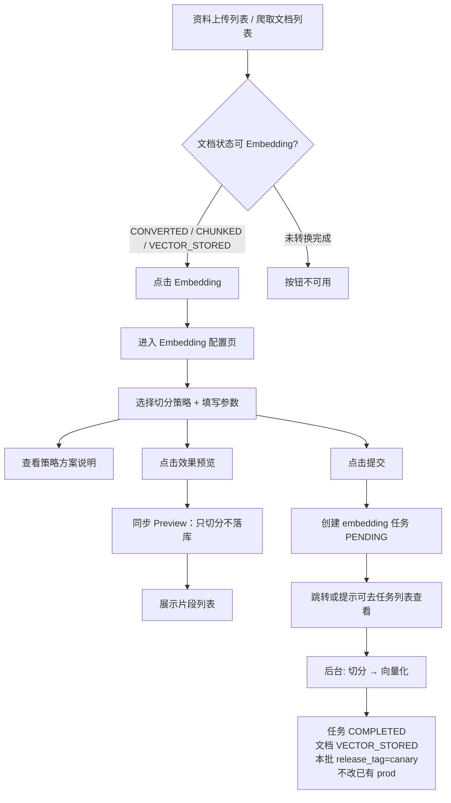
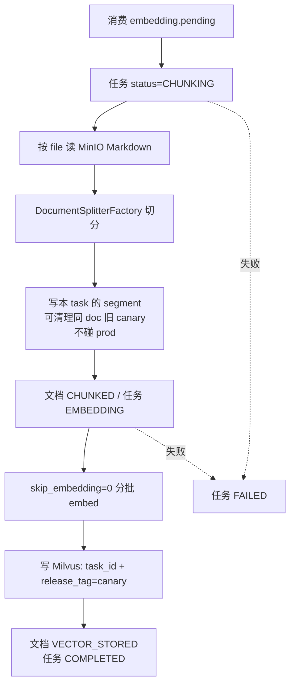
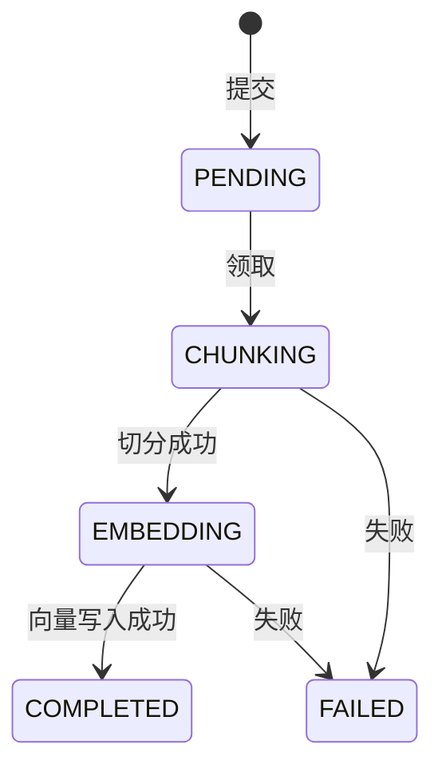

# 文档切分与向量化需求设计

## 一、需求背景与目标

### 1.1 背景

资料上传与网页爬取链路已将业务文档统一转换为 Markdown，并落库至 `knowledge_document`（状态 `CONVERTED`）。RAG 下一关键步骤是将 Markdown **按策略切分**并 **向量化写入 Milvus**，为后续独立检索项目与 RAGAS 测评提供数据基础。

参考 know-engine 的五种切分策略（TITLE / LENGTH / SEPARATOR / REGEX / SMART），本期在本系统以 Python 生态落地，并通过前端配置化启动后台 Embedding 任务。

### 1.2 迭代规划


| 阶段 | 内容 |
|------|------|
| **本期** | 五策略切分、预览、Embedding 任务；向量/segment 打 **`release_tag`**（成功默认为 `canary`）；任务菜单；为灰度/发布/待删除预留标签语义 |
| 后续 · 检索 | 主流量 filter `release_tag=prod`；可选灰度流量读 `canary` |
| 再后 · RAGAS + 发布 | 上线前 RAGAS 打 canary；通过后 **发布切换**：canary→prod，旧 prod→`pending_delete`，异步清理 |
| 持续 · 监控 | 请求埋点 + 看板；抽样 RAGAS；差评回流测试集 |

### 1.3 目标

- 在 **资料上传**、**网页爬取（文档信息）** 列表增加「Embedding」入口，配置策略、预览、提交后台任务。
- 后台：切分 → segment → LangChain embed → Milvus；文档 → `VECTOR_STORED`；本批数据 **`release_tag=canary`**（不自动盖掉已有 `prod`）。
- 新建「Embedding 任务」菜单。
- 技术栈：自研五策略 + LangChain Embeddings + Milvus。
- **扩展就绪**：同 `doc_id` 下用 **灰度 / 发布 / 待删除** 标签区分多套向量，检索只按标签过滤，不做文档级 task 指针。

### 1.4 范围边界

| 范围 | 说明 |
|------|------|
| 包含 | 五策略、预览、任务全生命周期、segment/Milvus 带 `task_id`+`release_tag`、任务菜单 |
| 本期不做 UI | 发布切换、灰度流量比例、RAGAS 页、监控看板 |
| 明确不做 | **Embedding 模型切换**（全量重嵌 + collection/Profile 切换）；检索 API、Agent Tool、LlamaIndex 入库、Excel 专用切分 |
| 依赖 | `CONVERTED` 文档与文件；`document_embedding` 适配；消息流 / 调度 |

---

## 二、总体流程

### 2.1 用户主流程



### 2.2 后台处理流程



### 2.3 模块职责

| 模块 | 职责 |
|------|------|
| `knowledge-web` | 列表 Embedding 按钮、配置页、任务列表/详情/切分效果；菜单「Embedding 任务」 |
| `knowledge-content` | 策略元数据、预览、任务 CRUD、切分、向量化、消息消费与调度兜底 |
| `knowledge-common` | `LangChainModelFactory` Embedding、`DocumentStatus`、消息流、模型功能适配读取 |
| `knowledge-admin` | 菜单种子、Embedding 功能点模型适配初始化（可与 content SQL 一并维护） |

### 2.4 数据流转总览

| 核心表 / 存储 | 作用 |
|---------------|------|
| `knowledge_document` | 文档主表；状态 CHUNKED / VECTOR_STORED |
| `knowledge_document_file` | Markdown 文件行 |
| `knowledge_document_embedding_task` | 任务与策略参数快照 |
| `knowledge_document_segment` | 分段；含 `task_id`、**`release_tag`** |
| MinIO | Markdown |
| Milvus | 向量含 doc_id、task_id、release_tag、**doc_title**、**doc_version**、text 等 |

---

## 三、状态机

### 3.1 文档状态 `knowledge_document.status`

沿用已有枚举，本期真正驱动流转：

| 状态值 | 含义 | 触发 |
|--------|------|------|
| `CONVERTED` | 已生成 Markdown | 上传/爬取完成（既有） |
| `CHUNKED` | 已完成文档分块 | Embedding 任务切分落库成功 |
| `VECTOR_STORED` | 已写入向量库 | Embedding 任务向量化全部成功 |

说明：

- 允许从 `CONVERTED` / `CHUNKED` / `VECTOR_STORED` 再跑 Embedding（生成新灰度集）。
- 新任务成功：本批 segment/向量 `release_tag=canary`；**不得改动同 doc 下已有 `prod`**。
- 失败时文档状态保持失败前状态。

### 3.2 Embedding 任务运行状态 `status`

| 状态值 | 含义 |
|--------|------|
| `PENDING` | 等待消费 |
| `CHUNKING` | 切分中 |
| `EMBEDDING` | 向量化中 |
| `COMPLETED` | 成功 |
| `FAILED` | 失败 |



### 3.3 发布标签 `release_tag`（权威在 segment ↔ Milvus）

**只落在 `knowledge_document_segment` 与 Milvus**，两列对齐；文档表、任务表都不存发布态。

| 标签 | 含义 | 谁用 |
|------|------|------|
| `canary` | 灰度/待评测 | 新任务成功默认；RAGAS；可选灰度流量 |
| `prod` | 发布态 | 线上主检索 |
| `pending_delete` | 待删除 | 发布切换后旧 prod；异步清理 |

**同一 `doc_id` 约束：**

- 最多一套有效 `prod` 分段/向量
- 最多一套有效 `canary`（再跑可顶替旧 canary）
- 切换：该批 segment + Milvus 的 `canary → prod`，原 `prod → pending_delete`，异步删

任务列表若要展示「本任务标签」，按 `task_id` 查 segment 聚合即可（同任务应同标签）。

---

## 四、入口与页面需求

### 4.1 资料上传列表

- 页面：`知识管理 → 资料上传`（既有）。
- 行操作新增「Embedding」。
- 可用条件：已关联有效 `knowledge_document`，且文档状态为 `CONVERTED` / `CHUNKED` / `VECTOR_STORED`。
- 点击后跳转 Embedding 配置页，携带 `docId`、`sourceType=0`（上传）。

### 4.2 网页爬取 — 文档信息

- 页面：`知识管理 → 网页爬虫` → 文档信息 Tab（既有）。
- 行操作新增「Embedding」。
- 可用条件同 4.1；`sourceType=1`（爬取）。
- 配置页需支持按文件（网页）切换预览；提交时对该文档下全部未删除 file 切分。

### 4.3 Embedding 配置页

推荐 **独立路由页**（或等价全屏 Drawer），避免小弹窗塞不下策略说明与预览。

路由建议：`/knowledge/embedding/config?docId=&sourceType=`  
组件建议：`views/knowledge/embedding/config.vue`

#### 4.3.1 页面布局

| 区域 | 内容 |
|------|------|
| 页头 | 文档标题、来源（上传/爬取）、当前文档状态、只读 Embedding 模型与维度 |
| 策略区 | 策略单选：TITLE / LENGTH / SEPARATOR / REGEX / SMART |
| 说明区 | 当前策略的方案设计文案（适用场景、参数含义、注意点） |
| 参数区 | 随策略动态表单（见 §五） |
| 预览控制 | 上传：样本说明（如前 8KB）；爬取：页面下拉（默认第一页 `file id ASC`）+「预览」按钮 |
| 预览结果 | 片段表格：序号、文本摘要、长度、标题元数据、skipEmbedding、parentChunkId |
| 操作 | 取消返回；提交创建任务 |

#### 4.3.2 预览规则

| 来源 | 预览输入 | 行为 |
|------|----------|------|
| 上传 | 该文档唯一 Markdown 文件 | 取样本切分（建议前 8KB，可配置上限）；**不落库、不调 embedding** |
| 爬取 | 用户所选 `fileId`（默认第一页） | 对该页 Markdown 样本切分；提交任务时仍切 **全部文件** |

预览结果需明确提示：「预览为样本效果，提交后将对文档全量内容切分」。

#### 4.3.3 提交规则

- 前端校验必填参数；后端二次校验。
- 同一 `doc_id` 若存在进行中任务（`PENDING` / `CHUNKING` / `EMBEDDING`），禁止重复提交，提示先等待或查看任务列表。
- 提交成功返回 `taskId`，提示可前往「Embedding 任务」查看进度。

### 4.4 Embedding 任务菜单（新建）

- 菜单位置：知识管理下，与资料上传、网页爬虫并列。
- 菜单名：Embedding 任务。
- 权限前缀：`rag:embedding:*`。

#### 4.4.1 任务列表

| 列 | 说明 |
|----|------|
| 任务 ID | `task_id` |
| 文档标题 | 关联文档 |
| 来源 | 上传 / 爬取 |
| 切分策略 | split_type |
| 运行状态 | status |
| 发布标签 | 由本任务 segment 的 `release_tag` 聚合展示（不落任务表） |
| 进度摘要 | 如 `chunk_count` / `embedded_count` |
| 模型 / 维度 | 任务快照 |
| 创建人 / 创建时间 | 审计 |
| 错误信息 | 失败时展示摘要 |

筛选：状态、来源、文档标题关键字、时间范围。  
进行中任务：列表或详情页 **5–10 秒轮询**（对齐爬虫任务习惯）。

#### 4.4.2 任务操作

| 操作 | 说明 |
|------|------|
| 详情 | 参数快照、模型/维度、错误详情、运行/发布状态 |
| 查看切分效果 | 任务至少完成切分后，分页展示 **本 task_id** 的 segment |
| 重试 | 仅 `FAILED`；按原参数新建任务并投递 |
| 上线/发布切换 | **本期不做 UI**；后续：canary→prod，旧 prod→pending_delete |

---

## 五、切分策略需求

### 5.1 策略一览

| 策略 | 切分依据 | 必填参数 | 可选参数 | 特殊行为 |
|------|----------|----------|----------|----------|
| **TITLE** | Markdown 标题层级 | `chunkSize`, `titleLevel`(1–6) | `overlap` | 代码块保护；超长父子二次切；父片 `skipEmbedding` |
| **LENGTH** | 按空白分词后凑满长度 | `chunkSize` | `overlap` | 无标题元数据；超长词按字符再切 |
| **SEPARATOR** | 自定义分隔符（按正则解释） | `chunkSize`, `separator` | `overlap` | 超长块需兜底再切（优于参考实现直接抛错） |
| **REGEX** | 自定义正则 | `chunkSize`, `regex` | `overlap` | 同 SEPARATOR |
| **SMART** | Markdown 全 6 级标题 | `chunkSize` | — | `overlap` 强制 `chunkSize * 10%`；忽略用户 `overlap`/`titleLevel` |

### 5.2 策略说明文案（配置页展示）

前端通过 `GET /embedding/strategies` 获取结构化说明，避免硬编码漂移。每条至少包含：`code`、`name`、`summary`、`applicableScenes`、`paramSchema`、`notes`。

### 5.3 切分作用范围

| 文档类型 | 切分范围 | segment 关联 |
|----------|----------|--------------|
| 上传（通常 1 file） | 该 Markdown 全文 | `doc_id` + `file_id` |
| 爬取（N files） | **每个 file 分别切分** | `doc_id` + `file_id`；`chunk_order` 可在任务内全局递增或按 file 内递增（技术方案定一种） |

### 5.4 父子分段（TITLE / SMART）

- 聚合段长度 ≤ `chunkSize`：单段，需 embedding。
- 超出：保留父分段全文（`skip_embedding=1`，不进 Milvus）；子分段按窗口 + overlap 切出并 `parent_chunk_id` 指向父。
- 后续检索项目命中子段后，可按 `parent_chunk_id` 回 MySQL 取父全文（本期只保证数据具备该能力）。

---

## 六、Embedding 模型与维度

### 6.1 定稿结论

**页面不开放自由填写向量维度。**

理由：Milvus collection 维度固定；手填维度易与模型输出不一致，导致写入失败或被迫多 collection。

### 6.2 落地方式

1. **业务适配 `document_embedding`**：绑定 Embedding 模型，并在适配上配置 `dimensions`（必填，>0）。
2. 模型表只登记模型编码/类型等，**不存维度**（同一模型可按业务选不同维，如千问 v4 支持 64~2048）。
3. 一期锁定千问 `text-embedding-v4`，默认维度 **1024**；写入与检索共用该适配。
4. 切分任务页禁止手填维度；维度只读来自适配。

---

## 七、灰度 / 发布标签与扩展预留

### 7.1 原则（本期必须遵守）

针对**同一个 `doc_id`**：

| 场景 | 规则 |
|------|------|
| 新 Embedding 成功 | 本批打 `canary`；可顶替同 doc 旧 `canary` |
| 已有 `prod` | **禁止**被新任务改写或删除 |
| 文档删除 | **不允许**；不提供文档软删级联清向量 |
| 可清理范围 | 仅分片 + 向量：旧 canary 被顶替、`pending_delete` 异步清理、失败任务残留 |
| 灰度流量（后续） | 少部分请求读 `canary` |
| RAGAS（后续） | 读 `canary`（测试集 ≠ 真实流量） |
| 发布切换（后续） | `canary → prod`；原 `prod → pending_delete`；异步清理 |
| 进行中任务 | 同 doc 禁止并行提交 |
| 失败重试 | 新建任务；只清本任务残留 |

**不做**文档级 task 指针；检索路由只靠 `release_tag`。

### 7.2 后续：发布切换

```text
同一 doc_id:
  旧 prod     → pending_delete
  目标 canary → prod
异步任务：扫描 pending_delete → 删 Milvus + segment 归档并物理删除
```

### 7.3 后续：监控

埋点建议含：`release_tag`（命中 prod/canary）、空命中、延迟、反馈。RAGAS 仅定期抽样。

---

## 八、权限

| 权限标识 | 说明 |
|----------|------|
| `rag:embedding:list` | 任务列表 |
| `rag:embedding:query` | 详情 / 切分效果 / 策略 / 模型 |
| `rag:embedding:create` | 预览、提交 |
| `rag:embedding:retry` | 失败重试 |
| `rag:embedding:publish` | **预留**：发布切换 |

---

## 九、非功能需求

| 项 | 要求 |
|----|------|
| 预览时延 | 样本同步切分，可截断 |
| 任务吞吐 | 分批 embed |
| 标签隔离 | 新 canary 不影响 prod；清理只针对 pending_delete / 旧 canary |
| 可观测 | 日志含 task_id / doc_id / release_tag |
| 安全 | 文档数据权限校验 |

---

## 十、验收标准

1. 上传/爬取列表可打开配置页，五策略可用。
2. 预览不落库、不 embed；爬取可切换页预览。
3. 任务 COMPLETED；文档 VECTOR_STORED；本批 `release_tag=canary`。
4. 若已有 prod，新 canary 完成后 **prod 仍在**。
5. 父片 skipEmbedding 不进 Milvus；维度只读。
6. 进行中不可重复提交；失败可重试。
7. segment/Milvus 含 `release_tag`；任务菜单可用。

---

## 十一、关联文档

| 文档 | 说明 |
|------|------|
| [02-技术方案.md](./02-技术方案.md) | 表结构、API、切分、Milvus、标签切换 |
| [../文档上传需求设计.md](../文档上传需求设计.md) | 上游 CONVERTED |
| [../网页爬取Agent/01-需求设计.md](../网页爬取Agent/01-需求设计.md) | 爬取产出 |
| know-engine 五策略参考 | 算法移植依据 |
