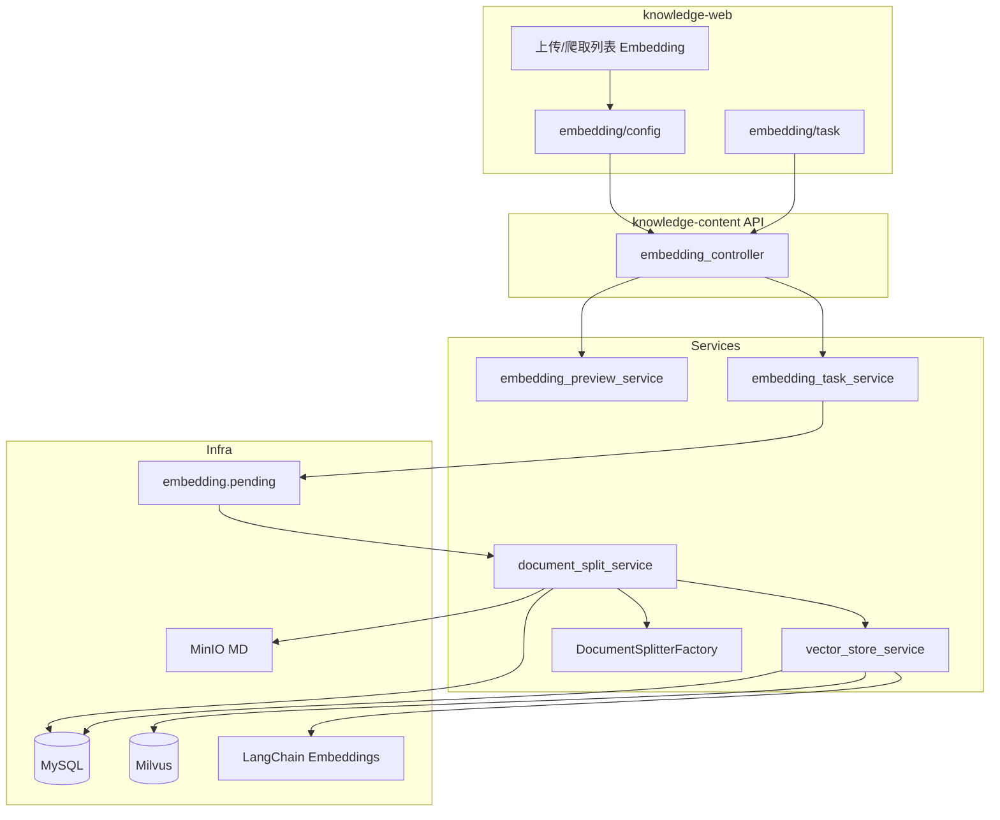

# 文档切分与向量化技术方案

> 配套需求：[01-需求设计.md](./01-需求设计.md)  
> 算法参考：know-engine《五种文档切片策略详细实现方案》

---

## 一、总体架构

### 1.1 技术选型定稿

| 环节 | 选型 | 说明 |
|------|------|------|
| 切分 | 自研 Factory + `langchain-text-splitters>=1.1.1,<2.0.0` | TITLE/SMART 自研；LENGTH 等可用 `RecursiveCharacterTextSplitter` 等 |
| Embedding | LangChain Embeddings | 复用 `LangChainModelFactory.create_embedding_model` |
| 向量库 | Milvus + `pymilvus[model]>=2.6.9,<3.0.0` | 一期直写；`[model]` extra 按依赖锁定 |
| 异步 | MessageStream + APScheduler 兜底 | 对齐现有文档解析/爬取模式 |
| 检索 / Agent | 不在本期 | **约定**：主流量 `release_tag=prod`；灰度可读 `canary` |
| 发布 / RAGAS / 监控 | 本期落 `release_tag` | 发布切换、RAGAS、看板后续迭代 |

### 1.2 逻辑架构



### 1.3 与上游衔接

- 输入：`knowledge_document.status ∈ {CONVERTED, CHUNKED, VECTOR_STORED}` + `knowledge_document_file.doc_key`（Markdown）。
- 上传：通常 1 doc : 1 file；爬取：1 doc : N files，**按 file 分别切分**，segment 带 `file_id`。
- 预览读 MinIO 逻辑复用既有 `DocumentService` 预览路径。

---

## 二、数据库设计

### 2.1 `knowledge_document_embedding_task`

| 列 | 类型 | 说明 |
|----|------|------|
| `task_id` | BIGINT PK AI | 任务主键 |
| `doc_id` | BIGINT NOT NULL | 关联文档 |
| `source_type` | CHAR(1) | 0 上传 / 1 爬取（冗余便于列表筛选） |
| `split_type` | VARCHAR(32) NOT NULL | TITLE/LENGTH/SEPARATOR/REGEX/SMART |
| `split_params` | JSON / TEXT | `{chunkSize, overlap, titleLevel, separator, regex}` |
| `status` | VARCHAR(32) | PENDING/CHUNKING/EMBEDDING/COMPLETED/FAILED |
| `error_message` | VARCHAR(2000) | 失败原因 |
| `chunk_count` | INT | 切分产生的 segment 数（含父片） |
| `embedded_count` | INT | 成功写入 Milvus 的条数 |
| `embedding_model_code` | VARCHAR(128) | 任务快照 |
| `dimensions` | INT | 任务快照 |
| `user_id` | BIGINT | 提交用户 |
| `dept_id` | BIGINT | 部门 |
| `create_by` / `create_time` / `update_by` / `update_time` | 审计 | |
| `del_flag` | CHAR(1) | 0/2 |
| `remark` | VARCHAR(500) | 可选 |

索引建议：`idx_doc_id`、`idx_status`、`idx_create_time`、`idx_user_id`。

约束（业务层）：同一 `doc_id` 同时最多一条 `status ∈ (PENDING, CHUNKING, EMBEDDING)`。

### 2.2 `knowledge_document_segment`

| 列 | 类型 | 说明 |
|----|------|------|
| `id` | BIGINT PK AI | 行主键 |
| `task_id` | BIGINT NOT NULL | 所属 embedding 任务 |
| `doc_id` | BIGINT NOT NULL | 所属文档 |
| `file_id` | BIGINT NOT NULL | 所属 `knowledge_document_file.id` |
| `chunk_id` | VARCHAR(64) NOT NULL | 业务分片 ID（UUID 或 Snowflake） |
| `chunk_order` | INT NOT NULL | 任务内全局递增，从 0 起 |
| `text` | LONGTEXT | 分段正文 |
| `metadata` | JSON / TEXT | 见 §2.3 |
| `parent_chunk_id` | VARCHAR(64) | 子片指向父；无则空 |
| `skip_embedding` | TINYINT | 1=父片不进向量库；0=需要 |
| `embedding_id` | VARCHAR(64) | Milvus 主键；未写入为空 |
| `status` | VARCHAR(32) | STORED / VECTOR_STORED |
| `create_by` / `create_time` / `update_by` / `update_time` | 审计 | 创建/更新人取自任务 `create_by` |
| `release_tag` | VARCHAR(32) NOT NULL | **与 Milvus 对齐**：canary / prod / pending_delete |
| `del_flag` | CHAR(1) | pending_delete 清理或旧 canary 顶替时软删；**prod 不可被新任务软删** |

索引建议：`idx_task_id`、`idx_doc_id`、`idx_doc_release(doc_id, release_tag)`、`idx_chunk_id`。

### 2.3 `metadata` JSON 约定

| 键 | 来源 | 说明 |
|----|------|------|
| `chunkId` | 切分器 / 落库 | 与列 `chunk_id` 一致 |
| `title` / `subtitle` / … | TITLE/SMART | 标题栈 |
| `headerLevel` | TITLE/SMART | 最深标题级别 |
| `parentChunkId` | 子片 | 与列同步 |
| `skipEmbedding` | 父片 | 与列同步 |
| `docId` / `fileId` / `taskId` | enrich | 溯源 |
| `releaseTag` | enrich | 与列一致 |
| `docTitle` / `docVersion` | enrich | 与 Milvus 冗余字段一致 |
| `fileName` / `sourceUrl` | enrich | 展示 |

### 2.4 文档主表

**不加**文档级发布指针，**任务表不存** `release_tag`。权威在 `knowledge_document_segment.release_tag` ↔ Milvus `release_tag`。

### 2.5 模型功能适配与维度

**表改造：** `knowledge_ai_model_function_adapter` 增加 `dimensions INT NULL`（独立脚本 `sql/upgrade_document_embedding_adapter.sql`）。维度挂在**业务适配**，不挂 `ai_models`。

**规则：**

| 场景 | 校验 |
|------|------|
| 适配 `param_id=document_embedding` | 绑定模型须为 embedding；适配上 `dimensions` 必填且 >0 |
| 其它业务适配 | dimensions 可空 |
| 模型主数据 | 仅登记 model_type=embedding，不存维度 |

```sql
-- 功能点 document_embedding（一期：千问 text-embedding-v4，默认 1024 维）
INSERT INTO knowledge_ai_model_function_adapter
  (function_point, param_id, model_id, dimensions, ...)
VALUES
  ('文档向量化', 'document_embedding', '<text-embedding-v4 model_id>', 1024, ...);
```

- Milvus collection 维度与适配 `dimensions` 一致。
- 写入与后续检索都读这一条适配。
- **本期不做模型切换**产品化。

### 2.6 菜单种子

在「知识管理」下新增：

| 菜单 | path | component | perms |
|------|------|-----------|-------|
| Embedding 任务 | `embedding` | `knowledge/embedding/task/index` | `rag:embedding:list` |
| 按钮-查询 | | | `rag:embedding:query` |
| 按钮-创建 | | | `rag:embedding:create` |
| 按钮-重试 | | | `rag:embedding:retry` |
| 按钮-上线 | | | `rag:embedding:publish`（**预留**，后续启用） |

配置页可作为隐藏路由（`hidden=true`）或由列表 `query` 跳转，component：`knowledge/embedding/config`。

---

## 三、切分实现

### 3.1 模块位置

建议包路径：

```
knowledge-content/src/knowledge_content/
  splitter/
    __init__.py
    types.py                 # SplitType, DocumentSplitParam, TextSegmentDTO
    factory.py               # DocumentSplitterFactory
    markdown_header_parent.py
    fixed_length_splitter.py
    regex_splitter.py        # SEPARATOR 与 REGEX 共用
  service/
    embedding_preview_service.py
    embedding_task_service.py
    document_split_service.py
    vector_store_service.py
  controller/
    embedding_controller.py
  message/consumer/
    embedding_task_consumer.py
  tasks/
    embedding_task_scheduler.py
  enums/
    embedding_task_status_enum.py
    split_type_enum.py
    segment_status_enum.py
```

### 3.2 参数对象

```python
class DocumentSplitParam(BaseModel):
    split_type: SplitType
    chunk_size: int
    overlap: int | None = 0
    title_level: int | None = None      # TITLE
    separator: str | None = None        # SEPARATOR
    regex: str | None = None            # REGEX
```

校验规则：

| 策略 | 校验 |
|------|------|
| 通用 | `chunk_size > 0`；`overlap >= 0` 且 `< chunk_size`（SMART 除外由服务端重写 overlap） |
| TITLE | `title_level ∈ [1,6]` |
| SEPARATOR | `separator` 非空；编译为正则失败则 400 |
| REGEX | `regex` 非空；同左 |
| SMART | 忽略入参 `overlap`/`title_level`；`overlap = int(chunk_size * 0.1)` |

### 3.3 Factory 映射

| splitType | 实现 |
|-----------|------|
| TITLE | `MarkdownHeaderParentTextSplitter(title_level, return_each_line=False, strip_headers=False, chunk_size, overlap)` |
| SMART | 同上，全 6 级标题，`return_each_line=True`，overlap=10% |
| LENGTH | `langchain_text_splitters.RecursiveCharacterTextSplitter`（或 Character，按空白/字符）；超长兜底 |
| SEPARATOR | `re.split(separator)` + 按 chunk_size 合并；超长 part **字符/递归兜底再切**（改进参考实现） |
| REGEX | 同 SEPARATOR，模式来自 `regex` |

### 3.4 TITLE / SMART 算法要点（移植）

1. 按行扫描；`` ``` `` / `~~~` 代码块内不识别标题。
2. 维护 `header_stack` 与 metadata（title/subtitle/…）。
3. TITLE：`return_each_line=False` 先按 metadata 聚合；SMART：逐行成段后再 `split_by_chunk_size`。
4. `split_by_chunk_size`：超长则父片 `skip_embedding=1` + 子片窗口滑动（`start = end - min(overlap, end)`）。
5. 所有策略落库前统一补齐 `chunk_id`（LENGTH/SEPARATOR/REGEX 切分器可不生成，由服务层补）。

### 3.5 `chunk_order` 约定

任务内处理 files 时按 `file.id ASC` 顺序；全局 `chunk_order` 从 0 递增跨 file，便于任务详情统一展示。

### 3.6 灰度写入语义（同 doc_id）

对目标 `doc_id`、当前新 `task_id`：

1. 若存在旧 **`canary`**：软删其 segment；按旧 canary 的 `task_id` 删 Milvus。
2. **禁止**改动同 doc 下 `release_tag=prod` 的数据。
3. 写入本任务新 segment（`task_id` + `release_tag=canary`）。
4. embed 写入 Milvus（同上标签）。
5. 任务 `COMPLETED`；文档 `status=VECTOR_STORED`。（标签只写在 segment/Milvus）

进行中禁止第二任务；FAILED 重试：新建任务，只清本任务残留。

---

## 四、向量化与 Milvus

### 4.1 Embedding

```python
adapter = AiModelFunctionAdapterDao.get_by_param_id("document_embedding")
model_config = to_EmbeddingModelConfigModel(adapter)  # 含 dimensions
embeddings = LangChainModelFactory.create_embedding_model(model_config)
vectors = embeddings.embed_documents(texts)  # 分批 50~100
```

仅处理本 `task_id` 下 `skip_embedding=0` 的 segment。

### 4.2 Collection 设计（一期）

- 名称：`knowledge_vector`（一期固定单一维度）。
- 度量：COSINE。
- 字段：

| 字段 | 类型 | 说明 |
|------|------|------|
| `id` | VARCHAR PK | = `embedding_id` |
| `vector` | FLOAT_VECTOR(dim) | |
| `doc_id` | INT64 | 标量索引 |
| `file_id` | INT64 | |
| `task_id` | INT64 | 溯源；清理可按任务 |
| `release_tag` | VARCHAR | **必建标量索引**；检索路由主字段 |
| `doc_title` | VARCHAR | 文档标题冗余，检索结果展示/过滤，免回表 |
| `doc_version` | VARCHAR | 文档版本冗余，多版本并存时过滤 |
| `chunk_id` | VARCHAR | |
| `text` | VARCHAR | 冗余正文 |

写入时从 `knowledge_document` 拷贝 `doc_title` / `doc_version` 快照；若日后改标题，以「重跑 Embedding 或发布切换时刷新」为准（不保证与主表实时一致）。

### 4.3 写入与清理

1. 生成 `embedding_id` → embed → insert（含 `doc_id`/`task_id`/`release_tag=canary`/`doc_title`/`doc_version`/`text`）。
2. 回写 segment。
3. 成功：任务 COMPLETED；segment/Milvus 均为 canary。
4. 清理：按 `task_id` 或按 `(doc_id, release_tag=pending_delete|旧 canary)`；**禁止**无差别按 doc 删光所有标签（会误伤仍在用的 prod）。
5. **文档不允许删除**（本领域不提供文档级删除/级联清库）；仅允许清理分片与向量（旧 canary 顶替、`pending_delete` 异步清理、失败任务残留清理）。

父片不写 Milvus。

### 4.4 依赖

依赖：`pymilvus[model]>=2.6.9,<3.0.0`（见 `knowledge-content/pyproject.toml`）+ Milvus env（uri/token/collection）。

---

## 4A、发布标签切换与监控（本期约定，后续实现）

### 4A.1 发布切换（后续）

```text
POST /embedding/tasks/{taskId}/publish
# 或按 doc：POST /embedding/documents/{docId}/promote
```

同一 `doc_id`：

1. 校验目标任务数据当前为 `canary`。
2. 将该 doc 下原 `prod` → `pending_delete`（segment + Milvus 标量更新，或先改 MySQL 再异步改/删向量）。
3. 目标 `canary` → `prod`。
4. 异步任务扫描 `pending_delete` → 删 Milvus + segment 归档并物理删除。

检索 filter：

- 主流量：`release_tag == "prod"`
- 灰度：`release_tag == "canary"`（按流量比例）
- RAGAS：`release_tag == "canary"`（或指定 task_id）

### 4A.2 线上监控埋点约定

`trace_id`, `user_id`, `query`, `doc_ids`, `release_tag`, `hit_count`, `top_score`, `latency_ms`, `empty_hit`, `feedback`, `error_code`
---

## 五、异步链路

### 5.1 消息

- Topic / Stream：`embedding.pending`（命名与现有 `document.parse.pending` 风格一致）。
- Payload：`{ "taskId": <long> }`。

### 5.2 Consumer

1. 加载任务；若已 COMPLETED 则幂等返回。
2. 校验文档存在（文档不可删，无需处理已删文档级联）。
3. CAS/乐观更新：`PENDING → CHUNKING`（防双消费）。
4. 调用 `document_split_service.split_document(task)`。
5. 文档 → `CHUNKED`；任务 → `EMBEDDING`。
6. 调用 `vector_store_service.embed_and_store(task)`（只写本 task）。
7. 文档 → `VECTOR_STORED`；任务 → `COMPLETED`；本批 `release_tag=canary`。
8. 异常：任务 → `FAILED`；清理本 task 残留，不碰 prod。

### 5.3 调度兜底

APScheduler 定时扫描：

- 长时间 `PENDING`（未消费）→ 重新投递。
- 长时间 `CHUNKING` / `EMBEDDING`（超时阈值可配，如 30–60 分钟）→ 标记 FAILED 或允许人工重试。

`app_scope=rag`，对齐现有解析调度注册方式。

---

## 六、API 设计

Base path 建议：`/api/rag/embedding`（与现有 `/api/rag/document` 一致）。

### 6.1 `GET /strategies`

返回五策略元数据：code、name、summary、applicableScenes、notes、paramSchema（JSON Schema 或字段列表）。

权限：`rag:embedding:query`

### 6.2 `GET /model-info`

```json
{
  "modelCode": "text-embedding-v3",
  "dimensions": 1024,
  "provider": "openai"
}
```

只读；来自 `document_embedding` 适配。无适配时 500/业务错误提示管理员配置。

### 6.3 `POST /preview`

请求：

```json
{
  "docId": 1001,
  "fileId": 2001,
  "splitType": "TITLE",
  "chunkSize": 500,
  "overlap": 50,
  "titleLevel": 2
}
```

规则：

- 上传可不传 `fileId`（唯一文件）；爬取建议传，缺省取 `id ASC` 第一条。
- 样本截断：默认前 8192 字符（可配置）。
- **不写库、不 embed**。

响应：

```json
{
  "sampleTruncated": true,
  "sampleLength": 8192,
  "segments": [
    {
      "order": 0,
      "text": "...",
      "length": 120,
      "skipEmbedding": false,
      "parentChunkId": null,
      "metadata": { "title": "发动机", "subtitle": "机油规格", "headerLevel": 2 }
    }
  ]
}
```

### 6.4 `POST /tasks`

请求同预览参数（全量切分，忽略样本截断）。响应：`{ "taskId": 1 }`。

校验：文档权限；无进行中任务；参数合法；快照写入 model/dimensions。

### 6.5 `GET /tasks`

分页：`pageNum`/`pageSize`，筛选 status、sourceType、docTitle、时间。  
响应 rows 含文档标题、策略、状态、chunk_count、embedded_count、error 摘要等。

### 6.6 `GET /tasks/{taskId}`

详情：完整 `split_params`、模型快照、状态、错误全文、关联 docId。

### 6.7 `GET /tasks/{taskId}/segments`

分页 segment；支持 `skipEmbedding` 筛选。用于「查看切分效果」。

### 6.8 `POST /tasks/{taskId}/retry`

仅 `FAILED`：按原参数新建任务并投递。

### 6.9 `POST /tasks/{taskId}/publish`（预留）

发布切换（canary→prod，旧 prod→pending_delete）；权限 `rag:embedding:publish`。见 §4A.1。
---

## 七、前端方案

### 7.1 文件

| 路径 | 说明 |
|------|------|
| `views/knowledge/embedding/config.vue` | 配置 + 预览 + 提交 |
| `views/knowledge/embedding/task/index.vue` | 任务列表 |
| `views/knowledge/embedding/task/detail components` | 详情抽屉、片段列表 |
| `api/content/embedding.js` | API 封装 |

### 7.2 列表改动

- `document/index.vue`：行按钮 Embedding → `router.push({ path: '.../embedding/config', query: { docId, sourceType: '0' } })`。
- `crawler/index.vue` 文档 Tab：同上，`sourceType: '1'`。

可用状态：文档 `CONVERTED|CHUNKED|VECTOR_STORED`；需能拿到 `docId`（上传列表已关联 doc 时展示）。

### 7.3 配置页交互

1. 挂载：拉 `strategies`、`model-info`、文档基础信息、爬取时 `listDocumentFiles`。
2. 切换策略：换说明与表单；SMART 隐藏 overlap/titleLevel。
3. 预览：防抖/按钮触发 `preview`；表格展示。
4. 提交：成功提示 `taskId`，可链到任务页。

### 7.4 任务页

进行中状态 `setInterval` 5–10s 刷新当前页或详情。

---

## 八、服务层关键方法（伪代码）

```python
# document_split_service
async def split_document(task: EmbeddingTask) -> int:
    replace_previous_canary(doc_id)  # 不碰 prod
    files = list_files(doc_id)  # id ASC
    order = 0
    all_segments = []
    for f in files:
        text = read_minio_markdown(f.doc_key)
        segs = factory.get(task.split_param).split(text)
        for s in segs:
            s.chunk_order = order; order += 1
            s.release_tag = "canary"
            enrich(s, doc, f, task)
            all_segments.append(s)
    bulk_insert_segments(all_segments)
    update_doc_status(CHUNKED)
    task.chunk_count = len(all_segments)
    return task.chunk_count

# vector_store_service
async def embed_and_store(task: EmbeddingTask) -> int:
    page = query_segments(task_id=task.task_id, skip_embedding=0)
    while page:
        ids = [new_uuid() for _ in page]
        vectors = embeddings.embed_documents([s.text for s in page])
        milvus.insert(..., task_id=task.task_id, release_tag="canary")
        update_segment_embedding(page, ids, VECTOR_STORED)
        page = next_page(...)
    update_doc_status(VECTOR_STORED)
    task.status = COMPLETED
```

---

## 九、配置项

| 配置 | 说明 | 建议默认 |
|------|------|----------|
| `embedding.preview_max_chars` | 预览样本上限 | 8192 |
| `embedding.embed_batch_size` | embed 批大小 | 100 |
| `embedding.task_timeout_minutes` | 卡住判定 | 60 |
| `milvus.uri` / `token` / `collection` | 连接与集合名 | 环境注入 |
| `milvus.metric` | 相似度 | COSINE |

---

## 十、测试要点

| 类型 | 用例 |
|------|------|
| 单测 | 五策略切分样例（含代码块内 `#`、TITLE 父子、SMART overlap） |
| 单测 | 参数校验、Factory 选型 |
| 集成 | preview 不落库；submit → consumer → segment + Milvus |
| 集成 | 新 canary 不删除 prod；旧 canary 可被替换 |
| 集成 | 爬取多 file |
| 前端 | 策略切换；release_tag 列；任务轮询 |

---

## 十一、实施顺序建议

1. 表结构 SQL（**segment + Milvus** 含 release_tag；任务表不含）+ DO/DAO/Enum  
2. Splitter Factory + 五策略单测  
3. Preview / Strategies / Model-info API  
4. Task 创建 + Consumer（canary 语义）  
5. VectorStore + Milvus（task_id + release_tag）  
6. 前端配置页 + 列表按钮 + 任务页  
7. 调度兜底与权限种子（publish 预留）  
8. （后续）发布切换 + RAGAS + 监控埋点  

---

## 十二、风险与对策

| 风险 | 对策 |
|------|------|
| SEPARATOR/REGEX 巨片 | 兜底再切 + 预览提示 |
| 误删线上向量 | 清理不得动 prod；只清 pending_delete / 旧 canary / 失败残留；**文档不可删** |
| canary 堆积 | 同 doc 仅保留最新 canary；pending_delete 异步清理 |
| 维度/换模型 | **一期锁死模型**；不做切换产品化；擅自换模须全量重嵌（范围外） |
| 双消费 | 任务状态 CAS |
| 预览≠全量 | UI 截断提示 |

---

## 十三、后续衔接

- **检索**：主流量 `release_tag=prod`；灰度可读 `canary`；父片回填。
- **Agent**：LC Tool → Retriever（可接 LlamaIndex）。
- **RAGAS**：打 canary；通过后发布切换（旧 prod→pending_delete）；前端展示测评。
- **监控**：埋点含 `release_tag` + 看板 + 抽样 RAGAS + 差评回流测试集。
