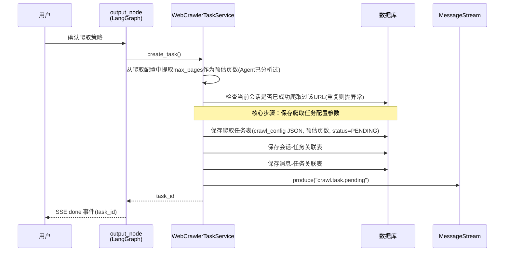
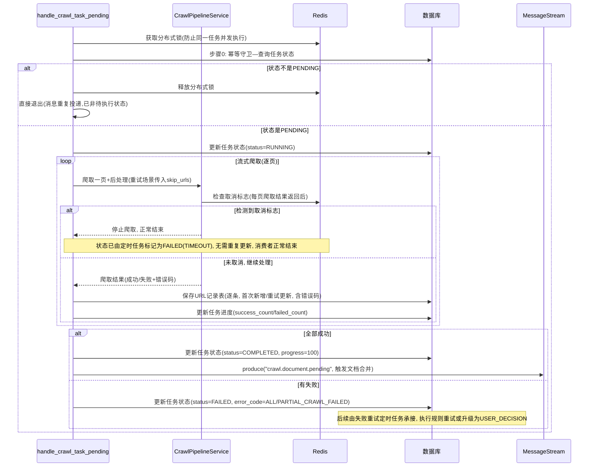
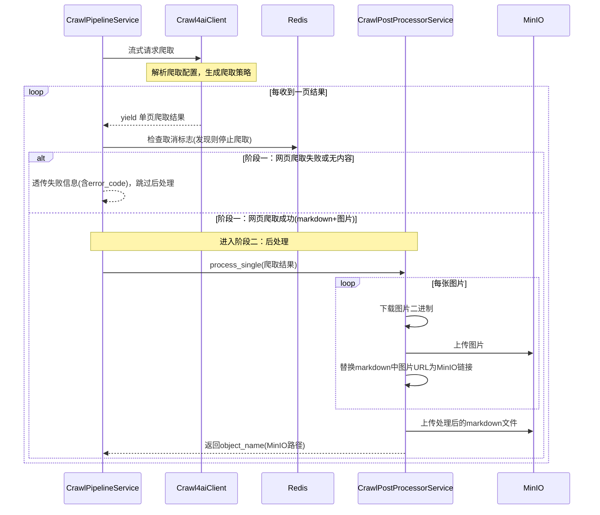
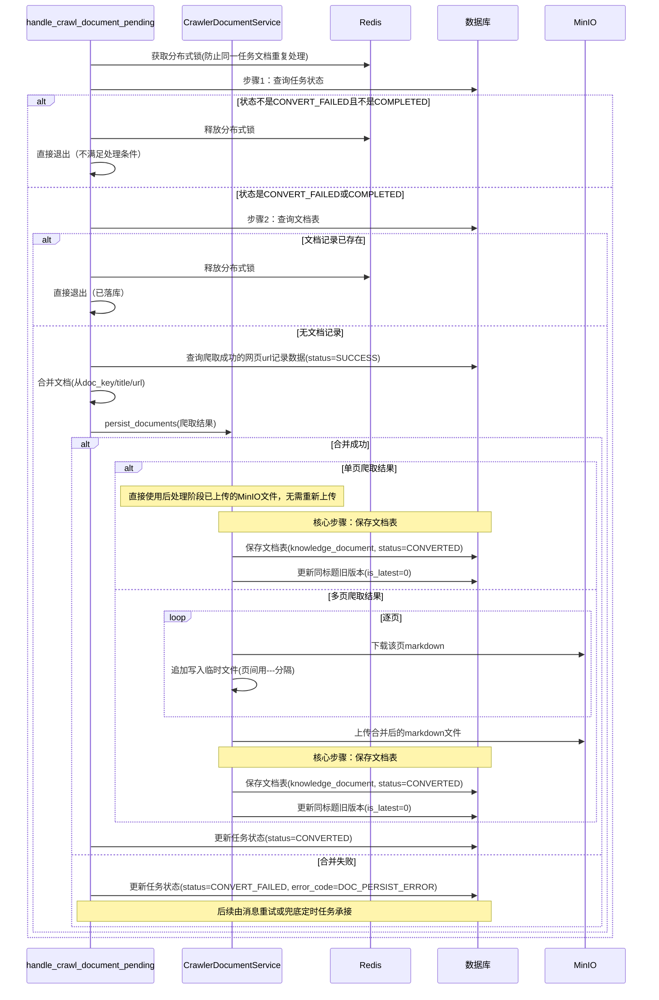
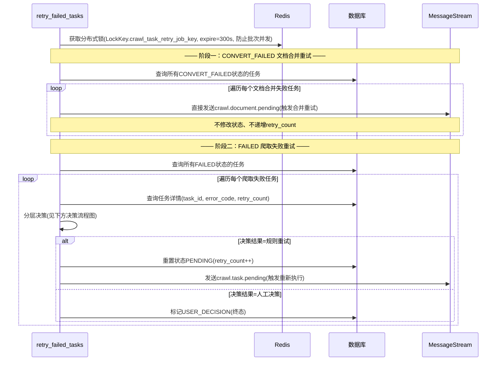
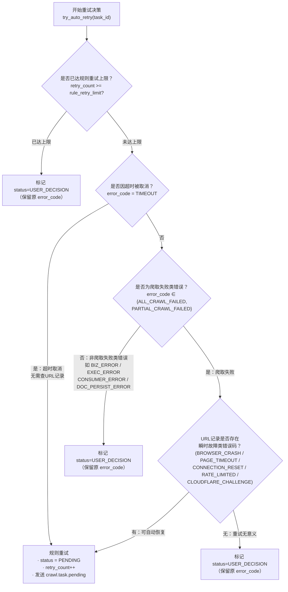
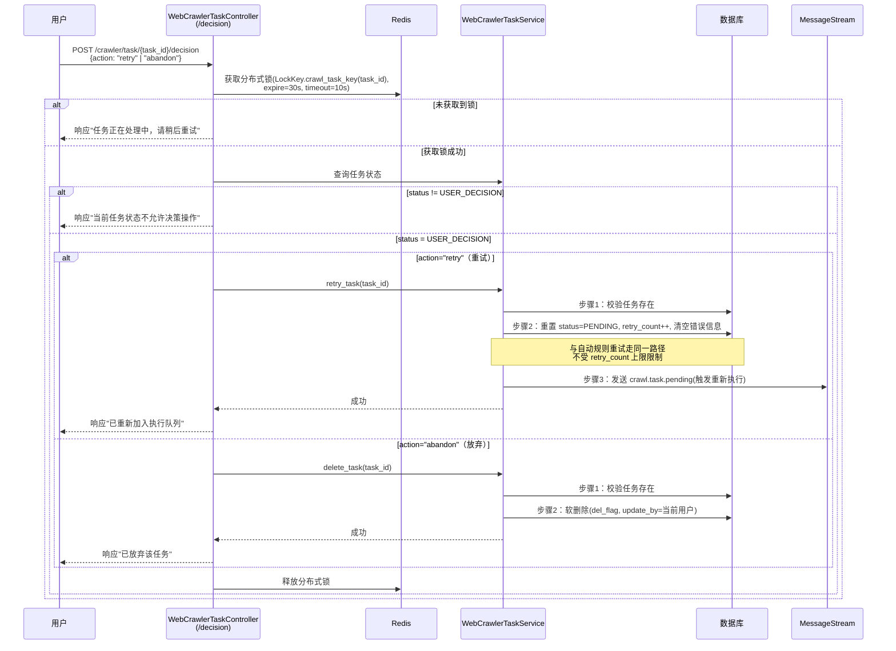

# 1.output_node 任务创建流程

用户确认策略后，`output_node` 调用 `WebCrawlerTaskService.create_task()`：粗估页数 → 检查重复爬取 → 落库任务及关联 → 发送 `crawl.task.pending` 消息触发后台执行。其中**保存爬取任务配置参数**（`crawl_config` JSON）是整个流程最核心的处理——后续执行阶段的全部爬取策略均依赖此配置。

## 消息

- **topic**：`crawl.task.pending`
- **载荷**：`{task_id}`
- **后续**：由 handle_crawl_task_pending 消费，进入执行阶段

---

# 2.handle_crawl_task_pending 任务执行流程

消费 `crawl.task.pending` 消息后，获取分布式锁防止并发执行，进入 `execute_task` 后先查询任务状态进行**幂等守卫**——仅 `PENDING` 状态才继续执行，其余状态直接跳过（防止消息重复投递导致已处理完成的任务被重执行）。校验通过后调用 `WebCrawlerTaskExecutorService.execute_task()` 编排完整执行链路：标记开始 → 流式爬取+逐页上传 → 标记终态。

> **重试场景说明**：重试时会先加载上次已成功URL集合（skip_urls），传入 Pipeline 跳过这些URL的爬取和后处理，避免重复工作。首次执行时 skip_urls 为空集，其他逻辑完全一致。

## CrawlPipelineService 子流程

`CrawlPipelineService` 编排两大阶段：**网页爬取**（Crawl4aiClient 流式获取页面）→ **后处理**（CrawlPostProcessorService 图片转储+Markdown上传），每爬完一页立即进入后处理并释放内存。

### 两大阶段职责

| 阶段 | 执行者 | 说明 |
|------|--------|------|
| 网页爬取 | Crawl4aiClient | 流式获取页面内容，每爬完一页 yield 一次（含 markdown、图片引用、状态码等） |
| 后处理 | CrawlPostProcessorService | **仅在爬取成功时执行**：提取图片 → 下载并上传 MinIO → 替换 markdown 链接 → 上传 markdown |

### 后处理详细步骤

| 步骤 | 说明 |
|------|------|
| 提取图片引用 | 从 markdown 中匹配 `` 语法 |
| 下载图片 | HTTP 下载原始图片二进制（超时 30s） |
| 上传图片到 MinIO | 路径：`crawler/{task_id}/images/{hash}.{ext}` |
| 生成图片描述 | 调用 LLM 为无 alt 文本的图片生成描述（可选） |
| 替换 markdown | 将图片 URL 替换为 MinIO 链接 |
| 上传 markdown | 路径：`crawler/{task_id}/pages/{url_hash}.md` |

## 任务表状态变更

| 时机 | 状态 | error_code |
|------|------|-----------|
| 开始执行 | RUNNING | - |
| 全部成功 | COMPLETED | null |
| 全部失败 | FAILED | ALL_CRAWL_FAILED |
| 部分失败 | FAILED | PARTIAL_CRAWL_FAILED |
| 被取消（超时兜底触发） | FAILED | TIMEOUT（由定时任务设置） |

## 消息

- **topic**：`crawl.document.pending`（仅全部成功时发送）
- **载荷**：`{task_id, target_url}`
- **后续**：由 handle_crawl_document_pending 消费，进入文档合并阶段

---
# 3.超时取消机制（定时任务）

由 **`WebCrawlerTaskScheduler.timeout_fallback`** 超时兜底定时任务（每5分钟）触发，扫描 RUNNING 超过阈值的任务：
1. 将任务状态标记为 `FAILED`，error_code=`TIMEOUT`
2. 在 Redis 中设置取消标志（key: `crawl:task:cancel:{task_id}`，TTL: 10分钟）
3. `CrawlPipelineService` 每收到一页爬取结果后检查此标志，发现后停止爬取，消费者正常结束
---
# 4.handle_crawl_document_pending 文档合并流程

消费 `crawl.document.pending` 消息后，获取分布式锁防止重复处理，前置校验任务状态和文档记录后，从 URL 记录中重建爬取结果，调用 `CrawlerDocumentService.persist_documents()` 完成文档落库。其中**保存文档表**（`knowledge_document`）是整个合并流程最核心的处理——将散落在 MinIO 的各页 markdown 收拢为一条可检索的知识库文档。

---

# 5.retry_failed_tasks 重试定时任务

定时扫描 `FAILED` 与 `CONVERT_FAILED` 状态的任务，通过分层策略自动重试或升级为用户人工决策。

### retry_failed_tasks(try_auto_retry) 决策流程图

> **分布式锁策略**：Job 级互斥锁（`LockKey.crawl_task_retry_job_key`），expire=300s、timeout=0、renew=True。新的定时触发若未抢到锁则直接跳过，等下一轮再来，防止上一批次尚未执行完毕时重复触发。

> **CONVERT_FAILED 处理**：仅重新发送 `crawl.document.pending` 消息，由 handle_crawl_document_pending 消费者重新执行文档合并流程。**不修改任务状态、不递增 retry_count**。

> **DIRECT_RETRY_TASK_ERROR_CODES**（直接重试，不查URL记录）：`TIMEOUT` — 仅限超时取消场景：定时任务超时兜底将 RUNNING 任务标记为 FAILED+TIMEOUT，重试时无需查询 URL 记录表，直接重置执行。

> **RULE_RETRY_ERROR_CODES**（URL记录级瞬时故障）：`BROWSER_CRASH` / `PAGE_TIMEOUT` / `CONNECTION_RESET` / `RATE_LIMITED` / `CLOUDFLARE_CHALLENGE`

> **规则重试**（`_rule_retry`）：重置 `status=PENDING`、递增 `retry_count`、清空错误信息，再发布 `crawl.task.pending` 消息触发重新执行。

> **标记 status=USER_DECISION**（终态）：原 error_code 保持不变（如 `ALL_CRAWL_FAILED`、`TIMEOUT`），用户在任务详情页跳转聊天框，通过 Agent 调整策略后手动重试或放弃。以下任一条件触发此分支：
> 1. `retry_count` 已达规则重试上限（`crawl4ai_rule_retry_limit`）
> 2. 任务级 error_code 非 `ALL_CRAWL_FAILED` / `PARTIAL_CRAWL_FAILED`（非爬取类错误，自动重试无意义）
> 3. URL 记录中无瞬时故障类错误码（失败原因不可自动恢复）

---

# 6.handle_task_decision 用户决策流程

`retry_failed_tasks` 将任务标记为 `status=USER_DECISION` 后，用户通过前端进入任务详情页，调用 `POST /crawler/task/{task_id}/decision` 接口做出决策：**重试**（复用原配置重新执行）或 **放弃**（软删除）。

> **触发入口**：用户在任务列表页看到 `status=USER_DECISION`（"待用户决策"），点击进入详情查看原始失败原因（`error_code` + `error_message`），在聊天框内通过 Agent 确认决策后提交。

> **重试与自动重试的异同**：
> - 相同点：都调用 `WebCrawlerTaskService.retry_task()`，重置 `status=PENDING`、递增 `retry_count`、发送 `crawl.task.pending`
> - 不同点：用户手动重试**不受 `retry_count` 上限限制**，可无限次触发
>
> **crawl_config 调整**：`TaskDecisionVo` 预留了 `crawl_config` 字段，当前实现中重试仍复用原配置，尚未接入调整参数后重试的逻辑。

> **放弃即软删除**：调用 `WebCrawlerTaskDao.soft_delete()` 设置 `del_flag` 标记，非物理删除，数据可追溯。

> **分布式锁**：复用 `LockKey.crawl_task_key(task_id)`，与消费者侧同一把锁——决策处理期间消费者不会同时消费同一任务；expire=30s、timeout=10s，锁释放后消费者才能拾取 PENDING 任务执行。

