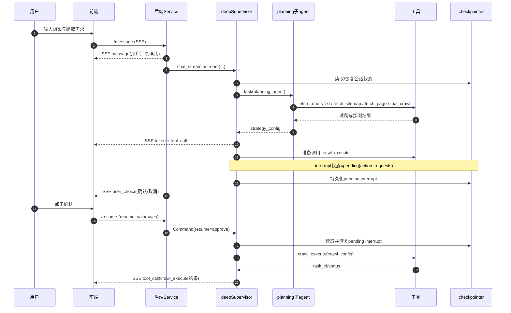
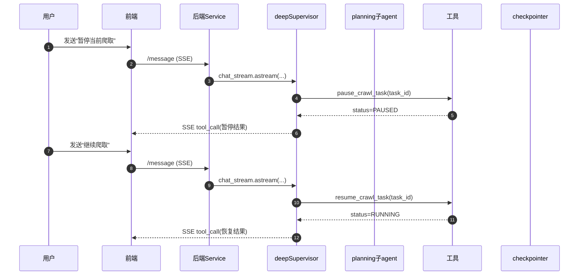
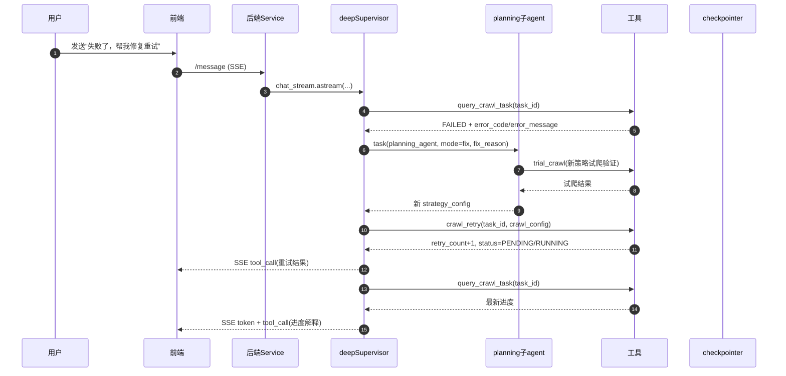
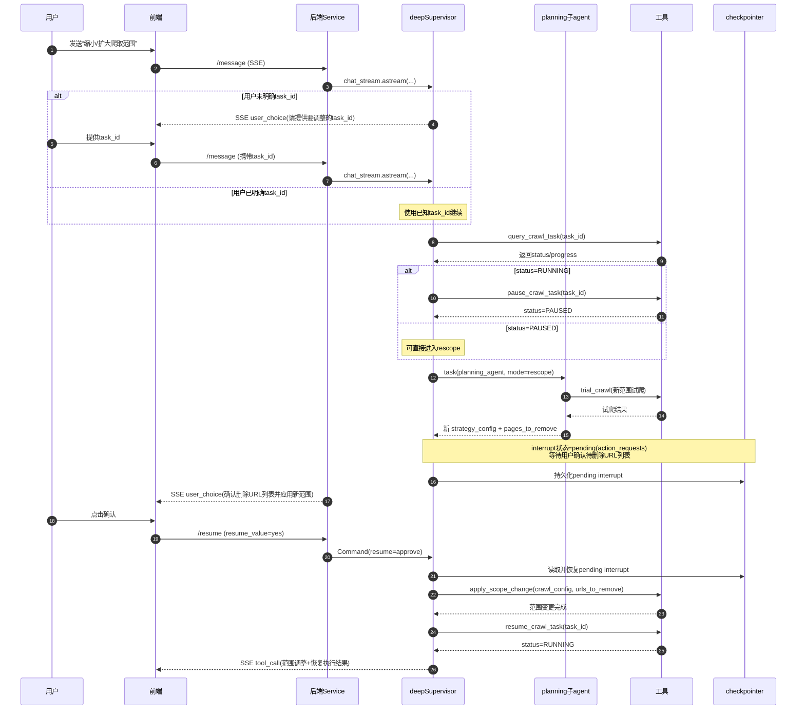
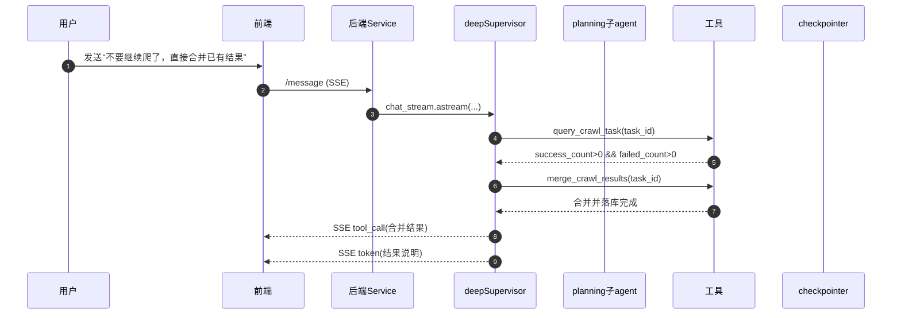

# 爬虫 Agent 整体执行流程梳理

## 1. 目标与范围

本文基于当前代码实现，梳理网页爬取 Agent 的端到端执行链路，覆盖：

- 对话入口与 SSE 返回协议
- LangGraph/deepagents 图执行与状态持久化
- 规划、试爬、正式爬取、任务运维分支
- HITL 中断与 `resume` 恢复机制

---

## 2. 对外接口与协议

### 2.1 会话相关

- 创建会话：`POST /crawler/session`
- 查询会话：`GET /crawler/session/{session_id}`
- 关闭/删除会话：`PUT /crawler/session/{session_id}/close`、`DELETE /crawler/session/{session_id}`

### 2.2 Agent 对话相关

- 发送消息（主入口）：`POST /crawler/chat/{session_id}/message`（SSE）
- 恢复中断：`POST /crawler/chat/{session_id}/resume`（SSE）
- 历史消息：`GET /crawler/chat/{session_id}/messages`

### 2.3 SSE 事件类型（当前）

- `message`：用户消息入库确认
- `token`：LLM token 流
- `tool_call`：工具调用请求或工具执行结果
- `user_choice`：HITL 审批弹框（确认/取消）
- `error`：异常信息

---

## 3. Agent 运行架构

### 3.1 图结构

- 根入口 `get_root_graph()` 直接返回 deep supervisor 图（无额外父图包裹）
- Supervisor 由 `create_deep_agent` 构建，绑定：
  - 工具集 `CRAWL_AGENT_DEEP_SUPERVISOR_TOOLS`
  - 子代理 `planning_agent`（CompiledSubAgent）
  - 中断策略 `interrupt_on`（`crawl_execute`、`apply_scope_change`）
  - Checkpointer（Redis saver）

### 3.2 状态与上下文分层

- Checkpointer 持久化状态（跨轮次）：
  - `target_url`、`strategy_config`、`task_id`、`pages_to_remove`、消息轨迹等
- Runtime context（单次 invoke）：
  - `model_id`

这保证了：

- 会话内多轮对话可恢复历史状态
- 每轮可按前端选择动态切模型，不污染持久状态

### 3.3 关键中间件职责

- `crawler_url_preprocess_middleware`
  - 从用户最后一条消息抽取 URL
  - 首次设置 `target_url`
  - 切站时重置 `strategy_config`
- `crawler_model_middleware`
  - 按上下文切模型（如 `model_id`）
- `crawler_state_sync_middleware`
  - 将 planning 输出回流为 `strategy_config`
  - 从 `crawl_execute/query_crawl_task` 结果抽取 `task_id`
  - 结合新策略派生 `pages_to_remove`

---

## 4. 主链路：发送消息 `/message`

`CrawlerAgentService.chat_stream()` 执行步骤：

1. 入库用户消息（审计/历史）
2. 立即返回 SSE `message` 确认
3. 构造 graph 输入（仅增量消息 + 身份字段）
4. 执行 `compiled.astream(..., stream_mode=['messages','updates'], subgraphs=True)`
5. 流结束后检查是否存在 pending interrupt，必要时返回 `user_choice`

执行时有两条并行“输出通道”：

- `messages` 模式：产出 `AIMessageChunk`，映射为 `token`
- `updates` 模式：节点输出消息入库 + 映射为 `tool_call`

说明：

- `tool_call` 事件会缓存并合并 tool args，保证“请求参数 + 执行结果”可关联
- 发生异常时统一回传 SSE `error`

---

## 5. 中断恢复链路：`/resume`

`CrawlerAgentService.resume_stream()` 逻辑：

1. 读取图状态，检查是否存在 pending interrupt
2. 若无中断直接返回 `error`（防止误调用）
3. 根据 pending interrupt 构造 `Command(resume=...)`
4. 与 `/message` 共用 `_run_astream()` 继续流式执行
5. 再次做 post-stream interrupt 检查

### 5.1 HITL 映射规则（当前）

- 当 pending value 含 `action_requests`：
  - 前端传 `yes` -> 映射为 `approve`
  - 其他值 -> 映射为 `reject`
- 针对不同工具生成不同 `user_choice.type`：
  - `crawl_execute` -> 策略确认类中断
  - `apply_scope_change` -> 范围变更确认类中断

---

## 6. Planning 子流程（子代理）

Planning 子图采用 `create_agent` + `ModelCallLimitMiddleware`：

- 工具侧重“分析与试探”：
  - `fetch_robots_txt`、`fetch_sitemap`、`fetch_page`
  - `anti_crawling_test`、`query_proxy_pool`
  - `trial_crawl`
- 动态 prompt 会注入：
  - `target_url`
  - `mode`（`init/fix/rescope`）
  - `fix_reason`

`trial_crawl` 特点：

- 强制同源校验（防跨站）
- 先做配置合法性校验
- 试爬时收敛深度（`max_pages<=3`、`max_depth<=1`）
- 返回结构化摘要供后续策略判断

---

## 7. 正式爬取与任务运维分支

### 7.1 提交正式任务：`crawl_execute`

- 使用 `target_url + crawl_config` 创建后台任务
- 分布式锁防止同 URL 重复提交
- 返回 `task_id/status/estimated_pages`
- `task_id` 通过中间件回流到图状态

### 7.2 进度查询：`query_crawl_task`

- 基于状态中的 `task_id` 查询任务
- 返回 `status/progress/success_count/failed_count/error_code/...`

### 7.3 运行时操作

- 暂停：`pause_crawl_task`（轮询执行器响应）
- 恢复：`resume_crawl_task`（轮询至 `RUNNING`）
- 重试：`crawl_retry`（复用 task_id，不新建任务）
- 调整范围：`apply_scope_change`
  - 在 PAUSED 场景下更新配置、可删 URL、再恢复
- 合并结果：`merge_crawl_results`（跳过失败页，合并成功页）
- 删除任务：`delete_crawl_task`

---

## 8. 按使用场景的端到端流程

### 场景 A：首次输入目标站点并发起爬取

1. 用户在会话输入 URL 与需求
2. Agent 进入 planning，探测站点并生成策略
3. `trial_crawl` 试爬验证策略有效性
4. LLM 决定调用 `crawl_execute`
5. 触发 HITL，前端收到 `user_choice`
6. 用户确认后调用 `/resume`
7. Agent 正式提交任务并返回 `task_id`
8. 后续可继续对话查询进度或执行运维操作

### 场景 B：任务执行中，用户要求暂停/恢复

1. Agent 调用 `pause_crawl_task`
2. 任务进入 `PAUSED`
3. 用户要求继续时，Agent 调用 `resume_crawl_task`
4. 任务恢复至 `RUNNING`

### 场景 C：任务失败后修复与重试

1. `query_crawl_task` 得到失败信息
2. planning 进入 `fix` 模式重生成策略
3. Agent 调用 `crawl_retry` 提交重试
4. 继续 `query_crawl_task` 追踪新进度

### 场景 D：中途调整爬取范围

1. 用户提出“缩小/扩大范围”
2. Agent 先判断是否有明确 `task_id`，没有则要求用户提供目标任务
3. Agent 调用 `query_crawl_task` 校验任务存在且状态可调整
4. 若任务处于运行态，先调用 `pause_crawl_task` 进入 `PAUSED`
5. planning 基于当前任务上下文生成新策略，并派生 `pages_to_remove`
6. Agent 向用户确认“待删除 URL 列表”
7. 用户确认后调用 `/resume`，Agent 执行 `apply_scope_change(crawl_config, urls_to_remove)`
8. Agent 调用 `resume_crawl_task` 恢复任务执行

### 场景 E：部分失败但要尽快产出

1. 查询任务确认已有成功页面
2. Agent 调用 `merge_crawl_results`
3. 将成功内容直接落库，跳过失败页面

---

## 9. 稳定性与一致性设计点

- Checkpointer 以 `session_id -> thread_id` 维持会话连续性
- 服务层统一做消息落库与 SSE 协议映射，图内核与面客协议解耦
- `subgraphs=True` 保证子图 token/updates 穿透
- 中断统一走 `/resume`，避免把 `yes/no` 这类决策污染聊天历史
- 工具层普遍带状态校验与降级返回，避免 LLM 误调用导致崩溃

---

## 10. 当前边界（便于后续演进）

- 当前 `user_choice` 映射主要覆盖 HITL 的 `action_requests`
- 其他 interrupt 类型保留日志并待扩展映射
- 已预留后续“策略确认专用接口”扩展位（控制器中有 TODO）

以上流程可作为联调、排障、前后端对齐和后续七阶段扩展的基线文档。

---

## 11. 时序图（按场景）

> 参与对象统一为：`用户`、`前端`、`后端Service`、`deepSupervisor`、`planning子agent`、`工具`、`checkpointer`。

### 11.1 场景 A：首次输入目标站点并发起爬取

### 11.2 场景 B：任务执行中，用户要求暂停/恢复

### 11.3 场景 C：任务失败后修复与重试

### 11.4 场景 D：中途调整爬取范围

### 11.5 场景 E：部分失败但要尽快产出

