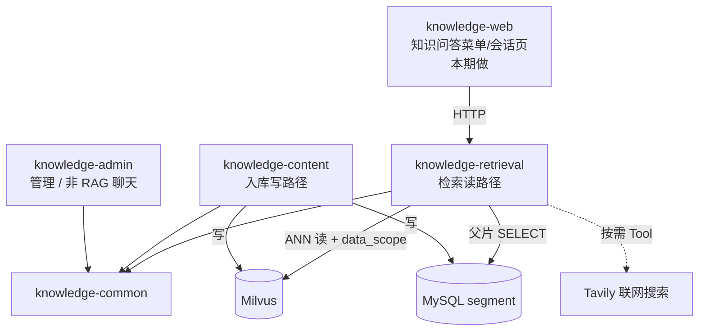
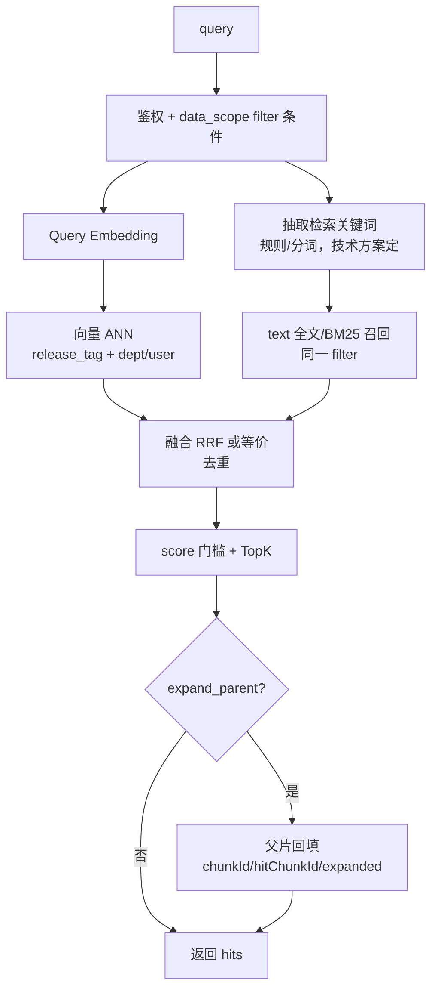
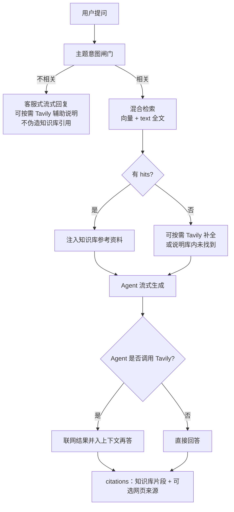

# 知识检索与 RAG 问答需求设计

> 状态：**需求讨论已收口**；OpenSpec change `knowledge-retrieval-service` **已对齐并进入实现**  
> 配套 OpenSpec：`openspec/changes/knowledge-retrieval-service/`（与本文决议一致）  
> 上游依赖：`docs/rag/文档切分与向量化/01-需求设计.md`（写路径已就绪，读路径为本期）  
> 外部对照：KnowEngine 智能问答业务流（意图→路由→多源检索→人设回答）——**仅作流程参考，不照搬业务场景**
> 
> 实现落点：`knowledge-retrieval`（9101）混合检索 + 知识问答；Milvus DDL/迁移见 `sql/milvus/`；菜单种子见 `sql/upgrade_knowledge_retrieval.sql`。
---

## 一、需求背景与目标

### 1.1 背景

切分与向量化已把 Markdown 写入 Milvus，并具备 `release_tag`（`canary` / `prod` / `pending_delete`）与父子分段元数据。当前缺口是：

1. **没有检索读路径业务**：`KnowledgeMilvusClient.search()` 仅基建，无生产调用方。
2. **现有聊天不接地**：`knowledge-admin` `/ai/chat`、爬虫 Agent 聊天均不读知识库。
3. **写服务不宜再堆读逻辑**：`knowledge-content` 已承担上传、爬取、切分、向量化、发布；检索若继续塞入，职责与生命周期会继续混杂。

因此需要独立「检索 / RAG」后端，把「问 → 找材料 →（可选）回答」落清楚。

### 1.2 与上游阶段的关系


| 阶段 | 内容 | 状态 |
|------|------|------|
| 切分 + 向量化 + release_tag | canary 写入、prod 发布 | **已完成** |
| **独立检索服务 + 知识问答前端** | 主题闸门、**混合检索**、RAG 多轮、Tavily、向量侧 data_scope | **本期做** |
| 体验与评测增强 | RAGAS、灰度比例配置、监控看板、交叉精排等 | 后续 |
| 增强召回（再增强） | 改写、多源路由等 | 明确后置 |
| 知识图谱 | 文档链接图 / 领域实体关系 / Text2Cypher | **已决议后置** |

### 1.3 目标（讨论基线）

1. 新建后端包 **`knowledge-retrieval`**（形态对齐 `knowledge-content`：独立 FastAPI 进程 + workspace 成员）。
2. 检索相关后端编排**全部**放在该包；`knowledge-common` 只复用基建（Milvus、Embedding/LLM 工厂、鉴权中间件等）。
3. 主流量按 **`release_tag=prod`** 过滤；允许传 `releaseTag` / `taskId`（调试与 RAGAS）。
4. 命中子段后可按 `parent_chunk_id` **回填父全文**（入库侧已具备数据能力）。
5. **检索 = 混合召回（向量 + 关键词）+ LLM/Agent 流式回答**；另提供 search API 供评测/调试。
6. **主题意图闸门（已拍板）**：字典主题；相关才进库检索；不相关客服式回复（可按需 Tavily）。
7. **数据权限（已拍板）**：Milvus 冗余 `dept_id` + `user_id`，检索按 data_scope filter。
8. **混合检索（已拍板 L1）**：利用已存 `text` 做关键词/全文召回，与向量召回融合后再精选。

### 1.4 范围边界

| 类别 | 说明 |
|------|------|
| **拟包含（后端）** | 新包脚手架；字典主题闸门；**混合检索（向量 + 关键词/全文）**；RAG 流式问答；复用 Agent 会话/消息多轮；Tavily Tool；系统参数 `rag.tavily.api_key`；`release_tag`；TopK/门槛；父片回填；引用；向量侧 data_scope；权限字；字典种子；启动脚本 |
| **拟包含（前端）** | 新菜单 + 聊天页（参考爬虫会话）；不新建会话表 |
| **连带改造（写路径/库表）** | Milvus：`dept_id`/`user_id` + **`text` 全文/BM25（或等价）索引**；content upsert；存量回填或重嵌/重建 collection |
| **本期不做 UI** | 灰度比例配置页、RAGAS 看板、监控看板 |
| **明确不做（一期）** | 图谱；Text2SQL；上传/爬取打 topic；汽车七分类 |
| **禁止** | 从 retrieval 触发切分/发布切换；真实 Tavily Key 不得进仓库/初始化 SQL |
| **依赖** | 向量与 embedding 适配；JWT + data_scope；Tavily Key 自行在参数设置填写 |

---

## 二、要解决的用户问题

| 角色 | 诉求 | 一期如何满足 |
|------|------|--------------|
| 知识库使用者 | 用自然语言问文档里的内容，得到有依据的答案 | 检索命中片段；若做 RAG 则流式回答并带引用 |
| 研发 / 评测 | 验证「某批 canary 向量好不好」 | 传 `releaseTag=canary`，可选 `taskId`（调试/RAGAS） |
| 运维 | 读写隔离、可独立启停扩容 | 独立进程与端口 |
| 管理员 | 控制谁能搜 / 谁能问 | 权限字（菜单可后补） |

**不是一期目标**：多业务库路由、图谱、替代 Admin 通用闲聊。允许知识问答 Agent **带少量 Tool**（知识库检索 + Tavily 辅助搜索）。

---

## 三、总体架构与职责

### 3.1 多包分工（目标态）



| 包 | 职责 |
|----|------|
| `knowledge-content` | 上传/爬取/切分/向量化/发布；**写** Milvus & segment（含 `dept_id`/`user_id` 冗余） |
| `knowledge-retrieval` | 主题闸门、混合检索、RAG/Tavily Tool、**业务 Agent 组装**；复用 common 会话与事件流基座 |
| `knowledge-common` | Milvus Client、Embedding/LLM 工厂、鉴权、中间件、事务；**Agent 会话/消息 CRUD 基座**；**Agent 聊天 SSE/事件流运行时基座** |
| `knowledge-admin` | 用户权限、通用 AI 聊天（不接知识库） |
| `knowledge-web` | **本期**：知识问答菜单 + 会话页（参考爬虫聊天）；调 retrieval API |

### 3.2 与 KnowEngine 的对照（避免误解）

| KnowEngine | 本系统一期倾向 |
|------------|----------------|
| 意图识别 → 问题改写 → 三路路由 | **做简化版主题闸门**（见 4.0）：对照「已导入主题」判相关否；不做七分类/改写/多源路由 |
| ES 向量 + 全文 | **Milvus 稠密向量 + text 全文/BM25 混合**（本期 L1） |
| MySQL Text2SQL / Neo4j | **不做** |
| RRF + BGE 精排 | **做 RRF 融合**（混合两路）；BGE 交叉精排仍后置 |
| 多角色人设回答 | 单一 grounded 助手即可 |
| 进度条 / 选车卡片 | **不做** |

可借鉴的是流水线清晰度：**检索与生成分层、失败可降级、引用可追溯**——实现形态按我们的数据面来。

---

## 四、用户与系统主流程

### 4.0 主题意图闸门（已采纳方向）

**问题**：库里同时有 Milvus 技术文、CPU 相关文等。若对「今天天气怎么样」或完全无关问题也去向量检索，容易捞到弱相关片段，再交给 LLM 反而有害。

**目标行为**：

```
字典主题（一期）= { Milvus技术, AI制作, LangChain, LangGraph }
用户问题
   → 意图：是否与上述主题之一相关？
        ├─ 否 → **不检索**；LLM **客服式回复**（礼貌说明当前知识库主题范围、可引导用户改问相关问题；禁止假装引用了文档）
        └─ 是 → **混合检索**（向量 + 关键词）→ Agent 基于资料回答（可按需 Tavily）
```

示例：

| 用户问题 | 闸门 | 是否检索 | 回复形态 |
|----------|------|----------|----------|
| HNSW 的 M 怎么设？ | 相关 → milvus | 是 |  grounded RAG |
| LangGraph 子图怎么流式？ | 相关 → langgraph | 是 | grounded RAG |
| 今天中午吃什么？ | 不相关 | 否 | 客服式（说明不在知识库主题内，可提示可问的主题） |
| CPU 伪共享？（字典暂无 cpu） | 不相关 | 否 | 客服式（同上，不编造 CPU 资料引用） |

**主题从哪来（已拍板：系统字典，不改上传/爬取）**：

意图对照的是 **字典维护的主题列表**（运营/管理员增删），**不**从文档表动态 DISTINCT，也**不**为此改造上传/爬取打标。

| 项 | 约定 |
|----|------|
| 载体 | 若依风格 **系统字典**（如 `rag_retrieve_topic`） |
| 一期初始值 | `milvus`（Milvus 技术）、`ai_production`（AI 制作）、`langchain`、`langgraph`（字典标签可中文，值用稳定 code） |
| 与文档关系 | 一期 **文档不强制绑 topic**；闸门只回答「像不像这些主题之一」 |
| 明确不做（本期） | 上传/爬取加 topic 字段、知识库分组改造、按 topic 过滤 Milvus |

后续若串台严重，再考虑文档绑 topic + `filter`；本期优先少动存量。

**闸门输出（建议）**：`{ related: bool, topics: [], confidence }`；`related=false` 时整条 RAG **跳过 Milvus**。

**与「只靠分数门槛」的关系**：threshold 仍建议保留（相关主题内也可能搜空/分低）；闸门解决的是 **主题外问题根本不进库**，二者互补。

### 4.1 检索主流程（相关通过后）—— **混合检索**



要点：

- **两路都要带** `release_tag` + data_scope（`dept_id`/`user_id`）过滤，避免关键词路绕过权限。
- 融合默认 **RRF**（实现可配置）；对外仍统一 `score`（融合分或归一化分，技术方案写清）。
- 关键词抽取失败/为空时：**降级为仅向量检索**，不阻断。
- DDL：为 `text` 增加全文/BM25（或 Milvus 稀疏检索等价能力）；可能需重建 collection / 重嵌——写路径与迁移在技术方案落地。
### 4.2 RAG 问答流程（主路径，已拍板）

用户侧主交互即「提问 → 流式回答」；内部为 **主题闸门 →（相关则）知识库检索 → Agent 生成**；生成阶段 Agent **可按需**调用 **Tavily** 补全实时/库外信息。



### 4.2.1 Tavily 辅助搜索 Tool（已拍板）

| 项 | 约定 |
|----|------|
| 是什么 | [Tavily](https://tavily.com)——面向 LLM/Agent 的联网搜索，提供实时检索结果 |
| 形态 | 注册为 Agent **Tool**（如 `tavily_search`）；**由 Agent 决定是否调用**，不是每问必搜 |
| 用途 | 知识库不足、需要时效/补充背景时，**辅助补全回答**；不替代 Milvus 作为主知识源 |
| 相关主题且库内有命中 | 优先用库内资料；Agent 仍可决定再搜网补全 |
| 相关但库内空 | 可搜网补全，并明示哪些来自联网、哪些来自知识库 |
| 主题不相关 | 客服式回复；Agent **可以**按需搜网帮忙，但**不得**把网页内容标成「知识库文档引用」 |
| 配置 | 系统参数 `rag.tavily.api_key`；**初始化不写真实 Key，需管理员自行更新**；禁止进 git / 需求正文 / 前端 |
| 失败 | Tavily 超时/失败/未配置 Key 时降级：仅用已有知识库上下文或客服说明，不阻断整会话 |
### 4.3 数据只读边界

| 资源 | 允许 | 禁止 |
|------|------|------|
| Milvus `knowledge_document_vector` | search / query | insert / 改向量 / 误删 prod |
| MySQL `knowledge_document_segment` | SELECT（父片、补全文） | 改 `release_tag`、删 segment |
| Embedding / Chat 模型 | 推理调用 | 改适配配置写库（只读配置） |
| Embedding Task / Publish API | — | 任何调用 |

---

## 五、功能需求

### 5.1 服务脚手架

| 项 | 需求 |
|----|------|
| 包名 | `knowledge-retrieval`（若有异议见第九章） |
| 形态 | 对齐 content：`main.py` + `server/server.py` + controller/service/vo |
| 端口 | 建议默认 **9101**（可 env 覆盖） |
| lifespan | Redis / DB / 字典与参数缓存 / 中间件 / 鉴权；**默认不**挂 embedding 消息消费者；按需初始化 Agent Checkpointer（若基座要求） |
| 启动 | `scripts/start-retrieval.sh` + workspace `uv` 成员 |
| **复用约束** | **会话 CRUD、消息落库、SSE 事件流处理不得从 0 重写**；必须基于 `knowledge-common` 已有 Agent 会话与 runtime 基座（与网页爬虫同一套），本包只扩展 `agent_type` + 业务图/Tool/检索编排 |

### 5.2 检索 API（混合检索）

**能力：**

1. 输入自然语言 `query`，输出融合排序后的知识片段列表。
2. **混合召回**：Query Embedding 走向量 ANN + 从问题抽取关键词走 `text` 全文/BM25（或等价）；两路结果 **RRF（或等价）融合去重**。
3. 使用与写入一致的 `document_embedding` 模型与维度。
4. 默认 `release_tag=prod`；支持覆盖为 `canary`；可选 `taskId`（调试/RAGAS）。
5. 两路召回均带 data_scope（`dept_id`/`user_id`）与 `release_tag`（及可选 `taskId`）过滤。
6. 支持 `top_k`（默认 **5**）、`score` 门槛（默认 **0.5**，可覆盖；后续 RAGAS 再调）。
7. 支持 `expand_parent`（默认 true）：父正文替换 + `chunkId`/`hitChunkId`/`expandedFromChild`。
8. 关键词抽取失败或全文路不可用时：**降级为仅向量**，不阻断。
9. 无命中：业务成功 + 空列表；空 query：校验失败。

**命中字段（建议最小集）：**

| 字段 | 说明 |
|------|------|
| `doc_id` | 文档 ID |
| `chunkId` / `hitChunkId` / `expandedFromChild` | 见父片回填约定 |
| `score` | 融合后分数，越大越相关 |
| `text` | 展示/注入正文（可能已是父全文） |
| `doc_title` / `doc_version` | 展示冗余 |
| `release_tag` | 实际过滤标签 |
| `file_id` / `task_id` | 可选，便于排查 |

### 5.3 父片回填

| 规则 | 说明 |
|------|------|
| 数据前提 | 子段 `parent_chunk_id` 非空；父段在 MySQL（父段通常 `skip_embedding=1`） |
| 开启时 | **用父段全文替换**该 hit 的主 `text` |
| 关闭时 | 直接用子段/Milvus text |
| 引用 id | `chunkId`=父（主引用）；`hitChunkId`=子命中；`expandedFromChild` 标明是否已父片替换 |

### 5.4 RAG 流式问答（主路径）

| 规则 | 说明 |
|------|------|
| 定义 | **主题闸门 →（相关则）向量召回 → Agent 回答**；Agent 可按需调用 Tavily；search API 供评测/调试 |
| 编排位置 | 必须在 `knowledge-retrieval`，不复用 admin `AiChatService` 拼检索 |
| 生成约束 | 知识库资料优先；联网结果须标明来源类型；禁止把网页内容说成已导入文档；无命中/不相关须明示 |
| 输出 | SSE；正文 + citations（知识库）+ 可选网页来源 |
| 会话 | 复用 `knowledge_agent_session` / `knowledge_agent_message` 多轮；见 F |

### 5.4.1 主题意图闸门

| 规则 | 说明 |
|------|------|
| 输入 | 用户问题 + **字典中的主题列表**（缓存可读，与现有 DictData 一致） |
| 输出 | 是否相关；可选命中的 topic code 列表 |
| 不相关 | **禁止**调用向量检索；LLM **客服式流式回复**；可按需 Tavily；**禁止**捏造知识库 citations |
| 相关 | 进入 Milvus 检索；一期 **不按 topic 过滤**向量（全局 ANN）；串台再迭代 |
| 不做 | 汽车式多意图；不点名 `doc_id`；**不改造上传/爬取绑主题**；不相关时冷淡一句了事 |

### 5.4.2 Tavily Tool

| 规则 | 说明 |
|------|------|
| 注册 | 知识问答 Agent 工具集包含 `tavily_search`（名称以实现为准） |
| 决策 | **模型决定**是否调用、搜什么 query；应用层不强制每轮搜索 |
| 参数 | 遵循 Tavily API 常规（query、可选 max_results 等）；默认结果条数宜少（如 3～5）以控延迟与费用 |
| 密钥 | **系统参数** `rag.tavily.api_key`：初始化 SQL **只插占位空值或「请自行在参数设置中填写」类说明，禁止写入真实 Key**；管理员自行在「参数设置」更新；运行时 `ConfigService` 读取 |
| 未配置 | Key 为空或仍为占位 → Tool 不可用 / 调用返回友好错误；Agent 降级不联网 |
| 安全 | **对话中提供的 Key 不得写入仓库、需求、SQL、日志**；操作日志对参数值脱敏；接口不回传 Key |
| 观测 | 日志记录是否调用、耗时、失败码（**不打完整 Key**） |

### 5.5 鉴权

| 权限字（草案） | 用途 |
|----------------|------|
| `rag:retrieve:query` | 检索 API |
| `rag:retrieve:chat` | RAG 聊天 API |

菜单种子可后补；无菜单时接口鉴权仍生效。

### 5.6 可观测（最小）

日志/埋点建议字段：`trace_id`, `query`(截断), `release_tag`, `hit_count`, `top_score`, `latency_ms`, `empty_hit`。  
完整看板与 RAGAS **不进一期交付**，只预留字段习惯。

---

## 六、非功能需求

| 项 | 要求 |
|----|------|
| 一致性 | Query embedding 与入库模型一致，禁止 silent 换模导致「全库搜不准」 |
| 安全 | 只读向量与 segment；默认不搜 `pending_delete` |
| 隔离 | 独立进程；故障不拖垮 content 入库 |
| 性能 | 父片批量回表；避免逐 hit 单查（实现约束） |
| 兼容 | 不破坏现有 embedding / publish 行为 |

---

## 七、接口轮廓（讨论用，非终稿）

> 路径前缀、字段名可在技术方案阶段微调。

### 7.1 检索

```
POST /retrieval/search
Authorization: Bearer …

{
  "query": "零重力座椅怎么开？",
  "topK": 5,
  "scoreThreshold": 0.5,
  "releaseTag": "prod",
  "taskId": null,          // 可选；调试 / RAGAS 验证时钉死 embedding 任务批次
  "expandParent": true
}
```

成功：`{ "hits": [ { "docId", "chunkId", "hitChunkId", "expandedFromChild", "score", "text", "docTitle", ... } ] }`  
（`chunkId` 为父/展示段；`hitChunkId` 为向量命中子段；`expandedFromChild=true` 表示已父片替换）

### 7.2 RAG 流式（若做）

```
POST /retrieval/chat/stream
{
  "question": "…",
  "topK": 5,
  "releaseTag": "prod",
  "taskId": null,        // 可选；调试 / RAGAS 验证用
  "history": []
}
```

事件草案：`meta` → `citations` → `content` 增量 → `done`（具体对齐现有 SSE 习惯再定）。

---

## 八、验收标准（草案）

1. `knowledge-retrieval` 可独立启动，不启动 embedding 消费。
2. 对已 `prod` 的文档提问，search 能返回相关片段；对仅 `canary` 默认搜不到，显式 `canary` 可搜到。
3. 含子段命中且回填开启时：`text` 为父全文，`chunkId` 为父，`hitChunkId` 为子，`expandedFromChild=true`。
4. 主题不相关：客服式回复（无 citations）；空命中：明确未找到资料；均不 5xx、不假引用。
5. 无接口权限或数据权限外的文档：不可作为命中返回。
6. **前端**：知识问答菜单与会话页可用（参考爬虫），多轮历史可展示。
7. 检索业务不出现在 `knowledge-content` 编排层或 admin AiChat 内。

---

## 九、已拍板决议汇总

> 原「待讨论」项均已定稿；实现细节见后续技术方案。

### A. 检索 = 向量 + LLM/Agent —— **已拍板**

- 主路径：主题闸门 → **混合检索** → Agent 流式回答（`knowledge-retrieval`）。
- Agent 可按需调用 **Tavily** 辅助联网搜索以补全回答。
- 另保留 search API（评测/调试/内部复用）。

### L. 混合检索 —— **已拍板：L1 本期上**

- 向量 ANN + `text` 关键词/全文（BM25 或等价）两路召回，**RRF（或等价）融合**。
- 需改 Milvus DDL：为 `text` 建全文/稀疏检索能力；可能重建 collection / 重嵌。
- 关键词抽取方案（分词/规则）与融合参数交技术方案；抽取失败则降级纯向量。
- 两路均受 `release_tag` + data_scope 约束。
- **挂载方式**：作为单 Agent 图的**条件前置中间件**（`need_retrieve=true` 时执行，见 M），不是图内独立节点。

### M. Agent 图结构 —— **已拍板：单 Agent + 路由选提示词/是否检索**

**决议（修正双 Agent 方案）**：同一会话只跑 **一张图、一个 Agent**，避免两套图抢 Checkpointer。

**`topic_gate` 仍不进图**：图外路由 LLM，输出用于：

1. **加载哪套提示词**（客服 / 知识问答）  
2. **本轮是否做混合检索**（相关才检索；不相关跳过）

```
用户消息
    │
    ▼
 topic_gate（图外路由 LLM）
    │  输出：prompt_profile + need_retrieve + topics
    │
    ▼
┌────────────────────────────────────────┐
│  单一 Knowledge QA Agent 图             │
│                                        │
│  START                                 │
│    │                                   │
│    │ «middleware（条件）」               │
│    │  need_retrieve=true               │
│    │    → hybrid_retrieve 注入上下文     │
│    │  need_retrieve=false              │
│    │    → 跳过检索                      │
│    │  并按路由结果切换 system prompt     │
│    ▼                                   │
│  qa_agent（ReAct / create_agent）       │
│    tools: [tavily_search, …]           │
│    │                                   │
│    ▼                                   │
│  END                                   │
└────────────────────────────────────────┘
```

| 组件 | 位置 | 职责 |
|------|------|------|
| `topic_gate` | 图外 | 选提示词 + 是否检索 |
| `hybrid_retrieve` | 条件前置中间件 | 仅 `need_retrieve` 时跑混合检索 |
| `qa_agent` | 唯一图节点 | 按已选提示词回答；可调 Tavily |
| 会话 / Checkpointer | 单 `agent_type` + 单 `thread_id` | 无双图冲突 |

**明确不做**：双 Agent 图按轮切换；deepagents 多 Worker / HITL。

### B. 包名 / 端口 —— **已拍板**

- 包名：`knowledge-retrieval`；端口：`9101`（env 可覆盖）。

### C. 父片回填 —— **已拍板**

- 正文用父全文替换子 text。
- `chunkId`=父；`hitChunkId`=子；`expandedFromChild` 标明是否已替换。

### D. 分数与门槛 —— **已拍板**

- 对外 `score` 越大越相关；默认 `top_k=5`，`score_threshold=0.5`（可配；后续 RAGAS 再调）。

### E. 灰度参数 —— **已拍板**

- 默认 `releaseTag=prod`；允许传 `releaseTag`；允许传 `taskId`（**调试 / RAGAS 验证**，注释写清）；不做流量百分比。

### F. 前端 / 会话 —— **已拍板（本期做；复用 common 基座）**

- **改 `knowledge-web`**：新菜单 + 会话页，参考爬虫聊天。
- **会话 / 消息不新建表**：复用 `knowledge_agent_session` / `knowledge_agent_message`，新 `agent_type`。
- **后端不 0→1 写会话与事件流**：
  - 会话 CRUD → 复用 `AgentSessionService` 等 common 基座（对齐 crawler 用法，换 `agent_type`）。
  - 发消息 SSE / 历史消息 / 事件流处理 → 复用 common Agent runtime（如 `AgentChatService` / chat_service 事件流范式）。
  - `knowledge-retrieval` 只做：**注册本业务 Agent（闸门、混合检索、Tavily Tool、prompt）+ 薄 Controller 挂路由**。
- 前端调 `knowledge-retrieval` API（路径可与 crawler 同构）。

### G. 与 Admin 聊天 —— **已拍板**

- Admin 通用聊天保留；知识问答走新菜单 + retrieval（本期接前端）。

### H. 文档权限 —— **已拍板**

- Milvus 冗余 `dept_id` + `user_id`；检索按 data_scope filter；content 写路径同步写入。

### I. 知识图谱 —— **已拍板：一期不做**

### J. 主题列表 —— **已拍板：系统字典**

- 种子：`milvus` / `ai_production` / `langchain` / `langgraph`；不大改上传/爬取。

---

## 十、与 OpenSpec 草案的关系

已有 change：`openspec/changes/knowledge-retrieval-service/`（proposal / design / specs / tasks）。

- **不回滚**；本文为需求定稿。
- OpenSpec change `knowledge-retrieval-service` 已按本文对齐（proposal / design / specs / tasks）。
- 下一步：`/opsx:apply` 或按 tasks 实现。

---

## 十一、参考

- 切分向量化需求：`docs/rag/文档切分与向量化/01-需求设计.md`
- 切分向量化技术：`docs/rag/文档切分与向量化/02-技术方案.md`（§4A 检索 filter 约定）
- OpenSpec 草案：`openspec/changes/knowledge-retrieval-service/`
- 外部对照：KnowEngine《智能问答：业务流与技术说明》（桌面 `retrieval-flow-analysis.md`）
- 爬虫会话参考：`knowledge_agent_session` / web crawler chat 前端