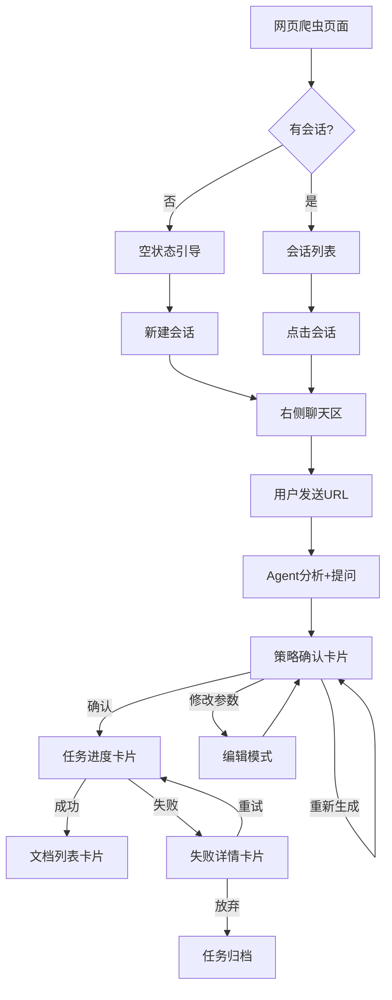
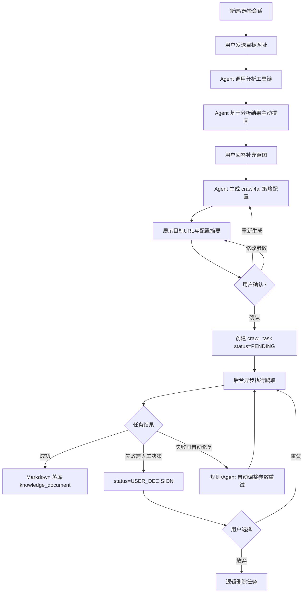

# 网页爬取 Agent — 需求设计

> **相关文档**
> - [02-技术选型](./02-技术选型.md) — 技术栈、大模型选型、Agent 架构模式选型
> - [03-架构设计](./03-架构设计.md) — Agent 架构、工具链、策略生成、LangGraph 状态图、数据压缩
> - [04-交互流程设计](./04-交互流程设计.md) — 流程全景、状态机、消费者与定时任务
> - [05-用户操作交互时序图](./05-用户操作交互时序图.md) — 关键场景时序图
> - [06-数据库设计](./06-数据库设计.md) — ER 图、建表语句、版本管理
> - [07-后端接口设计](./07-后端接口设计.md) — API 列表与出入参设计

---

## 一、需求背景与目标

### 1.1 背景

随着 RAG（检索增强生成）知识库建设的深入，系统需要持续补充高质量的 Markdown 格式数据源。当前知识库数据主要依赖人工整理与单文件上传，来源单一、入库效率低，难以支撑对公开网站、技术文档站、产品博客等整站内容的自动化采集。

网页爬取技术存在较高门槛：crawl4ai 涉及深度爬取策略（BFS/DFS/BestFirst）、URL 过滤链、反爬对抗、代理轮换、HTML 解析、缓存配置、Hook 注入等七大配置主题，普通用户难以理解这些技术参数的含义和抉择。

为扩展知识来源、降低人工录入成本，需要建设一套**爬取顾问型 Agent**：用户仅提供目标网址，Agent 自动执行站点预分析（robots.txt、sitemap、页面结构、反爬检测），基于分析结果主动向用户发起业务导向的提问（如板块选择、范围限定），而非要求用户提供技术参数。Agent 根据分析结果与用户回答，自动生成完整的 crawl4ai 爬取策略配置，经用户确认后提交后台异步任务执行，最终将爬取结果 Markdown 落库，纳入统一的 `knowledge_document` 文档主表管理。

### 1.2 目标

- 前端新增「知识管理 → 网页爬虫」独立页面，支持会话式 Agent 交互、策略确认、任务进度感知与结果管理。
- 后端在 `knowledge-content` 中实现基于 LangGraph + crawl4ai 的整站爬取 Agent：
  - Agent 作为「爬取顾问」，通过站点预分析 + 主动提问引导用户完成 crawl4ai 七大配置主题的策略生成；
  - 5 个分析工具（`fetch_robots_txt`、`fetch_sitemap`、`fetch_page`、`test_anti_crawling`、`analyze_url_patterns`）作为 LangGraph Tool 注册，返回结构化 JSON；
  - 大模型选用 Qwen-Plus，通过 LangChain `ChatTongyi` 接入；
  - crawl4ai 负责实际整站爬取与结构化 Markdown 输出；
  - 爬取结果写入 MinIO，并生成 `knowledge_document` 记录。
- 对话阶段（策略生成）与执行阶段（爬取任务）解耦：对话通过 SSE 流式响应，爬取通过后台异步任务执行。
- `knowledge-common` 提供 `ai_models` 等共享模型配置能力，`knowledge-admin` 保留模型管理入口。
- 本次范围不涉及 embedding 与文档分块的具体实现，但表结构需预留扩展字段。

### 1.3 范围边界

| 范围 | 说明 |
|------|------|
| 包含 | 网页爬虫页面、LangGraph Agent、crawl4ai 爬取执行、任务状态管理、爬取结果落库、文档版本管理 |
| 不包含 | embedding 计算、文档分块、向量库写入、检索排序逻辑 |
| 依赖 | `knowledge-admin` 的 AI 模型配置、`knowledge-common` 的共享 DO/DAO/VO/消息流 |

### 1.4 模块职责

| 模块 | 职责 |
|------|------|
| `knowledge-web` | 新增「知识管理 → 网页爬虫」独立页面；通过代理访问 `knowledge-content` 接口 |
| `knowledge-content` | LangGraph Agent、crawl4ai 爬取执行、任务状态更新、文档落库；复用资料上传的 MinIO 服务、文档落库逻辑、版本管理接口 |
| `knowledge-admin` | 保留 AI 模型管理页面，模型配置共享给 `knowledge-content` |
| `knowledge-common` | 兼容层：共享 `ai_models` DO/DAO/VO、消息流基础设施、MinIO/Redis 通用能力 |

#### 复用组件说明

网页爬取功能复用资料上传的以下组件：

| 组件 | 说明 |
|------|------|
| `KnowledgeMinioService` | MinIO 文件上传、下载、删除等操作 |
| `KnowledgeDocumentDao` | 文档主表 CRUD 操作 |
| `/document-parse/next-version` | 版本号预生成接口 |
| `DocumentSourceType` | 文档来源类型枚举（手动上传/网页爬取） |
| `DocumentStatus` | 文档状态枚举（CONVERTED/CHUNKED/VECTOR_STORED） |

---

## 二、前端页面需求

### 2.1 菜单结构

```
知识管理
├── 网页爬虫
├── 资料上传
└── embedding（占位）
```

### 2.2 网页爬虫页面

页面采用「左侧会话列表 + 右侧聊天区」布局。

#### 2.2.1 会话管理模块

- 新建爬取会话（调用 `POST /api/rag/crawler/session`）。
- 历史会话列表分页展示，支持按标题搜索（调用 `GET /api/rag/crawler/session/list`）。
- 点击会话加载历史消息并继续对话（调用 `GET /api/rag/crawler/session/{session_id}/messages`）。
- 会话重命名（调用 `PUT /api/rag/crawler/session/{session_id}`）。
- 删除会话（调用 `DELETE /api/rag/crawler/session/{session_id}`，级联软删除消息）。
- 会话状态展示：`ACTIVE` / `CLOSED`。

#### 2.2.2 Agent 聊天区模块

- 消息输入框：支持多行文本与换行。
- 发送消息：将 `user` 消息入库，并触发 SSE 流。
- SSE 流式返回 AI 回复（调用 `POST /api/rag/crawler/chat`）。
- Agent 交互流程：
  1. 用户发送目标网址后，Agent 调用分析工具链（`fetch_robots_txt`、`fetch_sitemap` 等），工具调用过程以 `tool` 角色消息实时展示。
  2. 分析完成后，Agent 基于结果主动提问引导用户补充意图（如「您希望爬取哪些板块？」「需要下载图片吗？」）。
  3. 用户回答后，Agent 生成完整的 crawl4ai 策略配置摘要，展示为结构化卡片。
  4. 用户确认后，对话阶段结束，进入后台任务执行阶段。
- 工具调用可视化：Agent 调用分析工具时，前端以折叠卡片展示工具名称、输入参数、返回结果（`tool` 角色消息）。
- 停止生成：前端中断 SSE 连接，已接收内容可选择性保存为不完整 `assistant` 消息。
- 重新生成最后一条回复：重新调用 SSE 接口。
- 模型选择下拉：从 `knowledge-admin` 已配置模型中选择，写入 `web_crawler_session.model_id`。
- 消息角色区分渲染：`user` / `assistant` / `system` / `tool`。
- Markdown / 代码块渲染。
- 复制单条消息。
- 清空当前会话消息（仅前端清空，可保留后端记录）。

#### 2.2.3 爬取策略确认模块

- Agent 分析用户意图后展示目标 URL。
- **重复爬取限制**：若当前会话已存在该 URL 的成功爬取记录（状态为 `COMPLETED` / `CONVERTED`），提示用户「该网址已在本会话中爬取成功，请新建聊天框处理」，不允许重复提交任务。
- 展示生成的 crawl4ai 配置摘要（爬取深度、FilterChain、反爬参数等）。
- 用户可选择「确认配置」「重新生成」「修改参数」：
  - **确认配置**：方案满意，提交后台爬取任务（调用 `POST /api/rag/crawler/task`），对话阶段结束，进入执行阶段。
  - **重新生成**：对整体方案方向不满意，让 Agent 重新推理生成一版新方案（回退到「生成整体方案」步骤，会再消耗 1 次 LLM 调用）。适用场景：Agent 推荐的爬取策略、深度、范围等整体方向不符合预期。
  - **修改参数**：对方案方向认可，但想手动微调个别参数值（回退到「展示策略摘要」步骤，不消耗 LLM）。前端将配置摘要渲染为可编辑表单，用户可直接修改第二类配置参数（如 `max_pages`、`include_patterns`、`extract_media` 等），修改后重新展示摘要供确认。
- 确认前支持多轮「重新生成」和「修改参数」迭代，直到用户满意为止。
- 确认后提交后台爬取任务（调用 `POST /api/rag/crawler/task`）。

#### 2.2.4 任务进度与结果模块

右侧主内容区顶部提供 Tab 切换：「聊天」/「任务」。

**聊天 Tab**（默认）：
- 当前任务实时进度条：轮询 `GET /api/rag/crawler/task/{task_id}`。
- 任务状态展示：`PENDING` / `RUNNING` / `COMPLETED` / `FAILED` / `USER_DECISION`。
- 成功页面数 / 失败页面数展示。
- 当前执行步骤提示。

**任务 Tab**：
- 历史爬取任务列表，字段包括：
  - 任务 ID
  - 目标 URL
  - 任务状态（`PENDING` / `RUNNING` / `COMPLETED` / `FAILED` / `USER_DECISION`）
  - 成功页面数 / 失败页面数
  - 失败原因说明
  - 创建时间
  - 操作列：文档下载（`COMPLETED` / `CONVERTED` 状态可用）、查看详情
- 点击失败任务详情 → 跳转至聊天 Tab 消息流底部，展示任务卡片。

**失败任务处理**：
| 状态 | 跳转后展示 | 用户操作 |
|------|-----------|----------|
| `USER_DECISION` | 任务卡片：失败原因、已尝试修复、建议方案 | 「调整参数重试」/「放弃删除」 |
| `FAILED` | 任务卡片：失败原因 + 说明「Agent 已自动处理，无需人工干预」 | 仅查看，无操作按钮 |

**其他功能**：
- 爬取结果文档列表（调用 `GET /api/rag/crawler/document/list`）。
- Markdown 文档预览。
- 文档下载。
- 失败 URL 明细查看（调用 `GET /api/rag/crawler/task/{task_id}/failed-urls`）。

### 2.3 页面布局与组件规格

#### 2.3.1 整体布局

- 页面采用「左侧会话列表（宽度 280px）+ 右侧主内容区（自适应剩余宽度）」两栏布局。
- 左侧会话列表固定宽度，右侧主内容区占满剩余空间，支持小窗口自适应压缩。
- 左侧顶部为「新建会话」按钮，下方为会话列表滚动区域。
- 右侧顶部为当前会话标题栏，下方为聊天消息区，底部为输入操作区。

#### 2.3.2 会话列表区

- 会话卡片展示：会话标题、创建时间、状态标签（`ACTIVE` / `CLOSED`）。
- 会话卡片交互：
  - 悬停显示「重命名」「删除」操作按钮。
  - 点击会话卡片高亮选中，右侧加载对应消息历史。
  - 当前激活会话左侧显示选中指示条。
- 会话搜索：顶部搜索框，实时过滤会话列表（本地过滤或调用接口）。
- 会话分页：列表底部「加载更多」按钮或滚动到底部自动加载。
- 空状态：无会话时显示引导文案「新建会话开始网页爬取」。

#### 2.3.3 聊天消息区

- 消息气泡布局：
  - `user` 消息右对齐，浅色背景。
  - `assistant` 消息左对齐，深色/主题背景，支持 Markdown 渲染。
  - `system` 消息居中显示，灰色小字，用于系统通知。
  - `tool` 消息以折叠卡片展示，默认折叠状态，点击展开查看完整内容。
- 工具调用卡片：
  - 折叠态：显示工具图标 + 工具名称（如 `fetch_robots_txt`）+ 执行状态图标（成功/失败）。
  - 展开态：显示输入参数 JSON + 返回结果 JSON，代码块格式化，支持复制。
- 消息操作：
  - 每条消息悬停显示「复制」按钮。
  - `assistant` 消息支持「重新生成」按钮（仅最后一条可用）。
- 加载状态：Agent 回复中显示打字机光标动画，工具调用中显示 loading spinner。
- 滚动行为：新消息自动滚动到底部，用户手动上滚后暂停自动滚动，出现「回到底部」悬浮按钮。

#### 2.3.4 输入操作区

- 输入框：多行文本框，支持 Shift+Enter 换行，Enter 发送。
- 发送按钮：输入框右侧，内容为空时置灰禁用。
- 停止按钮：SSE 流式输出中替换发送按钮，点击中断 SSE 连接。
- 模型选择：输入框左侧下拉选择器，展示已配置模型列表，切换后更新会话 `model_id`。
- 输入框上方：显示当前会话状态提示（如有进行中的任务则提示「任务执行中...」）。

#### 2.3.5 策略确认卡片

- 卡片布局：独立消息卡片，展示在聊天区内，与普通消息区分。
- 卡片内容：
  - 标题行：「爬取策略配置」+ 目标 URL。
  - 配置摘要区：按七大配置主题分组展示参数，每组可折叠。
  - 参数标注：每个参数后标注来源标签（「用户选择」「自动适配」「固定默认」）。
- 操作按钮区：
  - 「确认配置」：主色调按钮，点击提交任务。
  - 「重新生成」：次级按钮，点击触发 Agent 重新推理。
  - 「修改参数」：次级按钮，点击进入编辑模式。
- 编辑模式：
  - 配置摘要变为可编辑表单，仅第二类参数可修改（`max_pages`、`include_patterns`、`exclude_patterns`、`extract_media` 等）。
  - 第三类参数（Agent 自动推导）和第一类参数（固定默认）以只读展示。
  - 修改后按钮变为「更新方案」，点击重新展示摘要供确认。
- 确认后卡片状态：展示为只读卡片，显示「已提交」标签 + 任务 ID 链接。

#### 2.3.6 任务进度区

- 进度展示位置：策略确认卡片下方，作为新的消息卡片插入聊天区。
- 进度卡片内容：
  - 状态标签：`PENDING`（黄色）/ `RUNNING`（蓝色）/ `COMPLETED`（绿色）/ `FAILED`（红色）/ `USER_DECISION`（橙色）。
  - 进度条：百分比 + 条形进度条，`RUNNING` 状态时动画刷新。
  - 当前步骤文字提示（如「正在爬取 /docs/api/ 路径...」）。
  - 统计数据：成功页面数 / 失败页面数，实时更新。
- 失败状态卡片：
  - 显示错误信息摘要。
  - 「查看失败 URL」按钮，点击展开失败 URL 列表（分页）。
  - 「重试任务」按钮（`FAILED` / `USER_DECISION` 状态可用）。
  - `USER_DECISION` 状态显示用户决策选项（「调整参数重试」「放弃删除」）。
- 成功状态卡片：
  - 显示爬取完成统计（总页面数、成功数、耗时）。
  - 「查看文档」按钮，跳转到文档列表。

#### 2.3.7 文档列表与预览

- 文档列表展示位置：任务进度卡片下方，作为新的消息卡片插入聊天区。
- 列表项内容：文档标题、文件名、版本号、创建时间、状态标签。
- 列表项操作：
  - 「预览」按钮：点击在右侧或弹窗中打开 Markdown 预览。
  - 「下载」按钮：点击下载 Markdown 文件。
- Markdown 预览：
  - 弹窗预览模式：点击「预览」弹出全屏 Modal，渲染 Markdown 内容。
  - 支持代码高亮、表格渲染、图片链接（如有）。
  - 弹窗底部：「下载」「关闭」按钮。

### 2.4 页面流转与状态转换

#### 2.4.1 主要页面流转路径



#### 2.4.2 会话切换行为

- 点击不同会话时，右侧聊天区清空当前消息，加载目标会话的消息历史。
- 切换会话时，若有未保存的输入内容，提示用户确认。
- 切换会话不影响后台进行中的任务，任务状态通过轮询持续更新。
- 新建会话自动选中并清空聊天区，显示欢迎语。

#### 2.4.3 任务状态页面跳转

| 当前状态 | 用户操作 | 跳转目标 | 说明 |
|---------|---------|---------|------|
| 空状态 | 点击「新建会话」 | 聊天区显示欢迎语 | 进入对话模式 |
| 对话中 | 发送 URL | Agent 分析流程 | SSE 流式展示 |
| 策略确认 | 点击「确认配置」 | 任务进度卡片 | 提交后台任务 |
| 任务执行中 | 轮询刷新 | 进度条实时更新 | 无需跳转 |
| 任务成功 | 点击「查看文档」 | 文档列表卡片 | 展示爬取结果 |
| 任务失败 | 点击「查看失败 URL」 | 失败 URL 列表弹窗 | 分页展示 |
| 任务失败 | 点击「重试任务」 | 任务进度卡片重置 | 重新执行 |
| USER_DECISION | 点击「调整参数重试」 | 策略确认卡片（编辑模式） | 修改配置后重试 |
| USER_DECISION | 点击「放弃删除」 | 确认弹窗 → 任务归档 | 逻辑删除任务 |
| 文档列表 | 点击「预览」 | Markdown 预览弹窗 | 全屏 Modal |

#### 2.4.4 弹窗与浮层规格

| 弹窗类型 | 触发方式 | 内容 | 操作 |
|---------|---------|------|------|
| 文档预览弹窗 | 点击文档「预览」按钮 | 全屏 Modal，Markdown 渲染区 | 下载、关闭 |
| 失败 URL 弹窗 | 点击「查看失败 URL」 | 分页表格：URL、错误码、重试次数 | 关闭 |
| 确认弹窗（放弃） | 点击「放弃删除」 | 二次确认文案 | 确认删除、取消 |
| 确认弹窗（清空消息） | 点击「清空会话消息」 | 二次确认文案 | 确认清空、取消 |
| 确认弹窗（删除会话） | 点击「删除会话」 | 二次确认文案 | 确认删除、取消 |

#### 2.4.5 加载与错误状态

| 场景 | 展示 | 交互 |
|------|------|------|
| 会话列表加载中 | 骨架屏或 loading spinner | 不可点击 |
| 消息历史加载中 | 聊天区居中 loading | 不可输入 |
| Agent 回复中 | 打字机动画 + 工具调用 loading | 显示「停止」按钮 |
| 网络错误 | Toast 提示 + 重试按钮 | 点击重试 |
| SSE 连接断开 | 消息区提示「连接已断开」 | 自动重连或手动重试 |
| 会话列表为空 | 引导文案 + 「新建会话」按钮 | 点击新建 |
| 消息列表为空 | 欢迎语 system 消息 | 正常输入 |
| 任务轮询失败 | 进度卡片显示「状态更新失败」 | 自动重试轮询 |

---

## 三、流程全景

> 详细流程设计见 [04-交互流程设计](./04-交互流程设计.md)



### 数据流转总览

| 核心表 | 作用 |
|--------|------|
| `web_crawler_session` | 存储 Agent 会话基本信息与状态 |
| `web_crawler_message` | 存储会话中的 user/assistant/system/tool 消息 |
| `web_crawler_session_task` | 会话与爬取任务的关联 |
| `web_crawler_message_task` | 消息与爬取任务的关联 |
| `crawl_task` | 存储爬取任务状态、进度、配置、结果统计 |
| `crawl_task_failed_url` | 存储爬取失败的 URL 明细 |
| `knowledge_document` | 爬取成功后生成的文档主表记录 |
