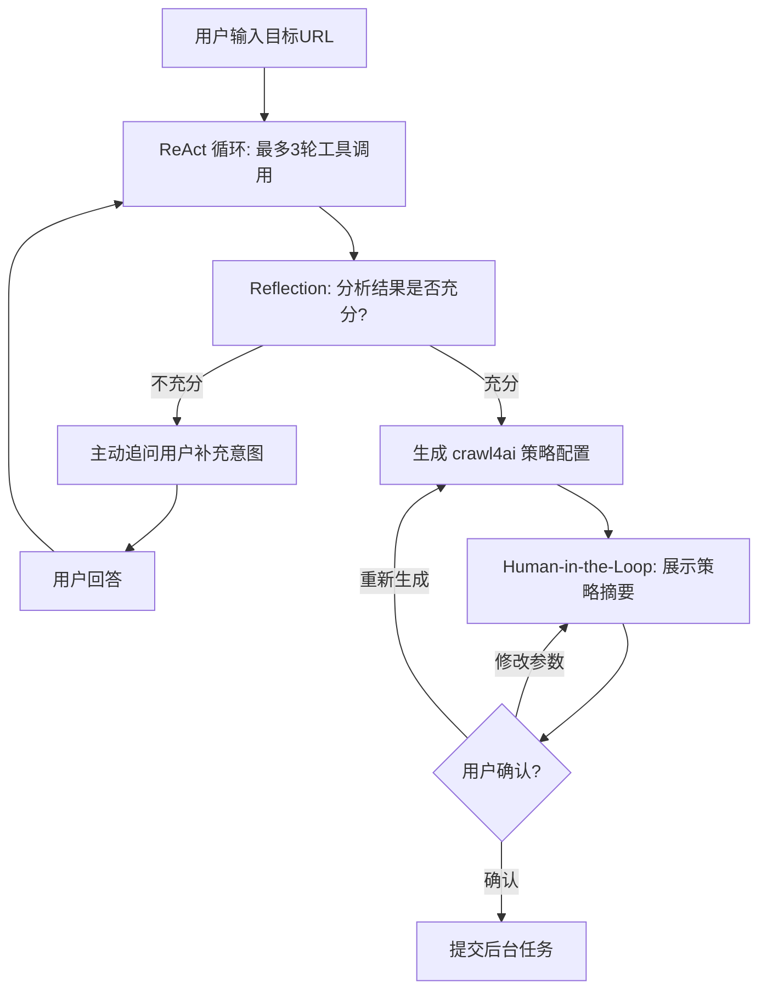
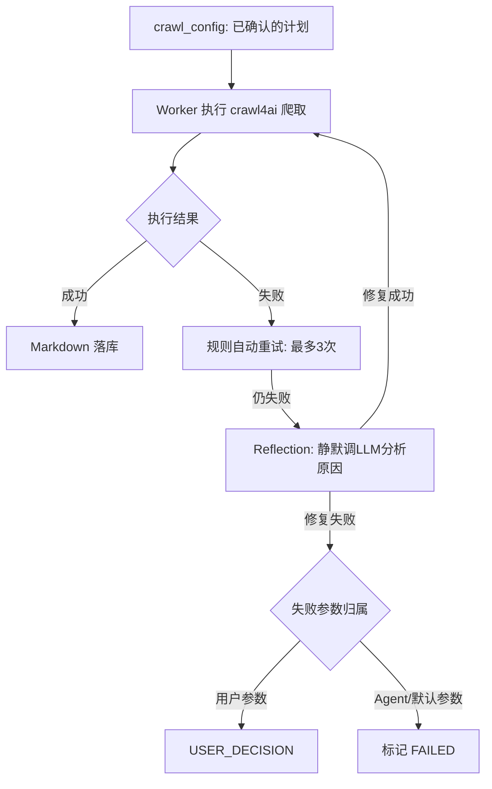

# 网页爬取 Agent — 技术选型

> **相关文档**
> - [01-需求设计](./01-需求设计.md) — 背景目标、前端页面需求
> - [03-架构设计](./03-架构设计.md) — Agent 架构、工具链、LangGraph 状态图

---

## 一、技术栈版本

| 依赖 | 版本约束 |
|------|---------|
| `crawl4ai` | `0.8.9` |
| `langchain` | `>= 1.2.15, < 2.0.0` |
| `langchain-openai` | `>= 1.1.13, < 2.0.0` |
| `langgraph` | `>= 1.1.6, < 2.0.0` |

## 二、大模型选型

Agent 选用 **Qwen-Plus**（通义千问 Plus），通过 LangChain `ChatTongyi` 接入：

| 维度 | 说明 |
|------|------|
| 工具调用 | 支持 function calling，稳定性好 |
| 中文理解 | 中文场景下推理能力强，适合生成中文提问和分析 |
| 成本 | 按量计费，性价比高 |
| 延迟 | 流式响应，对话体验流畅 |

## 三、Agent 架构模式选型

### 3.1 候选模式评估

对六种主流 Agent 架构模式进行评估后，采用**组合架构**策略，按阶段选用不同模式：

| 架构模式 | 原理 | 优点 | 缺点 | 是否采用 |
|---------|------|------|------|----------|
| **ReAct** | Think → Act → Observe 循环，每步动态决策 | 最灵活，工具返回影响下一步；LangChain 原生支持 | LLM 调用次数不可控；可能陷入循环 | **采用** |
| **Reflection** | 生成输出后自审质量，发现问题自动修正 | 输出质量高；自我纠错能力强 | 每步至少 2 次 LLM 调用，成本翻倍 | **采用（有限次）** |
| **Human-in-the-Loop** | 关键决策点暂停等待用户输入 | 用户掌控关键决策；安全性高 | 阻塞等待；不适合高频交互 | **采用** |
| Plan And Execute | 先生成完整计划，再逐步执行 | 计划可审查；执行确定性强 | 计划质量依赖首次推理，执行中难以调整 | 不单独使用 |
| ReWOO / LLMCompiler | 一次性规划所有工具调用，并行执行 | LLM 调用最少；成本最低 | 无法预知工具返回，不适应动态场景 | 不使用 |
| Multi Agent | 多个独立 Agent 各司其职 | 职责隔离；可并行 | 每个 Agent 独立消耗 token；协调复杂 | 不使用 |

### 3.2 选型理由

- **不用 ReWOO**：5 个工具有依赖关系（`fetch_sitemap` 结果决定是否 `analyze_url_patterns`，`fetch_page` 结果决定是否 `test_anti_crawling`），无法一次性规划。
- **不用 Multi Agent**：已采用「主 Agent + 纯 Tool」架构，5 个工具是纯 Python 函数无需独立 LLM，Multi Agent 过度设计。
- **不单独用 Plan And Execute**：对话阶段需要灵活性，执行阶段的「计划」就是 `crawl_config` 本身，不需要 LLM 再规划。

### 3.3 组合方案：对话阶段 + 执行阶段

#### 对话阶段：ReAct + Reflection + Human-in-the-Loop

- **ReAct（最多 3 轮）**：Think → Act → Observe 循环，根据工具返回动态决策下一步调哪个工具。限制最多 3 轮避免无限循环。
- **Reflection（单次）**：ReAct 结束后追加一次自审——分析结果是否足够生成高质量策略？不足则追问用户，充足则生成配置。
- **Human-in-the-Loop**：策略确认点等待用户审批。支持三种操作：修改参数（用户微调后重新展示）、重新生成（Agent 重新推理生成新方案）、确认（进入执行阶段）。

#### 执行阶段：Plan And Execute + Reflection（仅失败时）

- **Plan And Execute**：`crawl_config` 即为完整计划，Worker 按计划执行。
- **Reflection（仅失败时，单次）**：规则重试用尽后，静默调 LLM 分析失败原因，返回参数调整建议。
- **Human-in-the-Loop**：自动修复用尽且为用户参数问题时，升级为 USER_DECISION。

### 3.4 LLM 调用次数预估

| 场景 | 调用次数 | 说明 |
|------|---------|------|
| 对话阶段（策略生成） | 5-7 次 | ReAct 3 轮 + Reflection 1 次 + 提问/生成 1-3 次 |
| 对话阶段（简单站点） | 3-4 次 | ReAct 2 轮 + 提问 1 次 + 生成 1 次 |
| 执行失败静默修复 | 1 次 | Reflection 单次，不含对话历史 |

## 四、对话阶段与执行阶段解耦

Agent 的工作分为两个完全解耦的阶段：

**对话阶段（秒级，同步 SSE）**：
- 用户发送消息 → Agent 调用分析工具 → 主动提问 → 生成策略配置
- 通过 SSE 流式响应，用户可实时看到工具调用过程和 Agent 回复
- 会话持久化在 `web_crawler_session` + `web_crawler_message` 中
- 用户关闭页面后重新打开，历史消息可完整恢复

**执行阶段（分钟级，异步后台任务）**：
- 用户确认策略配置后，接口立即返回 `task_id`，对话阶段结束
- `crawl_task` 写入数据库，状态为 `PENDING`
- 后台 Worker 异步执行 crawl4ai 爬取，实时更新 `progress`/`current_step`
- 前端通过轮询 `GET /api/rag/crawler/task/{task_id}` 获取进度
- 用户关闭页面不影响任务执行，下次进入会话可看到任务状态
- 系统重启后，兜底定时任务可扫描未完成任务并重新拉起

**用户决策中断**：
- 任务进入 `USER_DECISION` 状态时暂停执行
- 通过消息流通知前端，在会话中插入 `system` 消息
- 用户下次进入会话时看到待决策任务
- 用户选择重试或放弃后，任务状态流转
