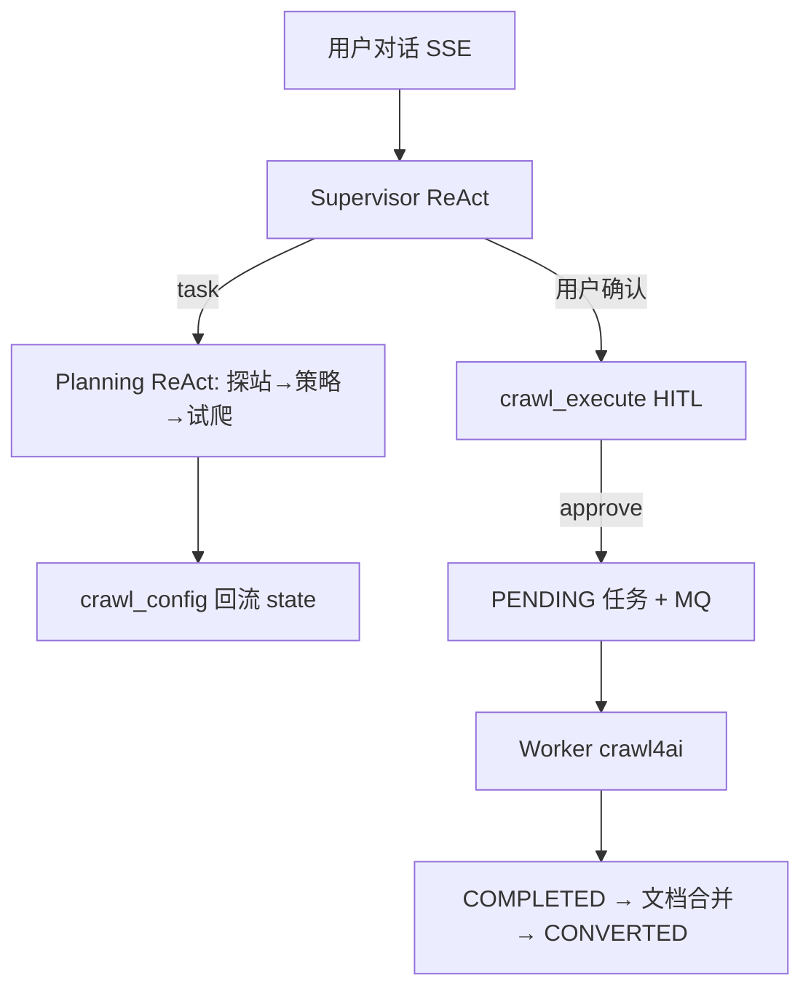

# 网页爬取 Agent — 技术选型（As-Built）

> **相关文档**
> - [01-需求设计](./01-需求设计.md)
> - [03-架构设计](./03-架构设计.md)

---

## 一、技术栈版本

| 依赖 | 版本（仓库锁定） | 归属 |
|------|------------------|------|
| `crawl4ai` | `0.9.0` | `knowledge-content` |
| `langchain` | `1.3.4` | `knowledge-common` |
| `langchain-openai` | `1.1.9` | `knowledge-common` |
| `langgraph` | `1.2.4` | `knowledge-common` |
| `deepagents` | `0.4.12` | `knowledge-common` |
| `langgraph-checkpoint-redis` | `0.5.0` | `knowledge-common` |

crawl4ai 支持 **sdk（进程内）** / **service（HTTP Docker）** 两种模式，由 `Crawl4aiConfig.crawl4ai_mode` 切换。

## 二、大模型选型

- **不硬编码**某一厂商模型。
- 管理端功能适配点：`web_crawler_agent`。
- 列表接口：`GET /crawler/chat/models`。
- 运行时：`AgentIdentityContext.model_id` + `crawler_model_middleware` 按次解析 `get_base_chat_model`。
- 无效/缺失时回退适配点下首个启用模型。

## 三、Agent 架构模式选型

### 3.1 采用方案：Supervisor + Planning（Multi Agent）

| 模式 | 是否采用 | 说明 |
|------|----------|------|
| **Multi Agent（Supervisor / Worker）** | **是** | deepagents Supervisor + Planning 子 Agent；职责隔离（编排 vs 探站策略） |
| **ReAct** | **是** | Supervisor / Planning 均基于 `create_agent` ReAct |
| **Human-in-the-Loop** | **是** | 写工具 `interrupt_on`（approve/reject），非独立 confirm 节点 |
| Reflection 节点 | 否 | 无独立 reflect 节点；质量靠试爬门禁与 Prompt 约束 |
| 单主 Agent + 纯 Tool | 否 | 早期方案，已废弃 |

### 3.2 选型理由

- **场景编排与探站分离**：Supervisor 禁止自行探站，必须 `task(planning_agent)`；避免任务生命周期工具与探站工具混在同一上下文。
- **框架原生委派**：使用 deepagents `CompiledSubAgent` + 内置 `task` 工具，不再手写 planning 委派工具。
- **HITL 挂在写工具上**：用户对话约定「确认爬取」后，由 LLM 发起 `crawl_execute`，执行前强制确认，兼顾体验与安全。
- **试爬硬门禁**：正式提交前必须 Redis 试爬指纹匹配，降低坏配置直冲全站的风险。

### 3.3 阶段划分

| 阶段 | 模式 | 时延 | LLM |
|------|------|------|-----|
| 对话 / 策略 | Supervisor + Planning ReAct + HITL | 秒～分钟级 SSE | 是 |
| 正式执行 | Plan（`crawl_config`）And Execute | 分钟级异步 | 否（失败修复再进对话） |

### 3.4 轮次与安全阀

| 位置 | 机制 | 默认 |
|------|------|------|
| Planning | `ModelCallLimitMiddleware(run_limit=…)` | `crawler_agent_max_react_rounds=50` |
| Supervisor | AIMessage 无 `tool_calls` 正常结束；`recursion_limit≈1000` 安全阀 | deepagents 默认 |

## 四、对话与执行解耦

**对话阶段**

- SSE：`/crawler/chat/{session_id}/message`、`/resume`
- 持久化：`knowledge_agent_session` / `knowledge_agent_message` + LangGraph Checkpointer
- 关闭页面可恢复历史与中断点

**执行阶段**

- Agent 工具创建 `knowledge_web_crawler_task`（`PENDING`）并投递 MQ
- Worker 更新进度 / URL 记录；前端任务 Tab 轮询
- 调度器兜底超时、僵尸任务、重投与规则重试

**用户决策**

- 规则重试用尽 → `USER_DECISION`
- 用户在会话中说明意图，Supervisor 走 Planning 调整 + `crawl_retry`（仍需 HITL + 试爬门禁）
