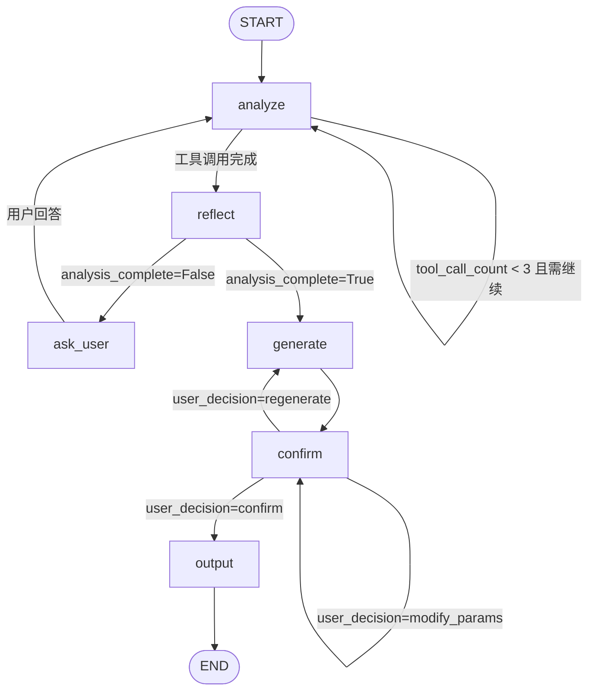
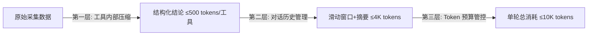

# 网页爬取 Agent — 架构设计

> **相关文档**
> - [02-技术选型](./02-技术选型.md) — 技术栈、大模型选型、Agent 架构模式选型
> - [04-交互流程设计](./04-交互流程设计.md) — 流程全景、状态机
> - [06-数据库设计](./06-数据库设计.md) — ER 图、建表语句

---

## 一、Agent 架构模型

Agent 采用 **主 Agent + 纯 Tool** 架构（非 Sub-agent、非 Skill）：

- **主 Agent**：一个 LangGraph Agent 实例，加载系统提示词，持有 5 个分析工具，负责全流程的意图理解、分析调度、提问引导、策略生成。
- **Tool**：5 个纯 Python 函数，不包含 LLM 调用，仅执行确定性的数据采集与解析，返回结构化 JSON。Agent 根据返回结果自行推理和决策。
- **大模型**：Qwen-Plus，通过 LangChain `ChatTongyi` 接入，工具调用稳定、中文理解强、成本低。

## 二、代码包结构

Agent 相关代码统一收归 `agents/` 包，内部自包含，与 `service/`、`mapper/` 等业务包平级：

```
knowledge_content/
├── agents/                     # Agent 模块（自包含）
│   ├── __init__.py
│   ├── crawler_agent.py        # 主编译图（StateGraph 构建与编排）
│   ├── nodes/                  # 图节点（每个文件 = 一个节点函数）
│   ├── states/                 # State TypedDict 定义
│   └── tools/                  # LangGraph 工具定义
├── common/
├── controller/
├── service/
├── mapper/
└── ...
```

### 包职责划分

| 包 | 职责 | 说明 |
|---|------|------|
| `agents/crawler_agent.py` | 图定义与编排 | 构建 StateGraph，串联 nodes、edges、条件边、中断点 |
| `agents/nodes/` | 图节点实现 | 每个文件对应一个节点函数（analyze、reflect、ask_user 等） |
| `agents/states/` | State 定义 | TypedDict 定义图的共享状态数据结构 |
| `agents/tools/` | 工具定义 | LangGraph @tool 装饰的函数，含参数校验与轻量实现 |

### tools 与 service 层职责边界

`agents/tools/` 作为薄适配层，仅负责定义 LangGraph 工具接口（@tool 装饰、参数校验、返回格式），复杂业务逻辑下沉到 `service/` 层复用：

```
agents/tools/ → service/ → mapper/
```

- **tools 层**：定义工具接口、参数校验、简单数据转换
- **service 层**：复杂业务逻辑、数据库操作、外部服务调用

---

## 三、分析工具链

| 工具 | 输入 | 输出 | 作用 |
|------|------|------|------|
| `fetch_robots_txt` | `url: str` | `{exists, disallowed_paths, sitemap_url, crawl_delay, verdict}` | 读取 robots.txt，解析允许/禁止爬取路径 |
| `fetch_sitemap` | `url: str` | `{exists, total_urls, sections, sample_urls, last_modified, verdict}` | 读取 sitemap.xml，获取站点 URL 结构与规模 |
| `fetch_page` | `url: str` | `{url, content_type, title, main_selector, has_pagination, pagination_type, internal_links_count, external_links_count, js_rendered, has_popup, has_search, verdict}` | 抓取单页面，分析页面结构、链接分布、分页模式 |
| `test_anti_crawling` | `url: str` | `{level, requires_js, has_captcha, rate_limit, cloudflare, waf_detected, verdict}` | 检测目标站点反爬机制：是否需要 JS 渲染、是否有验证码、是否限速 |
| `analyze_url_patterns` | `urls: list[str]` | `{patterns, depth_distribution, recommended_depth, verdict}` | 分析 URL 列表的路径模式，推断目录结构与内容分类 |

## 四、策略生成按七大配置主题归类

Agent 生成的 `crawl_config` JSON 对应 crawl4ai 七大配置主题，每个主题的参数来源如下：

### 主题 1：基础配置（BrowserConfig + CrawlerRunConfig）

| 参数 | 来源 | 说明 |
|------|------|------|
| `headless` | 默认值 `True` | 无需用户参与 |
| `viewport` | 默认值 `1920x1080` | 无需用户参与 |
| `enable_stealth` | 默认值 `True` | 无需用户参与 |
| `user_agent_mode` | 默认值 `random` | 无需用户参与 |
| `stream` | 默认值 `True` | 无需用户参与 |
| `page_timeout` | Agent 根据 `test_anti_crawling` 结果自动决策 | 反爬严格时适当延长 |
| `wait_until` | Agent 根据 `fetch_page` 结果自动决策 | JS 渲染页面用 `networkidle` |

### 主题 2：深度爬取策略

| 参数 | 来源 | 说明 |
|------|------|------|
| `crawl_strategy` | Agent 根据 `fetch_sitemap` + `fetch_page` 分析自动决策 | 根据站点规模和结构选择 BFS/DFS/BestFirst |
| `max_depth` | **用户确认** | 需用户决定爬取深度（默认建议 3） |
| `max_pages` | **用户确认** | 需用户决定最大页面数 |
| `include_patterns` | **用户确认** | 用户指定要爬取的路径模式 |
| `exclude_patterns` | **用户确认** | 用户指定要排除的路径模式 |
| `filter_chain` | Agent 根据分析结果自动配置 | 如过滤 PDF/图片链接、排除外部域名等 |

### 主题 3：反爬对抗

| 参数 | 来源 | 说明 |
|------|------|------|
| `anti_crawling_level` | Agent 根据 `test_anti_crawling` 结果自动决策 | 检测到反爬时提升对抗等级 |
| `delay_between_requests` | Agent 根据反爬检测结果自动决策 | 检测到限速时增加延迟 |
| `rotate_user_agent` | 默认值 `True` | 无需用户参与 |

### 主题 4：代理轮换

| 参数 | 来源 | 说明 |
|------|------|------|
| `proxy_list` | **用户确认**（可选） | 用户可提供代理列表，否则不使用代理 |
| `proxy_rotation_strategy` | Agent 自动决策 | 有代理时自动启用 RoundRobinProxyStrategy |

### 主题 5：HTML 解析

| 参数 | 来源 | 说明 |
|------|------|------|
| `content_selector` | Agent 根据 `fetch_page` 分析自动决策 | 分析页面结构自动定位正文区域 |
| `extract_media` | **用户确认** | 用户决定是否下载图片等媒体文件 |
| `media_download_path` | 默认值 | MinIO 上传路径 |
| `markdown_generator` | Agent 自动决策 | 根据页面类型选择合适的 Markdown 生成策略 |

### 主题 6：缓存配置

| 参数 | 来源 | 说明 |
|------|------|------|
| `cache_mode` | Agent 固定 `CacheMode.ENABLED` | 启用缓存，相同 URL 不重复请求（页级去重） |

缓存语义说明：
- `ENABLED`：启用缓存（相同 URL 不再重复请求，用于正常爬取）
- `BYPASS`：不读缓存但写入缓存（调试用，每次重新请求）
- `DISABLED`：完全禁用缓存（极少使用）

缓存配置由 Agent 固定使用 `ENABLED`，无需用户参与。

### 主题 7：Hook 注入

Agent 采用**声明式 Hook 输出**，而非硬编码 Hook 逻辑。Agent 检测到需要 Hook 注入的场景（登录、验证码、业务交互、附件抓取）时，向用户提问收集意图后，输出结构化的 Hook 声明到 JSON 的 `hooks` 部分。代码层按声明动态构建 crawl4ai 的 Hook 函数。

| 场景 | Hook 触发时机 | 原子操作序列 | 代码层构建目标 |
|------|--------------|-------------|---------------|
| 登录认证 | `on_before_request` | `fill` 填入凭证 → `click` 提交 → `wait` 完成 | Playwright 的 `page.fill()` + `page.click()` + `page.wait_for_selector()` |
| 验证码处理 | `on_page_loaded` | `wait` 等待验证码 → `pause` 暂停人工 | 检测到验证码元素后暂停爬取，等待人工操作 |
| 业务交互 | `on_page_loaded` | `fill` 填入关键词 → `click` 提交 → `wait` 结果 | Playwright 的表单交互 + 等待内容加载 |
| 附件抓取 | `on_after_page_load` | `evaluate` 提取链接 → `download` 下载 | JS 注入提取链接列表 + HTTP 下载 |

**Hook 声明语法**：
```json
{
  "hooks": {
    "on_before_request": [
      {
        "action": "inject_auth",
        "steps": [
          {"type": "fill", "selector": "input[name=username]", "value": "${username}"},
          {"type": "click", "selector": "button[type=submit]"},
          {"type": "wait", "selector": ".dashboard", "timeout": 10000}
        ]
      }
    ]
  }
}
```

**原子操作类型**：

| 操作类型 | 说明 | 参数 |
|---------|------|------|
| `fill` | 填入值 | `selector` + `value`（支持 `${variable}` 变量引用） |
| `click` | 点击元素 | `selector` |
| `wait` | 等待元素出现 | `selector` + `timeout` |
| `scroll` | 滚动页面 | `direction` + `distance` |
| `evaluate` | 执行 JavaScript | `script` |
| `pause` | 暂停等待人工操作 | `timeout`（可选，超时后自动继续） |
| `download` | 下载资源 | `target`（目标目录） |

## 五、参数四分类与权责模型

将 crawl4ai 参数分为四类，严格按分类处理：

### 第一类：固定默认（不分析、不提问）

使用固定默认值，每次输出 JSON 时按固定值原样填入：
`cache_mode`(ENABLED)、`headless`(true)、`viewport`(1920x1080)、`enable_stealth`(true)、`verbose`(false)、`excluded_tags`(['nav','footer','header','aside','script','style','form','iframe'])、`only_text`(false)、`word_count_threshold`(10)、`proxy_config`(null)、`stream`(true)。

### 第二类：配置参数（问用户后直接映射 JSON 字段）

用户回答直接填入对应的 JSON 配置字段：

| 用户意图 | 映射的 JSON 字段 |
|---------|------------------|
| 爬取范围 | `include_patterns` / `exclude_patterns` |
| 内容维度筛选（版本/语言/平台等） | `content_dimensions` + `include_patterns` URL 前缀 |
| 页面数量限制 | `max_pages` |
| 图片/媒体下载 | `extract_images` / `extract_media` |
| 附件下载 | `attachment_config` |

### 第三类：LLM 自动推导（分析后自行决策，不提问）

Agent 调用分析工具后，基于结构化返回结果自行推理决策：
`max_depth`、`crawl_strategy`、`include_external`、`delay_between_requests`、`user_agent_mode`、`simulate_user`、`magic`、`content_selector`、`wait_for`、`page_timeout`、`wait_until`、`scan_full_page`+`scroll_delay`、`process_iframes`、`flatten_shadow_dom`、`auto_dismiss_overlays`、`auto_load_more`、`auto_expand_sections`、`auto_click_tabs`、`markdown_generator`、`semaphore_count`、`url_scorer`、`filter_chain`。

### 第四类：Hook 声明（问用户后输出为可执行声明，代码层动态构建）

检测到相应场景时向用户提问，收集意图后输出结构化 Hook 声明到 JSON 的 `hooks` 部分，代码层按声明动态构建 crawl4ai 的 Hook 函数：

| 场景 | Hook 触发时机 |
|------|--------------|
| 登录凭证 | `on_before_request` |
| 验证码处理 | `on_page_loaded` |
| 业务交互（搜索框/表单） | `on_page_loaded` |
| 附件抓取 | `on_after_page_load` |

关键区分：第二类用户回答直接填入 JSON 配置字段，第四类用户回答输出为声明式 Hook，代码层按声明动态构建 Hook 函数。

### 参数权责规则

- **用户确认的参数（第二类 + 第四类）**：爬取出问题需要调整时，必须通知用户确认后才能修改。
- **Agent 自动推导的参数（第三类）**：爬取出问题时，Agent 自行决策调整，无需通知用户。
- **默认值参数（第一类）**：同 Agent 自动推导参数，Agent 可自行决策调整。
- **Hook 声明（第四类）**：代码层按声明动态构建 Hook 函数，Hook 声明本身需用户确认。

核心原则：**用户管「爬什么」（范围、维度、媒体），Agent 管「怎么爬」（策略、反爬、解析），代码层管「如何执行」（按 Hook 声明构建运行时逻辑）**。

## 六、LangGraph 状态图定义

对话阶段的 Agent 基于 LangGraph `StateGraph` 实现，以下为状态定义与图结构。

### State 数据结构

```python
class CrawlerAgentState(TypedDict):
    messages: Annotated[list[BaseMessage], add_messages]  # 对话历史（user/assistant，不含 tool 原始返回）
    tool_call_count: int          # 当前 ReAct 循环已调用工具次数（上限 3）
    analysis_complete: bool       # Reflection 自审是否通过
    site_type: str                # 识别的站点类型（tech_docs / blog / forum / general）
    user_intent: dict             # 收集到的用户意图（第二类 + 第四类参数）
    crawl_config: dict | None     # 生成的完整 crawl4ai 配置 JSON
    user_decision: str | None     # 用户确认结果："confirm" / "regenerate" / "modify_params"
```

### 节点定义

| 节点名 | 职责 | 调用 LLM | 调用工具 |
|--------|------|---------|----------|
| `analyze` | 调用分析工具链，收集站点信息（ReAct 循环体） | 是 | 是（5 个分析工具） |
| `reflect` | 自审分析结果是否充分（Reflection） | 是 | 否 |
| `ask_user` | 基于分析结果向用户提问补充意图 | 否（SSE 输出） | 否 |
| `generate` | 生成完整 crawl4ai 策略配置 | 是 | 否 |
| `confirm` | 展示策略摘要，等待用户确认（interrupt 点） | 否（SSE 输出） | 否 |
| `output` | 输出最终 JSON 配置，结束对话阶段 | 否 | 否 |

### 状态图（StateGraph）



### 条件边与中断点

| 类型 | 源节点 | 条件 | 目标节点 |
|------|--------|------|----------|
| 条件边 | `analyze` | `tool_call_count < 3` 且 LLM 决策需继续分析 | `analyze`（循环） |
| 条件边 | `analyze` | 工具调用完成或达到上限 | `reflect` |
| 条件边 | `reflect` | `analysis_complete=False` | `ask_user` |
| 条件边 | `reflect` | `analysis_complete=True` | `generate` |
| 条件边 | `confirm` | `user_decision=modify_params` | `confirm`（重新展示） |
| 条件边 | `confirm` | `user_decision=regenerate` | `generate`（重新生成） |
| 条件边 | `confirm` | `user_decision=confirm` | `output` |
| **中断点** | `confirm` | 每次进入前暂停（`interrupt_before`） | 等待用户输入后恢复 |

### 中断与恢复机制

`confirm` 节点配置为 `interrupt_before`，即每次进入该节点前 LangGraph 自动暂停图执行：

1. **暂停**：图执行到 `confirm` 节点前暂停，将当前 `crawl_config` 通过 SSE 推送给前端。
2. **恢复**：用户点击「确认」「重新生成」或「修改参数」后，前端将 `user_decision` 写入 State，调用 `graph.invoke()` 恢复执行。
3. **多轮迭代**：`modify_params` 和 `regenerate` 都会重新回到 `confirm` 节点再次中断，支持无限轮迭代。

## 七、数据压缩与成本控制

### 7.1 Token 消耗分析

| 消耗源 | 典型体积 | 风险等级 | 说明 |
|--------|---------|---------|------|
| 系统提示词 | 2-5K tokens | 固定开销 | 精简后可控 |
| 工具返回结果 | 单次 1-50K tokens | **最大风险源** | sitemap/页面链接数据量大 |
| 多轮对话历史 | 累积 10-100K+ | **第二大风险源** | 随轮次线性增长 |
| Agent 推理输出 | 0.5-2K tokens | 可控 | 单次回复不长 |

### 7.2 分层压缩方案

数据流经的每个环节都执行压缩，逐层递减：



#### 工具内部压缩（最关键）

每个 Tool 在返回给 Agent 前，自行完成「原始数据 → 结构化结论」的精炼。Agent 拿到的永远是**结论**而非**原始数据**。

| 工具 | 压缩策略 | 压缩后上限 |
|------|----------|----------|
| `fetch_robots_txt` | 解析规则后只返回结构化摘要，丢弃原始文本 | ≤ 200 tokens |
| `fetch_sitemap` | 统计总量 + 按路径前缀分组计数 + 抽样 5 条代表性 URL | ≤ 500 tokens |
| `fetch_page` | 只提取页面结构特征，丢弃 HTML 内容和完整链接列表 | ≤ 500 tokens |
| `test_anti_crawling` | 只返回检测结论和等级，丢弃原始 HTTP 头和 JS 代码 | ≤ 200 tokens |
| `analyze_url_patterns` | 归纳路径模式 + 深度分布统计，丢弃原始 URL 列表 | ≤ 500 tokens |
| **单轮工具总计** | | **≤ 1,900 tokens** |

#### 对话历史压缩

**工具调用结果折叠**：工具调用的原始结果**不保留在 LLM 对话历史中**，只保留 Agent 基于工具结果生成的总结性回复。

| 存储位置 | 内容 | 用途 |
|---------|------|------|
| `web_crawler_message`（数据库） | 完整工具返回 JSON | 前端展示工具调用详情 |
| LLM 上下文 | Agent 的总结性回复 | Agent 推理依据 |

实现方式：构建 LangGraph State 时，过滤掉 `role='tool'` 的消息，只保留 `user` / `assistant` 消息。

**滑动窗口 + 历史摘要**：保留最近 3 轮完整对话，更早的对话压缩为摘要。

| 组成 | 上限 |
|------|------|
| 历史摘要（如有） | ≤ 300 tokens |
| 最近 3 轮完整对话 | ≤ 3,700 tokens |
| **对话历史总计** | **≤ 4,000 tokens** |

#### Token 预算管控

| 环节 | 预算上限 | 说明 |
|------|---------|------|
| 系统提示词 | ≤ 3,000 tokens | 精简指令，不含示例代码 |
| 单次工具返回 | ≤ 500 tokens / 工具 | 工具内部压缩 |
| 对话历史 | ≤ 4,000 tokens | 滑动窗口 + 摘要 |
| Agent 单次输出 | ≤ 2,000 tokens | 限制回复长度 |
| **单轮总消耗** | **≤ 10,000 tokens** | 含所有输入输出 |

### 7.3 执行阶段静默调用压缩

Worker 静默调用 Agent LLM 分析失败原因时，**不传对话历史**，只传失败上下文：

| 上下文项 | 内容 | 上限 |
|---------|------|------|
| 错误信息 | `error_code` + `error_message` | ≤ 200 tokens |
| 当前配置 | `crawl_config` 的关键参数 | ≤ 300 tokens |
| 已尝试修复 | 修复措施列表 | ≤ 200 tokens |
| 系统指令 | 精简的修复指导提示词 | ≤ 500 tokens |
| **总计** | | **≤ 1,200 tokens** |

单次修复成本：输入 ¥0.001，输出 ¥0.004，几乎可忽略。

### 7.4 成本估算

按 Qwen-Plus 定价（输入 ¥0.8/百万 tokens，输出 ¥2/百万 tokens）：

| 场景 | 输入 tokens | 输出 tokens | 单次成本 |
|------|-----------|-----------|----------|
| 单轮对话（含工具调用） | ~8,000 | ~1,500 | ≈ ¥0.01 |
| 完整策略生成会话（6 轮） | ~48,000 | ~9,000 | ≈ ¥0.06 |
| 静默修复调用 | ~1,200 | ~500 | ≈ ¥0.002 |
| 单个任务全生命周期 | ~50,000 | ~10,000 | ≈ ¥0.06 |

### 7.5 提示词配置

Agent 运行依赖 prompts.yaml 中的以下提示词配置：

| 提示词 | 用途 | 使用场景 |
|--------|------|----------|
| `crawler_agent_system` | 主系统提示词 | 定义 Agent 角色、参数权责分类、工作流程、输出格式 |
| `crawler_reflection` | 策略自审提示词 | 判断分析结果是否充分生成高质量策略 |
| `crawler_retry_analysis` | 失败修复提示词 | 静默调用 LLM 分析爬取失败原因并给出调整建议 |
| `crawler_summary` | 对话历史压缩提示词 | 将多轮对话历史压缩为简洁摘要（≤300字） |
