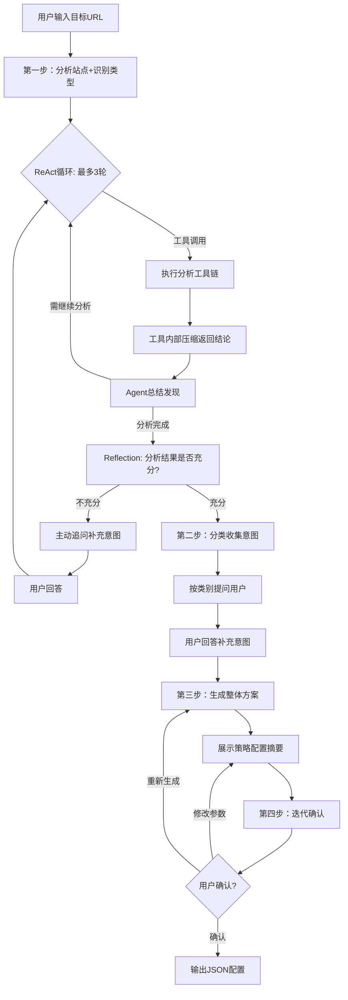
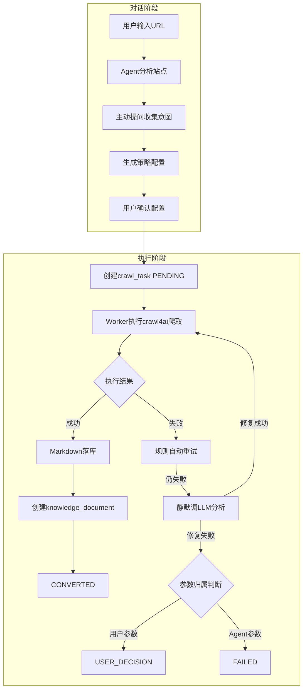
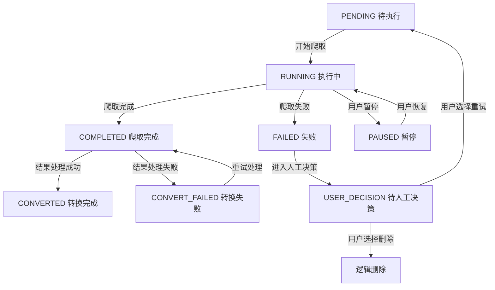

# 网页爬取 Agent — 交互流程设计

> **相关文档**
> - [01-需求设计](./01-需求设计.md) — 前端页面需求、流程全景
> - [03-架构设计](./03-架构设计.md) — Agent 架构、LangGraph 状态图
> - [05-用户操作交互时序图](./05-用户操作交互时序图.md) — 关键场景时序图

---

## 一、Agent 运行详细流程

基于 prompts.yaml 中的工作流程，Agent 对话阶段的详细流程如下：

**流程说明**：

1. **分析站点+识别类型**：调用 5 个分析工具（fetch_robots_txt、fetch_sitemap、fetch_page、test_anti_crawling、analyze_url_patterns），工具内部压缩后返回结构化结论。
2. **ReAct 循环**：最多 3 轮工具调用，根据工具返回动态决策下一步调用哪个工具。
3. **Reflection 自审**：ReAct 结束后追加一次自审，判断分析结果是否足够生成高质量策略。
4. **分类收集意图**：仅针对第二类参数（爬取范围、内容维度、页面数量、媒体下载等）向用户提问。
5. **生成整体方案**：展示完整策略配置，标注每个参数的来源（用户选择/自动适配/固定默认）。
6. **迭代确认**：用户确认后输出 JSON 配置，支持多轮修改。

**「重新生成」与「修改参数」的区别**：

| 操作 | 回退目标 | 执行者 | 触发场景 | 是否消耗 LLM |
|------|---------|--------|---------|-------------|
| **重新生成** | M（生成整体方案） | **Agent 重新推理** | 用户对整体方案方向不满意，希望 Agent 换一种思路重新生成完整策略 | 是（1 次 LLM 调用） |
| **修改参数** | N（展示策略摘要） | **用户手动微调** | 用户对方案方向认可，但想调整个别参数值（如 max_pages 从 50 改为 30） | 否 |
| **确认** | Q（输出 JSON） | 进入执行阶段 | 用户对方案满意，提交后台爬取任务 | 否 |

## 二、数据爬取整体流程

整合对话阶段与执行阶段的完整数据流转流程：

**流程阶段说明**：

| 阶段 | 模式 | 特点 | LLM调用次数 |
|------|------|------|------------|
| 对话阶段 | ReAct + Reflection + Human-in-the-Loop | 秒级，同步 SSE 流式响应 | 5-7 次 |
| 执行阶段 | Plan And Execute + Reflection（仅失败时） | 分钟级，异步后台任务 | 0-1 次（仅失败时） |

## 三、状态机定义

### 3.1 会话状态 `web_crawler_session.status`

| 状态值 | 含义 | 触发场景 |
|--------|------|----------|
| `ACTIVE` | 会话进行中 | 默认状态 |
| `CLOSED` | 会话已关闭 | 用户主动关闭或长时间未操作 |

### 3.2 消息角色 `web_crawler_message.role`

| 角色值 | 含义 | 入库时机 |
|--------|------|----------|
| `user` | 用户消息 | 用户发送消息后立即写入 |
| `assistant` | AI 回复 | Agent 完整回复结束后写入 |
| `system` | 系统提示 | 会话初始化或系统通知时写入 |
| `tool` | 工具调用结果 | Agent 调用工具后写入 |

### 3.3 爬取任务状态 `crawl_task.status`

| 状态值 | 含义 | 数据库标记变化 |
|--------|------|----------------|
| `PENDING` | 待执行 | `crawl_task.status='PENDING'`，`progress=0` |
| `RUNNING` | 执行中 | `crawl_task.status='RUNNING'`，`started_time=NOW()`，定时刷新 `progress`/`current_step` |
| `COMPLETED` | 爬取完成 | `crawl_task.status='COMPLETED'`，`progress=100`，`completed_time=NOW()`，等待结果处理 |
| `CONVERTED` | 转换完成 | `crawl_task.status='CONVERTED'`，爬取结果已写入 MinIO 并创建 `knowledge_document` |
| `CONVERT_FAILED` | 转换失败 | `crawl_task.status='CONVERT_FAILED'`，爬取结果写入 MinIO 失败，等待重试 |
| `FAILED` | 失败 | `crawl_task.status='FAILED'`，写入 `error_code`/`error_message`，记录 `crawl_task_failed_url` |
| `USER_DECISION` | 待人工决策 | `crawl_task.status='USER_DECISION'`，爬取失败或超时，等待用户选择重试或删除 |
| `PAUSED` | 暂停 | 用户手动暂停（可选） |

#### 状态流转图

### 3.4 失败记录 `crawl_task_failed_url`

- 单页爬取失败不中断整站任务，持续记录到 `crawl_task_failed_url`。
- 对超时、`503` 等 transient 错误按 `retry_count` 做有限重试。
- 浏览器进程崩溃、OOM、策略性失败需重新拉取任务，配合 `CacheMode.ENABLED` 减少重复请求。

### 3.5 版本管理标记

网页爬取文档的版本管理复用资料上传的版本管理机制：

- `knowledge_document` 以 `(doc_title, doc_version)` 联合唯一；`doc_title` 本身不唯一，同一标题可存在多版本，删除记录通过 `del_flag` 标记，不影响后续同名同版本重建。
- 版本号生成规则：复用 `/document-parse/next-version` 接口，查询该标题当前最大版本号，整数递增生成新版本号（如 `1.0` → `2.0`）。
- 爬取任务完成创建 `knowledge_document` 时，调用版本号预生成接口获取新版本号，写入 `doc_version` 字段，并更新该标题其他未删除记录的 `is_latest='0'`。
- `knowledge_document.is_latest` 表示已落库文档维度最新版（RAG 检索使用），同一标题下仅允许一条 `is_latest='1'` 的未删除记录。
- 默认文档列表（RAG 检索范围）只展示 `knowledge_document` 中 `is_latest='1'` 的记录。
- 与资料上传版本管理的一致性：网页爬取文档与手动上传文档共享同一版本管理规则，确保版本号连续性和 `is_latest` 标记的一致性。

## 四、消费者与定时任务

### 4.1 爬取任务执行器

- **类型**：后台异步任务 / 消费者
- **触发方式**：接口 `POST /api/rag/crawler/task` 提交后直接触发，或消费消息流中的 `crawler.task.pending`
- **核心流程**：
  1. 读取 `crawl_task.crawl_config` 与 `target_url`。
  2. 更新 `crawl_task.status='RUNNING'`，`started_time=NOW()`。
  3. 使用 crawl4ai 执行整站爬取：
     - 固定参数：`headless=True`、`viewport=1920x1080`、`enable_stealth=True`、`user_agent_mode='random'`、`cache_mode=ENABLED`、`stream=True`。
  4. 每爬取一页，更新 `crawl_task.progress`、`current_step`、`success_count`、`failed_count`。
  5. 单页失败时：
     - 记录 `crawl_task_failed_url`（`url`、`error_code`、`error_message`、`retry_count`）。
     - 对 transient 错误尝试重试，更新 `retry_count`。
  6. 全部完成后：
     - 将 Markdown 写入 MinIO。
     - 处理图片等媒体文件上传 MinIO 并替换链接。
     - 创建 `knowledge_document`：
       - `task_id` = 当前任务 ID
       - `source_type` = `'1'`
       - `source_url` = 目标 URL
       - `doc_key` = Markdown MinIO 对象键
       - `status` = `'CONVERTED'`
       - `is_latest` = `'1'`
       - 同标题旧版本 `is_latest='0'`
     - 更新 `crawl_task.status='COMPLETED'`，`progress=100`，`completed_time=NOW()`。
  7. 整体失败时，进入失败处理流程（见 4.3）。

### 4.2 爬取任务状态兜底定时任务

- **类型**：定时任务
- **触发方式**：每分钟扫描一次
- **核心流程**：
  1. 扫描 `status='RUNNING'` 且长时间未更新的 `crawl_task`。
  2. 若判定为卡死或浏览器崩溃，将任务状态回退为 `PENDING` 或标记为 `FAILED`。
  3. 支持重新拉起任务（利用 `CacheMode.ENABLED` 减少重复请求）。

### 4.3 失败自动修复机制

任务失败时，执行器不直接标记 `FAILED`，而是按以下分层策略自动修复：

#### 第一层：规则可判定 — Worker 自动重试

以下场景 Worker 可直接调整参数重试，无需 LLM 推理，最多重试 3 次：

| 错误类型 | 自动调整策略 |
|---------|-------------|
| 浏览器进程崩溃 / OOM | 降低 `max_pages`，减小并发，重启浏览器重试 |
| 页面超时（page_timeout） | 自动延长 `page_timeout` 重试 |
| 连接重置 / 网络瞬断 | 等待退避后重试（指数退避） |
| 429 限速 | 增大 `delay_between_requests` 重试 |
| 403 / Cloudflare 挑战 | 提升反爬对抗等级，开启 stealth 模式重试 |

#### 第二层：需要推理 — 静默调 Agent LLM

规则无法覆盖的复杂失败场景，Worker 静默调用 Agent LLM（不通知用户）：

- 将失败上下文（错误信息、已尝试的修复措施、当前 `crawl_config`）传入 LLM。
- LLM 分析失败原因，返回调整后的 `crawl_config` 参数补丁。
- Worker 合并参数补丁后重试，最多 1 次。
- 此过程用户无感知，不产生消息记录。

#### 第三层：自动修复用尽 — USER_DECISION

当自动修复全部用尽且失败原因为用户确认的参数问题时，任务进入 `USER_DECISION` 状态：

- 仅当失败与用户确认的参数（`max_depth`、`max_pages`、`include_patterns`、`exclude_patterns`、`proxy_list`、`extract_media`）相关时，才升级为 USER_DECISION。
- 若失败与 Agent/默认参数相关但自动修复用尽，直接标记 `FAILED`，不打扰用户。

**USER_DECISION 交互流程**：

1. 任务状态变为 `USER_DECISION`，更新 `error_message` 说明失败原因与已尝试的修复措施。
2. 通过消息流通知前端，在关联的会话中插入 `system` 消息，提示用户任务需要决策。
3. 用户在任务详情页看到失败原因、已尝试的修复记录、建议的参数调整方案。
4. 用户可选择：
   - **调整参数重试**：修改 `crawl_config` 中的用户参数，任务回到 `PENDING` 重新执行。
   - **放弃删除**：逻辑删除任务。
5. 用户关闭页面后，下次进入会话时仍可看到 `USER_DECISION` 状态的任务，不会丢失。
