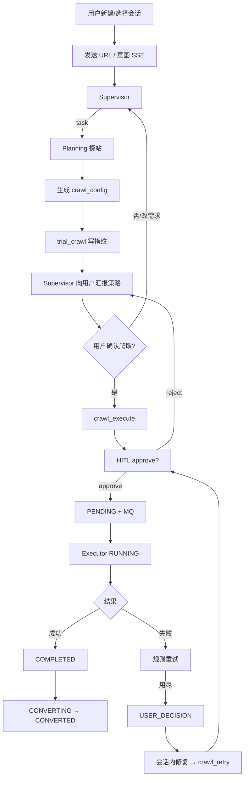
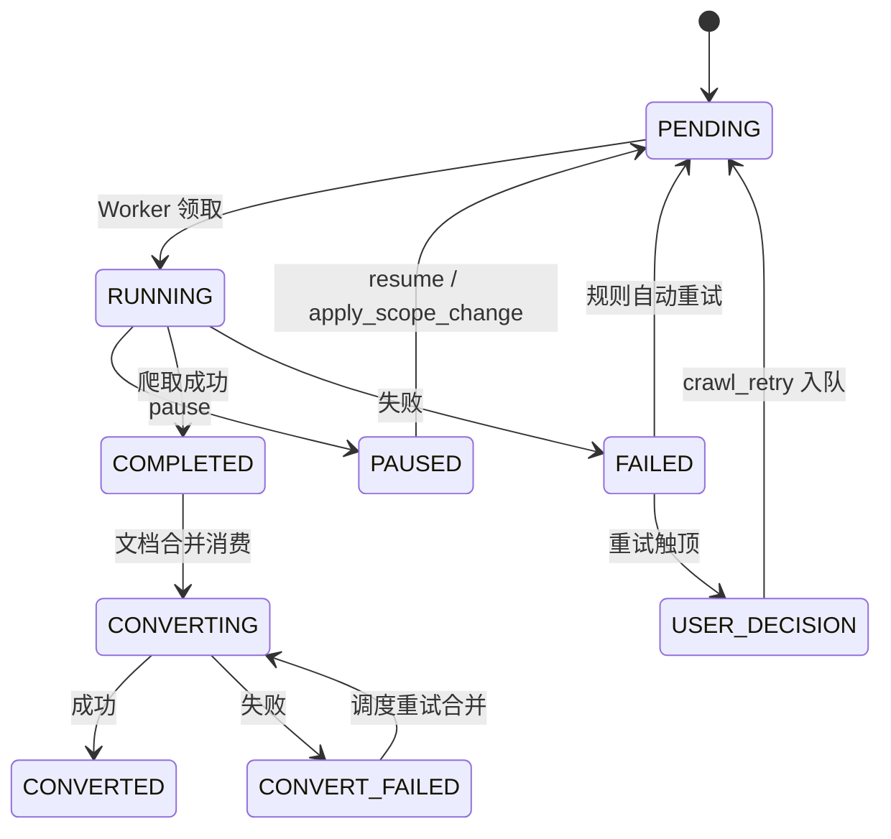

# 网页爬取 Agent — 交互流程设计（As-Built）

> **相关文档**
> - [03-架构设计](./03-架构设计.md)
> - [05-用户操作交互时序图](./05-用户操作交互时序图.md)
> - [06-数据库设计](./06-数据库设计.md)

---

## 一、端到端流程全景

对话阶段与执行阶段解耦：SSE 负责秒～分钟级交互；MQ Worker 负责分钟级爬取。

---

## 二、对话阶段状态（逻辑）

不单独落「对话阶段状态机表」，以 Checkpointer + 消息表为准：

| 逻辑阶段 | 表现 |
|----------|------|
| 空闲 | 等待用户输入 |
| Supervisor 思考/调工具 | SSE token / tool_call |
| Planning 运行中 | `source=subagent` 工具组 |
| 等待 HITL | `user_choice` 事件；图 interrupt |
| 等待用户自然语言 | 普通 AI 提问后结束本轮 |

---

## 三、任务状态机

枚举：`CrawlTaskStatus`（`knowledge_web_crawler_task.status`）。

说明：

- **FAILED**：规则重试进行中或中间失败态；**不要**默认引导用户立刻人工处理。
- **USER_DECISION**：需要人工决策 + Agent 修复路径。
- **CONVERTED**：已合入知识库文档；`merge` 仅表示入队成功。

### URL 记录状态

`knowledge_web_crawler_task_url_record.status`：`PENDING` | `SUCCESS` | `FAILED`。

---

## 四、关键业务路径

### 4.1 新站点爬取

1. Planning：robots / sitemap / page /（可选）probe / anti / proxy → 策略 → trial  
2. 用户确认 → `crawl_execute` HITL → PENDING  
3. Worker 执行 → COMPLETED → 文档合并  

### 4.2 进度查询

Supervisor：`list_actionable_crawl_tasks` / `query_crawl_task`（只读，无 HITL）。

### 4.3 暂停 / 恢复

- 对话：`pause_crawl_task` / `resume_crawl_task`（HITL）  
- 或任务 Tab REST：`POST /crawler/task/{id}/pause|resume`

### 4.4 改范围（Rescope）

1. 任务需 PAUSED（或先 pause）  
2. Planning 调整 `filter_chain` 等并试爬  
3. `preview_scope_removal` → `apply_scope_change`（HITL）→ 删越界 URL → 恢复  

### 4.5 失败修复

1. 仅 `USER_DECISION`（或用户明确要求）走修复话术  
2. `query_crawl_task` 灌入 failed_*  
3. Planning 针对失败 URL 调参 + trial  
4. `crawl_retry`（HITL）  

### 4.6 部分成功合并

`merge_crawl_results` 或 `POST .../merge`：放弃失败 URL，投递文档合并队列。

---

## 五、消息队列与调度

| 主题/职责 | 消费者 / 任务 |
|-----------|----------------|
| `crawl.task.pending` | `web_crawler_task_consumer` → executor |
| `crawl.document.pending` | `crawl_document_consumer` → MD 合并落库 |
| 定时调度 | `web_crawler_task_scheduler`：任务超时取消、僵尸 RUNNING、PENDING 重投、FAILED/CONVERT_FAILED 规则重试 |

幂等：Worker 领取时校验状态，避免重复执行。

---

## 六、前端轮询建议

| Tab | 行为 |
|-----|------|
| 会话 | SSE 为主；HITL 用 resume |
| 任务 | 列表/详情轮询；RUNNING 提高频率 |
| 文档 | 任务进入 CONVERTING/CONVERTED 后刷新列表 |
