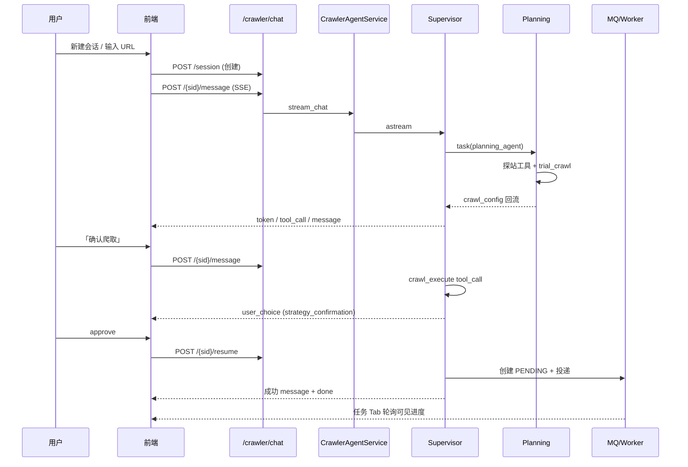
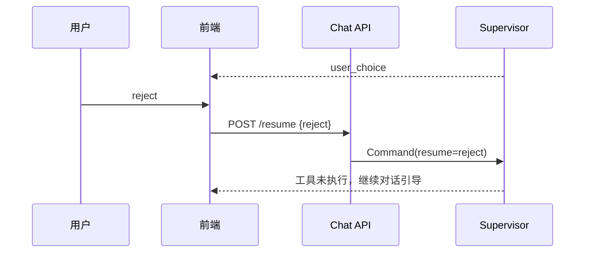
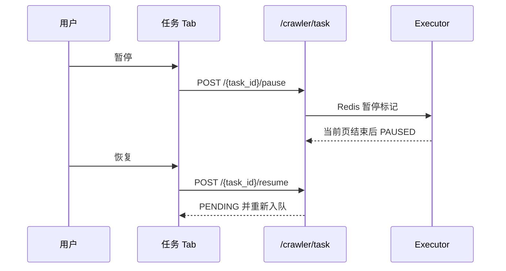
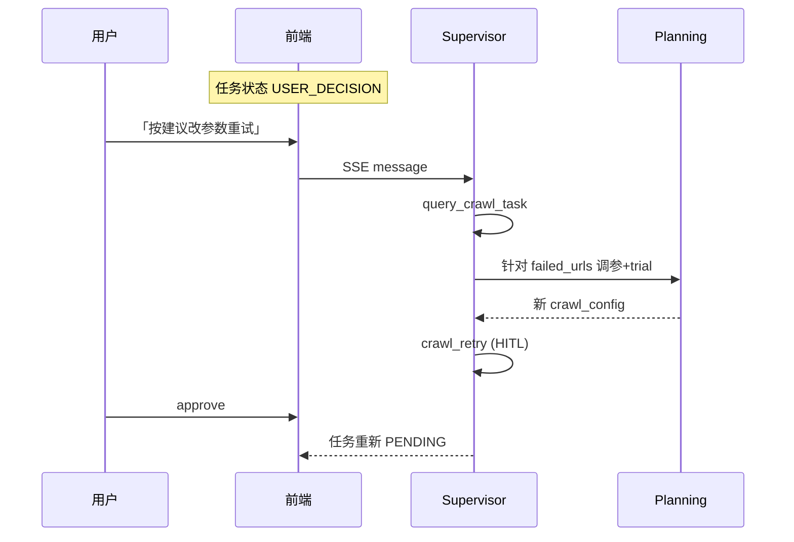
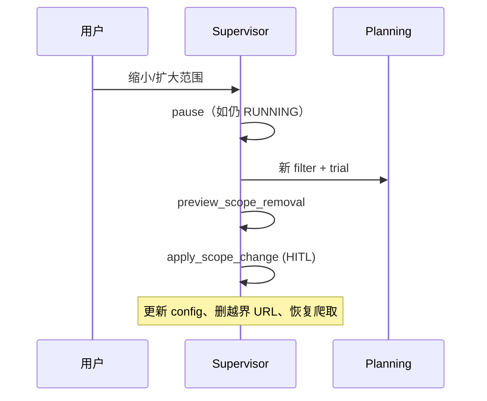
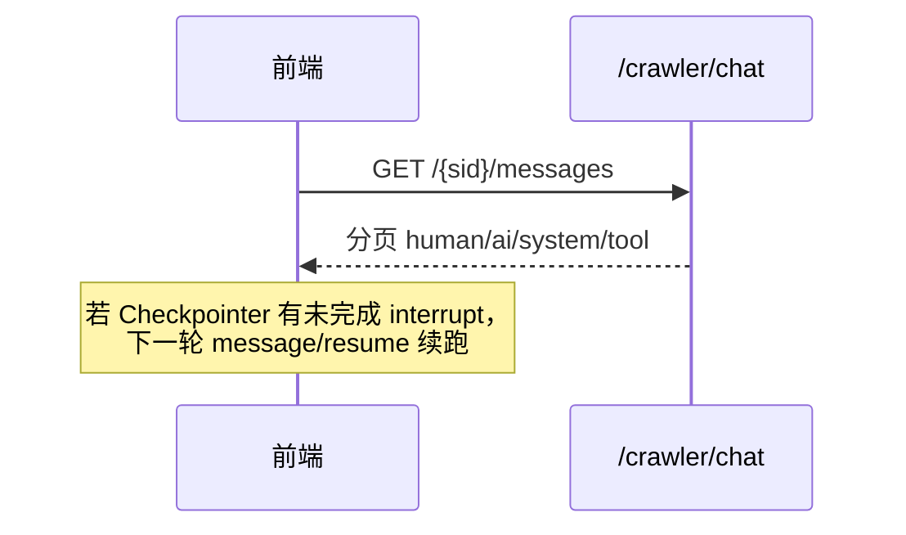

# 网页爬取 Agent — 用户操作交互时序图（As-Built）

> **相关文档**
> - [01-需求设计](./01-需求设计.md)
> - [04-交互流程设计](./04-交互流程设计.md)
> - [07-后端接口设计](./07-后端接口设计.md)

---

## 一、新会话策略生成并提交爬取

---

## 二、HITL 拒绝

---

## 三、任务暂停与恢复（REST）

对话路径等价调用 `pause_crawl_task` / `resume_crawl_task`（多一步 HITL）。

---

## 四、USER_DECISION 修复重试

---

## 五、改范围（Rescope）

---

## 六、历史消息加载

