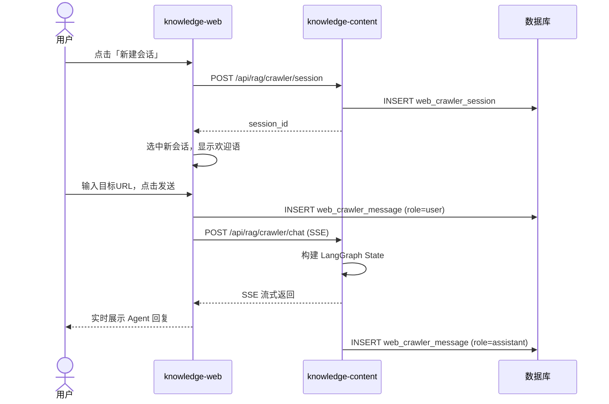
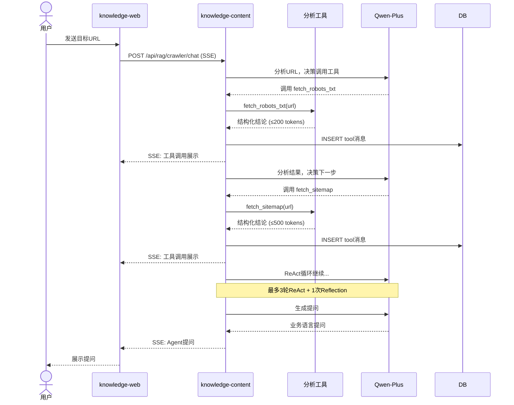
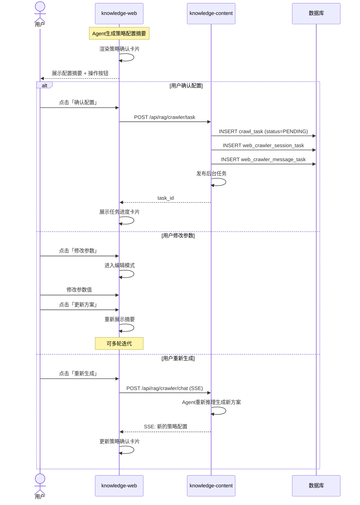
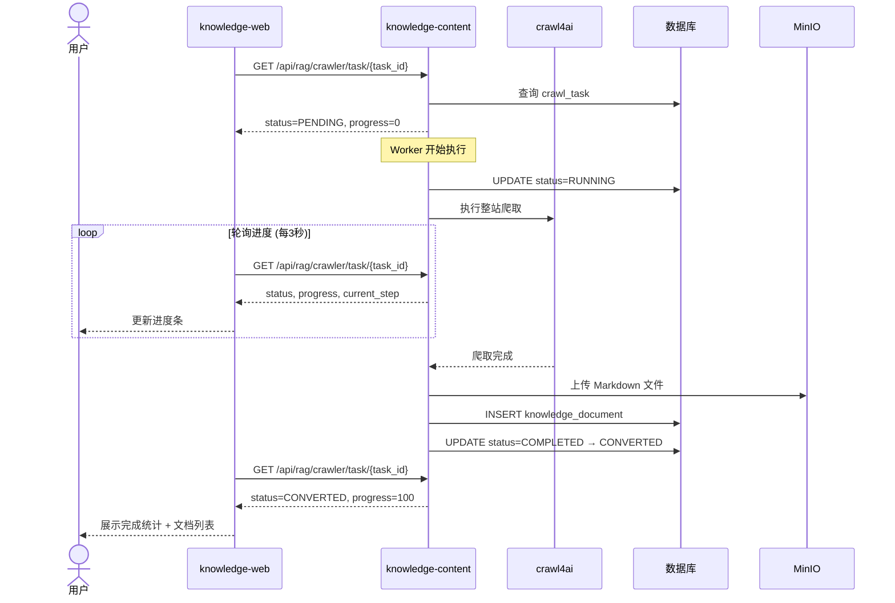
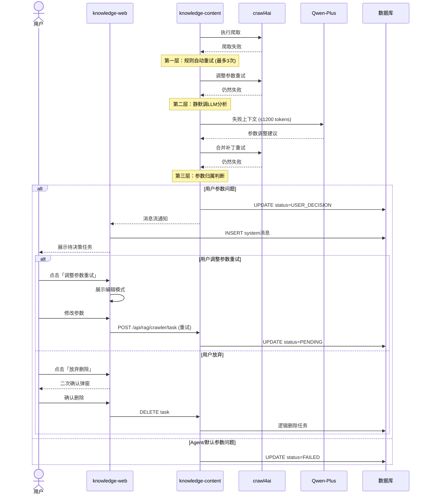
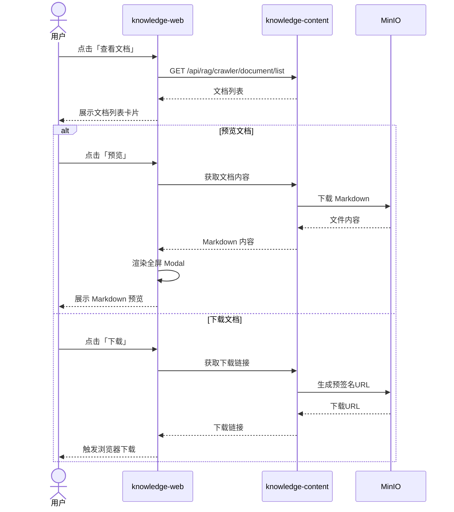
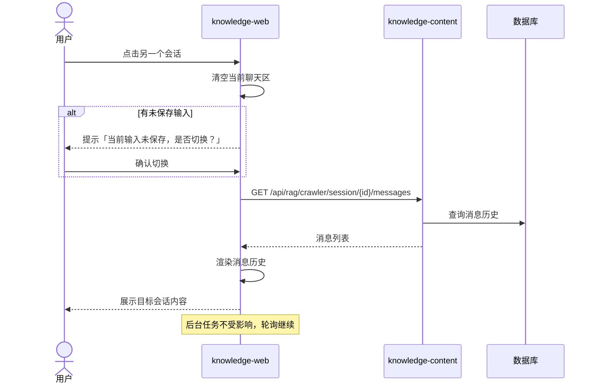

# 网页爬取 Agent — 用户操作交互时序图

> **相关文档**
> - [01-需求设计](./01-需求设计.md) — 前端页面需求
> - [04-交互流程设计](./04-交互流程设计.md) — 流程全景、状态机
> - [07-后端接口设计](./07-后端接口设计.md) — API 列表与出入参

---

## 一、创建会话与发送消息

## 二、Agent 分析与工具调用

## 三、策略确认与任务提交

## 四、任务执行与进度轮询

## 五、任务失败与 USER_DECISION

## 六、文档预览与下载

## 七、会话切换

