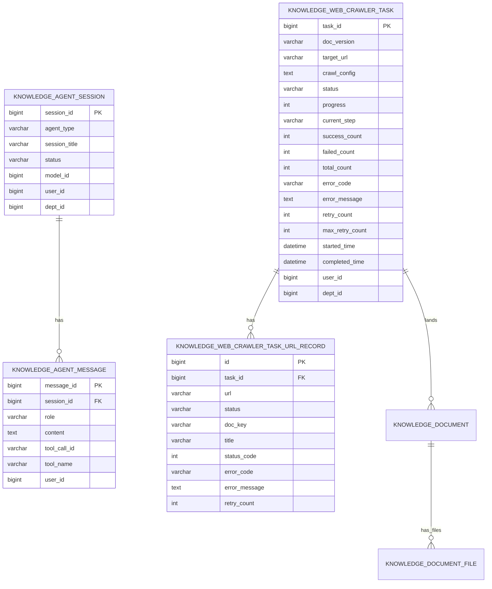

# 网页爬取 Agent — 数据库设计（As-Built）

> **相关文档**
> - [04-交互流程设计](./04-交互流程设计.md)
> - [07-后端接口设计](./07-后端接口设计.md)

---

## 一、表模块归属

| 表名 | 归属 | 说明 |
|------|------|------|
| `knowledge_agent_session` | `knowledge-common` | 通用 Agent 会话（`agent_type=web_crawler`） |
| `knowledge_agent_message` | `knowledge-common` | 通用 Agent 消息 |
| `knowledge_web_crawler_task` | `knowledge-content` | 爬取任务 |
| `knowledge_web_crawler_task_url_record` | `knowledge-content` | 每 URL 成败与 MinIO key |
| `knowledge_document` | `knowledge-content` | 落库文档主表（元数据；文件字段已下沉） |
| `knowledge_document_file` | `knowledge-content` | 文档文件子表（doc_key / source_url 等） |
| `sys_dict_*`（`crawl_proxy_pool`） | 系统字典 | 代理池，供 `query_proxy_pool` |

**已不使用的早期表设计**：独立 `crawl_task_failed_url`、`web_crawler_session_task`、`web_crawler_message_task`、专用 `web_crawler_session/message`（已收敛到 `knowledge_agent_*`）。

Checkpointer（Redis）存图状态 / interrupt，不入 MySQL。

---

## 二、ER 关系（逻辑）

会话与任务**无强制外键关联表**；关联通过 Agent state / 工具参数中的 `task_id`、业务查询与用户数据权限体现。

---

## 三、字段要点

### 3.1 `knowledge_agent_session`

| 字段 | 说明 |
|------|------|
| `agent_type` | 固定业务值 `web_crawler` |
| `status` | `ACTIVE` / `CLOSED` |
| `model_id` | 默认模型；单次消息仍可覆盖 |

### 3.2 `knowledge_agent_message`

| 字段 | 说明 |
|------|------|
| `role` | `human` / `ai` / `system` / `tool`（与 LangChain 对齐） |
| `tool_call_id` / `tool_name` | `role=tool` 时使用 |

### 3.3 `knowledge_web_crawler_task`

| 字段 | 说明 |
|------|------|
| `crawl_config` | crawl4ai 策略 JSON 文本 |
| `doc_version` | 创建时预分配，落库沿用 |
| `status` | 见 `CrawlTaskStatus` |
| `retry_count` / `max_retry_count` | 规则重试；触顶升 `USER_DECISION` |
| `progress` / `current_step` | 执行进度展示 |
| `success_count` / `failed_count` / `total_count` | 页面统计 |

### 3.4 `knowledge_web_crawler_task_url_record`

| 字段 | 说明 |
|------|------|
| `status` | `PENDING` / `SUCCESS` / `FAILED` |
| `doc_key` | 单页 Markdown MinIO 对象键 |
| `error_code` / `error_message` | 失败明细（替代独立 failed_url 表） |

### 3.5 `knowledge_document`

爬取落库时 `source_type` 为网页爬取枚举；关联任务由 `task_id` 写入。文件级字段（`doc_key`、`source_url`、`doc_name` 等）在子表 `knowledge_document_file`。

### 3.6 `knowledge_document_file`

每成功页一行：`source_url` + `doc_key`；上传场景每文档一行。详见 change `document-file-subtable` 与 `sql/upgrade_document_file_subtable.sql`。

---

## 四、状态与错误码

- 任务状态：`CrawlTaskStatus`（PENDING / RUNNING / PAUSED / COMPLETED / CONVERTING / CONVERT_FAILED / CONVERTED / FAILED / USER_DECISION）
- 任务错误码：`CrawlTaskErrorCode`（接口 `/crawler/task/error-code-options`）
- URL 错误码：`CrawlUrlErrorCode`（记录级）

---

## 五、辅助存储

| 存储 | 用途 |
|------|------|
| Redis Checkpointer | 图 checkpoint / HITL interrupt |
| Redis 试爬指纹 | `(session, url, config)` 正式提交门禁，TTL ~6h |
| Redis 暂停标记 | RUNNING 协作式暂停 |
| MinIO | 单页 MD、媒体（默认不再写 merged 合并包） |
