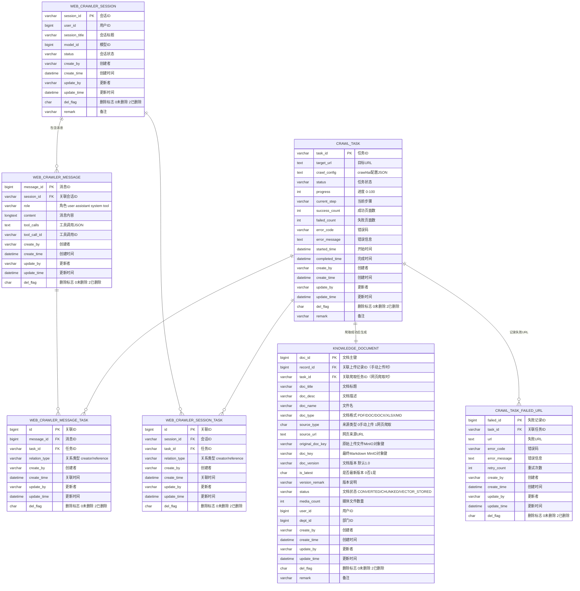

# 网页爬取 Agent — 数据库设计

> **相关文档**
> - [04-交互流程设计](./04-交互流程设计.md) — 状态机定义、版本管理规则
> - [07-后端接口设计](./07-后端接口设计.md) — API 列表与出入参

---

## 一、表模块归属

| 表名 | 归属项目 | 说明 |
|------|---------|------|
| `crawl_task` | `knowledge-content` | 网页爬取任务表 |
| `crawl_task_failed_url` | `knowledge-content` | 爬取失败 URL 明细表 |
| `web_crawler_session` | `knowledge-content` | Agent 会话表 |
| `web_crawler_message` | `knowledge-content` | Agent 消息表 |
| `web_crawler_session_task` | `knowledge-content` | 会话与任务关联表 |
| `web_crawler_message_task` | `knowledge-content` | 消息与任务关联表 |
| `knowledge_document` | `knowledge-common` | 文档主表，爬取成功后生成 |

## 二、ER 图



## 三、MySQL 建表语句

### 3.1 knowledge_document

```sql
CREATE TABLE `knowledge_document` (
    `doc_id` bigint NOT NULL AUTO_INCREMENT COMMENT '文档主键',
    `record_id` bigint DEFAULT NULL COMMENT '关联上传记录ID（手动上传时）',
    `task_id` varchar(64) DEFAULT NULL COMMENT '关联爬取任务ID（网页爬取时）',
    `doc_title` varchar(255) NOT NULL COMMENT '文档标题',
    `doc_desc` varchar(500) DEFAULT NULL COMMENT '文档描述',
    `doc_name` varchar(255) DEFAULT NULL COMMENT '文件名',
    `doc_type` varchar(50) DEFAULT NULL COMMENT '文档格式 PDF/DOC/DOCX/XLSX/MD',
    `source_type` char(1) DEFAULT '0' COMMENT '来源类型（0-手动上传 1-网页爬取）',
    `source_url` text COMMENT '网页来源URL',
    `original_doc_key` varchar(500) DEFAULT NULL COMMENT '原始上传文件MinIO对象键（网页爬取时为空）',
    `doc_key` varchar(500) DEFAULT NULL COMMENT '最终Markdown MinIO对象键',
    `doc_version` varchar(20) DEFAULT '1.0' COMMENT '文档版本',
    `is_latest` char(1) DEFAULT '1' COMMENT '是否最新版本（0-否 1-是）',
    `version_remark` varchar(255) DEFAULT NULL COMMENT '版本说明',
    `status` varchar(20) DEFAULT 'CONVERTED' COMMENT '文档状态 CONVERTED/CHUNKED/VECTOR_STORED',
    `media_count` int DEFAULT '0' COMMENT '媒体文件数量',
    `user_id` bigint NOT NULL COMMENT '上传用户ID',
    `dept_id` bigint DEFAULT NULL COMMENT '部门ID',
    `create_by` varchar(64) DEFAULT '' COMMENT '创建者',
    `create_time` TIMESTAMP DEFAULT CURRENT_TIMESTAMP COMMENT '创建时间',
    `update_by` varchar(64) DEFAULT '' COMMENT '更新者',
    `update_time` TIMESTAMP DEFAULT CURRENT_TIMESTAMP ON UPDATE CURRENT_TIMESTAMP COMMENT '更新时间',
    `del_flag` char(1) DEFAULT '0' COMMENT '删除标志（0-未删除 2-删除）',
    `remark` varchar(500) DEFAULT NULL COMMENT '备注',
    PRIMARY KEY (`doc_id`),
    UNIQUE KEY `uk_doc_title_version` (`doc_title`, `doc_version`),
    KEY `idx_doc_title` (`doc_title`),
    KEY `idx_source_type` (`source_type`),
    KEY `idx_is_latest` (`is_latest`),
    KEY `idx_record_id` (`record_id`),
    KEY `idx_task_id` (`task_id`)
) ENGINE=InnoDB DEFAULT CHARSET=utf8mb4 COMMENT='文档主表';
```

### 3.2 crawl_task

```sql
CREATE TABLE `crawl_task` (
    `task_id` varchar(64) NOT NULL COMMENT '任务ID',
    `target_url` text COMMENT '目标URL',
    `crawl_config` text COMMENT 'crawl4ai配置JSON',
    `status` varchar(20) DEFAULT 'PENDING' COMMENT '任务状态',
    `progress` int DEFAULT '0' COMMENT '进度 0-100',
    `current_step` varchar(50) DEFAULT NULL COMMENT '当前步骤',
    `success_count` int DEFAULT '0' COMMENT '成功页面数',
    `failed_count` int DEFAULT '0' COMMENT '失败页面数',
    `error_code` varchar(50) DEFAULT NULL COMMENT '错误码',
    `error_message` text COMMENT '错误信息',
    `started_time` datetime DEFAULT NULL COMMENT '开始时间',
    `completed_time` datetime DEFAULT NULL COMMENT '完成时间',
    `create_by` varchar(64) DEFAULT '' COMMENT '创建者',
    `create_time` TIMESTAMP DEFAULT CURRENT_TIMESTAMP COMMENT '创建时间',
    `update_by` varchar(64) DEFAULT '' COMMENT '更新者',
    `update_time` TIMESTAMP DEFAULT CURRENT_TIMESTAMP ON UPDATE CURRENT_TIMESTAMP COMMENT '更新时间',
    `del_flag` char(1) DEFAULT '0' COMMENT '删除标志（0-未删除 2-删除）',
    `remark` varchar(500) DEFAULT NULL COMMENT '备注',
    PRIMARY KEY (`task_id`),
    KEY `idx_status` (`status`)
) ENGINE=InnoDB DEFAULT CHARSET=utf8mb4 COMMENT='网页爬取任务表';
```

### 3.3 crawl_task_failed_url

```sql
CREATE TABLE `crawl_task_failed_url` (
    `failed_id` bigint NOT NULL AUTO_INCREMENT COMMENT '失败记录ID',
    `task_id` varchar(64) NOT NULL COMMENT '关联任务ID',
    `url` text COMMENT '失败URL',
    `error_code` varchar(50) DEFAULT NULL COMMENT '错误码',
    `error_message` text COMMENT '错误信息',
    `retry_count` int DEFAULT '0' COMMENT '重试次数',
    `create_by` varchar(64) DEFAULT '' COMMENT '创建者',
    `create_time` TIMESTAMP DEFAULT CURRENT_TIMESTAMP COMMENT '创建时间',
    `update_by` varchar(64) DEFAULT '' COMMENT '更新者',
    `update_time` TIMESTAMP DEFAULT CURRENT_TIMESTAMP ON UPDATE CURRENT_TIMESTAMP COMMENT '更新时间',
    `del_flag` char(1) DEFAULT '0' COMMENT '删除标志（0-未删除 2-删除）',
    PRIMARY KEY (`failed_id`),
    KEY `idx_task_id` (`task_id`)
) ENGINE=InnoDB DEFAULT CHARSET=utf8mb4 COMMENT='爬取失败URL明细表';
```

### 3.4 web_crawler_session

```sql
CREATE TABLE `web_crawler_session` (
    `session_id` varchar(64) NOT NULL COMMENT '会话ID',
    `user_id` bigint NOT NULL COMMENT '用户ID',
    `session_title` varchar(255) DEFAULT NULL COMMENT '会话标题',
    `model_id` bigint DEFAULT NULL COMMENT '模型ID',
    `status` varchar(20) DEFAULT 'ACTIVE' COMMENT '会话状态',
    `create_by` varchar(64) DEFAULT '' COMMENT '创建者',
    `create_time` TIMESTAMP DEFAULT CURRENT_TIMESTAMP COMMENT '创建时间',
    `update_by` varchar(64) DEFAULT '' COMMENT '更新者',
    `update_time` TIMESTAMP DEFAULT CURRENT_TIMESTAMP ON UPDATE CURRENT_TIMESTAMP COMMENT '更新时间',
    `del_flag` char(1) DEFAULT '0' COMMENT '删除标志（0-未删除 2-删除）',
    `remark` varchar(500) DEFAULT NULL COMMENT '备注',
    PRIMARY KEY (`session_id`),
    KEY `idx_user_id` (`user_id`)
) ENGINE=InnoDB DEFAULT CHARSET=utf8mb4 COMMENT='Agent会话表';
```

### 3.5 web_crawler_message

```sql
CREATE TABLE `web_crawler_message` (
    `message_id` bigint NOT NULL AUTO_INCREMENT COMMENT '消息ID',
    `session_id` varchar(64) NOT NULL COMMENT '关联会话ID',
    `role` varchar(20) DEFAULT NULL COMMENT '角色 user/assistant/system/tool',
    `content` longtext COMMENT '消息内容',
    `tool_calls` text COMMENT '工具调用JSON',
    `tool_call_id` varchar(64) DEFAULT NULL COMMENT '工具调用ID',
    `create_by` varchar(64) DEFAULT '' COMMENT '创建者',
    `create_time` TIMESTAMP DEFAULT CURRENT_TIMESTAMP COMMENT '创建时间',
    `update_by` varchar(64) DEFAULT '' COMMENT '更新者',
    `update_time` TIMESTAMP DEFAULT CURRENT_TIMESTAMP ON UPDATE CURRENT_TIMESTAMP COMMENT '更新时间',
    `del_flag` char(1) DEFAULT '0' COMMENT '删除标志（0-未删除 2-删除）',
    PRIMARY KEY (`message_id`),
    KEY `idx_session_id` (`session_id`)
) ENGINE=InnoDB DEFAULT CHARSET=utf8mb4 COMMENT='Agent消息表';
```

### 3.6 web_crawler_session_task

```sql
CREATE TABLE `web_crawler_session_task` (
    `id` bigint NOT NULL AUTO_INCREMENT COMMENT '关联ID',
    `session_id` varchar(64) NOT NULL COMMENT '会话ID',
    `task_id` varchar(64) NOT NULL COMMENT '任务ID',
    `relation_type` varchar(20) DEFAULT 'creator' COMMENT '关系类型 creator/reference',
    `create_by` varchar(64) DEFAULT '' COMMENT '创建者',
    `create_time` TIMESTAMP DEFAULT CURRENT_TIMESTAMP COMMENT '创建时间',
    `update_by` varchar(64) DEFAULT '' COMMENT '更新者',
    `update_time` TIMESTAMP DEFAULT CURRENT_TIMESTAMP ON UPDATE CURRENT_TIMESTAMP COMMENT '更新时间',
    `del_flag` char(1) DEFAULT '0' COMMENT '删除标志（0-未删除 2-删除）',
    PRIMARY KEY (`id`),
    UNIQUE KEY `uk_session_task` (`session_id`, `task_id`),
    KEY `idx_task_id` (`task_id`)
) ENGINE=InnoDB DEFAULT CHARSET=utf8mb4 COMMENT='会话与任务关联表';
```

### 3.7 web_crawler_message_task

```sql
CREATE TABLE `web_crawler_message_task` (
    `id` bigint NOT NULL AUTO_INCREMENT COMMENT '关联ID',
    `message_id` bigint NOT NULL COMMENT '消息ID',
    `task_id` varchar(64) NOT NULL COMMENT '任务ID',
    `relation_type` varchar(20) DEFAULT 'creator' COMMENT '关系类型 creator/reference',
    `create_by` varchar(64) DEFAULT '' COMMENT '创建者',
    `create_time` TIMESTAMP DEFAULT CURRENT_TIMESTAMP COMMENT '创建时间',
    `update_by` varchar(64) DEFAULT '' COMMENT '更新者',
    `update_time` TIMESTAMP DEFAULT CURRENT_TIMESTAMP ON UPDATE CURRENT_TIMESTAMP COMMENT '更新时间',
    `del_flag` char(1) DEFAULT '0' COMMENT '删除标志（0-未删除 2-删除）',
    PRIMARY KEY (`id`),
    UNIQUE KEY `uk_message_task` (`message_id`, `task_id`),
    KEY `idx_task_id` (`task_id`)
) ENGINE=InnoDB DEFAULT CHARSET=utf8mb4 COMMENT='消息与任务关联表';
```

## 四、版本管理规则

> 状态机详细定义见 [04-交互流程设计](./04-交互流程设计.md)

网页爬取文档的版本管理复用资料上传的版本管理机制：

- `knowledge_document` 以 `(doc_title, doc_version)` 联合唯一；`doc_title` 本身不唯一，同一标题可存在多版本，删除记录通过 `del_flag` 标记，不影响后续同名同版本重建。
- 版本号生成规则：复用 `/document-parse/next-version` 接口，查询该标题当前最大版本号，整数递增生成新版本号（如 `1.0` → `2.0`）。
- 爬取任务完成创建 `knowledge_document` 时，调用版本号预生成接口获取新版本号，写入 `doc_version` 字段，并更新该标题其他未删除记录的 `is_latest='0'`。
- `knowledge_document.is_latest` 表示已落库文档维度最新版（RAG 检索使用），同一标题下仅允许一条 `is_latest='1'` 的未删除记录。
- 默认文档列表（RAG 检索范围）只展示 `knowledge_document` 中 `is_latest='1'` 的记录。
- 与资料上传版本管理的一致性：网页爬取文档与手动上传文档共享同一版本管理规则，确保版本号连续性和 `is_latest` 标记的一致性。

## 五、兼容性改造

1. `ai_models` 的 DO/DAO/VO 从 `knowledge-admin` 下沉至 `knowledge-common`，`knowledge-admin` 业务代码仅调整 import 路径。
2. 前端 `vite.config.js` 与 nginx 配置新增 `knowledge-content` 代理。
3. `knowledge-content` 新增接口的权限编码需在 `knowledge-admin` 菜单/接口权限中注册。

## 六、部署依赖

- 运行环境需安装 Playwright + Chromium。
- Docker 镜像需额外处理浏览器运行依赖（如 `libnss3`、`libatk-bridge2.0-0` 等）。
