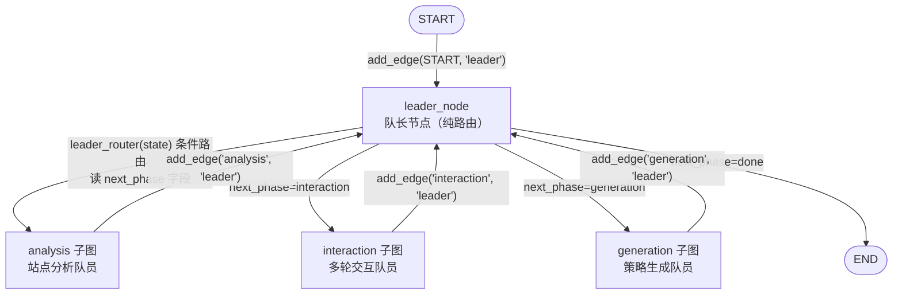
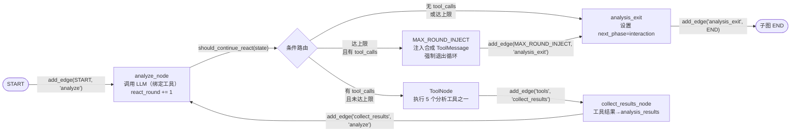
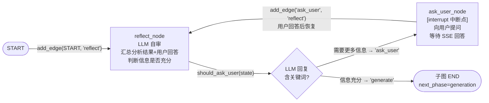
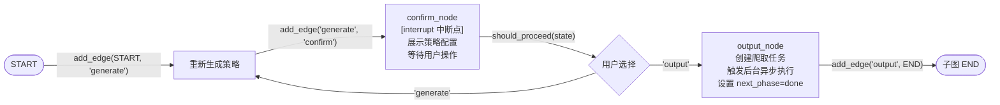

# 网页爬取 Agent — LangGraph 图结构调试手册

> **调试入口文件**
> - 根图：`agents/crawler_agent/graph.py`
> - 分析子图：`agents/crawler_agent/workers/analysis/graph.py`
> - 交互子图：`agents/crawler_agent/workers/interaction/graph.py`
> - 策略子图：`agents/crawler_agent/workers/generation/graph.py`
> - 状态定义：`agents/states/crawler_agent_state.py`
> - 队长节点：`agents/nodes/crawler_nodes/crawl_leader_node.py`
> - 各业务节点：`agents/nodes/crawler_nodes/` 目录下

---

## 一、总体架构：根图 + 子图



### 根图代码结构（graph.py）

```
StateGraph(CrawlerAgentState)
├── add_node('leader', leader_node)
├── add_node('analysis', build_analysis_subgraph())      # 子图节点
├── add_node('interaction', build_interaction_subgraph()) # 子图节点
├── add_node('generation', build_generation_subgraph())   # 子图节点
├── add_edge(START, 'leader')
├── add_conditional_edges('leader', leader_router, {
│       'analysis': 'analysis',
│       'interaction': 'interaction',
│       'generation': 'generation',
│       'done': END,
│   })
├── add_edge('analysis', 'leader')      # 子图完成 → 回队长
├── add_edge('interaction', 'leader')   # 子图完成 → 回队长
└── add_edge('generation', 'leader')    # 子图完成 → 回队长
```

### 队长节点（crawl_leader_node.py）

```python
async def leader_node(state) -> dict:
    # 首次运行（next_phase 为空）：基于 target_url 首次分流
    #   有 URL → 设置 next_phase='analysis'
    #   无 URL → 设置 next_phase='interaction'
    # 非首次：直接沿用队员已设置的 next_phase，不做任何修改
    return {}

def leader_router(state) -> str:
    # 直接返回 state.get('next_phase', 'interaction')
```

---

## 二、analysis 子图 — 站点预分析



### 子图代码结构

```
StateGraph(CrawlerAgentState)
├── add_node('analyze', analyze_node)
├── add_node('tools', ToolNode(CRAWLER_TOOLS))
├── add_node('collect_results', collect_results_node)
├── add_node(MAX_ROUND_INJECT, max_round_inject_node)
├── add_node('analysis_exit', _analysis_exit)
├── add_edge(START, 'analyze')
├── add_conditional_edges('analyze', should_continue_react, {
│       'tools': 'tools',
│       'reflect': 'analysis_exit',
│       MAX_ROUND_INJECT: MAX_ROUND_INJECT,
│   })
├── add_edge('tools', 'collect_results')
├── add_edge('collect_results', 'analyze')
├── add_edge(MAX_ROUND_INJECT, 'analysis_exit')
└── add_edge('analysis_exit', END)
```

### 工具列表（CRAWLER_TOOLS）

| 工具 | 文件 | 作用 |
|------|------|------|
| `fetch_robots_txt` | `agents/tools/fetch_robots_txt.py` | 获取 robots.txt |
| `fetch_sitemap` | `agents/tools/fetch_sitemap.py` | 获取站点地图 |
| `fetch_page` | `agents/tools/fetch_page.py` | 抓取单页面分析结构 |
| `test_anti_crawling` | `agents/tools/test_anti_crawling.py` | 检测反爬机制 |
| `analyze_url_patterns` | `agents/tools/analyze_url_patterns.py` | 分析 URL 路径模式 |

### 关键节点

**analyze_node** — ReAct 分析节点
- 压缩对话历史 → 注入系统提示词 → 调用 LLM（绑定工具） → react_round +1
- 默认 `max_react_rounds = 5`

**should_continue_react** — ReAct 循环路由
- `state.react_round >= max_react_rounds` + `有 tool_calls` → `MAX_ROUND_INJECT`
- `state.react_round >= max_react_rounds` + `无 tool_calls` → `'reflect'`
- `有 tool_calls` → `'tools'`
- `无 tool_calls` → `'reflect'`

**collect_results_node** — 工具结果采集
- 将 ToolNode 返回的 ToolMessage 序列化后追加到 `state.analysis_results`（dict[str, str]）
- key = 工具名，value = 结构化 JSON

**analysis_exit** — 退出节点
- 设置 `next_phase = 'interaction'` 交还队长

---

## 三、interaction 子图 — 多轮交互



### 子图代码结构

```
StateGraph(CrawlerAgentState)
├── add_node('reflect', reflect_node)
├── add_node('ask_user', ask_user_node)
├── add_edge(START, 'reflect')
├── add_conditional_edges('reflect', should_ask_user, {
│       'ask_user': 'ask_user',
│       'generate': END,
│   })
└── add_edge('ask_user', 'reflect')
```

### 关键节点

**reflect_node** — LLM 自审节点
1. 调用 `_build_analysis_summary(state)` 汇总 `analysis_results` + `user_answers`
2. 调用 LLM（不绑定工具）
3. 解析回复中是否含"需要更多信息"等关键词
4. 设置 `reflection_done = True`
5. 充分 → `next_phase = 'generation'`；不足 → `next_phase = ''`（子图内继续追问）

**should_ask_user** — 路由函数
- 读取 `state.messages` 最后一条
- 含 `['需要更多信息', '请提供', '需要您确认', '需要了解', '请告诉']` → `'ask_user'`
- 否则 → `'generate'`

**ask_user_node** — 中断节点
- 发出 `interrupt(value)` 暂停图执行
- 用户通过 SSE 回答后恢复
- 将回答追加到 `state.user_answers`

---

## 四、generation 子图 — 策略生成与确认



### 子图代码结构

```
StateGraph(CrawlerAgentState)
├── add_node('generate', generate_node)
├── add_node('confirm', confirm_node)
├── add_node('output', output_node)
├── add_edge(START, 'generate')
├── add_edge('generate', 'confirm')
├── add_conditional_edges('confirm', should_proceed, {
│       'output': 'output',
│       'generate': 'generate',
│   })
└── add_edge('output', END)
```

### 关键节点

**generate_node** — 策略生成节点
1. `_build_context(state)` 汇总 `target_url` + `analysis_results` + `user_answers`
2. 调用 LLM（不绑定工具）生成 crawl4ai 策略 JSON
3. `_extract_strategy_json()` 从 LLM 回复中提取（支持 3 种格式：直接 JSON、```json 代码块、{} 花括号块）
4. 写入 `state.strategy_config`

**confirm_node** — 策略确认节点（interrupt）
- 通过 `interrupt({'type': 'strategy_confirmation', 'strategy_config': ..., 'options': ['confirm', 'regenerate', 'modify']})` 暂停
- 用户选择：
  - `confirm` → 路由到 `output`
  - `regenerate` → 路由到 `generate`（重新调用 LLM）
  - `modify` → 路由到 `generate`（LLM 基于修改参数重新生成）

**should_proceed** — 确认路由
- 读 `state.confirm_action`：
  - `'confirm'` → `'output'`
  - `'regenerate'` / `'modify'` → `'generate'`

**output_node** — 输出节点
1. 调用 `WebCrawlerTaskService.create_task()` 创建爬取任务
2. 发送 `crawl.task.pending` 消息流
3. 设置 `next_phase = 'done'` 通知根图结束
4. 异常兜底：捕获 `ServiceException` 和未知异常，返回错误信息

---

## 五、状态定义（CrawlerAgentState）

```python
class CrawlerAgentState(TypedDict):
    # ── 公共字段（所有子图可读写）──
    messages:         Annotated[list[BaseMessage], add_messages]  # 对话消息列表
    target_url:       str              # 目标 URL
    next_phase:       str              # 阶段信号：'' | 'analysis' | 'interaction' | 'generation' | 'done'
    session_id:       int              # 会话 ID
    model_id:         int | None       # 模型 ID
    user_id:          int              # 用户 ID
    dept_id:          int | None       # 部门 ID
    create_by:        str              # 创建人
    message_id:       int | None       # 触发消息 ID
    task_id:          int | None       # 创建的任务 ID

    # ── analysis 子图 ──
    analysis_results:   dict[str, str]  # 工具分析结果 {工具名: JSON}
    react_round:        int            # ReAct 当前轮次
    max_react_rounds:   int            # 最大轮次（默认 5）
    reflection_done:    bool           # 自审完成标记

    # ── interaction 子图 ──
    user_answers:       dict[str, str]  # 用户回答 {问题摘要: 回答}

    # ── generation 子图 ──
    strategy_config:    dict | None     # 策略配置 JSON
    strategy_confirmed: bool            # 策略确认标记
    confirm_action:     str             # 用户动作：confirm/regenerate/modify
```

---

## 六、完整流程路径

### 路径 A：用户提供了 URL（标准路径）

```
START → leader
         → leader_router → 'analysis'（首次，有 target_url）
         → analysis 子图
                analyze → tools → collect_results → analyze → ... (ReAct 循环)
                → analysis_exit → END
         → leader（子图回队长）
         → leader_router → 'interaction'（analysis_exit 已设 next_phase）
         → interaction 子图
                reflect → [信息不足] → ask_user → [interrupt] → 用户回答 → reflect → ...
                → [信息充分] → END
         → leader（子图回队长）
         → leader_router → 'generation'（reflect 已设 next_phase）
         → generation 子图
                generate → confirm → [interrupt] → 用户确认 → output → END
         → leader（子图回队长）
         → leader_router → 'done' → END
```

### 路径 B：用户未提供 URL（从零开始）

```
START → leader
         → leader_router → 'interaction'（首次，无 target_url）
         → interaction 子图（直接进入交互流程收集需求）
                ...
         → leader → leader_router → 'generation'
         → generation 子图
                ... → END
         → leader → leader_router → 'done' → END
```

### 路径 C：用户选择 regenerate

```
... → confirm → [interrupt] → 用户选 'regenerate'
    → generate（重新调用 LLM）
    → confirm（再次 interrupt 等待确认）
    → ...
```

### 路径 D：ReAct 触顶强制退出

```
... → analyze（达到 max_react_rounds）
    → should_continue_react → MAX_ROUND_INJECT
    → tool_inject（注入合成 ToolMessage 作为兜底）
    → analysis_exit → ...（继续后续流程）
```

---

## 七、中断点汇总

| 中断点 | 所属子图 | 触发节点 | 等待内容 | 恢复方式 |
|--------|---------|---------|---------|---------|
| `ask_user` | interaction | `ask_user_node` | 用户对追问的回答 | SSE `Command(resume=...)` |
| `confirm` | generation | `confirm_node` | 用户对策略的选择（confirm/regenerate/modify） | SSE `Command(resume=...)` |

### 中断恢复的 SSE 交互

```
用户消息 → CrawlerAgentService.chat_stream()
         → 存储用户消息 → 推送确认事件
         → 构建本轮输入
         → Command(resume=user_message) 恢复图执行
         → 边推边存消息到业务表
```
