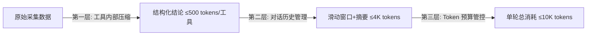

# 网页爬取 Agent 数据压缩方案

## 一、问题背景

网页爬取 Agent 在对话与执行过程中，会产生大量数据流转：

- **分析工具返回**：sitemap 可能包含数千条 URL，页面可提取上百个链接，原始数据直接灌入 LLM 上下文会导致 token 爆炸。
- **多轮对话历史**：Agent 对话累积 5-8 轮后，上下文可能膨胀到 50K+ tokens。
- **失败重试上下文**：Worker 静默调用 LLM 分析失败原因时，需要传入足够的上下文但不能过多。

核心目标：**控制 token 消耗、降低 Qwen-Plus 调用成本、避免触发模型 token 上限**。

---

## 二、Token 消耗结构分析

| 消耗源 | 典型体积 | 风险等级 | 说明 |
|--------|---------|---------|------|
| 系统提示词 | 2-5K tokens | 固定开销 | 精简后可控 |
| 工具返回结果 | 单次 1-50K tokens | **最大风险源** | sitemap/页面链接数据量大 |
| 多轮对话历史 | 累积 10-100K+ | **第二大风险源** | 随轮次线性增长 |
| Agent 推理输出 | 0.5-2K tokens | 可控 | 单次回复不长 |

---

## 三、分层压缩方案

数据流经的每个环节都执行压缩，逐层递减：



### 3.1 第一层：工具内部压缩（最关键）

每个 Tool 在返回给 Agent 前，自行完成「原始数据 → 结构化结论」的精炼。Agent 拿到的永远是**结论**而非**原始数据**。

#### 3.1.1 fetch_robots_txt

| 项目 | 说明 |
|------|------|
| 原始数据 | 完整 robots.txt 文本（可能几百行） |
| 压缩策略 | 解析规则后只返回结构化摘要，丢弃原始文本 |
| 压缩后返回 | ≤ 200 tokens |

```json
{
  "exists": true,
  "disallowed_paths": ["/admin", "/api", "/private"],
  "sitemap_url": "https://example.com/sitemap.xml",
  "crawl_delay": null,
  "verdict": "无特殊限制，允许爬取主要内容区域"
}
```

#### 3.1.2 fetch_sitemap

| 项目 | 说明 |
|------|------|
| 原始数据 | 完整 sitemap XML（可能几万条 URL） |
| 压缩策略 | 统计总量 + 按路径前缀分组计数 + 抽样 5 条代表性 URL，丢弃完整 URL 列表 |
| 压缩后返回 | ≤ 500 tokens |

```json
{
  "exists": true,
  "total_urls": 847,
  "sections": [
    {"path": "/blog/*", "count": 500, "content_type": "文章"},
    {"path": "/docs/*", "count": 300, "content_type": "文档"},
    {"path": "/changelog/*", "count": 47, "content_type": "更新日志"}
  ],
  "sample_urls": [
    "https://example.com/blog/getting-started",
    "https://example.com/docs/api-reference",
    "https://example.com/docs/guide/install"
  ],
  "last_modified": "2026-06-20",
  "verdict": "中型站点，847 个页面，主要内容在 /blog 和 /docs 两个板块"
}
```

#### 3.1.3 fetch_page

| 项目 | 说明 |
|------|------|
| 原始数据 | 完整 HTML + 所有链接（可能几百个） |
| 压缩策略 | 只提取页面结构特征（正文选择器、分页模式、链接统计），丢弃 HTML 内容和完整链接列表 |
| 压缩后返回 | ≤ 500 tokens |

```json
{
  "url": "https://example.com/docs",
  "content_type": "文档目录页",
  "title": "Documentation",
  "main_selector": "article.markdown-body",
  "has_pagination": true,
  "pagination_type": "numbered",
  "internal_links_count": 45,
  "external_links_count": 3,
  "js_rendered": false,
  "has_popup": false,
  "has_search": true,
  "verdict": "标准文档站，正文在 article 标签，有分页，无 JS 渲染依赖"
}
```

#### 3.1.4 test_anti_crawling

| 项目 | 说明 |
|------|------|
| 原始数据 | HTTP 响应头、JS 代码、挑战页面内容 |
| 压缩策略 | 只返回检测结论和等级，丢弃原始 HTTP 头和 JS 代码 |
| 压缩后返回 | ≤ 200 tokens |

```json
{
  "level": "轻度",
  "requires_js": false,
  "has_captcha": false,
  "rate_limit": null,
  "cloudflare": false,
  "waf_detected": false,
  "verdict": "无明显反爬机制，可直接爬取"
}
```

#### 3.1.5 analyze_url_patterns

| 项目 | 说明 |
|------|------|
| 原始数据 | URL 列表（可能几百条） |
| 压缩策略 | 归纳路径模式 + 深度分布统计，丢弃原始 URL 列表 |
| 压缩后返回 | ≤ 500 tokens |

```json
{
  "patterns": [
    {"pattern": "/blog/{slug}", "type": "文章页", "count": 200},
    {"pattern": "/docs/{category}/*", "type": "文档页", "count": 300},
    {"pattern": "/tag/{name}", "type": "标签聚合页", "count": 50}
  ],
  "depth_distribution": {"1": 5, "2": 50, "3": 400},
  "recommended_depth": 3,
  "verdict": "建议爬取深度 3，重点覆盖 /blog 和 /docs，/tag 为聚合页可排除"
}
```

#### 3.1.6 压缩后单轮工具总开销

| 工具 | 压缩后上限 |
|------|-----------|
| fetch_robots_txt | ≤ 200 tokens |
| fetch_sitemap | ≤ 500 tokens |
| fetch_page | ≤ 500 tokens |
| test_anti_crawling | ≤ 200 tokens |
| analyze_url_patterns | ≤ 500 tokens |
| **单轮工具总计** | **≤ 1,900 tokens** |

---

### 3.2 第二层：对话历史压缩

多轮对话累积是第二大 token 消耗源。

#### 3.2.1 工具调用结果折叠

工具调用的原始结果**不保留在 LLM 对话历史中**，只保留 Agent 基于工具结果生成的总结性回复。

| 存储位置 | 内容 | 用途 |
|---------|------|------|
| `web_crawler_message`（数据库） | 完整工具返回 JSON | 前端展示工具调用详情 |
| LLM 上下文 | Agent 的总结性回复 | Agent 推理依据 |

实现方式：构建 LangGraph State 时，过滤掉 `role='tool'` 的消息，只保留 `user` / `assistant` 消息。

#### 3.2.2 滑动窗口 + 历史摘要

保留最近 3 轮完整对话，更早的对话压缩为摘要：

```
[历史摘要] 用户要求爬取 xxx.com 的技术文档站点。Agent 分析后确认：
- 站点规模 847 页，主要内容在 /docs 和 /blog
- 无反爬机制，标准文档站
- 建议爬取深度 3
- 用户已确认配置：深度 3，范围 /docs/*，排除 /docs/archive/*
[最近 3 轮] 完整保留
```

摘要生成时机：当对话轮次超过 3 轮时，对第 N-3 轮之前的内容生成一次摘要，后续每新增一轮更新摘要。

摘要生成方式：使用 Qwen-Plus 对历史对话生成 ≤ 300 tokens 的结构化摘要。

#### 3.2.3 对话历史 Token 预算

| 组成 | 上限 |
|------|------|
| 历史摘要（如有） | ≤ 300 tokens |
| 最近 3 轮完整对话 | ≤ 3,700 tokens |
| **对话历史总计** | **≤ 4,000 tokens** |

---

### 3.3 第三层：Token 预算管控

给 Agent 设定硬性 token 预算上限：

| 环节 | 预算上限 | 说明 |
|------|---------|------|
| 系统提示词 | ≤ 3,000 tokens | 精简指令，不含示例代码 |
| 单次工具返回 | ≤ 500 tokens / 工具 | 工具内部压缩 |
| 对话历史 | ≤ 4,000 tokens | 滑动窗口 + 摘要 |
| Agent 单次输出 | ≤ 2,000 tokens | 限制回复长度 |
| **单轮总消耗** | **≤ 10,000 tokens** | 含所有输入输出 |

---

## 四、执行阶段静默调用的压缩

Worker 静默调用 Agent LLM 分析失败原因时，**不传对话历史**，只传失败上下文：

| 上下文项 | 内容 | 上限 |
|---------|------|------|
| 错误信息 | `error_code` + `error_message` | ≤ 200 tokens |
| 当前配置 | `crawl_config` 的关键参数 | ≤ 300 tokens |
| 已尝试修复 | 修复措施列表 | ≤ 200 tokens |
| 系统指令 | 精简的修复指导提示词 | ≤ 500 tokens |
| **总计** | | **≤ 1,200 tokens** |

单次修复成本：输入 ¥0.001，输出 ¥0.004，几乎可忽略。

---

## 五、成本估算

按 Qwen-Plus 定价（输入 ¥0.8/百万 tokens，输出 ¥2/百万 tokens）：

| 场景 | 输入 tokens | 输出 tokens | 单次成本 |
|------|-----------|-----------|---------|
| 单轮对话（含工具调用） | ~8,000 | ~1,500 | ≈ ¥0.01 |
| 完整策略生成会话（6 轮） | ~48,000 | ~9,000 | ≈ ¥0.06 |
| 静默修复调用 | ~1,200 | ~500 | ≈ ¥0.002 |
| 单个任务全生命周期 | ~50,000 | ~10,000 | ≈ ¥0.06 |

---

## 六、实现要点

### 6.1 工具层实现

每个工具函数内部实现压缩逻辑：

```python
async def fetch_sitemap(url: str) -> dict:
    """获取并压缩 sitemap 数据"""
    raw_xml = await _fetch_raw_sitemap(url)  # 原始 XML
    urls = _parse_sitemap(raw_xml)            # 解析 URL 列表
    
    # 压缩：按路径分组统计 + 抽样
    sections = _group_by_path_prefix(urls)
    sample = _random_sample(urls, n=5)
    
    return {
        "exists": True,
        "total_urls": len(urls),
        "sections": sections,       # 按路径前缀分组计数
        "sample_urls": sample,      # 5 条代表性 URL
        "verdict": _generate_verdict(len(urls), sections)
    }
```

### 6.2 对话历史管理实现

```python
def build_llm_messages(session_messages: list, max_history_rounds: int = 3) -> list:
    """构建 LLM 上下文消息列表，应用压缩策略"""
    # 1. 过滤掉 tool 角色消息（工具结果折叠）
    filtered = [m for m in session_messages if m.role != "tool"]
    
    # 2. 分组：历史摘要 + 最近 N 轮
    if len(filtered) > max_history_rounds * 2:
        old_messages = filtered[:-(max_history_rounds * 2)]
        recent_messages = filtered[-(max_history_rounds * 2):]
        summary = generate_summary(old_messages)  # Qwen-Plus 生成摘要
        return [{"role": "system", "content": summary}] + recent_messages
    
    return filtered
```

### 6.3 静默调用上下文构建

```python
def build_retry_context(task: CrawlTask, retry_history: list) -> list:
    """构建失败重试的 LLM 上下文，不含对话历史"""
    return [
        {"role": "system", "content": RETRY_SYSTEM_PROMPT},  # ≤ 500 tokens
        {"role": "user", "content": json.dumps({
            "error_code": task.error_code,
            "error_message": task.error_message,
            "crawl_config_key_params": extract_key_params(task.crawl_config),
            "retry_history": retry_history,
        })}
    ]
```

---

## 七、监控与调优

### 7.1 Token 消耗监控

在每次 LLM 调用后记录实际 token 消耗：

```python
@dataclass
class TokenUsage:
    prompt_tokens: int
    completion_tokens: int
    total_tokens: int
    context_breakdown: dict  # {"system": 2500, "tools": 1200, "history": 3000, "current": 500}
```

写入日志，用于后续调优各环节预算分配。

### 7.2 压缩效果验证

| 指标 | 目标值 | 监控方式 |
|------|-------|---------|
| 单轮 token 消耗 | ≤ 10K | LLM 响应日志 |
| 工具返回体积 | ≤ 500 tokens/工具 | 工具执行日志 |
| 对话历史体积 | ≤ 4K tokens | 上下文构建日志 |
| 摘要触发轮次 | 第 4 轮开始 | 对话管理日志 |
