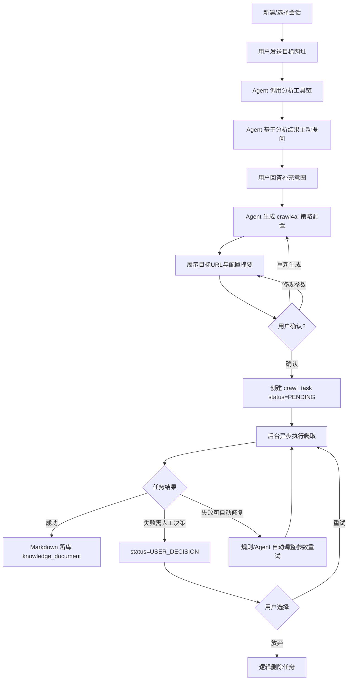
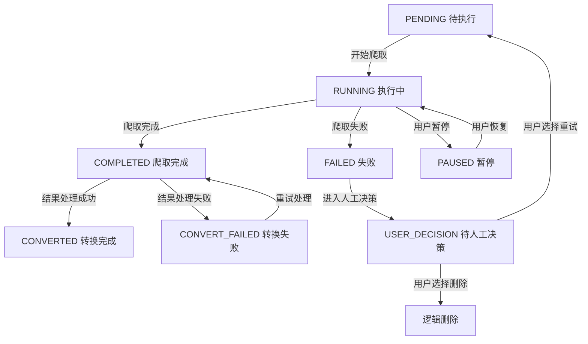
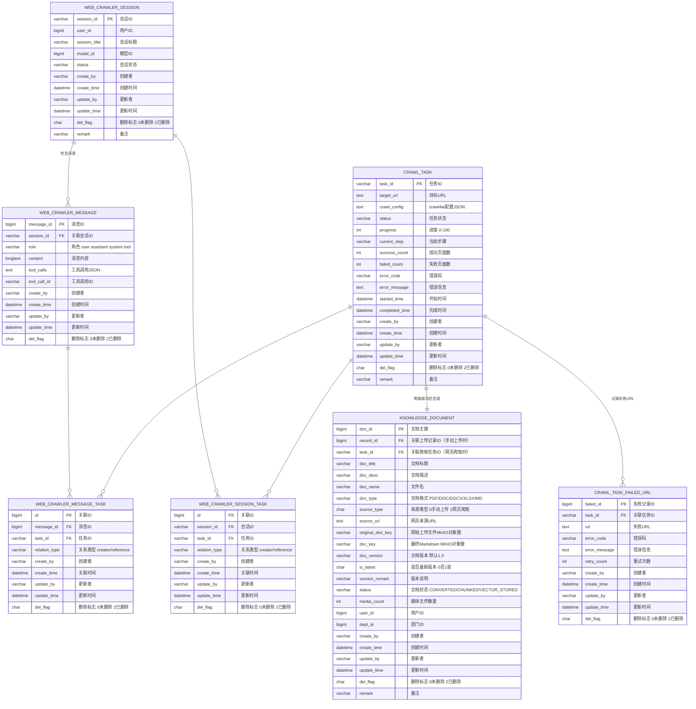

# 网页爬取 Agent 需求设计

## 一、需求背景与目标

### 1.1 背景

随着 RAG（检索增强生成）知识库建设的深入，系统需要持续补充高质量的 Markdown 格式数据源。当前知识库数据主要依赖人工整理与单文件上传，来源单一、入库效率低，难以支撑对公开网站、技术文档站、产品博客等整站内容的自动化采集。

网页爬取技术存在较高门槛：crawl4ai 涉及深度爬取策略（BFS/DFS/BestFirst）、URL 过滤链、反爬对抗、代理轮换、HTML 解析、缓存配置、Hook 注入等七大配置主题，普通用户难以理解这些技术参数的含义和抉择。

为扩展知识来源、降低人工录入成本，需要建设一套**爬取顾问型 Agent**：用户仅提供目标网址，Agent 自动执行站点预分析（robots.txt、sitemap、页面结构、反爬检测），基于分析结果主动向用户发起业务导向的提问（如板块选择、范围限定），而非要求用户提供技术参数。Agent 根据分析结果与用户回答，自动生成完整的 crawl4ai 爬取策略配置，经用户确认后提交后台异步任务执行，最终将爬取结果 Markdown 落库，纳入统一的 `knowledge_document` 文档主表管理。

### 1.2 目标

- 前端新增「知识管理 → 网页爬虫」独立页面，支持会话式 Agent 交互、策略确认、任务进度感知与结果管理。
- 后端在 `knowledge-content` 中实现基于 LangGraph + crawl4ai 的整站爬取 Agent：
  - Agent 作为「爬取顾问」，通过站点预分析 + 主动提问引导用户完成 crawl4ai 七大配置主题的策略生成；
  - 5 个分析工具（`fetch_robots_txt`、`fetch_sitemap`、`fetch_page`、`test_anti_crawling`、`analyze_url_patterns`）作为 LangGraph Tool 注册，返回结构化 JSON；
  - 大模型选用 Qwen-Plus，通过 LangChain `ChatTongyi` 接入；
  - crawl4ai 负责实际整站爬取与结构化 Markdown 输出；
  - 爬取结果写入 MinIO，并生成 `knowledge_document` 记录。
- 对话阶段（策略生成）与执行阶段（爬取任务）解耦：对话通过 SSE 流式响应，爬取通过后台异步任务执行。
- `knowledge-common` 提供 `ai_models` 等共享模型配置能力，`knowledge-admin` 保留模型管理入口。
- 本次范围不涉及 embedding 与文档分块的具体实现，但表结构需预留扩展字段。

### 1.3 范围边界

| 范围 | 说明 |
|------|------|
| 包含 | 网页爬虫页面、LangGraph Agent、crawl4ai 爬取执行、任务状态管理、爬取结果落库、文档版本管理 |
| 不包含 | embedding 计算、文档分块、向量库写入、检索排序逻辑 |
| 依赖 | `knowledge-admin` 的 AI 模型配置、`knowledge-common` 的共享 DO/DAO/VO/消息流 |

---

## 二、总体流程

### 2.1 流程全景



### 2.2 模块职责

| 模块 | 职责 |
|------|------|
| `knowledge-web` | 新增「知识管理 → 网页爬虫」独立页面；通过代理访问 `knowledge-content` 接口 |
| `knowledge-content` | LangGraph Agent、crawl4ai 爬取执行、任务状态更新、文档落库；复用资料上传的 MinIO 服务、文档落库逻辑、版本管理接口 |
| `knowledge-admin` | 保留 AI 模型管理页面，模型配置共享给 `knowledge-content` |
| `knowledge-common` | 兼容层：共享 `ai_models` DO/DAO/VO、消息流基础设施、MinIO/Redis 通用能力 |

#### 复用组件说明

网页爬取功能复用资料上传的以下组件：

| 组件 | 说明 |
|------|------|
| `KnowledgeMinioService` | MinIO 文件上传、下载、删除等操作 |
| `KnowledgeDocumentDao` | 文档主表 CRUD 操作 |
| `/document-parse/next-version` | 版本号预生成接口 |
| `DocumentSourceType` | 文档来源类型枚举（手动上传/网页爬取） |
| `DocumentStatus` | 文档状态枚举（CONVERTED/CHUNKED/VECTOR_STORED） |

### 2.3 数据流转总览

| 核心表 | 作用 |
|--------|------|
| `web_crawler_session` | 存储 Agent 会话基本信息与状态 |
| `web_crawler_message` | 存储会话中的 user/assistant/system/tool 消息 |
| `web_crawler_session_task` | 会话与爬取任务的关联 |
| `web_crawler_message_task` | 消息与爬取任务的关联 |
| `crawl_task` | 存储爬取任务状态、进度、配置、结果统计 |
| `crawl_task_failed_url` | 存储爬取失败的 URL 明细 |
| `knowledge_document` | 爬取成功后生成的文档主表记录 |

### 2.4 Agent 策略生成设计

#### 2.4.1 架构模型

Agent 采用 **主 Agent + 纯 Tool** 架构（非 Sub-agent、非 Skill）：

- **主 Agent**：一个 LangGraph Agent 实例，加载系统提示词，持有 5 个分析工具，负责全流程的意图理解、分析调度、提问引导、策略生成。
- **Tool**：5 个纯 Python 函数，不包含 LLM 调用，仅执行确定性的数据采集与解析，返回结构化 JSON。Agent 根据返回结果自行推理和决策。
- **大模型**：Qwen-Plus，通过 LangChain `ChatTongyi` 接入，工具调用稳定、中文理解强、成本低。

#### 2.4.2 分析工具链

| 工具 | 输入 | 输出 | 作用 |
|------|------|------|------|
| `fetch_robots_txt` | `url: str` | `{exists, content, parsed_rules}` | 读取 robots.txt，解析允许/禁止爬取路径 |
| `fetch_sitemap` | `url: str` | `{exists, url_count, sample_urls, content_types}` | 读取 sitemap.xml，获取站点 URL 结构与规模 |
| `fetch_page` | `url: str` | `{title, content_type, encoding, links, forms, pagination, content_structure}` | 抓取单页面，分析页面结构、链接分布、分页模式 |
| `test_anti_crawling` | `url: str` | `{requires_js, has_captcha, rate_limit_detected, challenge_type}` | 检测目标站点反爬机制：是否需要 JS 渲染、是否有验证码、是否限速 |
| `analyze_url_patterns` | `urls: list[str]` | `{patterns, path_segments, content_types, pagination_params}` | 分析 URL 列表的路径模式，推断目录结构与内容分类 |

#### 2.4.3 策略生成按七大配置主题归类

Agent 生成的 `crawl_config` JSON 对应 crawl4ai 七大配置主题，每个主题的参数来源如下：

**主题 1：基础配置（BrowserConfig + CrawlerRunConfig）**

| 参数 | 来源 | 说明 |
|------|------|------|
| `headless` | 默认值 `True` | 无需用户参与 |
| `viewport` | 默认值 `1920x1080` | 无需用户参与 |
| `enable_stealth` | 默认值 `True` | 无需用户参与 |
| `user_agent_mode` | 默认值 `random` | 无需用户参与 |
| `stream` | 默认值 `True` | 无需用户参与 |
| `page_timeout` | Agent 根据 `test_anti_crawling` 结果自动决策 | 反爬严格时适当延长 |
| `wait_until` | Agent 根据 `fetch_page` 结果自动决策 | JS 渲染页面用 `networkidle` |

**主题 2：深度爬取策略**

| 参数 | 来源 | 说明 |
|------|------|------|
| `crawl_strategy` | Agent 根据 `fetch_sitemap` + `fetch_page` 分析自动决策 | 根据站点规模和结构选择 BFS/DFS/BestFirst |
| `max_depth` | **用户确认** | 需用户决定爬取深度（默认建议 3） |
| `max_pages` | **用户确认** | 需用户决定最大页面数 |
| `include_patterns` | **用户确认** | 用户指定要爬取的路径模式 |
| `exclude_patterns` | **用户确认** | 用户指定要排除的路径模式 |
| `filter_chain` | Agent 根据分析结果自动配置 | 如过滤 PDF/图片链接、排除外部域名等 |

**主题 3：反爬对抗**

| 参数 | 来源 | 说明 |
|------|------|------|
| `anti_crawling_level` | Agent 根据 `test_anti_crawling` 结果自动决策 | 检测到反爬时提升对抗等级 |
| `delay_between_requests` | Agent 根据反爬检测结果自动决策 | 检测到限速时增加延迟 |
| `rotate_user_agent` | 默认值 `True` | 无需用户参与 |

**主题 4：代理轮换**

| 参数 | 来源 | 说明 |
|------|------|------|
| `proxy_list` | **用户确认**（可选） | 用户可提供代理列表，否则不使用代理 |
| `proxy_rotation_strategy` | Agent 自动决策 | 有代理时自动启用 RoundRobinProxyStrategy |

**主题 5：HTML 解析**

| 参数 | 来源 | 说明 |
|------|------|------|
| `content_selector` | Agent 根据 `fetch_page` 分析自动决策 | 分析页面结构自动定位正文区域 |
| `extract_media` | **用户确认** | 用户决定是否下载图片等媒体文件 |
| `media_download_path` | 默认值 | MinIO 上传路径 |
| `markdown_generator` | Agent 自动决策 | 根据页面类型选择合适的 Markdown 生成策略 |

**主题 6：缓存配置**

| 参数 | 来源 | 说明 |
|------|------|------|
| `cache_mode` | Agent 固定 `CacheMode.ENABLED` | 启用缓存，相同 URL 不重复请求（页级去重） |

缓存语义说明：
- `ENABLED`：启用缓存（相同 URL 不再重复请求，用于正常爬取）
- `BYPASS`：不读缓存但写入缓存（调试用，每次重新请求）
- `DISABLED`：完全禁用缓存（极少使用）

缓存配置由 Agent 固定使用 `ENABLED`，无需用户参与。

**主题 7：Hook 注入**

| 参数 | 来源 | 说明 |
|------|------|------|
| `on_page_start` | Agent 按需配置 | 如注入页面预处理逻辑 |
| `on_page_end` | Agent 按需配置 | 如注入内容后处理、格式清洗 |
| `on_error` | Agent 按需配置 | 错误处理 Hook |

#### 2.4.4 参数三分类与权责模型

将 crawl4ai 全部参数分为三类：

**第一类：默认值（20 项）— 不分析、不提问**

这些参数使用 crawl4ai 默认值或固定值即可，Agent 不需要分析，也不向用户提问：
`headless`、`viewport`、`enable_stealth`、`user_agent_mode`、`stream`、`rotate_user_agent`、`cache_mode`、`accept_downloads`、`screenshot`、`pdf`、`ocr`、`ocr_provider`、`css_selector`、`target_elements`、`word_count_threshold`、`excluded_tags`、`exclude_external_links`、`remove_overlay_elements`、`virtual_scroll_height`、`semchunk_label`。

**第二类：Agent 自动推导（13 项）— 分析后自行决策**

Agent 调用分析工具后，基于结构化返回结果自行推理决策，不向用户提问：
`crawl_strategy`、`filter_chain`、`anti_crawling_level`、`delay_between_requests`、`content_selector`、`markdown_generator`、`page_timeout`、`wait_until`、`proxy_rotation_strategy`、`on_page_start`、`on_page_end`、`on_error`、`media_download_path`。

**第三类：用户确认（8 项）— 主动提问引导**

Agent 通过提问引导用户确认，用户回答后写入配置：
`max_depth`、`max_pages`、`include_patterns`、`exclude_patterns`、`proxy_list`、`extract_media`、`extract_images`、`image_resolution_threshold`。

#### 2.4.5 参数权责规则

- **用户确认的参数**：爬取出问题需要调整时，必须通知用户确认后才能修改。
- **Agent 自动推导的参数**：爬取出问题时，Agent 自行决策调整，无需通知用户。
- **默认值参数**：同 Agent 自动推导参数，Agent 可自行决策调整。

核心原则：**用户管「爬什么」（范围、深度、媒体），Agent 管「怎么爬」（策略、反爬、解析）**。

---

## 三、状态机与数据库标记

### 3.1 会话状态 `web_crawler_session.status`

| 状态值 | 含义 | 触发场景 |
|--------|------|----------|
| `ACTIVE` | 会话进行中 | 默认状态 |
| `CLOSED` | 会话已关闭 | 用户主动关闭或长时间未操作 |

### 3.2 消息角色 `web_crawler_message.role`

| 角色值 | 含义 | 入库时机 |
|--------|------|----------|
| `user` | 用户消息 | 用户发送消息后立即写入 |
| `assistant` | AI 回复 | Agent 完整回复结束后写入 |
| `system` | 系统提示 | 会话初始化或系统通知时写入 |
| `tool` | 工具调用结果 | Agent 调用工具后写入 |

### 3.3 爬取任务状态 `crawl_task.status`

| 状态值 | 含义 | 数据库标记变化 |
|--------|------|----------------|
| `PENDING` | 待执行 | `crawl_task.status='PENDING'`，`progress=0` |
| `RUNNING` | 执行中 | `crawl_task.status='RUNNING'`，`started_time=NOW()`，定时刷新 `progress`/`current_step` |
| `COMPLETED` | 爬取完成 | `crawl_task.status='COMPLETED'`，`progress=100`，`completed_time=NOW()`，等待结果处理 |
| `CONVERTED` | 转换完成 | `crawl_task.status='CONVERTED'`，爬取结果已写入 MinIO 并创建 `knowledge_document` |
| `CONVERT_FAILED` | 转换失败 | `crawl_task.status='CONVERT_FAILED'`，爬取结果写入 MinIO 失败，等待重试 |
| `FAILED` | 失败 | `crawl_task.status='FAILED'`，写入 `error_code`/`error_message`，记录 `crawl_task_failed_url` |
| `USER_DECISION` | 待人工决策 | `crawl_task.status='USER_DECISION'`，爬取失败或超时，等待用户选择重试或删除 |
| `PAUSED` | 暂停 | 用户手动暂停（可选） |

#### 状态流转说明



### 3.4 失败记录 `crawl_task_failed_url`

- 单页爬取失败不中断整站任务，持续记录到 `crawl_task_failed_url`。
- 对超时、`503` 等 transient 错误按 `retry_count` 做有限重试。
- 浏览器进程崩溃、OOM、策略性失败需重新拉取任务，配合 `CacheMode.ENABLED` 减少重复请求。

### 3.5 版本管理标记

网页爬取文档的版本管理复用资料上传的版本管理机制：

- `knowledge_document` 以 `(doc_title, doc_version)` 联合唯一；`doc_title` 本身不唯一，同一标题可存在多版本，删除记录通过 `del_flag` 标记，不影响后续同名同版本重建。
- 版本号生成规则：复用 `/document-parse/next-version` 接口，查询该标题当前最大版本号，整数递增生成新版本号（如 `1.0` → `2.0`）。
- 爬取任务完成创建 `knowledge_document` 时，调用版本号预生成接口获取新版本号，写入 `doc_version` 字段，并更新该标题其他未删除记录的 `is_latest='0'`。
- `knowledge_document.is_latest` 表示已落库文档维度最新版（RAG 检索使用），同一标题下仅允许一条 `is_latest='1'` 的未删除记录。
- 默认文档列表（RAG 检索范围）只展示 `knowledge_document` 中 `is_latest='1'` 的记录。
- 与资料上传版本管理的一致性：网页爬取文档与手动上传文档共享同一版本管理规则，确保版本号连续性和 `is_latest` 标记的一致性。

---

## 四、前端页面与功能点

### 4.1 菜单结构

```
知识管理
├── 网页爬虫
├── 资料上传
└── embedding（占位）
```

### 4.2 网页爬虫页面

页面采用「左侧会话列表 + 右侧聊天区」布局。

#### 4.2.1 会话管理模块

- 新建爬取会话（调用 `POST /api/rag/crawler/session`）。
- 历史会话列表分页展示，支持按标题搜索（调用 `GET /api/rag/crawler/session/list`）。
- 点击会话加载历史消息并继续对话（调用 `GET /api/rag/crawler/session/{session_id}/messages`）。
- 会话重命名（调用 `PUT /api/rag/crawler/session/{session_id}`）。
- 删除会话（调用 `DELETE /api/rag/crawler/session/{session_id}`，级联软删除消息）。
- 会话状态展示：`ACTIVE` / `CLOSED`。

#### 4.2.2 Agent 聊天区模块

- 消息输入框：支持多行文本与换行。
- 发送消息：将 `user` 消息入库，并触发 SSE 流。
- SSE 流式返回 AI 回复（调用 `POST /api/rag/crawler/chat`）。
- Agent 交互流程：
  1. 用户发送目标网址后，Agent 调用分析工具链（`fetch_robots_txt`、`fetch_sitemap` 等），工具调用过程以 `tool` 角色消息实时展示。
  2. 分析完成后，Agent 基于结果主动提问引导用户补充意图（如「您希望爬取哪些板块？」「需要下载图片吗？」）。
  3. 用户回答后，Agent 生成完整的 crawl4ai 策略配置摘要，展示为结构化卡片。
  4. 用户确认后，对话阶段结束，进入后台任务执行阶段。
- 工具调用可视化：Agent 调用分析工具时，前端以折叠卡片展示工具名称、输入参数、返回结果（`tool` 角色消息）。
- 停止生成：前端中断 SSE 连接，已接收内容可选择性保存为不完整 `assistant` 消息。
- 重新生成最后一条回复：重新调用 SSE 接口。
- 模型选择下拉：从 `knowledge-admin` 已配置模型中选择，写入 `web_crawler_session.model_id`。
- 消息角色区分渲染：`user` / `assistant` / `system` / `tool`。
- Markdown / 代码块渲染。
- 复制单条消息。
- 清空当前会话消息（仅前端清空，可保留后端记录）。

#### 4.2.3 爬取策略确认模块

- Agent 分析用户意图后展示目标 URL。
- 展示生成的 crawl4ai 配置摘要（爬取深度、FilterChain、反爬参数等）。
- 用户可选择「确认配置」「重新生成」「修改参数」。
- 用户可修改部分参数（如最大深度、排除路径）。
- 确认后提交后台爬取任务（调用 `POST /api/rag/crawler/task`）。

#### 4.2.4 任务进度与结果模块

- 当前任务实时进度条：轮询 `GET /api/rag/crawler/task/{task_id}`。
- 任务状态展示：`PENDING` / `RUNNING` / `COMPLETED` / `FAILED`。
- 成功页面数 / 失败页面数展示。
- 当前执行步骤提示。
- 历史爬取任务列表。
- 任务详情弹窗。
- 爬取结果文档列表（调用 `GET /api/rag/crawler/document/list`）。
- Markdown 文档预览。
- 文档下载。
- 失败 URL 明细查看（调用 `GET /api/rag/crawler/task/{task_id}/failed-urls`）。
- 任务失败原因提示与重试入口。

### 4.3 页面流转逻辑

1. 用户进入「网页爬虫」页面，默认展示最新会话或空状态。
2. 新建会话后，右侧聊天区显示系统欢迎语（`system` 消息）。
3. 用户输入目标网站意图，前端发送消息并开启 SSE。
4. Agent 返回配置摘要卡片，前端渲染策略确认组件。
5. 用户确认后，前端调用提交任务接口，任务进入 `PENDING`。
6. 前端轮询任务状态，展示进度条与步骤。
7. 任务 `COMPLETED` 后，展示结果文档列表，支持预览/下载。
8. 任务 `FAILED` 后，展示失败原因与失败 URL 明细，提供重试入口。

---

## 五、后端接口

接口统一前缀：`/api/rag`

### 5.1 创建会话

- **接口**：`POST /api/rag/crawler/session`
- **核心参数**：
  - `session_title`：会话标题
  - `model_id`：模型 ID
- **执行流程**：
  1. 生成 `session_id`（UUID 或雪花算法字符串）。
  2. 插入 `web_crawler_session`：
     - `session_id` = 生成值
     - `user_id` = 当前用户 ID
     - `session_title` = 入参
     - `model_id` = 入参
     - `status` = `'ACTIVE'`
     - `create_by` / `create_time` / `update_by` / `update_time` 自动填充
     - `del_flag` = `'0'`
  3. 返回 `AjaxResult.success(session_id)`。

### 5.2 会话列表

- **接口**：`GET /api/rag/crawler/session/list`
- **核心参数**：
  - `page_num`：页码
  - `page_size`：每页条数
  - `session_title`：搜索关键词（可选）
- **执行流程**：
  1. 按 `user_id` 与 `del_flag='0'` 过滤。
  2. 若 `session_title` 非空，按标题模糊查询。
  3. 分页查询 `web_crawler_session`，按 `create_time` 降序。
  4. 返回列表与分页信息。

### 5.3 重命名会话

- **接口**：`PUT /api/rag/crawler/session/{session_id}`
- **核心参数**：
  - `session_title`：新标题
- **执行流程**：
  1. 校验会话归属当前用户。
  2. 更新 `web_crawler_session.session_title`。
  3. 更新 `update_by` / `update_time`。

### 5.4 删除会话

- **接口**：`DELETE /api/rag/crawler/session/{session_id}`
- **执行流程**：
  1. 校验会话归属当前用户。
  2. 软删除 `web_crawler_session`：`del_flag='2'`，更新 `update_by` / `update_time`。
  3. 级联软删除 `web_crawler_message`：`del_flag='2'`。

### 5.5 获取历史消息

- **接口**：`GET /api/rag/crawler/session/{session_id}/messages`
- **核心参数**：
  - `page_num`：页码
  - `page_size`：每页条数
- **执行流程**：
  1. 校验会话归属当前用户。
  2. 按 `session_id` 与 `del_flag='0'` 查询 `web_crawler_message`。
  3. 按 `create_time` 升序分页返回。

### 5.6 Agent 对话（SSE）

- **接口**：`POST /api/rag/crawler/chat`
- **Content-Type**：`text/event-stream`
- **核心参数**：
  - `session_id`：会话 ID
  - `content`：用户消息内容
- **执行流程**：
  1. 校验会话归属当前用户且 `status='ACTIVE'`。
  2. 插入 `web_crawler_message`：
     - `session_id` = 入参
     - `role` = `'user'`
     - `content` = 入参
     - `create_by` / `create_time` 自动填充
     - `del_flag` = `'0'`
  3. 读取会话历史消息（`user` / `assistant` / `tool`），构建 LangGraph State。
  4. 流式调用 LangGraph Agent，逐段返回内容给前端。
  5. 完整回复结束后，插入 `web_crawler_message`：
     - `role` = `'assistant'`
     - `content` = 完整回复内容
     - `tool_calls` = 若有工具调用则存 JSON
  6. 若触发工具调用，额外插入 `role='tool'` 的记录，包含 `tool_call_id` 与工具返回结果。

### 5.7 提交爬取任务

- **接口**：`POST /api/rag/crawler/task`
- **核心参数**：
  - `session_id`：会话 ID
  - `message_id`：触发任务的消息 ID
  - `target_url`：目标 URL
  - `crawl_config`：crawl4ai 配置 JSON
- **执行流程**：
  1. 生成 `task_id`（建议 `crawl_` 前缀 + UUID）。
  2. 插入 `crawl_task`：
     - `task_id` = 生成值
     - `target_url` = 入参
     - `crawl_config` = 入参
     - `status` = `'PENDING'`
     - `progress` = `0`
     - `success_count` = `0`
     - `failed_count` = `0`
     - `create_by` / `create_time` / `update_by` / `update_time` 自动填充
     - `del_flag` = `'0'`
  3. 插入 `web_crawler_session_task`：
     - `session_id` = 入参
     - `task_id` = 生成值
     - `relation_type` = `'creator'`
  4. 插入 `web_crawler_message_task`：
     - `message_id` = 入参
     - `task_id` = 生成值
     - `relation_type` = `'creator'`
  5. 发布后台任务开始爬取（直接调用异步任务或消息流）。
  6. 返回 `AjaxResult.success(task_id)`。

### 5.8 查询爬取任务

- **接口**：`GET /api/rag/crawler/task/{task_id}`
- **执行流程**：
  1. 查询 `crawl_task` 状态、进度、`current_step`、成功/失败数、错误信息。
  2. 返回任务快照。

### 5.9 失败 URL 列表

- **接口**：`GET /api/rag/crawler/task/{task_id}/failed-urls`
- **核心参数**：
  - `page_num`：页码
  - `page_size`：每页条数
- **执行流程**：
  1. 按 `task_id` 与 `del_flag='0'` 查询 `crawl_task_failed_url`。
  2. 按 `create_time` 降序分页返回。

### 5.10 爬取结果文档列表

- **接口**：`GET /api/rag/crawler/document/list`
- **核心参数**：
  - `task_id`：任务 ID
  - `page_num`：页码
  - `page_size`：每页条数
- **执行流程**：
  1. 按 `task_id` 与 `del_flag='0'` 查询 `knowledge_document`。
  2. 过滤 `source_type='1'`（网页爬取）。
  3. 分页返回文档列表。

---

## 六、消费者与定时任务

### 6.1 爬取任务执行器

- **类型**：后台异步任务 / 消费者
- **触发方式**：接口 `POST /api/rag/crawler/task` 提交后直接触发，或消费消息流中的 `crawler.task.pending`
- **核心流程**：
  1. 读取 `crawl_task.crawl_config` 与 `target_url`。
  2. 更新 `crawl_task.status='RUNNING'`，`started_time=NOW()`。
  3. 使用 crawl4ai 执行整站爬取：
     - 固定参数：`headless=True`、`viewport=1920x1080`、`enable_stealth=True`、`user_agent_mode='random'`、`cache_mode=ENABLED`、`stream=True`。
  4. 每爬取一页，更新 `crawl_task.progress`、`current_step`、`success_count`、`failed_count`。
  5. 单页失败时：
     - 记录 `crawl_task_failed_url`（`url`、`error_code`、`error_message`、`retry_count`）。
     - 对 transient 错误尝试重试，更新 `retry_count`。
  6. 全部完成后：
     - 将 Markdown 写入 MinIO。
     - 处理图片等媒体文件上传 MinIO 并替换链接。
     - 创建 `knowledge_document`：
       - `task_id` = 当前任务 ID
       - `source_type` = `'1'`
       - `source_url` = 目标 URL
       - `doc_key` = Markdown MinIO 对象键
       - `status` = `'CONVERTED'`
       - `is_latest` = `'1'`
       - 同标题旧版本 `is_latest='0'`
     - 更新 `crawl_task.status='COMPLETED'`，`progress=100`，`completed_time=NOW()`。
  7. 整体失败时，进入失败处理流程（见 6.3）。

### 6.2 爬取任务状态兜底定时任务

- **类型**：定时任务
- **触发方式**：每分钟扫描一次
- **核心流程**：
  1. 扫描 `status='RUNNING'` 且长时间未更新的 `crawl_task`。
  2. 若判定为卡死或浏览器崩溃，将任务状态回退为 `PENDING` 或标记为 `FAILED`。
  3. 支持重新拉起任务（利用 `CacheMode.ENABLED` 减少重复请求）。

### 6.3 失败自动修复机制

任务失败时，执行器不直接标记 `FAILED`，而是按以下分层策略自动修复：

**第一层：规则可判定 — Worker 自动重试**

以下场景 Worker 可直接调整参数重试，无需 LLM 推理，最多重试 3 次：

| 错误类型 | 自动调整策略 |
|---------|-------------|
| 浏览器进程崩溃 / OOM | 降低 `max_pages`，减小并发，重启浏览器重试 |
| 页面超时（page_timeout） | 自动延长 `page_timeout` 重试 |
| 连接重置 / 网络瞬断 | 等待退避后重试（指数退避） |
| 429 限速 | 增大 `delay_between_requests` 重试 |
| 403 / Cloudflare 挑战 | 提升反爬对抗等级，开启 stealth 模式重试 |

**第二层：需要推理 — 静默调 Agent LLM**

规则无法覆盖的复杂失败场景，Worker 静默调用 Agent LLM（不通知用户）：

- 将失败上下文（错误信息、已尝试的修复措施、当前 `crawl_config`）传入 LLM。
- LLM 分析失败原因，返回调整后的 `crawl_config` 参数补丁。
- Worker 合并参数补丁后重试，最多 1 次。
- 此过程用户无感知，不产生消息记录。

**第三层：自动修复用尽 — USER_DECISION**

当自动修复全部用尽且失败原因为用户确认的参数问题时，任务进入 `USER_DECISION` 状态：

- 仅当失败与用户确认的参数（`max_depth`、`max_pages`、`include_patterns`、`exclude_patterns`、`proxy_list`、`extract_media`）相关时，才升级为 USER_DECISION。
- 若失败与 Agent/默认参数相关但自动修复用尽，直接标记 `FAILED`，不打扰用户。

**USER_DECISION 交互流程**：

1. 任务状态变为 `USER_DECISION`，更新 `error_message` 说明失败原因与已尝试的修复措施。
2. 通过消息流通知前端，在关联的会话中插入 `system` 消息，提示用户任务需要决策。
3. 用户在任务详情页看到失败原因、已尝试的修复记录、建议的参数调整方案。
4. 用户可选择：
   - **调整参数重试**：修改 `crawl_config` 中的用户参数，任务回到 `PENDING` 重新执行。
   - **放弃删除**：逻辑删除任务。
5. 用户关闭页面后，下次进入会话时仍可看到 `USER_DECISION` 状态的任务，不会丢失。

---

## 七、数据库表结构

### 7.1 表模块归属

| 表名 | 归属项目 | 说明 |
|------|---------|------|
| `crawl_task` | `knowledge-content` | 网页爬取任务表 |
| `crawl_task_failed_url` | `knowledge-content` | 爬取失败 URL 明细表 |
| `web_crawler_session` | `knowledge-content` | Agent 会话表 |
| `web_crawler_message` | `knowledge-content` | Agent 消息表 |
| `web_crawler_session_task` | `knowledge-content` | 会话与任务关联表 |
| `web_crawler_message_task` | `knowledge-content` | 消息与任务关联表 |
| `knowledge_document` | `knowledge-common` | 文档主表，爬取成功后生成 |

### 7.2 ER 图



### 7.3 MySQL 建表语句

#### 7.3.1 knowledge_document

```sql
CREATE TABLE `knowledge_document` (
    `doc_id` bigint NOT NULL AUTO_INCREMENT COMMENT '文档主键',
    `record_id` bigint DEFAULT NULL COMMENT '关联上传记录ID（手动上传时）',
    `task_id` varchar(64) DEFAULT NULL COMMENT '关联爬取任务ID（网页爬取时）',
    `doc_title` varchar(255) NOT NULL COMMENT '文档标题',
    `doc_desc` varchar(500) DEFAULT NULL COMMENT '文档描述',
    `doc_name` varchar(255) DEFAULT NULL COMMENT '文件名',
    `doc_type` varchar(50) DEFAULT NULL COMMENT '文档格式 PDF/DOC/DOCX/XLSX/MD',
    `source_type` char(1) DEFAULT '0' COMMENT '来源类型（0-手动上传 1-网页爬取）',
    `source_url` text COMMENT '网页来源URL',
    `original_doc_key` varchar(500) DEFAULT NULL COMMENT '原始上传文件MinIO对象键（网页爬取时为空）',
    `doc_key` varchar(500) DEFAULT NULL COMMENT '最终Markdown MinIO对象键',
    `doc_version` varchar(20) DEFAULT '1.0' COMMENT '文档版本',
    `is_latest` char(1) DEFAULT '1' COMMENT '是否最新版本（0-否 1-是）',
    `version_remark` varchar(255) DEFAULT NULL COMMENT '版本说明',
    `status` varchar(20) DEFAULT 'CONVERTED' COMMENT '文档状态 CONVERTED/CHUNKED/VECTOR_STORED',
    `media_count` int DEFAULT '0' COMMENT '媒体文件数量',
    `user_id` bigint NOT NULL COMMENT '上传用户ID',
    `dept_id` bigint DEFAULT NULL COMMENT '部门ID',
    `create_by` varchar(64) DEFAULT '' COMMENT '创建者',
    `create_time` TIMESTAMP DEFAULT CURRENT_TIMESTAMP COMMENT '创建时间',
    `update_by` varchar(64) DEFAULT '' COMMENT '更新者',
    `update_time` TIMESTAMP DEFAULT CURRENT_TIMESTAMP ON UPDATE CURRENT_TIMESTAMP COMMENT '更新时间',
    `del_flag` char(1) DEFAULT '0' COMMENT '删除标志（0-未删除 2-删除）',
    `remark` varchar(500) DEFAULT NULL COMMENT '备注',
    PRIMARY KEY (`doc_id`),
    UNIQUE KEY `uk_doc_title_version` (`doc_title`, `doc_version`),
    KEY `idx_doc_title` (`doc_title`),
    KEY `idx_source_type` (`source_type`),
    KEY `idx_is_latest` (`is_latest`),
    KEY `idx_record_id` (`record_id`),
    KEY `idx_task_id` (`task_id`)
) ENGINE=InnoDB DEFAULT CHARSET=utf8mb4 COMMENT='文档主表';
```

#### 7.3.2 crawl_task

```sql
CREATE TABLE `crawl_task` (
    `task_id` varchar(64) NOT NULL COMMENT '任务ID',
    `target_url` text COMMENT '目标URL',
    `crawl_config` text COMMENT 'crawl4ai配置JSON',
    `status` varchar(20) DEFAULT 'PENDING' COMMENT '任务状态',
    `progress` int DEFAULT '0' COMMENT '进度 0-100',
    `current_step` varchar(50) DEFAULT NULL COMMENT '当前步骤',
    `success_count` int DEFAULT '0' COMMENT '成功页面数',
    `failed_count` int DEFAULT '0' COMMENT '失败页面数',
    `error_code` varchar(50) DEFAULT NULL COMMENT '错误码',
    `error_message` text COMMENT '错误信息',
    `started_time` datetime DEFAULT NULL COMMENT '开始时间',
    `completed_time` datetime DEFAULT NULL COMMENT '完成时间',
    `create_by` varchar(64) DEFAULT '' COMMENT '创建者',
    `create_time` TIMESTAMP DEFAULT CURRENT_TIMESTAMP COMMENT '创建时间',
    `update_by` varchar(64) DEFAULT '' COMMENT '更新者',
    `update_time` TIMESTAMP DEFAULT CURRENT_TIMESTAMP ON UPDATE CURRENT_TIMESTAMP COMMENT '更新时间',
    `del_flag` char(1) DEFAULT '0' COMMENT '删除标志（0-未删除 2-删除）',
    `remark` varchar(500) DEFAULT NULL COMMENT '备注',
    PRIMARY KEY (`task_id`),
    KEY `idx_status` (`status`)
) ENGINE=InnoDB DEFAULT CHARSET=utf8mb4 COMMENT='网页爬取任务表';
```

#### 7.3.3 crawl_task_failed_url

```sql
CREATE TABLE `crawl_task_failed_url` (
    `failed_id` bigint NOT NULL AUTO_INCREMENT COMMENT '失败记录ID',
    `task_id` varchar(64) NOT NULL COMMENT '关联任务ID',
    `url` text COMMENT '失败URL',
    `error_code` varchar(50) DEFAULT NULL COMMENT '错误码',
    `error_message` text COMMENT '错误信息',
    `retry_count` int DEFAULT '0' COMMENT '重试次数',
    `create_by` varchar(64) DEFAULT '' COMMENT '创建者',
    `create_time` TIMESTAMP DEFAULT CURRENT_TIMESTAMP COMMENT '创建时间',
    `update_by` varchar(64) DEFAULT '' COMMENT '更新者',
    `update_time` TIMESTAMP DEFAULT CURRENT_TIMESTAMP ON UPDATE CURRENT_TIMESTAMP COMMENT '更新时间',
    `del_flag` char(1) DEFAULT '0' COMMENT '删除标志（0-未删除 2-删除）',
    PRIMARY KEY (`failed_id`),
    KEY `idx_task_id` (`task_id`)
) ENGINE=InnoDB DEFAULT CHARSET=utf8mb4 COMMENT='爬取失败URL明细表';
```

#### 7.3.4 web_crawler_session

```sql
CREATE TABLE `web_crawler_session` (
    `session_id` varchar(64) NOT NULL COMMENT '会话ID',
    `user_id` bigint NOT NULL COMMENT '用户ID',
    `session_title` varchar(255) DEFAULT NULL COMMENT '会话标题',
    `model_id` bigint DEFAULT NULL COMMENT '模型ID',
    `status` varchar(20) DEFAULT 'ACTIVE' COMMENT '会话状态',
    `create_by` varchar(64) DEFAULT '' COMMENT '创建者',
    `create_time` TIMESTAMP DEFAULT CURRENT_TIMESTAMP COMMENT '创建时间',
    `update_by` varchar(64) DEFAULT '' COMMENT '更新者',
    `update_time` TIMESTAMP DEFAULT CURRENT_TIMESTAMP ON UPDATE CURRENT_TIMESTAMP COMMENT '更新时间',
    `del_flag` char(1) DEFAULT '0' COMMENT '删除标志（0-未删除 2-删除）',
    `remark` varchar(500) DEFAULT NULL COMMENT '备注',
    PRIMARY KEY (`session_id`),
    KEY `idx_user_id` (`user_id`)
) ENGINE=InnoDB DEFAULT CHARSET=utf8mb4 COMMENT='Agent会话表';
```

#### 7.3.5 web_crawler_message

```sql
CREATE TABLE `web_crawler_message` (
    `message_id` bigint NOT NULL AUTO_INCREMENT COMMENT '消息ID',
    `session_id` varchar(64) NOT NULL COMMENT '关联会话ID',
    `role` varchar(20) DEFAULT NULL COMMENT '角色 user/assistant/system/tool',
    `content` longtext COMMENT '消息内容',
    `tool_calls` text COMMENT '工具调用JSON',
    `tool_call_id` varchar(64) DEFAULT NULL COMMENT '工具调用ID',
    `create_by` varchar(64) DEFAULT '' COMMENT '创建者',
    `create_time` TIMESTAMP DEFAULT CURRENT_TIMESTAMP COMMENT '创建时间',
    `update_by` varchar(64) DEFAULT '' COMMENT '更新者',
    `update_time` TIMESTAMP DEFAULT CURRENT_TIMESTAMP ON UPDATE CURRENT_TIMESTAMP COMMENT '更新时间',
    `del_flag` char(1) DEFAULT '0' COMMENT '删除标志（0-未删除 2-删除）',
    PRIMARY KEY (`message_id`),
    KEY `idx_session_id` (`session_id`)
) ENGINE=InnoDB DEFAULT CHARSET=utf8mb4 COMMENT='Agent消息表';
```

#### 7.3.6 web_crawler_session_task

```sql
CREATE TABLE `web_crawler_session_task` (
    `id` bigint NOT NULL AUTO_INCREMENT COMMENT '关联ID',
    `session_id` varchar(64) NOT NULL COMMENT '会话ID',
    `task_id` varchar(64) NOT NULL COMMENT '任务ID',
    `relation_type` varchar(20) DEFAULT 'creator' COMMENT '关系类型 creator/reference',
    `create_by` varchar(64) DEFAULT '' COMMENT '创建者',
    `create_time` TIMESTAMP DEFAULT CURRENT_TIMESTAMP COMMENT '创建时间',
    `update_by` varchar(64) DEFAULT '' COMMENT '更新者',
    `update_time` TIMESTAMP DEFAULT CURRENT_TIMESTAMP ON UPDATE CURRENT_TIMESTAMP COMMENT '更新时间',
    `del_flag` char(1) DEFAULT '0' COMMENT '删除标志（0-未删除 2-删除）',
    PRIMARY KEY (`id`),
    UNIQUE KEY `uk_session_task` (`session_id`, `task_id`),
    KEY `idx_task_id` (`task_id`)
) ENGINE=InnoDB DEFAULT CHARSET=utf8mb4 COMMENT='会话与任务关联表';
```

#### 7.3.7 web_crawler_message_task

```sql
CREATE TABLE `web_crawler_message_task` (
    `id` bigint NOT NULL AUTO_INCREMENT COMMENT '关联ID',
    `message_id` bigint NOT NULL COMMENT '消息ID',
    `task_id` varchar(64) NOT NULL COMMENT '任务ID',
    `relation_type` varchar(20) DEFAULT 'creator' COMMENT '关系类型 creator/reference',
    `create_by` varchar(64) DEFAULT '' COMMENT '创建者',
    `create_time` TIMESTAMP DEFAULT CURRENT_TIMESTAMP COMMENT '创建时间',
    `update_by` varchar(64) DEFAULT '' COMMENT '更新者',
    `update_time` TIMESTAMP DEFAULT CURRENT_TIMESTAMP ON UPDATE CURRENT_TIMESTAMP COMMENT '更新时间',
    `del_flag` char(1) DEFAULT '0' COMMENT '删除标志（0-未删除 2-删除）',
    PRIMARY KEY (`id`),
    UNIQUE KEY `uk_message_task` (`message_id`, `task_id`),
    KEY `idx_task_id` (`task_id`)
) ENGINE=InnoDB DEFAULT CHARSET=utf8mb4 COMMENT='消息与任务关联表';
```

---

## 八、其他说明

### 8.1 前端 API 代理

前端需新增 `knowledge-content` 代理入口：

- 开发环境：`/dev-rag-api` → `http://127.0.0.1:9098`
- 生产/容器环境：`/docker-rag-api/` → `knowledge-content:9098`

### 8.2 兼容性改造

1. `ai_models` 的 DO/DAO/VO 从 `knowledge-admin` 下沉至 `knowledge-common`，`knowledge-admin` 业务代码仅调整 import 路径。
2. 前端 `vite.config.js` 与 nginx 配置新增 `knowledge-content` 代理。
3. `knowledge-content` 新增接口的权限编码需在 `knowledge-admin` 菜单/接口权限中注册。

### 8.3 部署依赖

- 运行环境需安装 Playwright + Chromium。
- Docker 镜像需额外处理浏览器运行依赖（如 `libnss3`、`libatk-bridge2.0-0` 等）。

### 8.4 技术栈

- `crawl4ai = 0.8.9`
- `langchain >= 1.2.15, < 2.0.0`
- `langchain-openai >= 1.1.13, < 2.0.0`
- `langgraph >= 1.1.6, < 2.0.0`

### 8.5 大模型选型

Agent 选用 **Qwen-Plus**（通义千问 Plus），通过 LangChain `ChatTongyi` 接入：

| 维度 | 说明 |
|------|------|
| 工具调用 | 支持 function calling，稳定性好 |
| 中文理解 | 中文场景下推理能力强，适合生成中文提问和分析 |
| 成本 | 按量计费，性价比高 |
| 延迟 | 流式响应，对话体验流畅 |

### 8.6 对话阶段与执行阶段解耦

Agent 的工作分为两个完全解耦的阶段：

**对话阶段（秒级，同步 SSE）**：
- 用户发送消息 → Agent 调用分析工具 → 主动提问 → 生成策略配置
- 通过 SSE 流式响应，用户可实时看到工具调用过程和 Agent 回复
- 会话持久化在 `web_crawler_session` + `web_crawler_message` 中
- 用户关闭页面后重新打开，历史消息可完整恢复

**执行阶段（分钟级，异步后台任务）**：
- 用户确认策略配置后，接口立即返回 `task_id`，对话阶段结束
- `crawl_task` 写入数据库，状态为 `PENDING`
- 后台 Worker 异步执行 crawl4ai 爬取，实时更新 `progress`/`current_step`
- 前端通过轮询 `GET /api/rag/crawler/task/{task_id}` 获取进度
- 用户关闭页面不影响任务执行，下次进入会话可看到任务状态
- 系统重启后，兜底定时任务可扫描未完成任务并重新拉起

**用户决策中断**：
- 任务进入 `USER_DECISION` 状态时暂停执行
- 通过消息流通知前端，在会话中插入 `system` 消息
- 用户下次进入会话时看到待决策任务
- 用户选择重试或放弃后，任务状态流转
