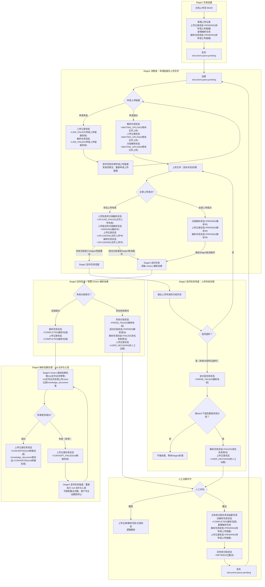
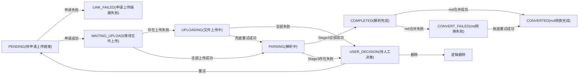
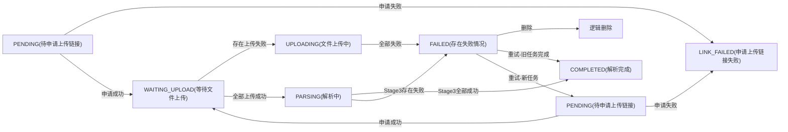
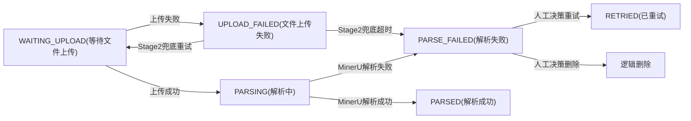

# 解析任务状态流转

## 状态职责说明

### 人工决策「重试」路径的旧失败分段状态处理

存在失败情况时，**解析任务状态统一为 `FAILED`**，**上传记录状态统一为「待人工决策」**，进入人工决策环节选择重试或删除。

`FAILED` 状态可能来自：
- Stage2 全部上传超时失败；
- Stage3 存在失败情况（部分失败或全部失败）。

在人工决策环节选择「重试」后：

- **旧解析任务**：状态标记为 `COMPLETED(解析完成)`，表示其负责的部分已完结，失败分段转交给新任务处理。
- **旧失败分段**：状态由「解析失败」改为「已重试」，不再参与当前 batch 的终态判断，视为已完结。
- **新任务**：对失败分段发起新的解析任务，状态为 `PENDING`（与初始任务一致，代码中排除旧任务即可），并重新发布 `document.parse.pending`。
- **上传记录状态**：改为 `PENDING(待申请上传链接)`，与解析任务状态保持一致；重试本质上是重新申请链接并上传，统一用 `PENDING` 更清晰。

### 人工决策「删除」路径处理

选择「删除」后：

- **上传记录**：逻辑删除。
- **解析任务**：逻辑删除。
- **分段任务**：逻辑删除。
- **后续处理**：不再进入 md 合并入库流程。

### md 转换失败的定时任务拖底机制

- md 合并与入库过程若出现异常，上传记录任务状态标记为 `CONVERT_FAILED`。
- 由 **Stage4 定时任务拖底** 重新执行 md 合并与入库。
- 拖底任务**不限制重试次数**，持续尝试直至成功。
- 用户可通过前端的**删除按钮**主动终止该文件的解析流程。

### Stage2 定时任务兜底机制

Stage2 消费者上传失败后，由 **Stage2 定时任务兜底** 处理：

- **职责**：扫描并处理上传失败的分段，重新尝试上传。
- **重试机制**：对上传失败的分段重新执行 `S2_E 上传文件` 节点。
- **超时处理**：超过 24 小时仍未上传成功的分段，状态标记为「解析失败」。
- **终态收敛**：当该 batch 下所有分段都已超时失败（无剩余非失败分段）时，解析任务状态收敛为 `FAILED`，上传记录状态收敛为「待人工决策」，进入人工决策环节。

### Stage3 定时任务触发条件

Stage3 定时任务独立扫描数据库，轮询 MinerU 批量解析结果，触发条件为：

- **batch 中至少有一个分段上传成功**（`S2_F` 的部分成功场景或 `S2_G` 的全部成功场景）；
- 上传失败的分段由 Stage2 定时任务兜底重试，不阻塞 Stage3 对成功分段的轮询；
- Stage3 根据 batch 中失败/成功分段的状态，统一判断进入「解析完成」或「待人工决策」；存在失败情况时解析任务状态为 `FAILED`。

> 注意：上传链接自申请起 24 小时内有效，超过 24 小时未上传成功的分段不再继续上传。

## 状态值定义

### 主状态枚举（上传记录 + 解析任务共用）

| 中文状态 | 英文编码 | 说明 |
|---|---|---|
| 待申请上传链接 | `PENDING` | 初始状态，等待申请 MinerU 上传链接 |
| 申请上传链接失败 | `LINK_FAILED` | 申请 MinerU 上传链接失败，进入兜底重试 |
| 等待文件上传 | `WAITING_UPLOAD` | 链接申请成功，等待上传分段文件 |
| 文件上传中 | `UPLOADING` | 存在分段上传失败，正在兜底重试 |
| 解析中 | `PARSING` | 文件上传完成，正在轮询 MinerU 解析结果 |
| 解析完成 | `COMPLETED` | 所有分段解析成功 |
| 待人工决策 | `USER_DECISION` | 存在失败情况，等待用户选择重试或删除 |
| md转换完成 | `CONVERTED` | md 合并入库成功 |
| md转换失败 | `CONVERT_FAILED` | md 合并入库失败，进入 Stage4 拖底重试 |
| 存在失败情况 | `FAILED` | 解析任务存在失败（上传超时失败或解析失败），需人工介入 |

> 重试产生的新解析任务同样使用 `PENDING`，代码中取数据时排除旧任务即可。

### 分段任务状态枚举

| 中文状态 | 英文编码 | 说明 |
|---|---|---|
| 等待文件上传 | `WAITING_UPLOAD` | 链接已申请，等待上传该分段 |
| 文件上传失败 | `UPLOAD_FAILED` | 该分段上传失败 |
| 解析中 | `PARSING` | 该分段已上传，MinerU 正在解析 |
| 解析成功 | `PARSED` | MinerU 返回该分段解析成功 |
| 解析失败 | `PARSE_FAILED` | MinerU 解析失败或上传超时失败 |
| 已重试 | `RETRIED` | 人工决策重试后，旧失败分段被标记为已重试 |

> 逻辑删除不是状态值，是对上传记录、解析任务、分段任务执行 `del_flag=1`（或等价标记）的操作。

## 三类状态独立转换图

### 上传记录状态

### 解析任务状态

### 分段任务状态

