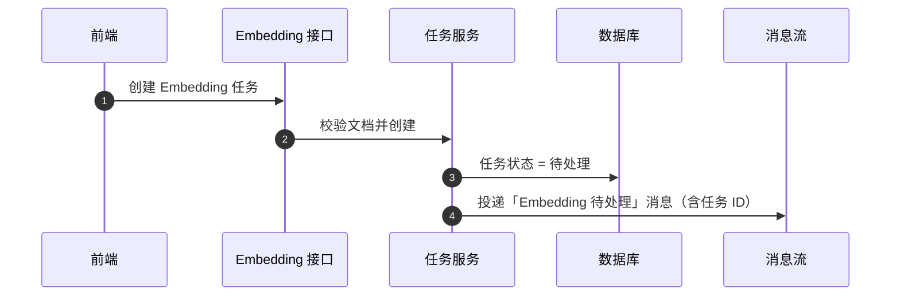
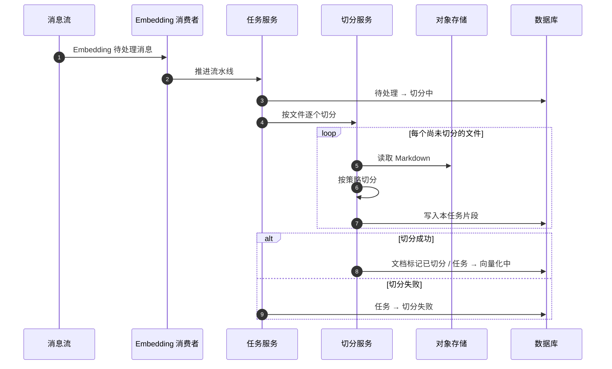
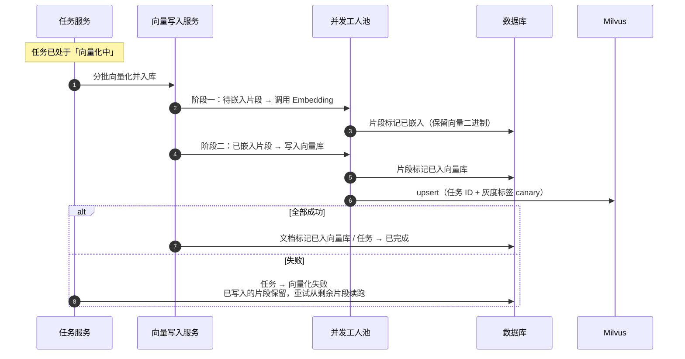
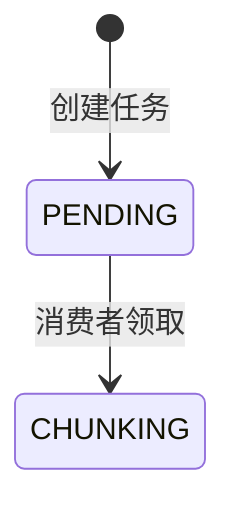
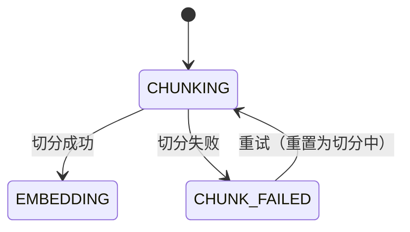
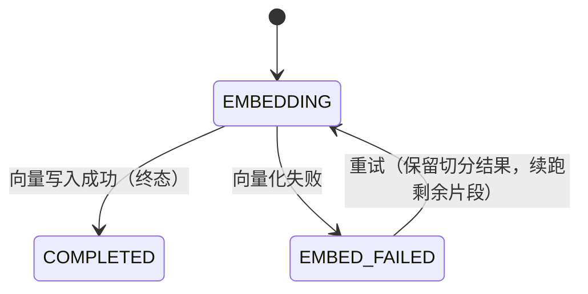
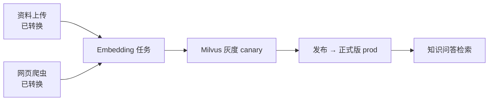

# 切分与向量化流程

资料上传 / 网页爬虫得到「已转换」文档后的共享写路径（`knowledge-content`）。产物写入片段表 + Milvus（默认灰度标签 `canary`），发布为正式版 `prod` 后供 [知识问答](./知识问答流程.md) 检索。

## 1. 提交创建任务

前端提交 Embedding 任务：落库为「待处理」，再投递消息。预览接口只切分展示，不落库、不入队。

同文档若已有进行中任务（待处理 / 切分中 / 向量化中），不可再提交。

## 2. 文档切分

消费者领取后进入切分阶段：按文件读 Markdown → 按策略切分 → 写本任务片段（可清理同文档旧灰度数据，不动正式版）。

切分支持按文件断点续跑：已落库的文件重试时会跳过。

## 3. 向量化写入

切分成功后进入向量化：先调 Embedding 接口写片段向量，再批量写入 Milvus（`release_tag=canary`）。

## 4. 任务状态机

按阶段拆开：提交 → 切分 → 向量化；失败可就地重试，不退回「待处理」。

### 4.1 提交与领取

### 4.2 切分阶段

### 4.3 向量化阶段

### 4.4 状态一览

| 状态 | 阶段 | 含义 |
|------|------|------|
| `PENDING` 待处理 | 提交 | 已创建，等待消费 |
| `CHUNKING` 切分中 | 切分 | 正在读文件并切分落库 |
| `CHUNK_FAILED` 切分失败 | 切分 | 可重试，重置为切分中 |
| `EMBEDDING` 向量化中 | 向量化 | 正在 Embedding 并写入 Milvus |
| `EMBED_FAILED` 向量化失败 | 向量化 | 可重试，保留已切分/已写入片段 |
| `COMPLETED` 已完成 | 向量化 | 终态成功 |

## 5. 在入库链路中的位置

## 6. 关键代码

| 角色 | 路径 |
|------|------|
| 接口 | `knowledge_content/controller/embedding_controller.py` |
| 任务服务 | `service/embedding_task_service.py` |
| 预览 | `service/embedding_preview_service.py` |
| 切分 | `service/document_split_service.py` |
| 向量写入 | `service/vector_store_service.py` |
| 并发嵌入 | `service/embedding_concurrent_service.py` |
| 发布 | `service/embedding_publish_service.py` |
| 消费 | `message/consumer/embedding_task_consumer.py` |
| 状态枚举 | `enums/embedding_task_status_enum.py` |
