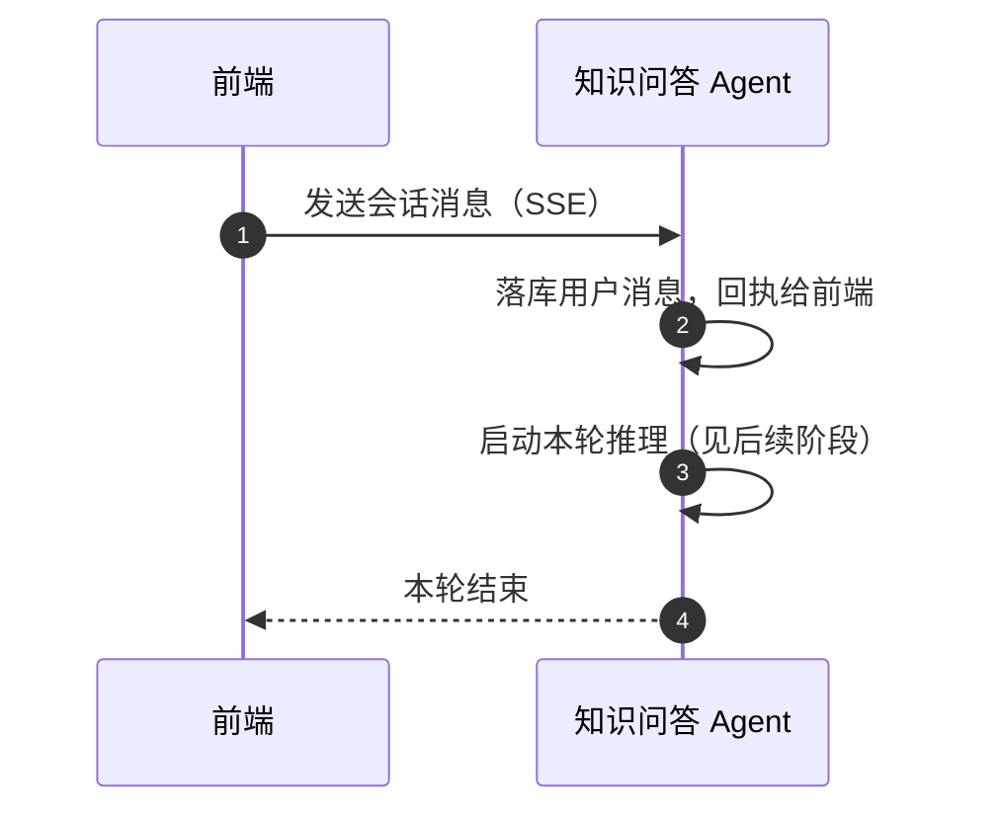
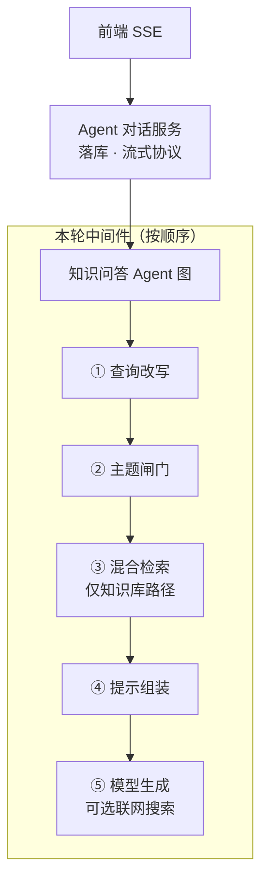
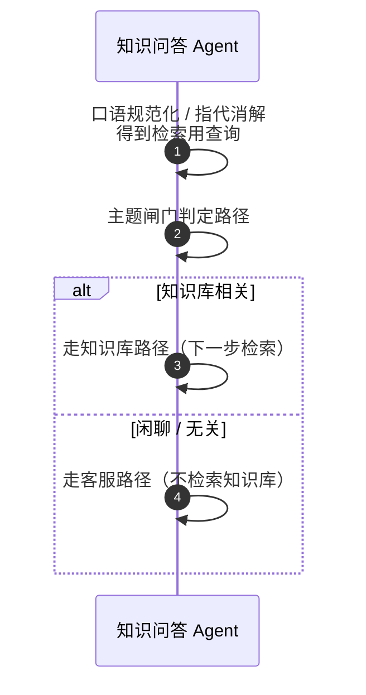
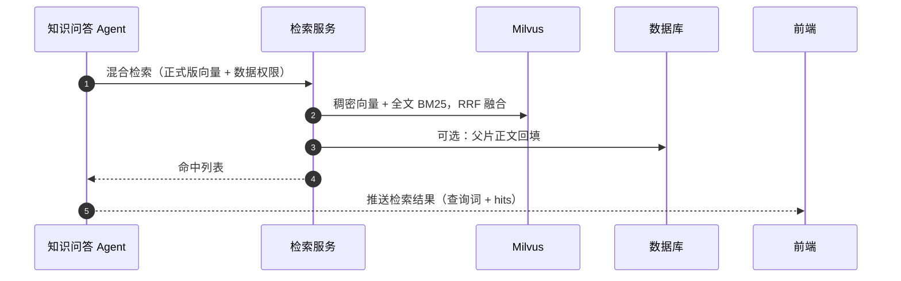
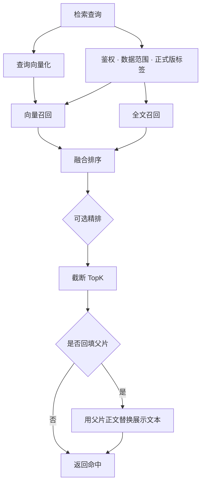
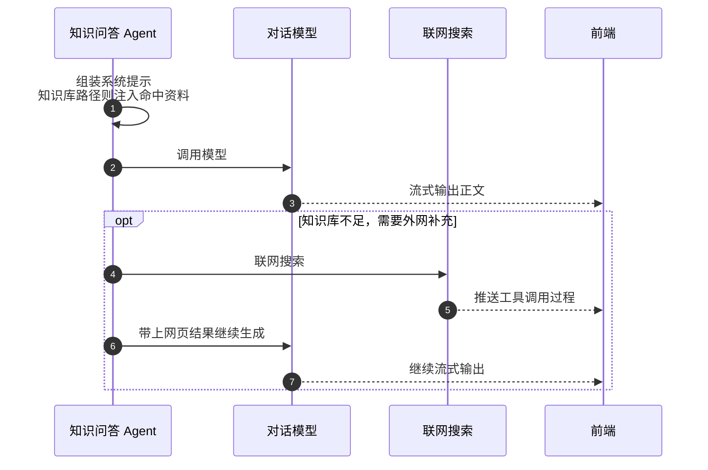
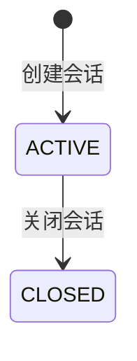

# 知识问答流程

基于已发布向量（正式版 `prod`）的会话式问答（`knowledge-retrieval`）。上游：资料上传 / 网页爬虫 → [切分与向量化](./切分与向量化流程.md) → 发布。

## 1. 收消息并启动 Agent

前端发问 → 落库用户消息 → 启动知识问答 Agent（SSE 流式）。

独立检索评测：`POST /retrieval/search`，只走混合检索，不经过 Agent。

### Agent 架构

每轮开始会清空上轮的改写结果、闸门结论和检索命中，避免短记忆串轮。

## 2. 查询改写与主题分流

## 3. 混合检索（仅知识库路径）

知识库路径才会检索；命中结果通过业务 SSE 推给前端，并注入后续提示。

检索内部步骤：

检索异常时返回空命中，不伪造引用。

## 4. 生成回答

按分流结果切换系统提示；知识库路径会注入检索资料。模型流式输出；知识不足时可调用联网搜索。

## 5. 会话状态

| 项 | 说明 |
|----|------|
| 会话 | 通用 Agent 会话表，类型为知识问答 |
| 会话状态 | 进行中 / 已关闭 |
| 向量默认读 | 正式版 `prod` |

## 6. 关键代码

| 角色 | 路径 |
|------|------|
| 对话接口 | `knowledge_retrieval/controller/knowledge_qa_chat_controller.py` |
| 会话接口 | `knowledge_retrieval/controller/knowledge_qa_session_controller.py` |
| 检索接口 | `knowledge_retrieval/controller/retrieval_controller.py` |
| Agent 服务 | `agents/service/knowledge_qa_agent_service.py` |
| Agent 图 | `agents/knowledge_qa_agent/graph.py` |
| 中间件 | `agents/middleware/{query_rewrite,topic_gate,hybrid_retrieve,qa_prompt}_middleware.py` |
| 混合检索 | `service/document_vector_retrieve_service.py` |
| 公共 SSE | `knowledge_common/agent/runtime/chat_service.py` |
