# 网页爬虫流程

对话式配置爬取策略，异步执行爬取并写入知识库（`knowledge-content`）。会话复用通用 Agent 会话表；爬取任务状态在 `knowledge_web_crawler_task`。入库完成后的切分向量化见 [切分与向量化流程](./切分与向量化流程.md)。

## 1. 对话确认 → 提交爬取任务

用户与 Agent 对话探站、确认策略后，经人工确认（HITL）创建爬取任务并投递消息队列。

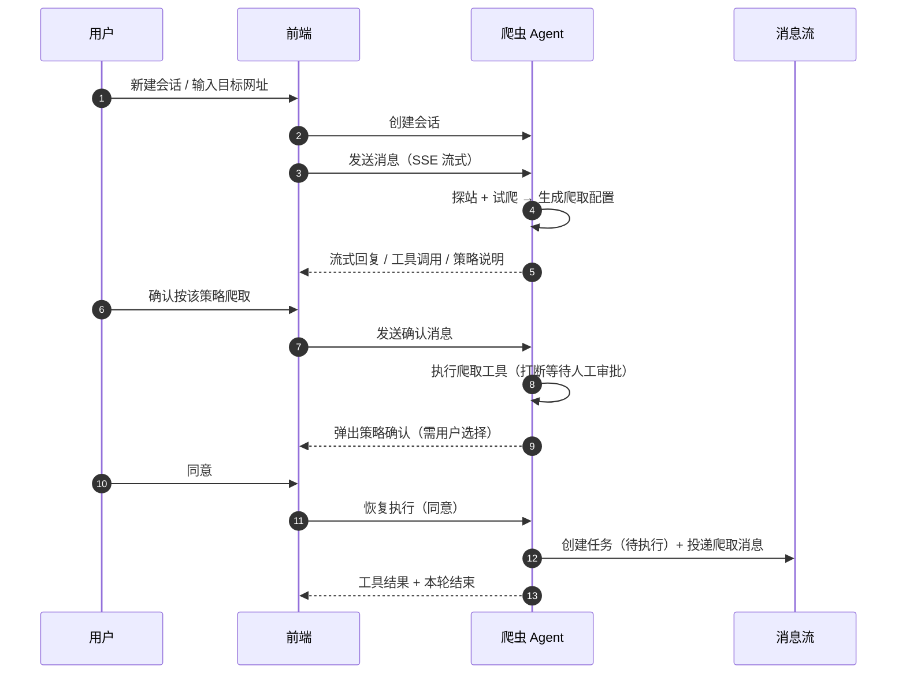

需人工审批的写操作：提交爬取、改范围、暂停、恢复、删除、合并落库、失败重试。

### Agent 架构

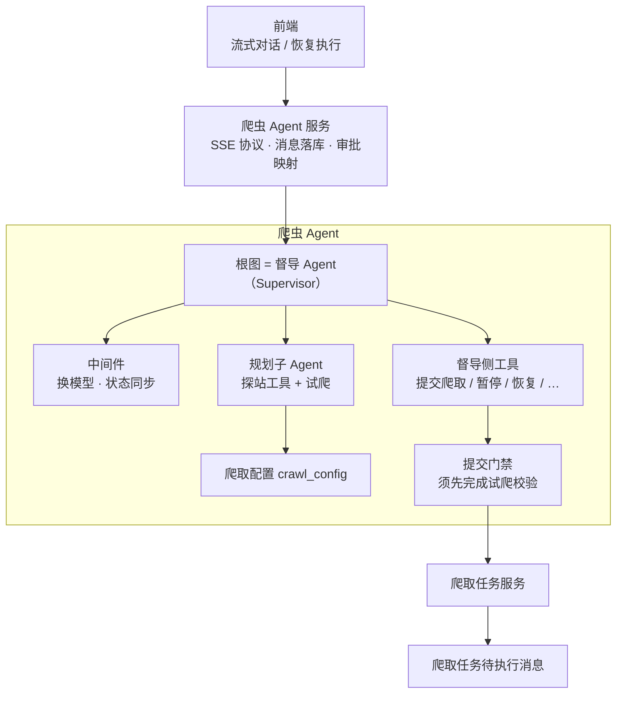

- 根图即督导 Agent，不再套一层父图。
- 规划能力通过框架 `task` 委派给规划子 Agent；策略确认靠对话约定 + 写工具人工审批，没有单独的确认接口。

## 2. 任务执行 → 文档落库

### 2.1 任务执行总览

消费「爬取任务待执行」消息：领取任务 → 流式逐页爬取 → 全部成功则投递「文档落库」消息。

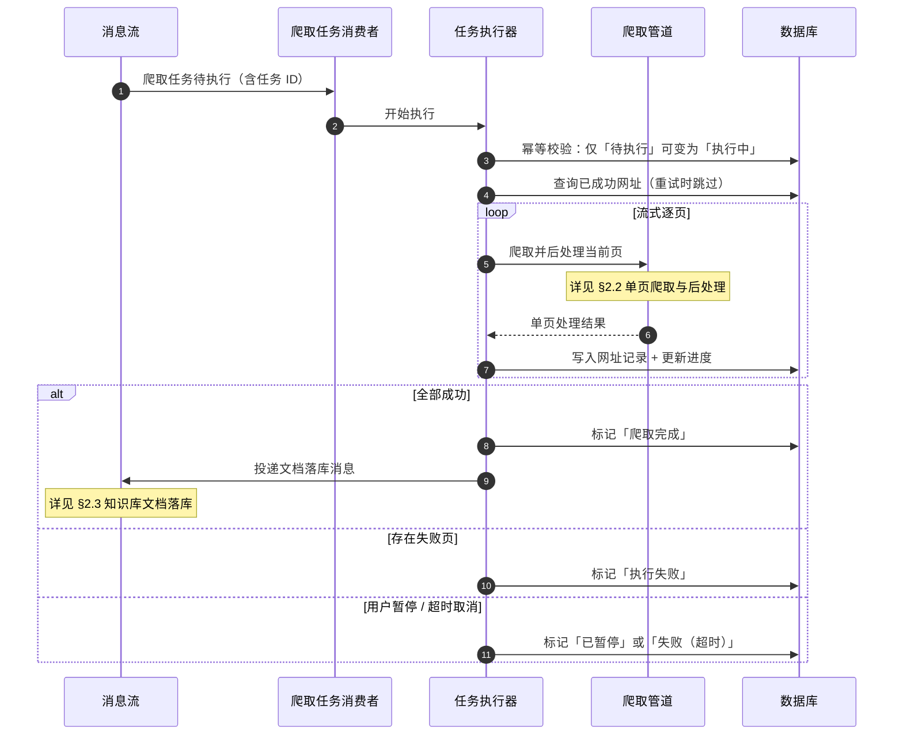

### 2.2 单页爬取与后处理

每爬完一页立刻做后处理并写入对象存储，随即释放正文，避免大站结果长期占内存。

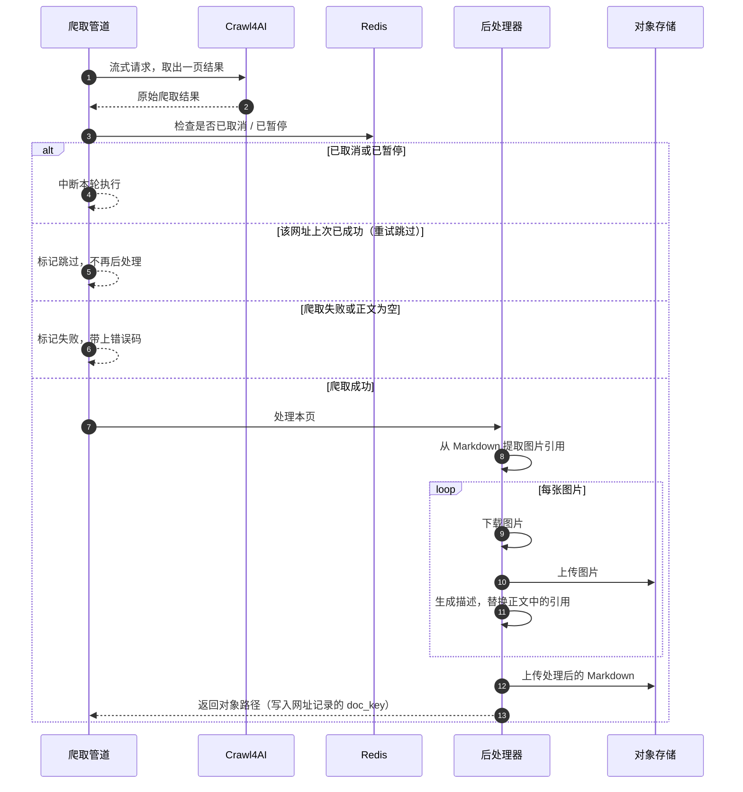

执行器拿到单页结果后：写入网址记录表（成功/失败 + 对象路径），并更新任务进度。

### 2.3 知识库文档落库

爬取全部成功后投递文档落库消息。默认写法：**1 条文档主表 + N 条文件子表**（每个成功页对应一行文件，不把多页 Markdown 拼成一份）。

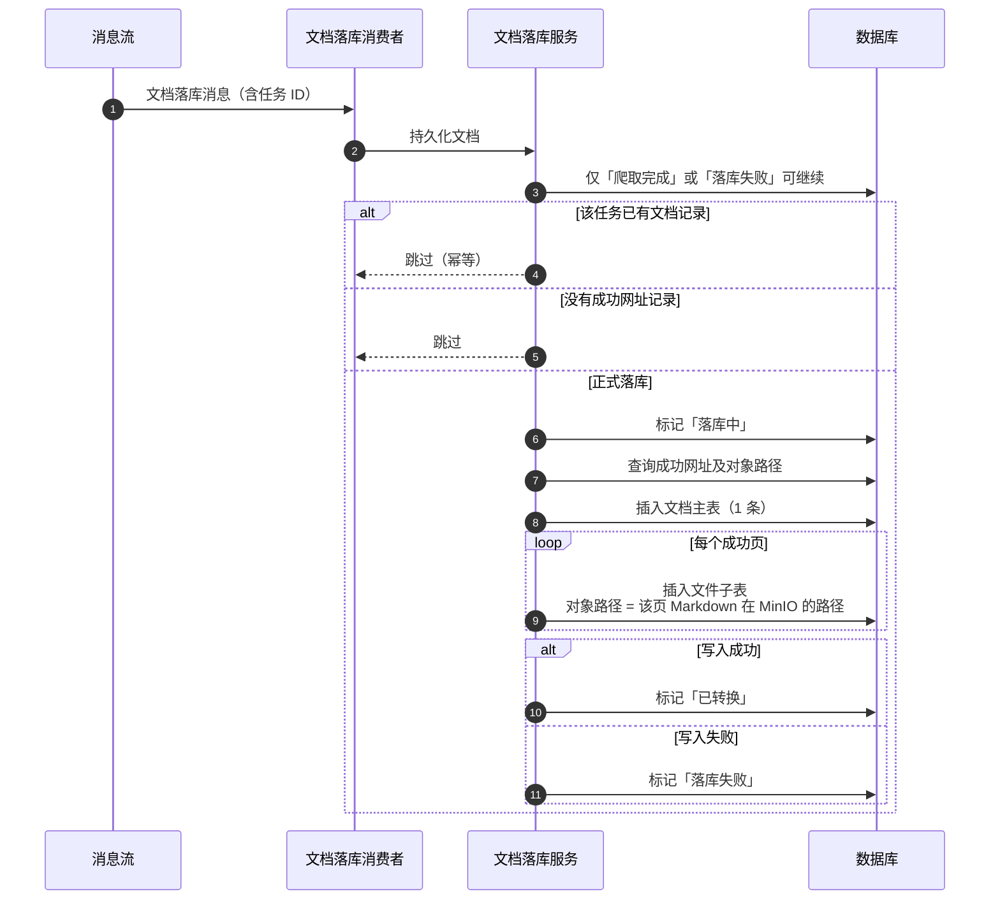

「落库失败」由定时任务扫描后，重新投递文档落库消息重试。

## 3. 任务状态机

按阶段看更清楚：先爬取，再处理失败重试，最后落知识库。

### 3.1 爬取执行

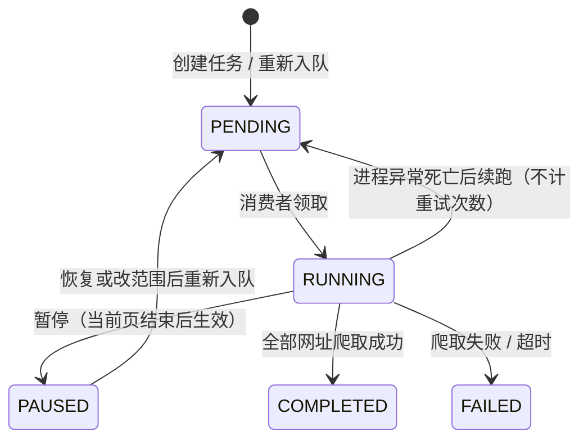

### 3.2 失败重试与人工决策

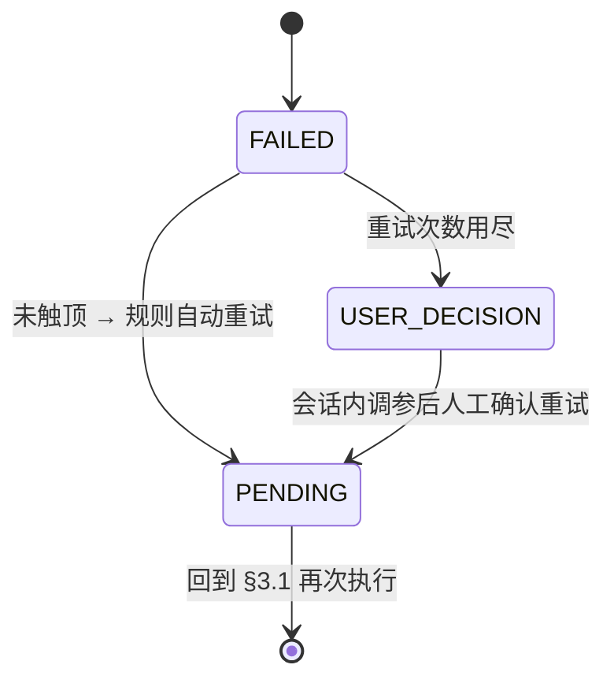

### 3.3 文档落库

爬取成功（`COMPLETED`）后进入本阶段；与爬取执行互不交叉。

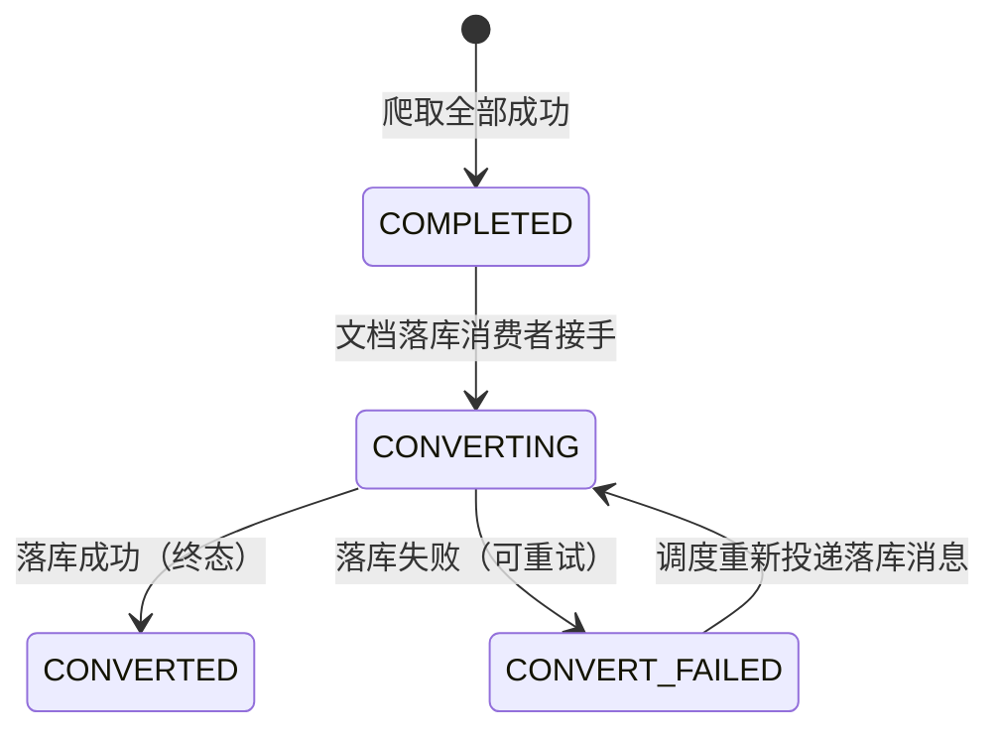

### 3.4 状态一览

| 状态 | 阶段 | 含义 |
|------|------|------|
| `PENDING` 待执行 | 爬取 | 排队中（新建、恢复、重试后都会回到这里） |
| `RUNNING` 执行中 | 爬取 | 执行器正在爬取 |
| `PAUSED` 已暂停 | 爬取 | 用户暂停，进度保留 |
| `FAILED` 执行失败 | 重试 | 爬取失败，可自动重试 |
| `USER_DECISION` 待决策 | 重试 | 自动重试耗尽，需在会话里调参后再重试 |
| `COMPLETED` 爬取完成 | 落库 | 页面都爬完了，等待写入知识库 |
| `CONVERTING` 落库中 | 落库 | 正在写文档主表 / 文件子表 |
| `CONVERT_FAILED` 落库失败 | 落库 | 可被调度重试 |
| `CONVERTED` 已转换 | 落库 | 已写入知识库文档（终态） |

单页网址记录状态：`PENDING` 待处理｜`SUCCESS` 成功｜`FAILED` 失败。
## 4. 暂停 / 恢复 / 改范围 / 失败修复

### 4.1 任务 Tab 暂停与恢复

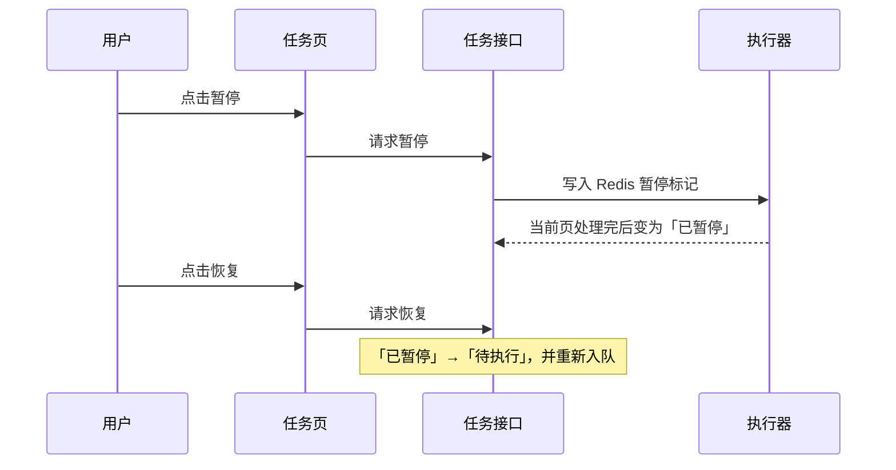

### 4.2 会话内缩小 / 扩大爬取范围

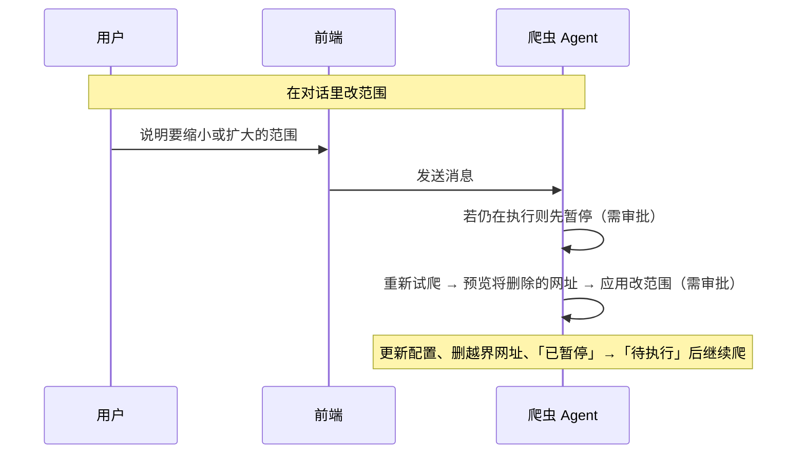

### 4.3 失败自动重试与人工修复

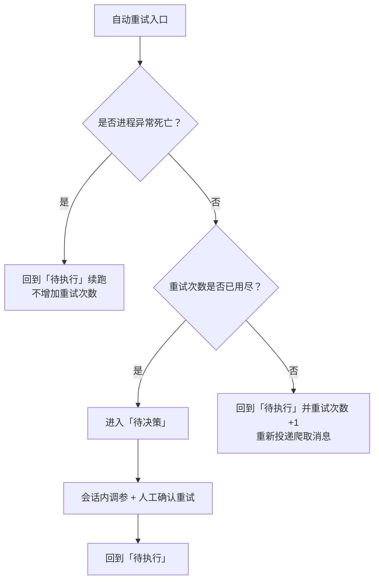

## 5. 关键代码

| 角色 | 路径 |
|------|------|
| Agent 根图 | `agents/crawler_agent/graph.py` |
| 督导 Agent | `agents/crawler_agent/workers/supervisor/deep_agent.py` |
| 对话 / 人工审批 | `agents/service/crawler_agent_service.py` |
| 任务服务 | `service/web_crawler_task_service.py` |
| 任务执行器 | `service/web_crawler_task_executor_service.py` |
| 爬取管道 | `service/crawl_pipeline_service.py` |
| 文档落库 | `service/crawler_document_service.py` |
| 消息消费 | `message/consumer/web_crawler_task_consumer.py`、`crawl_document_consumer.py` |
| 定时调度 | `tasks/web_crawler_task_scheduler.py` |
| 状态枚举 | `enums/crawl_task_status_enum.py` |
