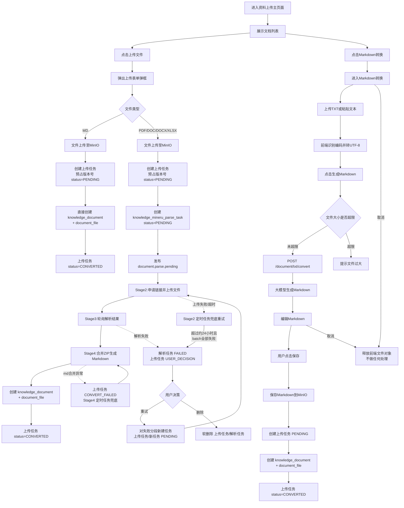
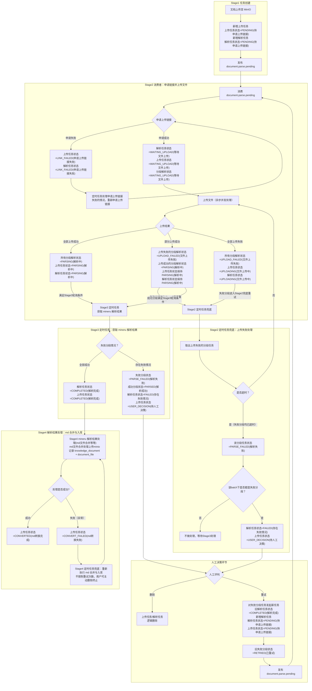
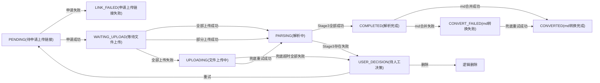
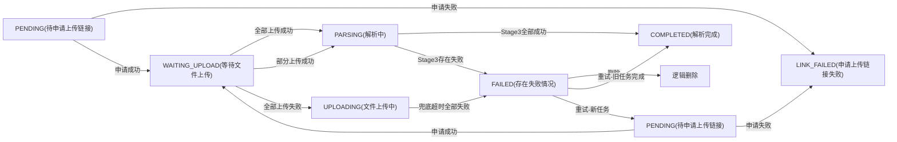
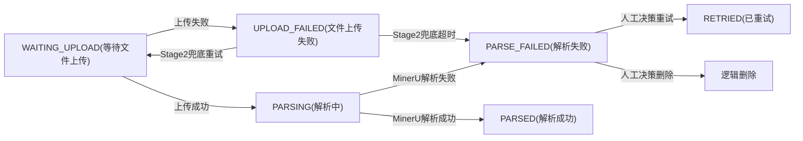

# 资料上传流程

文档上传与 MinerU 解析入库（`knowledge-content`）。后续切分向量化见 [切分与向量化流程](./切分与向量化流程.md)。

> 表名以代码为准：上传任务表为 `knowledge_upload_document_parse_task`（下文图中简称上传记录/上传任务）；文件落在 `knowledge_document_file`，主表无 `status` 字段。

## 1. 流程全景

## 2. 整体状态流转图

存在失败情况时，**解析任务统一为 `FAILED`**，**上传任务统一为 `USER_DECISION`**，进入人工决策（重试或删除）。

消息主题：`document.parse.pending`（Stage2）、`document.md.pending`（Stage4）。  
定时兜底：Stage2-A（`LINK_FAILED`/`PENDING`）、Stage2-B（`UPLOAD_FAILED`）、Stage3（轮询）、Stage4（`CONVERT_FAILED`/`COMPLETED`）。

## 3. 分对象状态机

### 上传任务状态

### 解析任务状态

### 分段任务状态

## 4. 关键代码

| 角色 | 路径 |
|------|------|
| 上传 API | `knowledge_content/controller/document_upload_parse_controller.py` |
| 核心服务 | `knowledge_content/service/document_upload_parse_service.py` |
| Stage2/4 消费 | `knowledge_content/message/consumer/document_parse_consumer.py` |
| 定时任务 | `knowledge_content/tasks/document_parse_scheduler.py` |
| ZIP 合并 | `knowledge_content/service/mineru_zip_merge_service.py` |
| 枚举 | `enums/document_upload_status_enum.py` 等 |
