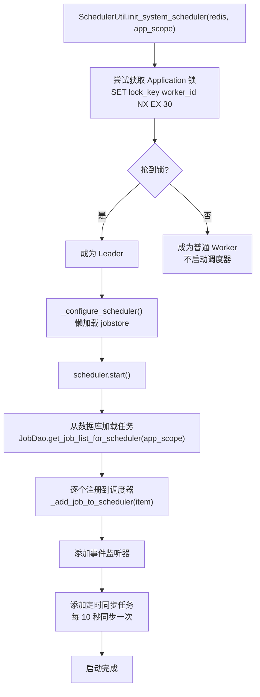
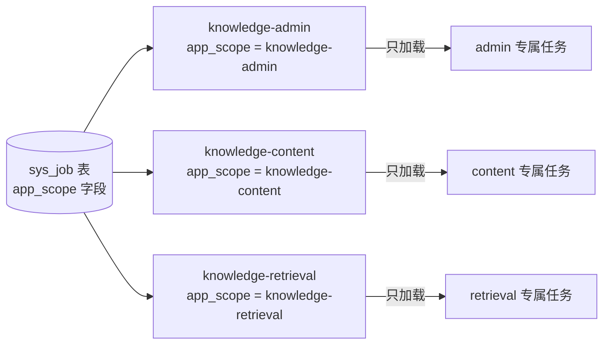
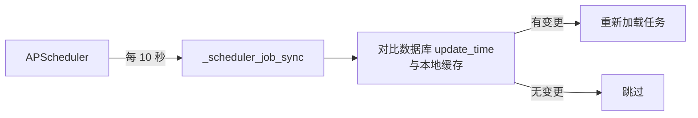
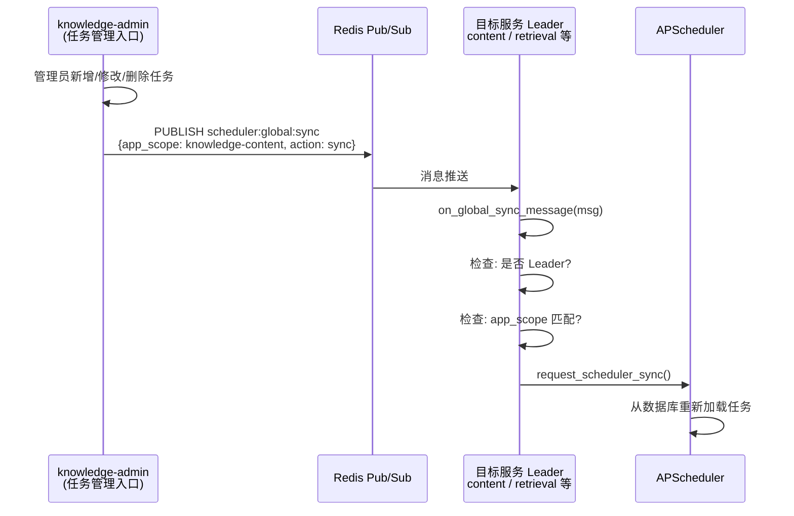
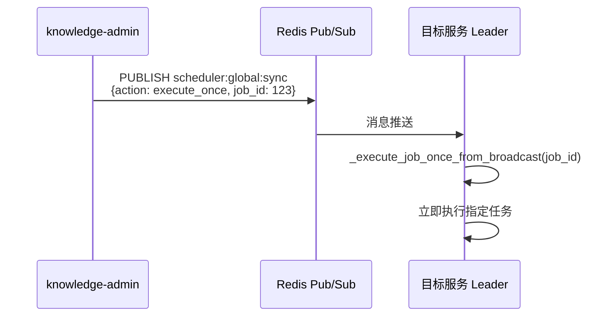
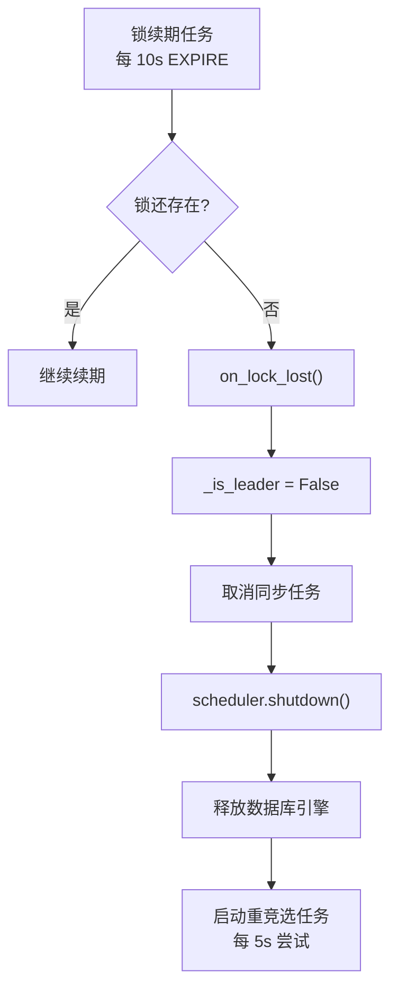

# 定时任务调度与同步

> 模块位置：`knowledge-common/src/knowledge_common/config/get_scheduler.py`

## 1. 概述

基于 APScheduler + Redis 分布式锁实现定时任务调度，支持多服务（admin / content / retrieval）独立运行、`app_scope` 隔离、Leader 选举、双同步机制（定时轮询 + 广播即时通知）。

---

## 2. Leader 选举与启动流程



**关键设计**：
- 数据库是任务状态的**唯一真相源**
- Leader 启动只是将数据库中已启用任务镜像到内存调度器
- Leader 挂了，其他 Worker 抢到锁后重新加载，数据不丢失

---

## 3. app_scope 任务隔离



- `sys_job` 表通过 `app_scope` 字段标识任务所属应用
- 各服务启动时只加载 `app_scope = 自身 APP_NAME` 的任务
- 避免跨服务加载任务导致 `ModuleNotFoundError`

---

## 4. 双同步机制

### 4.1 定时轮询（兜底）



### 4.2 广播即时通知（实时）



**订阅者位置**：`knowledge_common/message/subscriber/scheduler_subscriber.py`

### 4.3 execute_once 即时执行



---

## 5. 广播通知触发时机

admin 后台在以下操作后发送广播：

| 操作 | 广播内容 |
|------|---------|
| 新增任务 | `{action: sync, app_scope: xxx}` |
| 修改任务 | `{action: sync, app_scope: xxx}` |
| 删除任务 | `{action: sync, app_scope: xxx}` |
| 修改任务状态 | `{action: sync, app_scope: xxx}` |
| 立即执行 | `{action: execute_once, job_id: xxx}` |

---

## 6. 锁丢失处理



---

## 7. MyCronTrigger 扩展

继承 APScheduler `CronTrigger`，支持 6/7 位 cron 表达式（含秒）：

| 字段位置 | 含义 | 特殊值 |
|---------|------|--------|
| 第 1 位 | 秒 | - |
| 第 2 位 | 分 | - |
| 第 3 位 | 时 | - |
| 第 4 位 | 日 | `?` `L` `W` |
| 第 5 位 | 月 | - |
| 第 6 位 | 星期 | `?` `L` `#` |
| 第 7 位（可选） | 年 | - |

**特殊符号**：
- `?`：不指定（日/星期互斥）
- `L`：最后一个（如 `L` 在星期位表示最后一个星期六）
- `W`：最近工作日（如 `15W` 表示 15 号最近的工作日）
- `#`：第几个星期几（如 `5#2` 表示第二个星期四）

---

## 8. JobStore 配置

```python
job_stores = {
    'default': MemoryJobStore(),
    'sqlalchemy': SQLAlchemyJobStore(url=SYNC_SQLALCHEMY_DATABASE_URL),
    'redis': RedisJobStore(**redis_config),
}
```

- `default`：内存存储（实际使用的 jobstore）
- `sqlalchemy`：数据库持久化（APScheduler 内部元数据）
- `redis`：Redis 存储（备用）

---

## 9. 相关文档

- [广播服务](./广播服务.md)
- [启动流程](../系统架构/启动流程与生命周期.md)
- [Redis 与数据库](./Redis与数据库基础设施.md)
