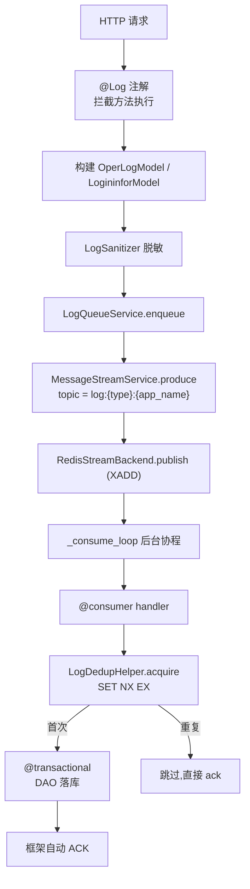
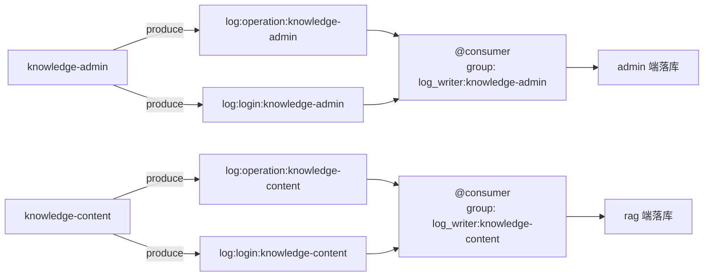
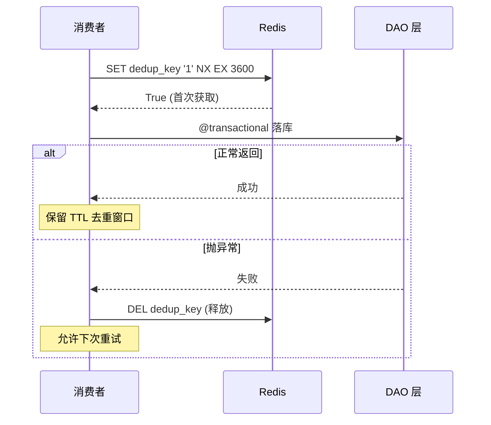
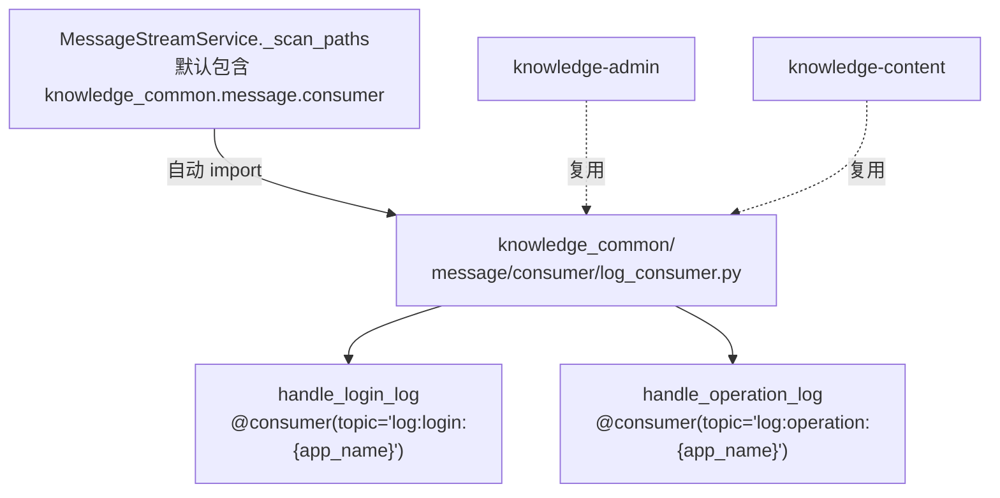

# 日志聚合与操作日志落库

> 模块位置：`knowledge-common/src/knowledge_common/message/consumer/log_consumer.py`

## 1. 概述

日志聚合基于 `MessageStreamService` 框架实现。推送侧用 `produce`，消费侧用 `@consumer` 装饰器，按 `app_name` 隔离，业务级去重由 `LogDedupHelper` 保证。

---

## 2. 端到端链路



---

## 3. 核心组件

| 组件 | 位置 | 职责 |
|------|------|------|
| `@Log` | `common/annotation/log_annotation.py` | 拦截方法执行，记录操作日志 |
| `LogQueueService` | `service/log_service.py` | 推送门面，构建 payload + headers，调用 produce |
| `MessageStreamService` | `message_stream/service.py` | 框架门面，管理生产/消费/ack |
| `@consumer` | `message_stream/consumer.py` | 声明消费者，框架自动拉起消费协程 |
| `LogDedupHelper` | `service/log_service.py` | 业务级去重，Redis SET NX EX |
| `log_consumer.py` | `message/consumer/log_consumer.py` | 消费者函数（common 集中维护） |

---

## 4. app_name 隔离机制



**命名规则**：

| 元素 | 格式 | 示例 |
|------|------|------|
| topic | `log:{event_type}:{app_name}` | `log:operation:knowledge-admin` |
| group_id | `log_writer:{app_name}` | `log_writer:knowledge-admin` |
| dedup key | `{prefix}:{app_name}:{event_id}` | `log:dedup:knowledge-admin:abc123` |

**自产自销**：admin 推送的消息只由 admin 端消费者落库，rag 推送的消息只由 rag 端消费者落库。

---

## 5. 去重机制（LogDedupHelper）



**使用方式**：

```python
async with LogDedupHelper.acquire(event_id, app_name) as ok:
    if not ok:
        return  # 重复消息，跳过
    # 落库逻辑
    log_entry = OperLogModel(**msg.value)
    await OperationLogDao.add_operation_log_dao(log_entry)
```

**语义**：
- `__aenter__`：`SET key '1' NX EX ttl`，返回是否首次获取
- `__aexit__` 正常：保留 TTL 去重窗口
- `__aexit__` 异常：主动 `DEL` 释放，允许重试

---

## 6. 消费者集中化架构



**设计要点**：
- 消费者代码在 common 集中维护一份
- admin / rag 启动时自动 import 并注册
- topic 按 `app_name` 动态生成（`AppConfig.app_name`）
- 非本 app 的 topic 消费者会长期空转阻塞拉取（CPU 开销可忽略）

---

## 7. 推送端 Headers

`LogQueueService._produce_event` 构造的 headers：

| Header | 说明 |
|--------|------|
| `event_id` | 业务幂等键（`md5(request_id + log_type + source)`） |
| `event_type` | 事件类型（`login` / `operation`） |
| `request_id` | 请求唯一标识（TraceCtx） |
| `trace_id` | 链路追踪 ID |
| `span_id` | 链路 Span ID |
| `app_name` | 应用标识 |
| `source` | 日志来源 |

---

## 8. 事务保障

消费者落库使用 `@transactional` 装饰：

```python
@transactional()
async def _persist_log(msg, default_app, model_cls, dao_method):
    event_id = msg.headers.get('event_id')
    app_name = msg.headers.get('app_name', default_app)
    async with LogDedupHelper.acquire(event_id, app_name) as ok:
        if not ok:
            return
        log_entry = model_cls(**msg.value)
        await dao_method(log_entry)
```

- 事务回滚时 `LogDedupHelper.__aexit__` 自动释放 dedup key
- 确保失败的消息可以被重试

---

## 9. 配置说明

| 配置 | 默认值 | 说明 |
|------|--------|------|
| `log_stream_dedup_ttl` | `3600` | 去重 Key 过期时间（秒） |
| `log_stream_dedup_prefix` | `log:dedup` | 去重 Key 前缀 |
| `message_stream_backend` | `redis` | 消息流后端选择 |
| `message_stream_redis_maxlen` | `100000` | Redis Stream 裁剪上限 |

---

## 10. 相关文档

- [消息流服务](./消息流服务.md)
- [中间件链](../系统架构/中间件链与注解切面.md)
- [事务管理](./注解式事务管理.md)
