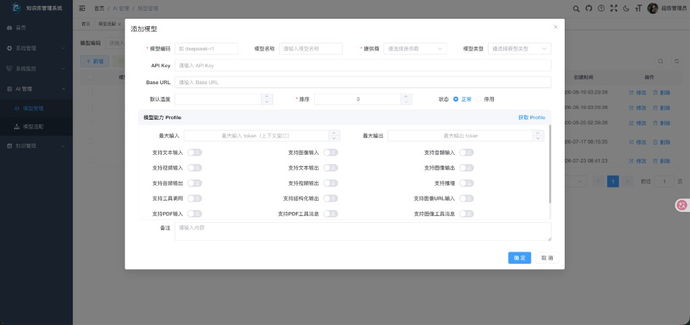
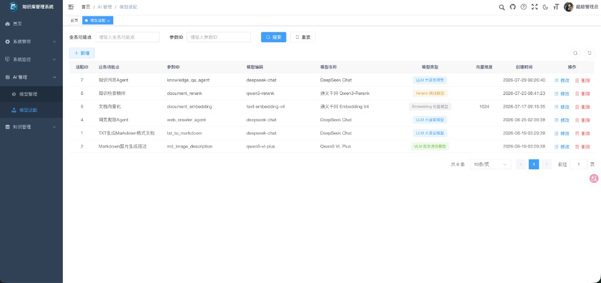
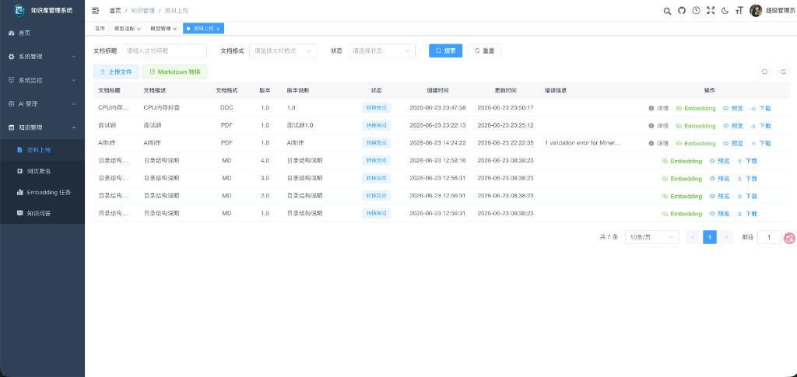
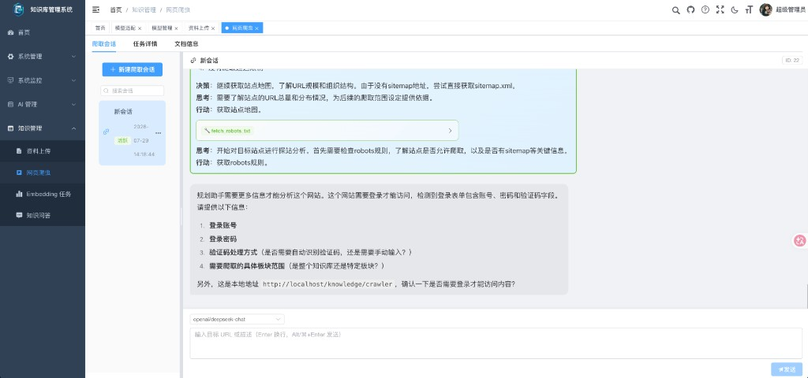
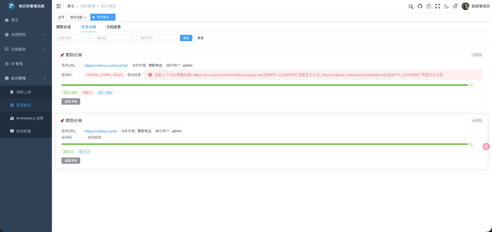
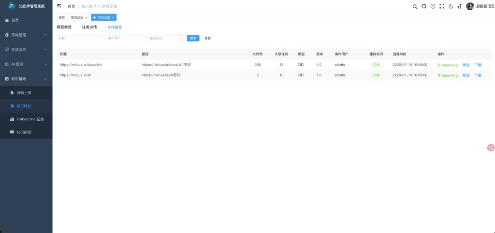
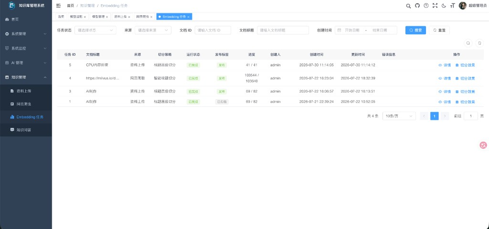
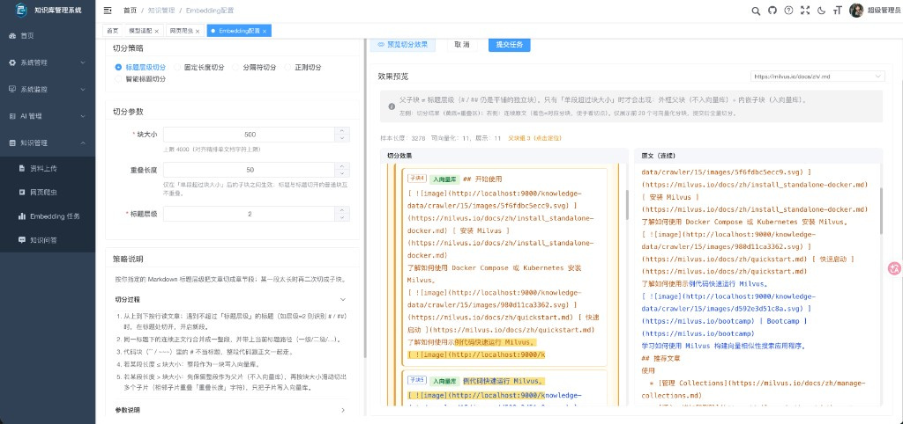
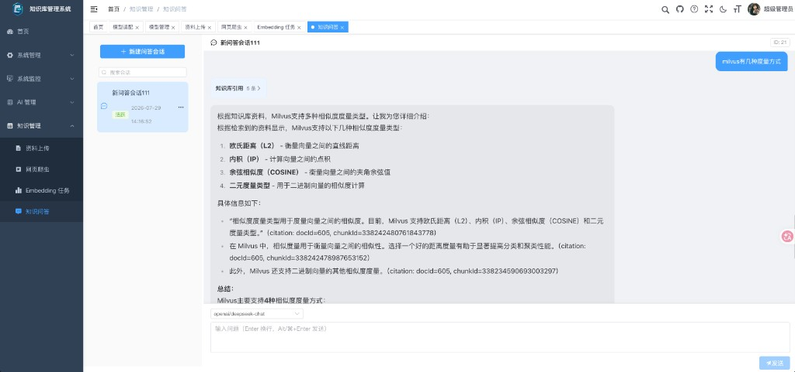

# 演示图

若依原有模块截图外联自上游 [README-RuoYi.md · 演示图](../../README-RuoYi.md#演示图)（[RuoYi-Vue3-FastAPI](https://github.com/insistence/RuoYi-Vue3-FastAPI)），仅收录本项目仍使用的界面。本项目新增 / 改造模块使用本地截图。

## 若依原有模块（沿用）

<table>
    <tr>
        <td>
            
        </td>
        <td>
            
        </td>
    </tr>
    <tr>
        <td>
            
        </td>
        <td>
            
        </td>
    </tr>
    <tr>
        <td>
            
        </td>
        <td>
            
        </td>
    </tr>
    <tr>
        <td>
            
        </td>
        <td>
            
        </td>
    </tr>
    <tr>
        <td>
            
        </td>
        <td>
            
        </td>
    </tr>
    <tr>
        <td>
            
        </td>
        <td>
            
        </td>
    </tr>
    <tr>
        <td>
            
        </td>
        <td>
            
        </td>
    </tr>
    <tr>
        <td>
            
        </td>
        <td>
            
        </td>
    </tr>
    <tr>
        <td>
            
        </td>
        <td>
            
        </td>
    </tr>
</table>

未引用（本项目已弃用）：服务监控、在线构建器、代码生成、AI 对话、移动端。模型管理改用本项目截图，见下节。

## 本项目新增 / 改造模块

<table>
    <tr>
        <td>
            
        </td>
        <td>
            
        </td>
    </tr>
    <tr>
        <td>
            
        </td>
        <td>
            
        </td>
    </tr>
    <tr>
        <td>
            
        </td>
        <td>
            
        </td>
    </tr>
    <tr>
        <td>
            
        </td>
        <td>
            
        </td>
    </tr>
    <tr>
        <td>
            
        </td>
        <td></td>
    </tr>
</table>
