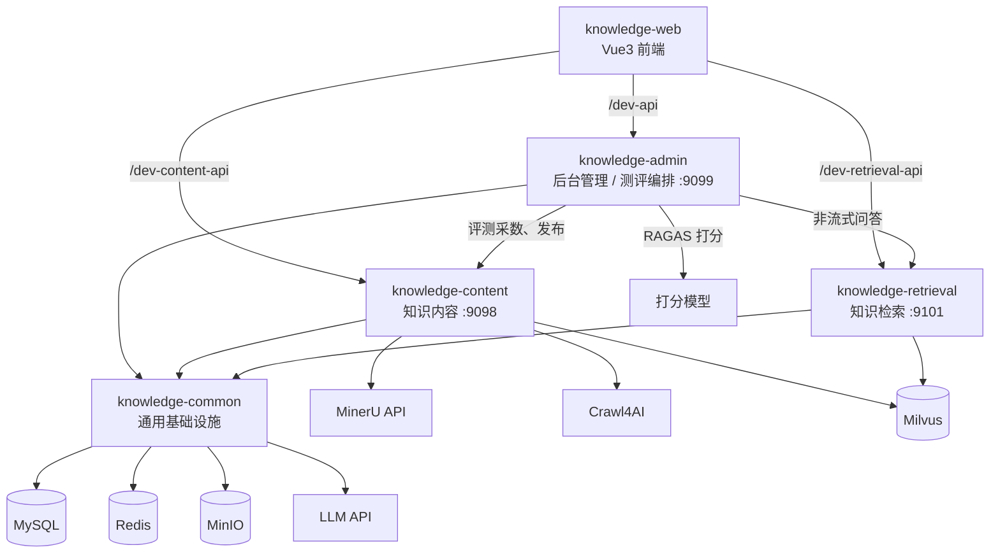
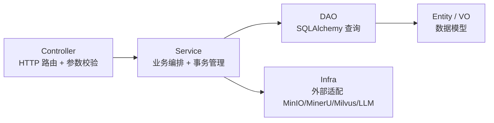
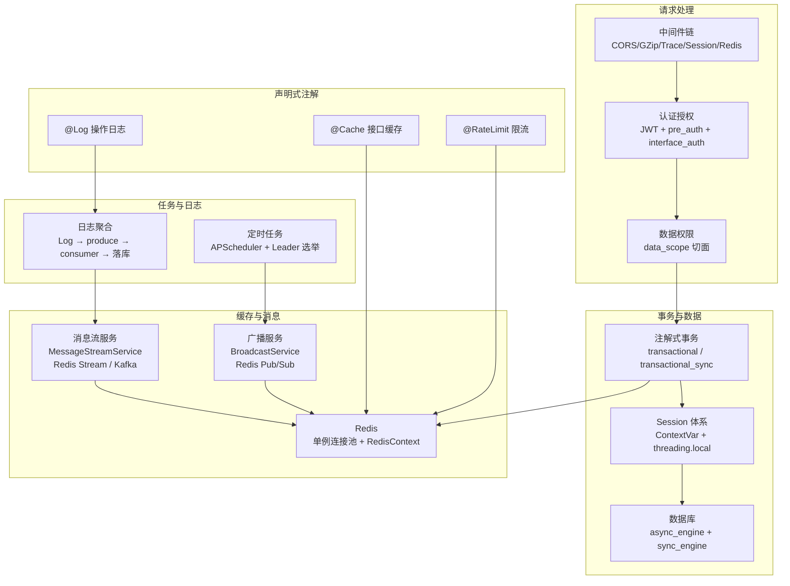
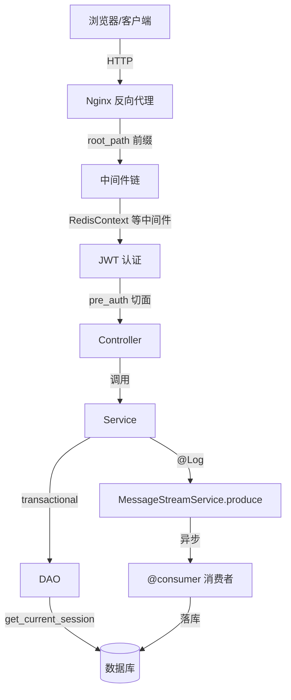

# 系统架构总览

## 1. 项目定位

企业知识库 RAG 系统，基于 [RuoYi-Vue3-FastAPI](https://github.com/insistence/RuoYi-Vue3-FastAPI) 二次开发。文档入库后先写入 canary 向量，经测评集和 RAGAS 打分，再发布到正式库。问答按主题关键词决定是否检索。

---

## 2. 多包分层

| 包 | 职责 | 默认端口 | 关键入口 |
|---|---|---|---|
| **knowledge-common** | 通用能力下沉：事务、消息流、广播、中间件、DAO、Service、工具类 | — | `src/knowledge_common/` |
| **knowledge-admin** | 后台管理：用户、角色、菜单、字典、定时任务、AI 模型；测评集出题、测评任务、RAGAS 打分与发布 | `9099` | `src/knowledge_admin/server/server.py` |
| **knowledge-content** | 知识内容：文档上传、MinerU 解析、切分向量化、网页爬取、主题关键词与日常词 | `9098` | `src/knowledge_content/server/server.py` |
| **knowledge-retrieval** | 知识检索与问答：主题路由、混合检索、精排、QA Agent；对测评提供非流式问答 | `9101` | `src/knowledge_retrieval/server/server.py` |
| **knowledge-web** | Vue3 + Element Plus 前端 | Vite `:80` | `src/main.js` |

知识库主路径：资料上传或网页爬虫入库，切分后向量写入 canary；管理端按这篇文档生成测评集，绑定这次向量任务跑 RAGAS；有成功记录后再发布，canary 切到正式库。问答时问句先对已完成主题的关键词做命中，未命中再问主题模型，然后混合检索、精排、回填父段。

---

## 3. 业务分层架构（CSD 模式）

- **Controller**：接收 HTTP 请求，参数校验，调用 Service，返回标准化响应
- **Service**：业务逻辑编排，`@transactional` 管理事务边界，组合多个 DAO 调用
- **DAO**：纯数据访问层，通过 `get_current_session()` 获取上下文中的 session
- **Infra**：外部依赖适配器（MinIO 对象存储、MinerU 文档解析、Milvus 向量库、LLM / Embedding API）

---

## 4. 核心基础设施全景

---

## 5. 请求端到端链路

**关键路径说明**：

1. **请求进入**：中间件链按注册顺序处理（Trace → CORS → GZip → Session → Redis → ContextCleanup → ...）
2. **认证鉴权**：`pre_auth` 依赖注入解析 JWT → `interface_auth` 校验接口权限 → `data_scope` 过滤数据范围
3. **事务管理**：`@transactional` 装饰 Service 方法，自动管理 commit/rollback
4. **日志异步**：`@Log` 注解触发 `LogQueueService.enqueue` → `MessageStreamService.produce` → 消费者异步落库

---

## 6. 基础设施文档索引

| 主题 | 文档 |
|------|------|
| 应用启动与生命周期 | [启动流程](./启动流程与生命周期.md) |
| 中间件链与注解切面 | [中间件链](./中间件链与注解切面.md) |
| 注解式事务管理 | [事务管理](../基础设施/注解式事务管理.md) |
| 消息流服务 | [消息流](../基础设施/消息流服务.md) |
| 广播服务 | [广播服务](../基础设施/广播服务.md) |
| Redis 与数据库 | [Redis 与数据库](../基础设施/Redis与数据库基础设施.md) |
| 定时任务调度 | [定时任务](../基础设施/定时任务调度.md) |
| 日志聚合 | [日志聚合](../基础设施/日志聚合.md) |
| 分布式信号量 | [分布式信号量](../基础设施/分布式信号量.md) |
| MinIO 下载流程 | [MinIO](../基础设施/MinIO下载流程.md) |
| 知识问答（业务） | [知识问答流程](../rag功能流程说明/知识问答流程.md) |
| 知识库发布评测 | [发布评测方案](../rag/03-知识库发布评测方案.md) |
| 测评集出题 | [出题架构](../rag/07-测试集出题架构方案.md) |
| 主题关键词 | [过滤方案](../rag/16-主题关键词过滤方案.md) |
| 检索服务说明 | [knowledge-retrieval/README.md](../../knowledge-retrieval/README.md) |
